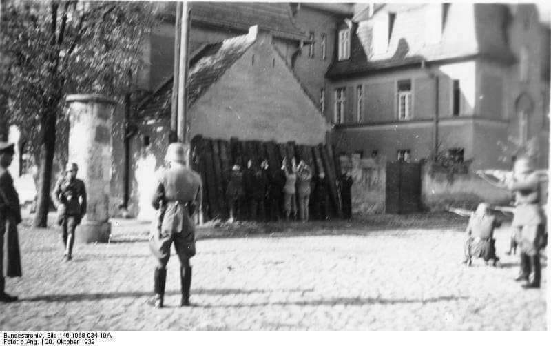
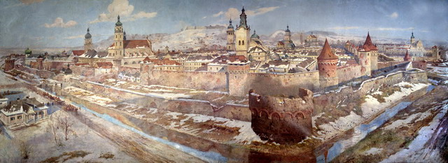

### 1939

Rozpoczęła się w Wielkopolsce niemiecka operacja "Tanneberg"-działanie na szeroką skalę wymierzone w likwidację polskich elit przywódczych. Koncepcja tej akcji eksterminacyjnej powstała razem z planem ataku na Polskę. Na liście osób skazanych na zagładę znalazło się 61 tysięcy przedstawicieli różnych warstw polskiego społeczeństwa, począwszy od księży, polityków ,ludzi kultury, a skończywszy na przedsiębiorcach i byłych powstańcach. 
W ogóle na terenie Polski akcja zaczęła się 1 września 1939 roku. Do 25 października 1939 roku wykonano ponad 760 egzekucji i masowych mordów, w których życie straciło ponad 20 tysięcy ludzi.
Na zdjęciu egzekucja Polaków przez Einsatzkommando
11 pod dowództwem Heinza Graefe w Kórniku 20 października 1939.

  

### 1918

Rada Miejska Lwowa zdecydowała o przyłączeniu miasta do Polski. Lwów, jedno z największych i najpiękniejszych miast Ukrainy został założony ok. 1250 roku przez króla Daniela I Halickiego, który nazwał miasto Lwowem na cześć swojego syna Lwa. W latach 1349-1370 Lwów wchodził w skład Królestwa Polskiego, a w latach 1370-1387 w skład Królestwa Węgier, od potem do 1772 ponownie w skład Królestwa Polskiego i Rzeczypospolitej Obojga Narodów, od 1434 był stolicą województwa ruskiego Korony.

  

---

<a href="https://github.com/TomaszWaszczyk/historia.waszczyk.com/edit/master/src/content/october-4.md" target="_blank">Edytuj tę stronę dzieląc się własnymi notatkami!</a>
