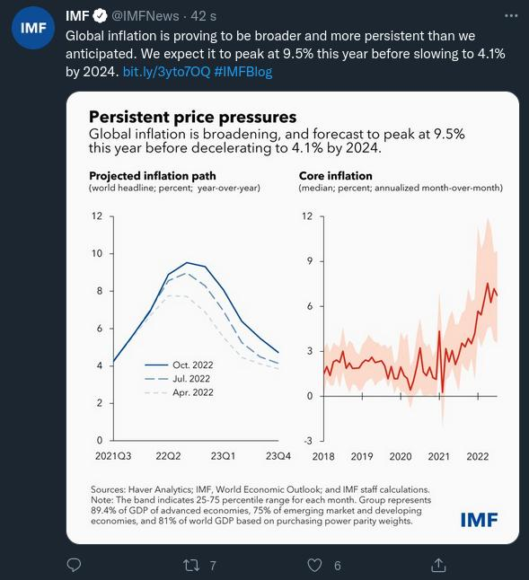
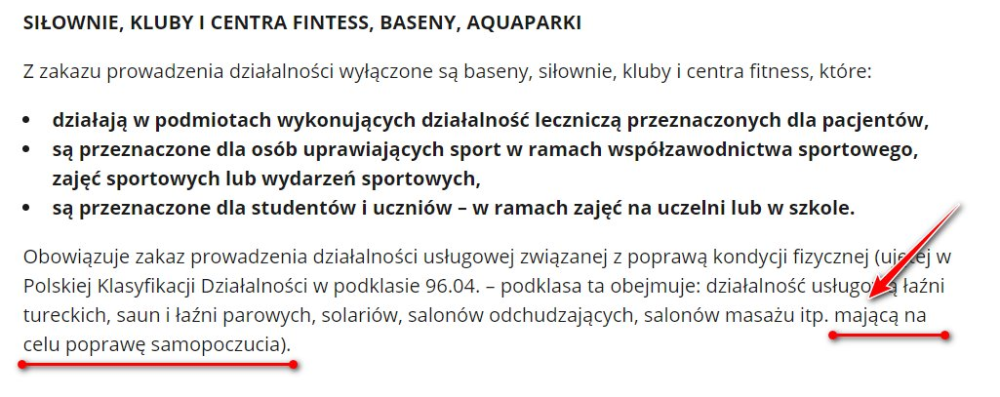
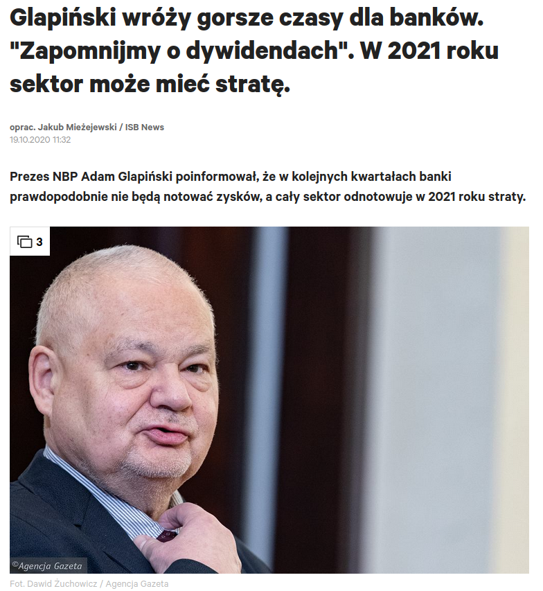
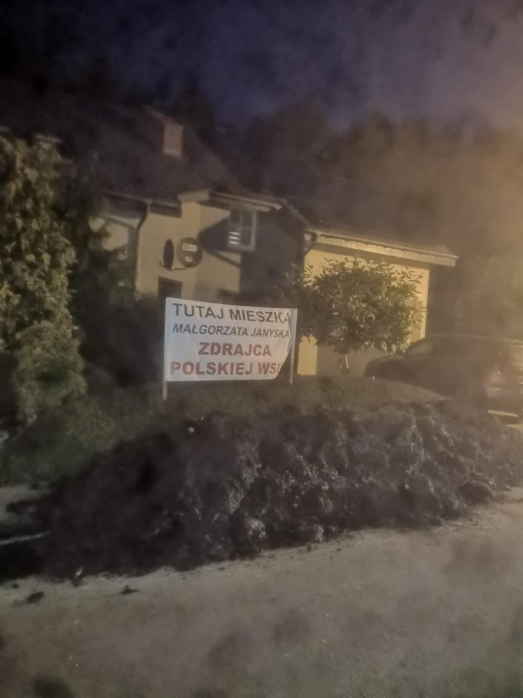
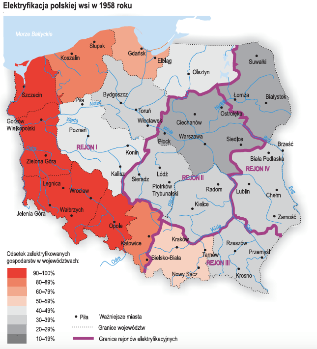
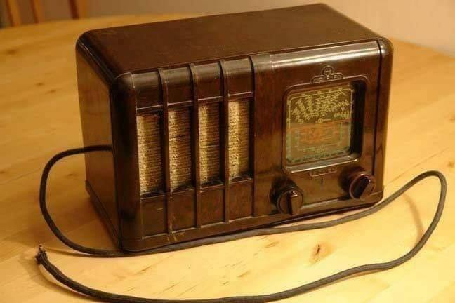
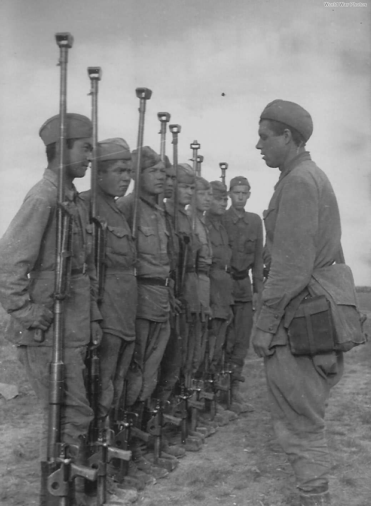
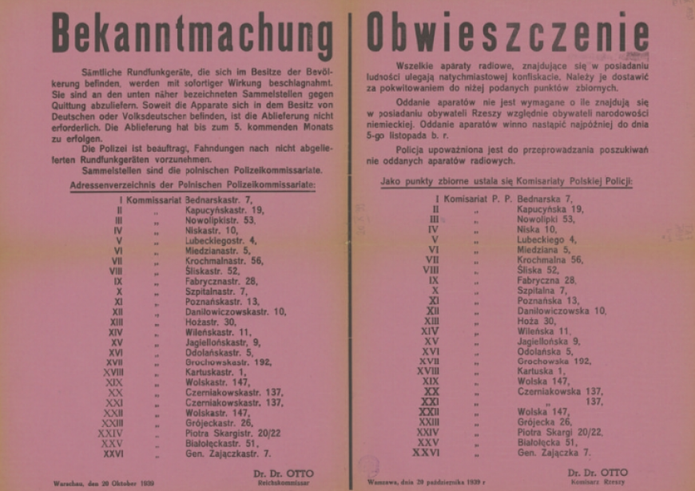

### 2022

  

### 2020

  

---

Wielkie ćwiczenia. Armia wezwie nawet 200 tys. rezerwistów

"Oczywiście oficerowie Sztabu Generalnego Wojska Polskiego zastrzegają, że wszystko jest zależne od tego, jak będzie się rozwijała w przyszłym roku pandemia SARS-CoV-19. Z informacji, którą otrzymaliśmy od płk Joanny Klejszmit, rzeczniczki Sztabu Generalnego Wojska Polskiego, wynika, że w 2021 roku 'planowany limit średnioroczny pozwoli na powołanie na ćwiczenia wojskowe nawet do ok. 200 tys. żołnierzy rezerwy'" - czytamy w gazecie.

Zgodnie z informacjami "Rzeczpospolitej" w tej grupie znajdą się rezerwiści powołani na kursy oficerskie i podoficerskie, studenci - ochotnicy w ramach programu Legia Akademicka, a także 12 tys. ochotników, którzy będą chcieli odbyć służbę przygotowawczą. Założenia takie znalazły się w projekcie rozporządzenia Rady Ministrów w sprawie określenia liczby osób, które w 2021 r. mogą być powołane do czynnej służby wojskowej, który został przygotowany przez resort obrony.

Dziennik zaznacza jednak, że ostateczna liczba przeszkolonych będzie znana za rok, bowiem wielkość wezwań uzależniona jest od długości ćwiczeń wojskowych, a także potrzeb poszczególnych jednostek wojskowych.

"Dowódcy jednostek wojskowych najczęściej wzywają rezerwistów na obowiązkowe ćwiczenia na okres od pięciu do 14 dni kalendarzowych. Jednym z celów takich wezwań jest przekwalifikowanie żołnierzy do innych specjalności wojskowych. W grupie wzywanych mogą znaleźć się pracownicy korpusów: medycznego, sprawiedliwości i prawnego, duszpasterstwa, finansowego, Sił Powietrznych, m.in. kierowcy, operatorzy sprzętu inżynieryjnego, kucharze, fryzjerzy. Co istotne, na ćwiczenia nie muszą być wzywani tylko żołnierze rezerwy, ale też ci, którzy zostali do rezerwy przeniesieni, pomimo że wcześniej nie odbyli przeszkolenia wojskowego" - napisano.

<!-- Bogaci ludzie w Chinach często zatrudniają duplikaty do odbycia kary więzienia. Praktyka nazywana jest ′′ ding zui ′′ czyli ′′ przestępczym zastępstwem " -->

<!-- „Moja żona ma covida. Modlę się, żeby nie musiała iść do szpitala. Oddziały covidowe to umieralnie” (rezydent anestezjologii) 
Dokładnie miesiąc temu minister Adam Niedzielski zapowiedział „podwojenie dostępnej bazy łóżek” dla pacjentów zakażonych wirusem. I udało się! Było 15 tys. łóżek, jest 35 tys. W ciągu 30 dni przybyło 20 tys.!
Są jednak pytania: czy stoi przy nich odpowiedni sprzęt? Mają dostęp do tlenu? Skąd wzięto lekarzy, pielęgniarki, ratowników, by je obsługiwali? Łóżka są na serio? Czy też dyrektorzy szpitali, by poprawić humor ministrowi, tworzyli je szybkim pociągnięciem pisaka, robiąc np. z interny „internę covidową”?
Statystycznie wyglądamy świetnie – tylko 60 proc. łóżek covidowych jest zajętych. Do tego mamy 657 wolnych respiratorów (wypada po 41 na województwo). Zachorowań mniej. 
Tylko dlaczego bijemy rekordy w liczbie zgonów? Zadzwoniłem do lekarza, który od miesięcy jest na pierwszej linii. Zapytałem, czy tak samo jak premier Morawiecki uważa, że osiągamy delikatną przewagę w walce z wirusem.
„Redaktorze,
telefon w lekarskim nie milknie. Przez cały dyżur biegam po siedmiopiętrowym szpitalu: laryngologia, okulistyka, chirurgia dziecięca, pulmonologia, ginekologia, chirurgia, ortopedia, onkologia, hematologia, radiologia, pediatria... Konsultacje, wkłucia centralne, reanimacja.
Pacjenci umierają. Mój ostatni 24-godzinny dyżur odmierzała śmierć: zgon, zgon... pizza (zdążyłem zjeść połowę, bo mnie wezwali), zgon, zgon... Półtorej godziny snu i znów wezwanie. „Leć, bo się pacjent załamał”. Biegnę. Nie dobiegłem na czas. Taki dyżur to standard.
Wieszasz kartkę i już
Wiesz, że tych ludzi można byłoby uratować? Na pewno by żyli, gdyby to, co widzisz w statystykach, odpowiadało prawdzie. Mówisz, że „statystycznie” mamy zapas łóżek dla pacjentów covidowych.
Opowiem ci, jakie to łóżka. Nasz szpital od początku pandemii przechodzi ciągłe reorganizacje. Najpierw covidowcy leżeli w wydzielonym budynku, potem tworzono miejsca covidowe na poszczególnych oddziałach, potem część pacjentów covidowych przeniesiono do innego skrzydła.
To wszystko oznacza chaos. Na laryngologii jest oddział covidowy, laryngologia jest tam, gdzie okulistyka, okulistyka tam, gdzie chirurgia dziecięca, chirurgia dziecięca tam, gdzie pediatria... A jutro może się to zmienić.
Każda z tych rotacji przynosi statystyczne zwiększenie liczby łóżek covidowych. Jak? Wieszasz kartkę na drzwiach: „Oddział covidowy” – i już! Ale co to za oddział covidowy bez respiratorów, sprzętu, personelu? Sprzęt w kartonach: cewniki naczyniowe, cewniki pęcherzowe. Personel przypadkowy, z łapanki.
                                             ***
Zakładam wkłucie centralne. Sam go na jałowo nie założę. Musi ktoś pomagać. Jest pielęgniarka, ale ona nie wie, gdzie co leży:
– Doktorze, ja nie jestem z tego oddziału.
– Ja też nie.
– Może w tych kartonach.
– Może.
Czas leci. Chory pogarsza się oddechowo.
– Co to za pacjent?
Milczenie.
– Jakie ma obciążenia?
Milczenie.
Wszystkie pielęgniarki są z innych oddziałów. Nie mają prawa kojarzyć tych pacjentów – cztery dziewczyny na 40 pacjentów!
Kolejne wezwanie. Covidowa interna. Pacjent niewydolny oddechowo. Intubuję, reanimuję. 5, 10, 15 minut. Żadnego efektu. Jestem wykończony. W 20. minucie padam, nie jestem w stanie ratować go dalej. Przerywam. Patrzę na niego, całkiem młody gość. Rocznik 65. Myślałem, że się uda.
                                            ***
Ktoś mnie puka w plecy. Pielęgniarka z interny: – Doktorze, a możesz spojrzeć, bo tam nam się jeszcze jedna pani pogarsza. Babcia. Obrzęki, zmiany pozakrzepowe na kończynach dolnych. Każę ją położyć na brzuchu. Saturacja się poprawia.
– Jaki lekarz prowadzi?
Nikt nie wie.
– Dobra, pani musi tak leżeć.
Po kilku godzinach łapie mnie internistka.
– Pan reanimował moją pacjentkę?
– Ja? Chyba nie…
– Taka starsza pani na internie.
– Na internie przekładałem jedną panią na brzuch.
– O nią chodzi.
– Co z nią?
– Jak przyszłam, to była martwa… Jakby pan napisał, że była konsultacja anestezjologiczna...
Nawet nie zauważyła, kiedy pacjentka jej zeszła! Teraz szuka dupokrytki. I co ja mogę napisać? Brak dalszych wskazań do eskalacji terapii, czyli że była nie do uratowania? Napiszę. Pomogę. Doktor jest sama na oddziale, też musi biegać po całym szpitalu i konsultować internistycznie. Nie ma szans, żeby to ogarnęła.
                                                 ***
Wzywają mnie do założenia wkłucia centralnego dla covidowca. Dziadek, 80 lat. W bardzo złym stanie. Niewydolny krążeniowo, obrzęknięty. Zakładam wkłucie. Piszę w konsultacji prośbę o wykonanie gazometrii i biegnę. Wzywają mnie na inne oddziały.
O godz. 2:45 znów wezwanie do tego samego pacjenta: „Pacjent pogarszający się oddechowo”. Wracam. Dobijam się do drzwi, dzwonię. Na oddziale nie ma personelu. Za drzwiami pacjenci covidowi. Jeden z nich właśnie się załamuje!
Idę w zakontaminowanym kombinezonie przez czystą część. Nie powinienem tego robić, ale człowiek chyba tam umiera. Pacjent leży na płasko, na plecach. Monitor obok, czujnik saturacji obok. Stoją sobie. Nie zostały podłączone. Podnoszę wezgłowie, podnoszę pacjenta. Uzyskuję saturację 85. Trzeba pilnie wykonać ileś czynności. Ale tu, kurwa, nie ma nikogo. Komu mam to zlecić?
Wychodzę. Mijam pacjentów leżących na łóżkach. Starzy, niedołężni ludzie. Na ścianie kartka: „Telefon do pielęgniarek...”. Wiem, że żaden z pacjentów nie jest w stanie zatelefonować.
Te oddziały to umieralnie. Są po to, żeby ludzie nie schodzili na ulicy.
                                                  ***
A ja? Kiedy ostatnio widziałem swoich pacjentów? A przecież mój oddział to OIOM! Pacjenci na stronie brudnej pod respiratorami, na czystej po wstrząsach, z zapaleniem otrzewnych, trzeba pilnować gospodarki wodnoelektrolitowej. Kiedy mam to robić, skoro konsultuję i reanimuję? Kto jest bez winy?
Pamiętam z ostatnich dni jednego z covidowych pacjentów. Konsultowałem go na jakimś oddziale. Jak podszedłem do niego, miał niecałe 60 proc. saturacji. Patrzę, a w jego nogach leżą wąsy tlenowe!
– Dlaczego to nie jest podłączone? – krzyczę do pielęgniarki.
– A bo nie ma kto mu tego podłączyć, doktorze!
Jezu! To zakładam te wąsy. Mija doba. Pacjent niewydolny oddechowo trafia do mnie na OIOM. Leży sobie pod respiratorem, leży, aż się butla z tlenem skończyła. I zmarł. Taka to, kurwa, smutna przygoda się zdarzyła.
Dziwisz się? A ja wcale się nie dziwię. Na stronie brudnej na 19 pacjentów są trzy pielęgniarki. Powinno być dziesięć. Jedna na dwa stanowiska. Tlen w butlach, butle na dwukołowych wózkach przywiązane łańcuchami. Tak tu jest.
Jeszcze pójdziemy za to siedzieć. To jest przecież sprawa do prokuratury. I co ja powiem: „Pacjent zmarł, bo skończyła się butla z tlenem, bo nie było komu przypilnować, bo jest mało pielęgniarek”? A co to obchodzi żonę tego faceta? Albo pana prokuratora? Jak widzisz, trudno przeżyć w moim szpitalu. Tu musisz mieć szczęście. Jak ktoś spostrzeże, że butla się kończy, będzie OK.
Czytaj też: Lekarze alarmują. Zaraz będziemy tu mieli Lombardię
Tlenu nie ma, nikt nie powiedział
Dlaczego używamy butli? Brak tlenu w instalacji szpitalnej. Za dużo pacjentów podłączonych do respiratorów. Oczywiście, nikt nam niczego nie powiedział. Wszystko sprawdza się na żywym organizmie. Podłączam pacjenta pod respirator. Nie działa. Drugi? Lepiej. Po chwili dzwoni lekarka: – Coś się dzieje złego z pacjentem. Desaturuje!
Sprawdzamy. Respirator nastawiony na 100 proc. podaje tylko w 36 proc. Wtedy wpadliśmy na to, że trzeba sprowadzić butlę, bo w ścianie ciśnienie jest zbyt niskie.
                                               ***
Na interwencję do drugiego budynku szpitalnego, gdzie jest kilka „lżejszych” oddziałów covidowych, jeździmy karetką. Leczy tam fajny hematolog, miły chirurg, neurolog, nefrolog. Ale nie ma anestezjologów, lekarzy medycyny ratunkowej ani sprzętu. Więc jak się ktoś pogorszy, muszą wzywać nas. Najczęściej wzywają na ostatnią chwilę.
Dlaczego? Otóż mają jeden monitor i dwa pulsoksymetry na oddział. Jeśli chory nie jest podłączony do sprzętu, to oni nie widzą, że się pogarsza. Tym bardziej że przy covidzie pacjenci z saturacją 70 proc. potrafią logicznie rozmawiać. Nie widać problemów. Aż nagle bach... Oni reagują, jak nastąpi to bach. Mówiąc wprost – jak pacjent zsinieje, dzwonią po nas.
Respirator wziąć. Lifepacka: monitor z funkcją defibrylacji, kardiowersji brać. Plecak z ambu, z lekami, rurkami. Leki z lodówki. Dygam z tym do karetki. Z pielęgniarką przebieramy się w kombinezony. A pacjent się tam dusi.
Rzadko udaje się zdążyć. Jesteśmy w drodze i dostajemy informację: „Możecie wracać, już po wszystkim”. Czasami nas nawet nie wołają. Widzą, że i tak nie zdążymy. I to też jest statystyka w praktyce. Na tamtych oddziałach są wyłącznie łóżka covidowe, które widzi w tabelkach pan minister. Ale są to łóżka bez dostępu do tlenu, bez sprzętu pomiarowego i bez personelu.
                                                   ***
Na interwencję zawsze chcę brać ze sobą pielęgniarkę z OIOM. One są doświadczone, znają się na rzeczy. Gdy trwa reanimacja, chcesz kogoś takiego obok siebie.
Proszę je: „No pojedź ze mną” – i chyba nie muszę ci mówić, jaki jest ich stosunek do moich próśb. „Doktor, a może byś znalazł kogoś innego, co?”.
Nie mam pretensji. Są upocone, umęczone, ledwie stoją. „Ratowanie życia” brzmi pięknie, ale to ciężka fizyczna praca. Pacjent waży 150 kg. Przenieś go z pielęgniarką na nosze!
Wspominałem ci, że z okazji 11 listopada szpital wypłacał nagrody za walkę z covidem? Dostali różni ludzie: pan związkowiec, pani z kadr... Nie dosłała żadna z oiomowych pielęgniarek.
                                               ***
Anestezjolog ma grubą skórę. Często oglądamy śmierć. Mamy taką pracę. Mówimy: „mogę reanimować i jeść kanapkę”, ale dziś łapię się za głowę. Jesteśmy wykończeni fizycznie i psychicznie. A to nie jest nawet środek epidemii. Miesiące walki przed nami. Wypłaszczanie krzywej widać tylko w ministerstwie. I chyba tylko dzięki sztuczkom matematycznym. Bo u nas jest dramat.
Wczoraj zakaziła się moja żona. Ciągle myślę, co zrobić, jak się pogorszy oddechowo. Zostawiać ją w domu? Słać do szpitala? Ale kto się nią tam zajmie, jak nie będzie mnie obok? Czy przepracowany lekarz albo pielęgniarka zauważy, że tlen w butli się kończy? Skoro ja się boję, co muszą przeżywać inni ludzie, którzy nie są lekarzami?
Myślę, że niedługo też się zakażę. Prawdę mówiąc, liczę na to. Chciałbym odpocząć od tego burdelu.
Pozdrawiam
P.” -->

---

  

---

> Prezes NBP Adam Glapiński poinformował, że w kolejnych kwartałach banki prawdopodobnie nie będą notować zysków, a cały sektor odnotowuje w 2021 roku straty.

  

> Oczywiście, mamy świadomość, że wszystkie wyniki analiz są obarczone nadal olbrzymią niepewnością dotyczącą rozwoju pandemii. Jednocześnie ostatnie dane gospodarcze i rewizje prognoz pokazują, że spowolnienie gospodarcze może być łagodniejsze niż spodziewaliśmy się jeszcze w lipcu w 'Raporcie o inflacji' NBP.

---

  

---

Pół biedy i bieda cała

Współcześni makroekonomiści pieniądze „wypłukują z powietrza". Bank centralny może ich wyemitować ile chce. Nazywa się to Modern Monetary Theory (MMT). Niektórzy jednak złośliwie rozwijają ten skrót jako More Money Today. A co będzie tomorrow?
Państwo nie powinno potrzebować moich pieniędzy. Skoro ma „swoje".
Nie można wyemitować ile się chce i trochę trzeba pożyczyć. Długu ponoć nie trzeba oddawać. Wystarczy go "obsługiwać".
Niektórzy w nie do końca transparentnym trybie otrzymali wyemitowane z niczego przez banki centralne pieniądze; muszą coś z nimi zrobić – kupić jakieś aktywa. To lepsze od trzymania ich w banku na ujemnych stopach procentowych.
O długu parę rzeczy trzeba wiedzieć. A dokładniej pięć: od kogo się pożycza, w jakiej walucie, jak dużo, jak szybko zwiększa się zadłużenie i w jakim celu. Dług wewnętrzny nie jest tak groźny jak zagraniczny – własnych obywateli łatwiej oszukać.
Żeby dług obsługiwać, czyli płacić odsetki, trzeba mieć na odsetki. Kiedy jest deficyt, to dług trzeba „rolować", czyli zaciągać nowy na odsetki od starego. Jak szybko się dług powiększa, wierzyciele mogą się bać pożyczać. Wtedy trzeba zacząć spłacać dług.

---

### 1987

  

### 1958

  

### 1943

W Krakowie przy ulicy Mazowieckiej 32 Gestapo dokonało pierwszej publicznej egzekucji 20 wiezniów osadzonych w więzieniu na Montelupich. Akcja była odwetem za zamach na Reichsdeutschera Jakuba Wierzchosławskiego,który był urzędnikiem Arbeitsamtu (niemieckiego urzędu pracy). Zwłoki zamordowanych wywieziono w nieznanym kierunku. Z pośród rozstrzelanych tożsamość 18 osób pozostanie tajemnicą, rozpoznano jedynie Tomasza Fornalę oraz Włodzimierza Marszalika.
Przyczynę egzekucji i nazwiska pomordowanych zakomunikowały uliczne głośniki.

  

### 1942

Okupacyjny komisarz Rzeszy na Warszawę Helmut Otto podpisał obwieszczenie o natychmiastowej konfiskacie wszelkich aparatów radiowych, które należało oddać do 5 listopada.

  

---

II wojna światowa. Sowieccy żołnierze z karabinami przeciwpancernymi PTRD (kaliber14.5m). Na początku Barbarossy Armia Czerwona poniosła ogromne straty w sprzęcie przeciwpancernym i zaczynało brakować jej środków przeciwpancernych. Próbowano temu zaradzić wprowadzając na jej uzbrojenie  karabiny przeciwpancerne  PTRS i PTRD.   PTRD nie cieszył zbyt dużą popularnością wśród żołnierzy. Była to broń wysoko awaryjna co wynikało  z faktu, że zbyt pospiesznie wprowadzono ją do produkcji używając przy tym do jej budowy materiałów niskiej jakości.    Mimo wszystko  zaczęto formować jednostki wyposażone w tę broń i to na masowa skalę. Powstawały samodzielne kompanie  czy bataliony przeciwpancerne.    Etat sowieckiego pułku piechoty przewidywał 75 sztuk tej broni na stanie. Karabiny przeciwpancerne używane były w Armii Czerwonej aż do 1943 roku kiedy to stopniowo zaczęto wycofywać je z jednostek liniowych na skutek zwiększenia produkcji dział przeciwpancernych różnych kalibrów.

  

### 1939

Rozpoczęła się w Wielkopolsce niemiecka operacja "Tanneberg"-działanie na szeroką skalę wymierzone w likwidację polskich elit przywódczych. Koncepcja tej akcji eksterminacyjnej powstała razem z planem ataku na Polskę. Na liście osób skazanych na zagładę znalazło się 61 tysięcy przedstawicieli różnych warstw polskiego społeczeństwa, począwszy od księży, polityków ,ludzi kultury, a skończywszy na przedsiębiorcach i byłych powstańcach.
W ogóle na terenie Polski akcja zaczęła się 1 września 1939 roku. Do 25 października 1939 roku wykonano ponad 760 egzekucji i masowych mordów, w których życie straciło ponad 20 tysięcy ludzi.
Na zdjęciu egzekucja Polaków przez Einsatzkommando
11 pod dowództwem Heinza Graefe w Kórniku 20 października 1939.

  

---

Okupacyjny komisarz III Rzeszy na Warszawę Helmut Otto podpisał obwieszczenie o natychmiastowej konfiskacie wszelkich aparatów  radiowych, które należało oddać do 5 listopada.

  

---

### 1918

Rada Miejska Lwowa zdecydowała o przyłączeniu miasta do Polski. Lwów, jedno z największych i najpiękniejszych miast Ukrainy został założony ok. 1250 roku przez króla Daniela I Halickiego, który nazwał miasto Lwowem na cześć swojego syna Lwa. W latach 1349-1370 Lwów wchodził w skład Królestwa Polskiego, a w latach 1370-1387 w skład Królestwa Węgier, od potem do 1772 ponownie w skład Królestwa Polskiego i Rzeczypospolitej Obojga Narodów, od 1434 był stolicą województwa ruskiego Korony.

  

### 1859

https://pl.wikipedia.org/wiki/John_Dewey (zakładał, że ludzie uzywają mózgu) vs https://pl.wikipedia.org/wiki/Walter_Lippmann (zakładał, że ludzie są apatyczni)

---

<a href="https://github.com/TomaszWaszczyk/historia.waszczyk.com/edit/master/src/content/october-20.md" target="_blank">Edytuj tę stronę dzieląc się własnymi notatkami!</a>
