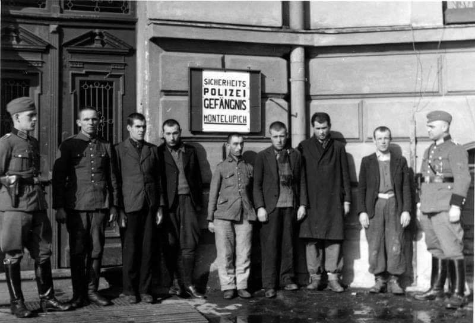

### 2020

  

---

Wielkie ćwiczenia. Armia wezwie nawet 200 tys. rezerwistów

"Oczywiście oficerowie Sztabu Generalnego Wojska Polskiego zastrzegają, że wszystko jest zależne od tego, jak będzie się rozwijała w przyszłym roku pandemia SARS-CoV-19. Z informacji, którą otrzymaliśmy od płk Joanny Klejszmit, rzeczniczki Sztabu Generalnego Wojska Polskiego, wynika, że w 2021 roku 'planowany limit średnioroczny pozwoli na powołanie na ćwiczenia wojskowe nawet do ok. 200 tys. żołnierzy rezerwy'" - czytamy w gazecie.

Zgodnie z informacjami "Rzeczpospolitej" w tej grupie znajdą się rezerwiści powołani na kursy oficerskie i podoficerskie, studenci - ochotnicy w ramach programu Legia Akademicka, a także 12 tys. ochotników, którzy będą chcieli odbyć służbę przygotowawczą. Założenia takie znalazły się w projekcie rozporządzenia Rady Ministrów w sprawie określenia liczby osób, które w 2021 r. mogą być powołane do czynnej służby wojskowej, który został przygotowany przez resort obrony.

Dziennik zaznacza jednak, że ostateczna liczba przeszkolonych będzie znana za rok, bowiem wielkość wezwań uzależniona jest od długości ćwiczeń wojskowych, a także potrzeb poszczególnych jednostek wojskowych.

"Dowódcy jednostek wojskowych najczęściej wzywają rezerwistów na obowiązkowe ćwiczenia na okres od pięciu do 14 dni kalendarzowych. Jednym z celów takich wezwań jest przekwalifikowanie żołnierzy do innych specjalności wojskowych. W grupie wzywanych mogą znaleźć się pracownicy korpusów: medycznego, sprawiedliwości i prawnego, duszpasterstwa, finansowego, Sił Powietrznych, m.in. kierowcy, operatorzy sprzętu inżynieryjnego, kucharze, fryzjerzy. Co istotne, na ćwiczenia nie muszą być wzywani tylko żołnierze rezerwy, ale też ci, którzy zostali do rezerwy przeniesieni, pomimo że wcześniej nie odbyli przeszkolenia wojskowego" - napisano.

<!-- Bogaci ludzie w Chinach często zatrudniają duplikaty do odbycia kary więzienia. Praktyka nazywana jest ′′ ding zui ′′ czyli ′′ przestępczym zastępstwem " -->

---

  

---

> Prezes NBP Adam Glapiński poinformował, że w kolejnych kwartałach banki prawdopodobnie nie będą notować zysków, a cały sektor odnotowuje w 2021 roku straty.

  

> Oczywiście, mamy świadomość, że wszystkie wyniki analiz są obarczone nadal olbrzymią niepewnością dotyczącą rozwoju pandemii. Jednocześnie ostatnie dane gospodarcze i rewizje prognoz pokazują, że spowolnienie gospodarcze może być łagodniejsze niż spodziewaliśmy się jeszcze w lipcu w 'Raporcie o inflacji' NBP.

---

  

---

Pół biedy i bieda cała

Współcześni makroekonomiści pieniądze „wypłukują z powietrza". Bank centralny może ich wyemitować ile chce. Nazywa się to Modern Monetary Theory (MMT). Niektórzy jednak złośliwie rozwijają ten skrót jako More Money Today. A co będzie tomorrow?
Państwo nie powinno potrzebować moich pieniędzy. Skoro ma „swoje".
Nie można wyemitować ile się chce i trochę trzeba pożyczyć. Długu ponoć nie trzeba oddawać. Wystarczy go "obsługiwać".
Niektórzy w nie do końca transparentnym trybie otrzymali wyemitowane z niczego przez banki centralne pieniądze; muszą coś z nimi zrobić – kupić jakieś aktywa. To lepsze od trzymania ich w banku na ujemnych stopach procentowych.
O długu parę rzeczy trzeba wiedzieć. A dokładniej pięć: od kogo się pożycza, w jakiej walucie, jak dużo, jak szybko zwiększa się zadłużenie i w jakim celu. Dług wewnętrzny nie jest tak groźny jak zagraniczny – własnych obywateli łatwiej oszukać.
Żeby dług obsługiwać, czyli płacić odsetki, trzeba mieć na odsetki. Kiedy jest deficyt, to dług trzeba „rolować", czyli zaciągać nowy na odsetki od starego. Jak szybko się dług powiększa, wierzyciele mogą się bać pożyczać. Wtedy trzeba zacząć spłacać dług.

---

### 1958

  

### 1942

Okupacyjny komisarz Rzeszy na Warszawę Helmut Otto podpisał obwieszczenie o natychmiastowej konfiskacie wszelkich aparatów radiowych, które należało oddać do 5 listopada.

  

---

~~

II wojna światowa. Sowieccy żołnierze z karabinami przeciwpancernymi PTRD (kaliber14.5m). Na początku Barbarossy Armia Czerwona poniosła ogromne straty w sprzęcie przeciwpancernym i zaczynało brakować jej środków przeciwpancernych. Próbowano temu zaradzić wprowadzając na jej uzbrojenie  karabiny przeciwpancerne  PTRS i PTRD.   PTRD nie cieszył zbyt dużą popularnością wśród żołnierzy. Była to broń wysoko awaryjna co wynikało  z faktu, że zbyt pospiesznie wprowadzono ją do produkcji używając przy tym do jej budowy materiałów niskiej jakości.    Mimo wszystko  zaczęto formować jednostki wyposażone w tę broń i to na masowa skalę. Powstawały samodzielne kompanie  czy bataliony przeciwpancerne.    Etat sowieckiego pułku piechoty przewidywał 75 sztuk tej broni na stanie. Karabiny przeciwpancerne używane były w Armii Czerwonej aż do 1943 roku kiedy to stopniowo zaczęto wycofywać je z jednostek liniowych na skutek zwiększenia produkcji dział przeciwpancernych różnych kalibrów.

  

### 1943

W Krakowie przy ulicy Mazowieckiej 32 Gestapo dokonało pierwszej publicznej egzekucji 20 wiezniów osadzonych w więzieniu na Montelupich. Akcja była odwetem za zamach na Reichsdeutschera Jakuba Wierzchosławskiego,który był urzędnikiem Arbeitsamtu (niemieckiego urzędu pracy). Zwłoki zamordowanych wywieziono w nieznanym kierunku. Z pośród rozstrzelanych tożsamość 18 osób pozostanie tajemnicą, rozpoznano jedynie Tomasza Fornalę oraz Włodzimierza Marszalika.
Przyczynę egzekucji i nazwiska pomordowanych zakomunikowały uliczne głośniki.

  

### 1939

Rozpoczęła się w Wielkopolsce niemiecka operacja "Tanneberg"-działanie na szeroką skalę wymierzone w likwidację polskich elit przywódczych. Koncepcja tej akcji eksterminacyjnej powstała razem z planem ataku na Polskę. Na liście osób skazanych na zagładę znalazło się 61 tysięcy przedstawicieli różnych warstw polskiego społeczeństwa, począwszy od księży, polityków ,ludzi kultury, a skończywszy na przedsiębiorcach i byłych powstańcach.
W ogóle na terenie Polski akcja zaczęła się 1 września 1939 roku. Do 25 października 1939 roku wykonano ponad 760 egzekucji i masowych mordów, w których życie straciło ponad 20 tysięcy ludzi.
Na zdjęciu egzekucja Polaków przez Einsatzkommando
11 pod dowództwem Heinza Graefe w Kórniku 20 października 1939.

  

### 1918

Rada Miejska Lwowa zdecydowała o przyłączeniu miasta do Polski. Lwów, jedno z największych i najpiękniejszych miast Ukrainy został założony ok. 1250 roku przez króla Daniela I Halickiego, który nazwał miasto Lwowem na cześć swojego syna Lwa. W latach 1349-1370 Lwów wchodził w skład Królestwa Polskiego, a w latach 1370-1387 w skład Królestwa Węgier, od potem do 1772 ponownie w skład Królestwa Polskiego i Rzeczypospolitej Obojga Narodów, od 1434 był stolicą województwa ruskiego Korony.

  

### 1859

https://pl.wikipedia.org/wiki/John_Dewey (zakładał, że ludzie uzywają mózgu) vs https://pl.wikipedia.org/wiki/Walter_Lippmann (zakładał, że ludzie są apatyczni)

---

<a href="https://github.com/TomaszWaszczyk/historia.waszczyk.com/edit/master/src/content/october-20.md" target="_blank">Edytuj tę stronę dzieląc się własnymi notatkami!</a>
