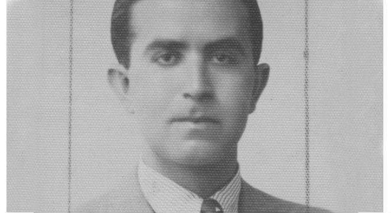
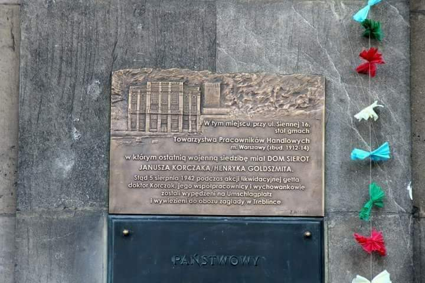

### 2022

BGK odwołuje przetarg sprzedaży obligacji zaplanowany na 24 października
PAP - Biznes

Bank Gospodarstwa Krajowego odwołuje przetarg sprzedaży obligacji zaplanowany na 24 października - podał bank w komunikacie.

Bank planował na 24 października emisję na rzecz Funduszu Przeciwdziałania COVID-19 oraz pierwszą emisję na rzecz Funduszu Wsparcia Sił Zbrojnych.

Oferowane 6- i 10-letnie papiery na rzecz Funduszu Wsparcia Sił Zbrojnych miały mieć stałe oprocentowanie na poziomie 8,25 proc.

W piątek rentowności polskich 10-letnich obligacji skarbowych rosły nawet o ponad 40 pb. do ponad 9 proc. (PAP Biznes)

### 2020

"Bahamy zapiszą się w historii jako pierwszy kraj, który wprowadził do obiegu nową formę pieniądza banku centralnego – CBDC (Central Bank Digital Currency)"

---

LONDON (Reuters) - PayPal Holdings Inc joined the cryptocurrency market on Wednesday, allowing customers to buy, sell and hold bitcoin and other virtual coins using the U.S. digital payments company’s online wallets.

---

Rekord świata. Obligacje na walkę z pandemią to przełom w historii UE

UE wypuściła obligacje socjalne. Popyt na nie pobił rekord świata

Unia Europejska sprzedała właśnie obligacje za 17 miliardów euro. Jest to wydarzenie wyjątkowe i dość niesamowite z paru powodów. Po pierwsze stało się w końcu to, o co przez lata w Unii się kłócono – Unia wyemitowała wspólny i duży dług. Politycy niechętni tej zmianie podkreślają, że to jednorazowa przygoda, do której zmusiła nas epidemia koronawirusa, ale faktem jest, że to się stało.

### 2019

Mecenas Schramm zamieścił informację o odrzuceniu przez Szwajcarów obywatelskiego projektu bezwarunkowego dochodu podstawowego z zawartym przytykiem wobec polskiego 500+. Różnica między dochodem bezwarunkowym a świadczeniem na dziecko jest taka, że ten pierwszy państwo wypłaca bez żadnego świadczenia wzajemnego ze strony beneficjenta, zaś świadczenie na dziecko wypłacane jest w zamian za "świadczenie" w postaci urodzenia i wychowania dziecka, które jest czystym interesem dla państwa i społeczeństwa jako przyszły pracownik i podatnik. 
Przytyk sugeruje implicite, że Szwajcarzy odrzucają programy typu 500+, tymczasem taki sam program w Szwajcarii jak najbardziej funkcjonuje od 10 lat.
Szwajcarzy mają trzy rodzaje świadczeń na dzieci: za urodzenie, za wychowanie i za edukację.
Nie ma jednej kwoty dla całego państwa, każdy kanton reguluje to sobie oddzielnie, minimum to 200 franków miesięcznie na wychowanie dziecka, 250 dla uczącego się. Przykładowo rodzina 2+2 otrzymuje miesięcznie minimum 400 franków. Wypłaca je pracodawca, a gdy rodzic niepracujący - rząd. Przykładowo w Genewie są takie świadczenia:

- 2000 franków za urodzenie dziecka,
- 300 franków miesięcznie na wychowanie (do 16 roku życia),
- 400 franków miesięcznie dla uczącego się.

https://www.unige.ch/egalite/parents/en/work/financial-support-families
https://velocityglobal.com/blog/how-switzerlands-child-benefits-assist-families/

Tak więc 500+ jest dziś europejskim standardem. W przeciwieństwie do bezwarunkowego dochodu. Jan Sowa wywodzi, że Karol Marks uważał bezwarunkowy dochód podstawowy za warunek ziszczenia się komunizmu.

  

### 1999

W Monachium zmarł Alfred Longin Schütz – polski kompozytor pochodzenia żydowskiego, dyrygent, pianista, autor muzyki do pieśni „Czerwone maki na Monte Cassino”.  Był absolwentem Lwowskiego Konserwatorium Muzycznego. Odbył dwuletnią praktykę bankową w lwowskim oddziale Warszawskiego Banku Dyskontowego. W latach 1932-1936  był związany z Wesołą Lwowską Falą  (był jej kierownikiem muzycznym). Od grudnia 1941 pracował w Wydziale Propagandy Sztabowej Armii Polskiej gen. Władysława Andersa. Pracował dla grup artystycznych Armii Polskiej na Wschodzie, później dla Teatru 2. Korpusu Wojska Polskiego na Zachodzie.  Po wojnie przebywał na terenie Brazylii, gdzie realizował się muzycznie. W 1961 roku osiadł w Monachium i rozpoczął współpracę z Radiem Wolna Europa. W ciągu trwające 25 lat pracy dla Radia Wolna Europa stworzył około 300 piosenek dla cotygodniowej audycji ,,Podwieczorek przy mikrofonie'' , a także skomponował utwory orkiestrowe (Mazurskie wesele, Taniec karpackich zbójników, Europejskie fanfary, Spotkanie królów na Wawelu). Opublikował swoje wspomnienia na łamach pism: „Dziennik Polski'' oraz ,,Dziennik Żołnierza” w Londynie oraz w olsztyńskim piśmie „Dziennik Pojezierza”.  Zmarł mając 89 lat. Spoczął na Cmentarzu Wschodnim w Monachium

  

### 1941

Niemieckie władze okupacyjne Warszawy wydały zarządzenie o zacieśnieniu granic getta. W ramach tego rozporządzenia zorganizowany przez Janusza Korczaka Dom Sierot znajdujący się na ulicy Chłodnej został przeniesiony do budynku Towarzystwa Wzajemnej Pomocy Pracowników Handlowych i Przemysłowych przy ulicy Siennej 16.
Było to niestety ostatnie miejsce, w którym ta placówka prowadziła działalność. W sierpniu 1942 roku Korczak, 10 wychowawców i 192 dzieci zostało wypędzonych na Umschlagplatz, skąd wywieziono ich do obozu zagłady w Treblince.

  

### 1805

https://pl.wikipedia.org/wiki/Bitwa_pod_Trafalgarem

---

<a href="https://github.com/TomaszWaszczyk/historia.waszczyk.com/edit/master/src/content/october-21.md" target="_blank">Edytuj tę stronę dzieląc się własnymi notatkami!</a>
