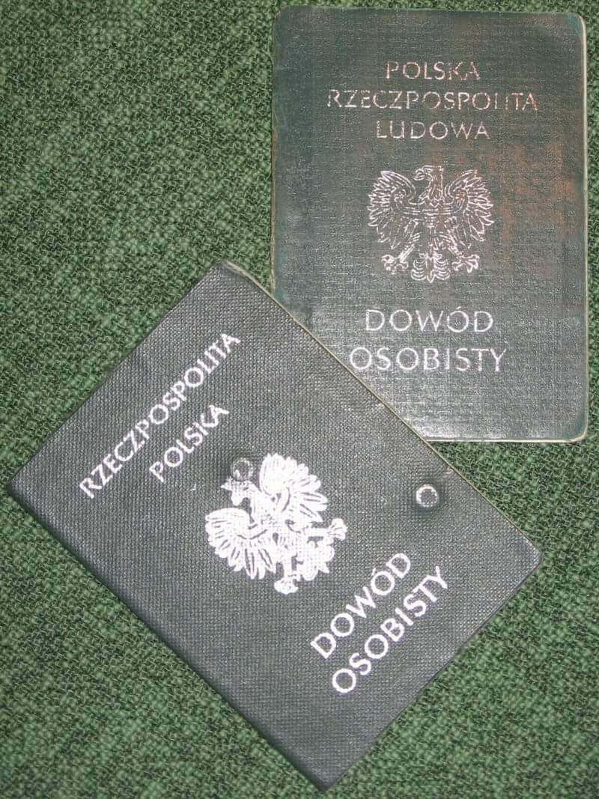
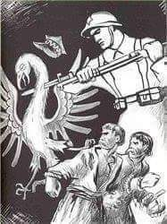

### 2023

<a href="./documents/october/hf_ben-xvi_enc_20071130_spe-salvi.pdf" target="_blank">Spe Salvi</a>

<!-- https://www.vatican.va/content/benedict-xvi/pl/encyclicals/documents/hf_ben-xvi_enc_20071130_spe-salvi.html -->

### 2022

Tak potraktowana Hu Jintao byłego prezydenta Chin 2003-2013 podczas XX kongresu KPCh. Te ujęcia są najlepsze. Pokazowy koniec Chin jakie znamy od 1978 r.  
Niektórzy snuli teorie, że te loty amerykańskich polityków na Tajwan mają osłabić pozycje Xi Jinpinga podczas wyborów. Chyba nie wyszło.

Xi ma teraz naj. władzy od czasów Mao Zedonga. Jedynowładztwo i brak kadencyjności sprawią, że Chiny będą podobne do Korei Północnej. Odchodząc, Hu Jintao kładzie rękę na ramieniu premiera Li Keqianga, który dziesięć lat temu był jego faworytem do objęcia stanowiska prezydenta, ale został w tyle za Xi Jinping.

<video width="640" height="480" controls>
<source src="./movies/october/chiny.mp4" type="video/mp4">
Your browser does not support the video tag.
</video>

<video width="640" height="480" controls>
<source src="./movies/october/chiny2.mp4" type="video/mp4">
Your browser does not support the video tag.
</video>

<!-- Rafal-Piech-Jodek-potasu.mp4 -->

### 2021

Kryzys na granicy. Źródła Onetu: Amerykanie ostrzegają Polskę przed konfliktem z Rosją

Stany Zjednoczone miały ostrzec polski rząd przed możliwym atakiem Rosji na Ukrainę, do którego może zostać wykorzystany konflikt na polsko-białoruskiej granicy – dowiedział się Onet w źródłach dyplomatycznych. Waszyngton miał wezwać polskie władze do pilnych działań na rzecz zbudowania wspólnej koalicji państw bałtyckich, UE i Wielkiej Brytanii, która miałaby powstrzymać zapędy Kremla związane z możliwą inwazją na Ukrainę.

---

<video width="640" height="480" controls>
<source src="./movies/october/vaxvideo.mp4" type="video/mp4">
Your browser does not support the video tag.
</video>

---

### 2020

Ponad połowa małych i średnich europejskich firm boi się, że nie przetrwa roku

McKinsey poinformował, że ponad połowa małych i średnich europejskich firm, zatrudniających dwie trzecie ludzi na kontynencie, nie jest pewna przetrwania kolejnych 12 miesięcy, donosi Reuters.
Agencja zwraca uwagę, że McKinsey przeprowadził badanie w sierpniu, jeszcze przed ponownym nasileniem pandemii w Europie, które zmusiło rządy do zwiększenia ograniczeń mających hamować rozprzestrzenianie wirusa. Firma konsultingowa zapytała ponad 2 tys. firm zatrudniających 250 lub mniej pracowników z pięciu krajów: Niemiec, Francji, Hiszpanii i Wielkiej Brytanii. Okazało się, że 55 proc. obawia się upadku do września przyszłego roku jeśli ich przychody nie wzrosną z obecnego poziomu. W przypadku utrzymania obecnego trendu, jedna na 10 małych i średnich firm obawia się bankructwa w ciągu 6 miesięcy.

<!-- Pisząc o skutkach zainfekowania wirusem SARS-CoV-2 chciałbym przede wszystkim określić problem z medycznego, a nie politycznego punktu widzenia, jednakże w całej tej sytuacji elementy zdrowotne są pod pewnymi względami tak ściśle związane z elementami polityki, że nie sposób ich całkowicie rozdzielić.
Jak w dowcipie, który ostatnio przeczytałem: Pacjentka pyta lekarza, czy mamy się spodziewać nowej fali zachorowań. Lekarz odpowiada: „Nie wiem, proszę pani. Jestem lekarzem a nie politykiem”.
Na początku ogłoszenia epidemii (pandemii) nie bardzo było wiadomo, czy nie zbliża się kolejne zagrożenie masowym wymieraniem ludności, jak w czasie prawdziwych epidemii (dżuma Justyniana , 541-542r. – w samym Konstantynopolu umierało dziennie 5000 osób a populacja miasta zmniejszyła się o 40%; dżuma w Europie w XIV w – zmarła 1/3 ludności Europy;  „zaraza” w Londynie w 1665-1666r. – zmarło 20% mieszkańców Londynu; grypa hiszpanka – śmiertelność 10-20%). To były prawdziwe epidemie, nie takie jak sławetna świńska grypa. Oskarżono wówczas WHO o ogłaszanie sztucznej pandemii na potrzeby koncernów farmaceutycznych. Wykazano, że w grupie, która przygotowywała dokument w sprawie rekomendacji stosowania szczepionek, pracowało 3 naukowców, którzy otrzymywali wypłaty od firm farmaceutycznych. W 2010 r. opublikowano na ten temat krytyczne raporty - zarówno na łamach brytyjskiego pisma medycznego BMJ, jak również na posiedzeniu Zgromadzenia Parlamentarnego Rady Europy  (PACE). 
W przypadku Covid-19 okazało się, że śmiertelność średnio na świecie nie przekracza setnych części procent. W Polsce na Covid-19 zmarło kilkakrotnie mniej, niż w tym samym czasie na zapalenie płuc. Na HIV/AIDS rocznie umiera na świecie ok. 1 mln. osób. Liczba zakażeń jelitowych bakterią Clostridium difficile jest kilkakrotnie większa niż liczba osób, u których stwierdzono zainfekowanie wirusem SARS-CoV-2, a przebieg zakażenia jest często o wiele bardziej poważny.
W ciągu kilku ostatnich miesięcy pracy na oddziale zakaźnym spotykałem się z wieloma osobami, u których wykryto zainfekowanie Covid-19. Celowo nie piszę, że „były chore na Covid”, gdyż ponad 95 % miało albo lekkie objawy, ustępujące po 1-3 dniach, albo nie wykazywała w ogóle żadnych objawów. Zwyklej u tych lekko chorych obserwowaliśmy niewielkie podwyższenie temperatury ciała, przejściowe zaburzenia smaku lub węchu. Oczywiście, były także osoby, u których wystąpiły poważne objawy, wymagające hospitalizacji a niekiedy intensywnego leczenia. Zawsze istnieli ludzie ciężko chorzy i zawsze ludzie umierali. Nikt tego nie neguje. Na szczęście spośród osób, które do nas trafiały, był to naprawdę niewielki odsetek. Ci pacjenci oczywiście byli kierowani do szpitala jednoimiennego. 
Nie tylko z mojej obserwacji, ale także z wymiany doświadczeń z wieloma moimi kolegami – głównie lekarzami rodzinnymi – wynika, że w czasie zachorowań grypowych stan pacjentów był zdecydowanie bardziej poważny. Były to w większości osoby naprawdę chore, bardzo osłabione, wysoko gorączkujące, a ich normalna, codzienna aktywność, była wyłączona na kilka lub kilkanaście dni. 
Przez lata spotykaliśmy się z różnymi chorobami infekcyjnymi, przebiegającymi często z bardziej burzliwymi objawami, ale nikt z tego powodu nie wpadał w panikę, nie zarządzał kwarantanny, izolacji, nie zmuszał ludzi zdrowych do wykonywania testów, badań – tylko dlatego, że znaleźli się w pobliżu osoby zainfekowanej. Po prostu zachowywano się racjonalnie.
Pamiętam, jak zaczęły się zachorowania na HIV. Początkowo ludzie byli naprawdę przestraszeni. Obawiali się, że zakażą się jeśli dotkną klamki, którą przed chwilą dotykał pacjent z HIV. I co wówczas robiono? Nakręcano panikę? Zarządzano kwarantanny? Czy podawano w mediach, ile nowych przypadków wykryto każdego dnia? Czy wirusa nazywano „śmiertelnym wirusem”? Nie. I władze, i pracownicy medyczni zachowywali się wówczas zupełnie normalnie. Starano się ludzi uspokoić, wytłumaczyć, że jest to choroba infekcyjna jak wiele innych i oczywiście należy zachować pewną ostrożność, ale nie wolno wpadać w panikę. To były normalne czasy. Nie było „zapotrzebowania politycznego” na eskalowanie pandemii  strachu, zupełnie inaczej niż w chwili obecnej. 
Aktualnie śmiertelność z powodu innych chorób (w tym infekcyjnych) jest znacznie wyższa, niż śmiertelność wśród osób, które kwalifikuje się jako zmarłe w wyniku zakażenia Covid. Na inne choroby zakaźne umiera ponad 90% osób, a zakwalifikowanych jako Covid – poniżej 10%. Natomiast przekaz medialny jest taki, że mamy się bać tych kilku procent, a nie musimy się przejmować innymi zakażeniami, które są odpowiedzialne za ponad 90% zgonów spowodowanych chorobami zakaźnymi. Gdzie logika? Niezbędne jest w tym przypadku uświadomienie, że zakażenie Covid może być przysłowiowym „gwoździem do trumny” u osób schorowanych, ale praktycznie samo w sobie nie prowadzi do śmierci (tak jak to było początkowo w przypadku AIDS - teraz są terapie, które pozwalają zachować tych pacjentów przy życiu, lecz na początku rozpoznanie AIDS kojarzyło się z nieuchronnym zgonem).
Już słyszę adwersarzy, którzy mówią: „A gdyby to chodziło o twoją najbliższą osobę, schorowaną, w podeszłym wieku, to też uważasz, że nie powinno być obostrzeń, maseczek, izolacji, kwarantanny itp.? Powiedz to osobie, która utraciła kogoś bliskiego”.
Odpowiadam podwójnie:
1) To powiedz to trzem innym osobom, które utraciły swoich bliskich z powodu niemożności otrzymania właściwej pomocy lekarskiej z powodu restrykcji covidowych.
2).  Mój Tato w wieku 81 lat zachorował na banalną infekcję wirusową (nie żaden Covid), która była tym przysłowiowym gwoździem do trumny. Zmarł. I wcale nie uważam, że powinniśmy w tamtym czasie paraliżować normalne życie, funkcjonowanie służby zdrowia, aby zredukować możliwość  przenoszenia   czynników zakaźnych. Podstawowe zasady – tak. Ale nadzwyczajne, przekraczające zasady zdrowego rozsądku – zdecydowanie NIE.
Mimo braku istotnych różnic pomiędzy infekcją Covid a innymi infekcjami wirusowymi (w tym – innymi koronawirusami, które występują w populacji w ilości 5 do 15%) – zarządzono wyolbrzymione, sprzeczne z logiką restrykcje. Sparaliżowano służbę zdrowia. Sparaliżowano gospodarkę. Zniszczono wiele firm (niezależnie od wypłat rekompensujących). Pozbawiono ludzi komfortu bycia wolnym człowiekiem. Zastraszono. 
Być może uchroniono (a właściwie – odwleczono w czasie) zakażenie jakiegoś procenta osób. W miejsce tego pozbawiono zdrowia, a niejednokrotnie życia, o wiele więcej ludzi. Terapia okazała się gorsza niż choroba. Na co dzień spotykam się z sytuacjami, że chorzy pacjenci nie mogą się dostać do lekarza, jeśli mają podwyższoną temperaturę ciała. Są odsyłani z kwitkiem w formie „teleporady”, bez badania fizykalnego, bez badań analitycznych, obrazowych (bo mogą mieć Covida). Ostatnio poruszający, znany mi osobiście przykład z innego miasta: starsza kobieta mieszkająca z mężem (także w podeszłym wieku) z nieco podwyższoną temp. ciała. Pobrano wymaz w kierunku Covid i pozostała w domu. Po kilku godzinach wzrost temp. ciała do ponad 40 st. C. Zasłabła. Mąż wezwał pogotowie. Ratownicy poinformowali, że w oddziale zakaźnym nie ma miejsc wolnych. Szpital jednoimienny jej nie przyjmie, bo nie ma stwierdzonego dodatniego Covida. Inne szpitale nie przyjmą, bo nie ma stwierdzonego ujemnego Covida. Pacjentkę pozostawiono w domu, tłumacząc, że gdyby pojawiła się silna duszność, to niech jeszcze raz wezwie pogotowie. Może w tym czasie będzie już wynik pobranego wcześniej wymazu w kierunku SARS-CoV-2.
Proszę mi wierzyć, to nie jest żadne wyolbrzymianie problemu. I ja i moi koledzy spotykamy się z takimi sytuacjami często. Kiedy na początku na wyniki testów czekaliśmy nawet kilka dni, to pamiętam, jak jeden pacjent po wypadku nie był zaopatrzony przez 3 dni (rany nie były zeszyte). Krążył między jednym szpitalem a drugim (w tym – jednoimiennym, gdzie też go nie zaopatrzono twierdząc, że powinien być zaopatrzony w miejscu zamieszkania).
Z pewnością każdy zna  liczne takie przypadki. To jeden z wielu aspektów pandemii strachu.
Inną, niezwykle przykrą konsekwencją koronapaniki jest pozostawianie starszych, lub młodych ale poważnie chorych osób wymagających hospitalizacji bez możliwości kontaktu z bliskimi. Tacy ludzie, często bardzo emocjonalnie związani z innymi członkami rodziny zostają osamotnieni, bez możliwości odwiedzin w momencie, kiedy wsparcie najbliższych jest im najbardziej potrzebne.
Warto tu wspomnieć o depresjach (koledzy psychiatrzy i psychologowie mają coraz więcej nowych pacjentów). 
Depresja idzie w parze także ze wzrostem bezrobocia. Jak wynika z wielu analiz – wzrost bezrobocia o 1% przyczynia się do wzrostu liczby samobójstw o ok. 1,1%.
Kilkakrotnie na moich oczach dochodziło do omdleń, kiedy pacjenci (nawet mężczyzna w sile wieku) z powodu założonej maseczki mieli utrudniony dopływ tlenu. Po zdjęciu maski wracali powoli do siebie. Wtedy mówiłem, żeby nie zakładali w tym dniu maseczki, niezależnie od zaleceń ministra.
A propos bezpieczeństwa maseczek. Znowu wielu adwersarzy przekonuje, że personel służby zdrowia, zwłaszcza zabiegowcy – używają na co dzień masek i nic się nie dzieje. Tak, to prawda, ale czy w przypadku zaostrzenia POChP lub w zaawansowanej ciąży stają za stołem operacyjnym? Chyba nie.
Ponadto - zdecydowana większość obserwowanych przeze mnie (i nie tylko) osób używa tej samej maski przez wiele tygodni. Jest ona zabrudzona, zainfekowana, a zdarza się, że jeden drugiemu pożycza przed wejściem do sklepu. Inni maja ją na samych ustach lub na brodzie, byleby się uchronić przed mandatem. Nawet gdyby taka maska rzeczywiście ograniczała transmisję wirusa, to w tych przypadkach nie tylko nie ogranicza, ale dodatkowo naraża na infekcje. 
Czy warto więc tak bardzo dezorganizować normalne życie, normalne funkcjonowanie służby zdrowia, aby osiągnąć wyimaginowaną korzyść zdrowotną w nielicznych, pojedynczych przypadkach, poświęcając pod wieloma względami dużo większe grupy ludzi?
O co więc chodzi? Bo ze zdrowym rozsądkiem, a zwłaszcza z medyczną zasadą „primum non nocere” (przede wszystkim nie szkodzić) - ma to niewiele wspólnego. 
Zastraszanie i wzbudzanie paniki szkodzi nam wszystkim. Proszę sobie wyobrazić pilota samolotu, który awaryjnie lądował. Po wylądowaniu informuje pasażerów: „proszę spokojnie podchodzić do wyjść awaryjnych. Na zewnątrz są już służby ratunkowe. Wszyscy bezpiecznie opuszczą samolot”. I nawet, jeśliby zagrażało większe niebezpieczeństwo, to takie rozważne podejście i uspokojenie ludzi zwiększa szansę ich uratowania. A gdyby pilot krzyczał: „Ludzie! Ratujcie się kto może, bo w każdej chwili mogą wybuchnąć zbiorniki z paliwem”. Jak można byłoby to ocenić?
Na naszych oczach odbywa się to drugie. Niestety. Nawet samo podawanie liczb nowo zakażonych lub zmarłych osób jest sposobem manipulacji i straszenia. Średnio w ciągu doby umiera w Polsce ok. 1100 osób. I o tym się nie mówi w mediach. Natomiast słyszymy, że zmarło 8 osób z powodu Covida (tak naprawdę nie wiadomo, czy rzeczywiście z powodu Covida, bo sekcji się u nas w tych przypadkach nie robi).
Ponadto, w zdecydowanej większości przypadków ludzie umierali na inne choroby, będąc „bezobjawowymi nosicielami wirusa” ale do informacji publicznej podaje się, że zmarli „z powodu” koronawirusa, co jest kolejnym elementem manipulacji zmierzającej do eskalowania strachu.
A gdyby tak informować, że dziś zginęło w wypadkach komunikacyjnych 8 osób w Polsce. I tak codziennie (tyle bowiem średnio ginie). I gdyby stwierdzić, że trzeba wobec tego podjąć nadzwyczajne działania – ograniczenie ilości pojazdów na jezdni (jeden pojazd od drugiego w odległości 100 m), ograniczenie ilości pieszych na przejściach (maksimum dwie osoby jednocześnie), konieczność noszenia przez pieszych czapeczek z migającym światełkiem (za brak czapeczki wysokie mandaty)? A najlepiej: „Zostań w domu, nie wychodź na ulicę – zachowaj się odpowiedzialnie”. I tu widać nonsens nieadekwatnych działań, z jakimi mamy do czynienia w związku z koronapaniką.
Jeżeli ktoś powie, że przykład jest chybiony, bo tu chodzi o chorobę zakaźną - to od razu odpowiadam: chodzi o to, by zmniejszyć ilość zgonów – niezależnie od przyczyny. 
Ktoś może powiedzieć, że łatwo mi ironizować na temat ofiar wypadków. Od razu odpowiadam: mój syn zginął w wypadku w wieku 19 lat. I nie uważam, że powinno się nosić dla bezpieczeństwa czapeczki z migającym światełkiem.
Dlaczego uważam, że straszenie jest częścią polityki?
Minęło kilka miesięcy. W niektórych krajach zrezygnowano z siania paniki i prowadzono w miarę normalne życie (poza nielicznymi ograniczeniami). Jaki skutek w porównaniu w tymi, gdzie wprowadzono obostrzenia
Kraj / procent zakażeń w całej populacji / procent zgonów w całej populacji
USA / 1,8% / 0,055%
Brazylia / 1,8% / 0,06%
Włochy / 0,45% / 0,06%
Polska / 0,18% / 0,005%
Białoruś / 0,75% / 0,007%
Szwecja / 0,84% / 0,06%
Jak widać – nie ma istotnej różnicy pomiędzy średnią liczbą zgonów na świecie a średnią liczbą zgonów w krajach bez obostrzeń (Szwecja, Białoruś).
A propos Białorusi – niezależnie od oceny politycznej i moralnej ich prezydenta, to warto zapoznać się z konferencją prasową, gdzie podał do publicznej wiadomości, w jaki sposób próbowano go nakłonić, by zastosował takie obostrzenia, jak w pozostałych krajach:
„Agencja Bełsat poinformowała o tym, że WHO czyli Światowa Organizacja Zdrowia, agenda ONZ zaproponowała prezydentowi Łukaszence 92 miliony dolarów za wprowadzenie w całym kraju restrykcji takich, jak we Włoszech”. Odmówił. Kilka tygodni później zgłosił się do niego Międzynarodowy Fundusz Walutowy (IMF) również agenda ONZ.  Oferta za to samo okazała się dziesięciokrotnie większa. Łukaszenko odmówił stwierdzając - “Nie będziemy tańczyć jak nam kto zagra”. - cytuje białoruska agencja powołując się na materiał filmowy.
Białoruś nie zamknęła swej gospodarki a 9 maja zorganizowała nawet (w przeciwieństwie do Rosji) defiladę w Dzień Zwycięstwa. Mimo to sytuacja epidemiczna jest na Białorusi lepsza niż w wielu innych krajach, które zastosowały tzw. lock down”.
Czy tak m.in. wygląda „pociąganie za sznurki”? A może jeszcze innych metod „perswazji” używano?
Przyszłość nie napawa optymizmem. Pomimo, że na początku minister zdrowia mówił jak lekarz („maseczki nic nie dają i nie wiem, po co je ludzie noszą”, oraz: „ja nie mam objawów chorobowych więc nie muszę ich nosić”), później zmienił zdanie na bardziej „poprawne politycznie”.   
Zastraszanie konsekwentnie postępuje.
Ale nie wszyscy boją się „śmiertelnego wirusa” (jak się go często określa w mediach). Coraz więcej osób porównuje go z innymi, znanymi chorobami i widzi cały absurd tego zastraszania. Podobnie większość moich kolegów – lekarzy. Boją się czegoś innego: kwarantanny. Wolą nie przyjmować pacjentów, odesłać ich bez badania zasłaniając się taką możliwością (teleporada), żeby przypadkiem nie natknąć się na pacjenta, u którego wykryje się  Covid-19.
Gdyby nie ta obawa, problem w służbie zdrowia w dużej mierze byłby rozwiązany.
Podobnie ze szpitalami jednoimiennymi, które przestają być wydolne.
Jeśliby ktoś chciał bardziej skutecznie dokonać destrukcji służby zdrowia to można by było wprowadzić kwarantannę, izolację, badania przesiewowe np. u osób z zakażeniami jelitowymi (w tym: Cl. difficile), z HIV/AIDS, z zapaleniem płuc (ok. 12 tys. zgonów rocznie w Polsce i także można się zarazić drogą kropelkową). Zróbmy w tych przypadkach również szpitale jednoimienne i dopiero wówczas pokażemy społeczeństwu, przed jakim straszliwym niebezpieczeństwem trzeba go chronić. A szpitale jednoimienne nie będą w stanie przyjąć wszystkich tam kierowanych.
Panika będzie jeszcze większa.
W prowadzonym przeze mnie oddziale zakaźnym już teraz nie jesteśmy w stanie obsłużyć wszystkich zgłaszających się pacjentów, którym odmówiono pomocy w innych placówkach służby zdrowia. Brak personelu, brak „mocy przerobowych”.
Z dziesiątków osób, które się zgłaszają, tylko u pojedynczych osób jest wykryty Covid. Cała reszta jest zdrowa. A nawet ci zainfekowani (zgłosili się, bo dostali takie polecenie) w zdecydowanej większości wykazują zdziwienie, że wykryto wirusa, bo nie mają ŻADNYCH objawów.
Tak więc izolujemy zdrowych (bo wykryto u nich materiał genetyczny jednego z całej rzeszy wirusów, które normalnie zasiedlają ludzki organizm i z którymi nasz układ odpornościowy doskonale sobie radzi), poddajemy ich badaniom, nie mając już pełnych możliwości zająć się chorymi na inne choroby.
A co będzie za kilka tygodni, gdy pojawią się typowe dla okresu jesiennego infekcje z podwyższoną temperaturą ciała? Zdecydowana większość tych osób nie będzie miała wykrytego tego „śmiertelnego” wirusa (przypomnę, że śmiertelność w skali świata to zaledwie 0,05%!), ale zostaną odesłani bez badania, żeby personel nie musiał poddać się kwarantannie.
Czy te wszystkie, nieadekwatne do rzeczywistego zagrożenia obostrzenia, mają na celu zdrowie ludzi? Wątpliwe. Gdyby istotne było zdrowie, to prowadzono by akcje uświadamiające, że należy dbać o naturalną odporność organizmu oraz podawano by sposoby jak można to osiągnąć. 
Byłem kilka lat temu na konferencji naukowej dla lekarzy rodzinnych (konferencja o stanie zdrowia Polaków, pod patronatem ministra zdrowia), gdzie podano ciekawe informacje: mamy coraz większe możliwości w medycynie stanów nagłych, ale jeśli chodzi o choroby przewlekłe, to sytuacja nie jest wesoła. Oczywiście stosujemy leczenie farmakologiczne, ale w tym przypadku możemy wpływać na zdrowie pacjentów zaledwie w ok. 10%. Natomiast 56% zależy od tego, jak pacjent traktuje swój organizm (używki, aktywność fizyczna, zdrowe odżywianie, uzupełnianie niedoborów witamin, mikroelementów, fitoskładników, eliminowanie toksyn itp.). W 24% na nasze zdrowie ma wpływ środowisko, w jakim żyjemy. W 10% - predyspozycje genetyczne, a jedynie w 10% - tzw. medycyna naprawcza.
Od lat mam możliwość obserwacji pacjentów, którzy w oparciu o powyższe informacje tak zmienili swój styl życia, tak zaczęli dbać o organizm, że praktycznie przestali zapadać na infekcje pomimo, że wcześniej często chorowali. Poprawa funkcji organizmu ma wpływ także na inne jego czynności, nie tylko na układ immunologiczny.
Dlaczego o tym się milczy? Dlaczego zaleca się maseczki, a nie mówi się, że można inaczej zadbać o zdrowie? Czy dlatego, że komuś zależy, by ludzie nie byli zbyt zdrowi? Komu?
Kto pociąga za sznurki „poprawności”? 
Sposobem wyjścia z zapaści, jaka czeka nas w nadchodzącym czasie zwiększenia zachorowań, jest zaprzestanie traktowania zakażenia Covid jak wyjątkowej choroby i traktowanie go tak, jak powiedział Premier Morawiecki przed wyborami prezydenckimi: „Nie ma się czego bać, widzę, że już większość z państwa nie nosi maseczek. Choroba, jak choroba, jak inne choroby infekcyjne”.
A więc potraktujmy ją tak, jak powinniśmy - róbmy masowe badania wymazów w takim stopniu jak to robimy w przypadku innych chorób infekcyjnych (czyli wcale), znieśmy kwarantanny, a wówczas zajmiemy się ludźmi naprawdę chorymi i wymagającymi leczenia a nie zdrowymi nosicielami. Szpitale jednoimienne będą mogły być normalnymi szpitalami, a pacjenci zainfekowani, ale wymagający hospitalizacji, będą mogli być przyjmowani w każdym innym szpitalu bez obawy, że trzeba będzie poddawać się kwarantannie, która paraliżuje normalne funkcjonowanie placówek służby zdrowia i każdego człowieka. -->

### 2004

https://pl.wikipedia.org/wiki/Pomara%C5%84czowa_rewolucja

### 1951

Władze wydały dekret o dowodach osobistych. Dokument ten regulował dotychczasowe przepisy dotyczące dowodów, ujednolicał je, a przede wszystkim wprowadzał obowiązek ich posiadania.
Nowe dowody, wydane jednak dopiero w roku 1953 miały formę 16 stronicowej książeczki o formacie 80×110 mm w ciemnozielonych, kartonowych okładkach[1] (potem 79×110 mm w miękkich okładkach). Oprócz podstawowych danych personalnych (imię, nazwisko, imiona rodziców, data i miejsce urodzenia, rysopis) oraz zdjęcia zawierał rubryki, do których wpisywano numer PESEL, stan cywilny, zawód, miejsce pracy, zameldowanie, dzieci na utrzymaniu. Na dalszych stronach dowodu odnotowywano, między innymi, fakt wydania książeczki walutowej, karty zaopatrzenia, powszechnych świadectw udziałowych itp. Potwierdzano także w dowodzie osobistym specjalną pieczęcią prawo do przekraczania granicy PRL–NRD, a później nową pieczęcią prawo do przekraczania granic państwowych w obrębie krajów tzw. wspólnoty socjalistycznej, wpisywano grupę krwi posiadacza dowodu oraz zaznaczano fakt zawarcia małżeństwa (do czasu wydania nowego dokumentu).

  

### 1939

Na okupowanych przez ZSRR wschodnich terenach Polski odbyły się sfałszowane wybory do zgromadzeń ludowych.
Decyzja o ich przeprowadzeniu zapadła 1.X.1939 roku na posiedzeniu Komitetu Centralnego Wszechzwiązkowej Komunistycznej Partii Bolszewików. Zamiarem Rosjan było utworzenie zgromadzeń do tzw Zachodniej Ukrainy ze stolicą we Lwowie i Zachodniej Białorusi ze stolicą w Białymstoku. W planach tych nie uwzględniono powstania zgromadzenia lubelskiego, ponieważ zawarte kilka dni wcześniej porozumienie sowiecko- niemieckie stanowiło nowy podział stref wpływów sowiecko - niemieckich w postaci granicy na Sanie, Bugu i Narwii. Równocześnie podpisano dodatkowy protokół o wspólnym zwalczaniu polskiego podziemia na terenie obydwu okupacji.
Współpraca nazistów z komunistami osiągała
apogeum. Międzynarodówka komunistyczna
zachwycała się współpracą przeciwko
„imperialistom angielskim i francuskim”.
Decydenci we Francji i Wielkiej Brytanii nie byli
w stanie nawet potępić polityki sowieckiej, a
agresja na Polskę nie wywołała większego
poruszenia. W dniu wyborów po Lwowie krążyły specjalne samochody agitacyjne. Sowieci stosowali też specyficzne bodźce zachęcające do głosowania. W punktach wyborczych można było nabyć towary nieobecne w sklepach i napić się alkoholu. Przez cały dzień po mieście krążyły grupy agitatorów „zachęcających” do głosowania. Zdarzało się, że ludzi do urn doprowadzano siłą.
Bronisława Stachowicz wspominała: „Jeśli chodzi o mnie, to głosowałam pod przymusem, zabranaz domu w szlafroku i domowych pantoflach na bose nogi. Eskorta składająca się z 2 uzbrojonych milicjantów i cywilnego NKWD nie pozwoliła nawet włożyć płaszcza. Matka moja, siostra i brat głosowali także pod presją”. W obliczu tego typu działań i ewidentnych
fałszerstw, wyniki wyborów przedstawiały się dla komunistów imponująco. W głosowaniu do
zgromadzenia tak zwanej zachodniej Ukrainy
miało wziąć udział 92,83 procent uprawnionych
do głosowania, z czego ponad 90 procent
„głosowało” na kandydatów popieranych przez
komunistów. Jeszcze lepszy wynik „zanotowano” w głosowaniu do zgromadzenia tak zwanej zachodniej Białorusi. Tutaj punkty wyborcze miało odwiedzić 96,7 procent uprawnionych do głosowania, z których również ponad 90 procent „poparło” kandydatów promowanych przez komunistów. Znamienny był również skład narodowościowy powołanego zgromadzenia. W zgromadzeniu tak zwanej zachodniej Białorusi, wśród 926 deputowanych znalazło się 621 Białorusinów, 127 Polaków, 72 Żydów, 43 Rosjan, 53 Ukraińców 10 przedstawicieli innych nacji.
Zdjęcie przedstawia sowiecki plakat propagandowy.

  

W notatce wykorzystano fragmenty artykułu pt "Wyborcza farsa".

---

<a href="https://github.com/TomaszWaszczyk/historia.waszczyk.com/edit/master/src/content/october-22.md" target="_blank">Edytuj tę stronę dzieląc się własnymi notatkami!</a>
