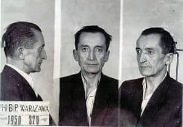
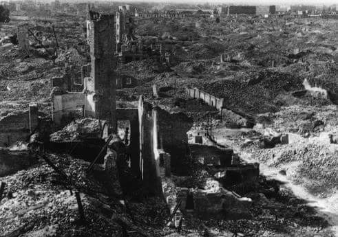

### 1951

Do prezesa Sądu Wojewódzkiego miasta Warszawy Ilii Rubinowa wpłynęło pismo z wnioskiem o prowadzenie rozprawy przeciwko generałowi Fieldorfowi (zdjęcie)  przy drzwiach zamkniętych. Jego autorem był wicedyrektor Departamentu Specjalnego Prokuratury Generalnej Władysław Dymant, z zawodu ... ślusarz i górnik, były żołnierz Armii Czerwonej, członek Związku Patriotów Polskich, absolwent Szkoły Politycznej Polskiej Partii Robotniczej w Wałbrzychu.

  

### 1943

"Skorzystajmy z Grossaktion dla
wykańczania również Polaków. W getcie
zginęło i będzie nadal ginęło bardzo wielu
Żydów. Wszędzie poniewierają się tam trupy,
więc gdy dojdzie do tego jeszcze kilka
tysięcy Polaków, to i tak nikt niczego nie
będzie mógł sprawdzić"
Takie słowa według relacji samego Jurgena Stroopa wypowedział Ludwig Hahn-szef niemieckiej policji bezpieczeństwa.
23.X.1943 roku właśnie w ruinach warszawskiego getta Niemcy zabili 300 przywiezionych tu dzień wcześniej z warszawskiej Pragi zakładników.

  

### 1937

https://pl.wikipedia.org/wiki/Karol_Modzelewski "niewolnictwo państwowe"

### 1892

Jan Kowalewski urodził się w Łodzi 23 października 1892 roku. Mieszkał w jednej z kamienic przy ul. Nawrot. O jego łódzkim życiu niewiele wiadomo. Ojciec miał na imię Józef, a matka Zdzisława, z domu Kowalska. Jego rodzina na pewno nie należała do ubogich. Jan Kowalewski uczył się bowiem w renomowanym w Łodzi gimnazjum, Szkole Handlowej Kupiectwa Łódzkiego. Można więc przypuszczać, że rodzina Kowalewskiego miała kupieckie korzenie.

W tej szkole, w 1909 roku, Jan Kowalewski zdał maturę. Niedługo po tym wyjechał do Belgii. Znalazł się w Liege, gdzie rozpoczął studia na tamtejszym uniwersytecie. Studiował chemię przemysłu. W 1912 roku uzyskał tzw. pół dyplom. Został inżynierem, a ukończył studia będące odpowiednikiem dzisiejszego licencjatu.

- Jan Kowalewski wybrał kierunek Karola Borowieckiego, jednego z bohaterów „Ziemi obiecanej” - wyjaśniał nam Andrzej Rosiński, łódzki historyk zajmujący się życiem Jana Kowalewskiego. - Został chemikiem, kolorystą.

Po studiach Jan Kowalewski wrócił do Łodzi. Miał 20 lat i myślał o karierze inżyniera chemika. Zawodową praktykę odbywał w Zgierzu, w fabrykach przetworów chemicznych. Ale jeszcze przed wybuchem wojny wyjechał z Łodzi. Dostał angaż na inżyniera w Białej Cerkwi na Ukrainie. Być może wtedy na zawsze pożegnał się z rodzinnym miastem.

- Jego późniejsze losy sprawiły, że niewiele mówił o swoim życiu - tłumaczył nam Andrzej Rosiński.

W Białej Cerkwi Kowalewskiego zastała wojna. W 1915 roku został zmobilizowany i jako inżynier skierowany do szkoły oficerskiej w Kijowie. Rok później ukończył ją w stopniu chorążego. Dostał przydział do tzw. zapasowego pułku w Teodozji. Potem walczył na froncie rumuńskim, w Bukowinie i Mołdawii. Podczas jednego z ataków gazowych został ranny. W styczniu 1917 roku otrzymał awans na podporucznika. Po obaleniu caratu brał udział w organizowani Związku Wojskowego Polaków. Kiedy w 1917 roku sformowano w Besarabii II Korpus Polski na Ukrainie, został komisarzem frontu rumuńskiego, a potem oficerem operacyjnym sztabu korpusu.

Po bitwie pod Kijowem, w maju 1918 roku, Jan Kowalewski dostał się do niemieckiej niewoli. Ale udało mu się z niej uciec; przy okazji zabrał ze sobą dokumenty korpusu. Znalazł się z nimi w ogarniętą rewolucją Moskwie. Potem pojechał do Kijowa. Należał już wtedy do Polskiej Organizacji Wojskowej. Brał udział w organizacji 4 Dywizji Strzelców Polskich generała Lucjana Żeligowskiego. Został w niej szefem wywiadu, otrzymując stopień porucznika. Przez Odessę, Besarabię, Bukowinę i Pokucie w maju 1919 znalazł się w niepodległej Polsce.

Tu zaczyna się jeden z najciekawszych epizodów życia Jana Kowalewskiego. Zostaje oddelegowany do Biura Wywiadu Oddziału II Naczelnego Dowództwa Wojska Polskiego. Organizuje Wydział II Radiowywiadu Biura Szyfrów Oddziału II Sztabu Generalnego Naczelnego Dowództwa. Doskonale sprawdza się w tej roli. Ma zresztą ku temu wspaniałe kwalifikacje. Ścisły, matematyczny umysł, znajomość kilku języków obcych. Jako oficer służb inżynierskich znał dobrze organizację armii rosyjskiej. A Armia Czerwona odtwarzała schematy armii carskiej, służyli w niej przecież carscy oficerowie.

Co najważniejsze, Jan Kowalewski miał talent do łamania szyfrów. Jak sam potem wspominał w Radiu Wolna Europa, szyfrantem został przez przypadek. Kolega, porucznik Stanisław Sroka, miał akurat wesele siostry. Poprosił Kowalewskiego, by zastąpił go na dyżurze w sztabie generalnym. Miał segregować depesze, które napływały z nasłuchu radiowego i wysyłać w odpowiednie miejsce. Wtedy w ręce wpadła mu sterta nierozszyfrowanych depesz bolszewickich. I zaczął się bawić w jej rozszyfrowanie.

- Wcześniej jedynym źródłem moich wiadomości o szyfrach były jedynie nowelki Allana Edgara Poe - wspominał w Wolnej Europie Jan Kowalewski. - Spędziłem całą noc na tej pracy. Udało mi się rozszyfrować depesze wysłane przez tzw. „Grupę Mozyrską”. Zapełniała ona lukę między Armią Północną dowodzoną przez Tuchaczewskiego a Armią Południową, której głównym politrukiem był Stalin. W deszyfracji pomogły mi dwie rzeczy - słowo „dywizja”, które w języku rosyjskim zawierało w sobie trzy litery „i” oraz to, że depesze były podpisywane szyfrem, a raz pełnym tekstem.

Na drugi dzień po sztabie rozeszła wieść, że jest osoba, które potrafi rozszyfrowywać bolszewickie depesze. Janowi Kowalewskiemu kazano utworzyć komórkę deszyfracyjną przy sztabie generalnym. Założył całą sieć stacji nasłuchowych, które przy pomocy telegrafu były połączone ze sztabem głównym.

Jednocześnie przy rozszyfrowywaniu depesz zatrudnił znakomitych matematyków z Uniwersytetu Warszawskiego i Uniwersytetu Lwowskiego. Byli to późniejsi profesorowie Wacław Sierpiński, Stanisław Leśniewski i Stefan Mazurkiewicz. Już w sierpniu 1919 roku udało się im przełamać klucze szyfrowe Armii Czerwonej. Polskie dowództwo otrzymało m.in. informacje co do koncentracji wojsk sowieckich, przebiegu linii frontu podczas wojny domowej na Ukrainie, na Kaukazie i w południowej Rosji. Kowalewski złamał też szyfry armii Antona Denikina, białej Floty Czarnomorskiej, a także Armii Ukraińskiej Republiki Ludowej.

- Pozwoliło to na śledzenie wydarzeń w Rosji - mówił nam Andrzej Rosiński. - A już w styczniu 1920 roku Kowalewski rozpoczął łamanie szyfrów niemieckich.

Jak twierdzi prof. Grzegorz Nowik, to właśnie dzięki Kowalewskiemu i jego grupie Józef Piłsudski oraz polskie dowództwo otrzymało niesamowitą broń. Przydała się ona podczas wojny polsko - bolszewickiej w 1920 roku. W czasie bitwy warszawskiej dzięki rozszyfrowaniu depesz bolszewickich Piłsudski mógł podjąć skuteczne decyzje strategiczne.

Po latach Jan Kowalewski wspominał moment, gdy Armia Konna Budionnego przełamała w 1920 roku linię frontu, co spowodowało odwrót polskich wojsk. Pierwszym sygnałem o pojawieniu się w akcji tej armii była depesza o zdobyciu polskiego pociągu pancernego, którego załogę bolszewicy wycięli szablami. Jan Kowalewski całą noc siedział nad rozszyfrowaniem tej depeszy.

- Odtąd Budionny był naszym „stałym klientem” - wspominał bohater z Łodzi. - Zmieniał szyfry, nazywał swoje dywizje nazwami szlachetnych kamieni. Na przykład „gwiazda świeci” oznaczało, że dywizja posuwa się do przodu.

Jednak najważniejsze dla przebiegu bitwy warszawskiej było to, że udało się rozszyfrować depesze mówiącą o tym, że dowódca „Grupy Mozyrskiej” , która obsadzała środkowy odcinek frontu, między Armia Północą a Południową, nie daje rady i ma do obsadzenia swoimi żołnierzami coraz dłuższy odcinek frontu. To nasunęło Józefowi Piłsudskiemu kierunek kontrofensywy. Jednocześnie Kowalewski ze swoją grupą zaczęli zagłuszać bolszewickie stacje radiotelegraficzne, co uniemożliwiło kontakt między bolszewickimi armiami. Stacja na Cytadeli Warszawskiej zaczęła nadawać na rosyjskiej częstotliwości. Przez 36 godzin polscy radiotelegrafiści zaczęli wystukiwać alfabetem Morse’a Księgę Rodzaju zaczynającą się od słów: Na początku było słowo, a słowo było w Bogu... W konsekwencji IX Armia Sowiecka nie odebrała rozkazu odwrotu i została internowana na terenie Prus.

Po wojnie polsko - bolszewickiej Jan Kowalewski został skierowany do walki w III Powstaniu Śląskim. Józef Piłsudski odznaczył go Krzyżem Virtuti Militari, a w 1922 roku otrzymał awans na kapitana. W 1923 roku kapitan Kowalewski wyjechał do Japonii, gdzie tworzył służby kryptologiczne tamtejszego cesarstwa. W dowód zasług otrzymał Order Wschodzącego Słońca , najwyższy order japońskiego imperium.

Po powrocie do kraju został majorem, skierowano go na studia do Wyższej Szkoły Wojennej w Paryżu. Już jako podpułkownik był attache wojskowym w Moskwie. Jednak w 1933 został uznany za personę non grata i opuścił Związek Radziecki. W tym samym roku zaczął pełnić funkcję attache wojskowego w Rumunii.

Do kraju powrócił w 1937 roku. Jako człowiek związany z Piłsudskim został na krótko szefem sztabu Obozu Zjednoczenia Narodowego. Potem pracował w przemyśle zbrojeniowym. Został dyrektorem przedsiębiorstwa zajmującego się skupem surowców strategicznych.

Po wybuchu wojny znalazł się w Rumunii. Był tam prezesem Komitetu Opieki nad Uchodźcami. Następnie wyjechał do Francji, gdzie współpracował z Władysławem Sikorskim. Przed upadkiem Francji Kowalewski przez Hiszpanię dotarł do Lizbony. Oficjalnie zajmował się uchodźcami. Tak naprawdę jednak prowadził pracę wywiadowczą. Został kierownikiem Placówki Łączności z Kontynentem oraz centrali informacji z krajów kontynentu.

Na konferencji w Teheranie w grudniu 1943 roku Stalin wymienił nazwisko Kowalewskiego i zażądał jego odwołania z placówki w Lizbonie. Działalność Kowalewskiego stanowiła przeszkodę w planach Stalina sowietyzacji Europy Środkowo-Wschodniej.

20 marca 1944 roku Kowalewski wyjechał z Lizbony do Londynu. Mieszkał tam do końca życia. Był wydawcą dziennika „East Europe”, współpracował z Radiem Wolna Europa, publikował w prasie emigracyjnej. Jeszcze na 2 lata przed śmiercią rozszyfrował depesze Romualda Traugutta z czasów Powstania Styczniowego. Zmarł na raka 31 października 1965 roku.

---

<a href="https://github.com/TomaszWaszczyk/historia.waszczyk.com/edit/master/src/content/october-23.md" target="_blank">Edytuj tę stronę dzieląc się własnymi notatkami!</a>
