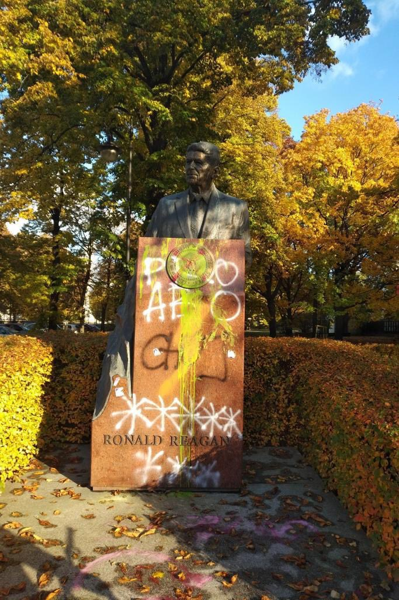
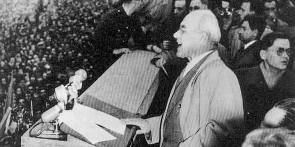
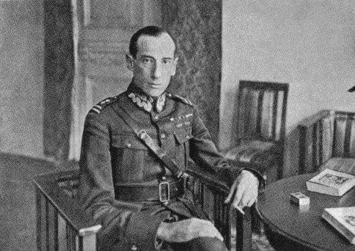
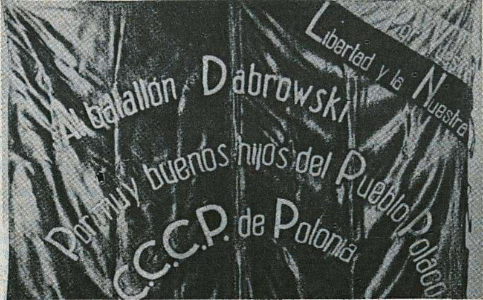
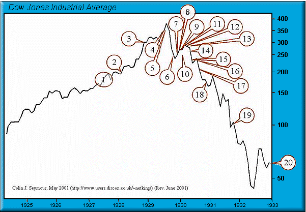
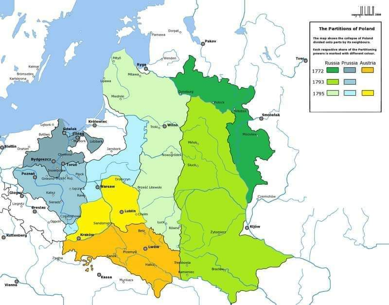

### 2020

Lewica walczącą zniszczyła pomnik Ronalda Reagana, bo kiedyś powiedział:

„Zauważyłem, że wszyscy którzy popierają aborcję zdążyli się już urodzić.”

  

### 1956

Na warszawskim Placu Defilad władze zorganizowały wiec ku czci nowo wybranego I sekretarza Komitetu Centralnego Polskiej Zjednoczonej Partii Robotniczej Władysława Gomułki.
Według danych organizatorów w uroczystości tej udział wzięło 400 tysięcy ludzi.
Gomułka powiedział wtedy między innymi:
" Naród może całkowicie ufać swemu wojsku i jego dowództwu, które u nas – jak wszędzie na świecie – w pełni i w całości jest podporządkowane rządowi swojego kraju. Towarzysze! Na fali olbrzymiej aktywności politycznej mas, którą wyzwoliło VIII Plenum, tu i ówdzie dochodzą do głosu siły wrogie socjalizmowi, wrogie sojuszowi polsko-radzieckiemu, wrogie władzy ludowej, siły, które chcą wykrzywić, zahamować i cofnąć socjalistyczną demokratyzację.
Towarzysze! Nie pozwólmy reakcyjnym podżegaczom i różnym chuliganom stawać w poprzek naszej drogi. Wara im od czystego nurtu walki socjalistycznych i patriotycznych sił narodu! Pędźcie przecz prowokatorów i reakcyjnych krzykaczy! Władze państwowe ani na chwilę nie będą tolerować jakiejkolwiek akcji wymierzonej w polską rację stanu i przeciwko naszemu ustrojowi państwowemu.
Towarzysze! Czas nagli. Partia musi przystąpić do rozwiązywania codziennych, trudnych spraw naszej gospodarki i życia państwowego. Czym dzisiaj możecie pomóc kierownictwu partii i rządowi? Przede wszystkim tym, że każdy stanie przy swym warsztacie na swoim posterunku i wzmożoną pracą czy nauką wykaże swą wierność i oddanie naszej sprawie.
Dzisiaj zwracamy się do ludu pracującego Warszawy i całego kraju z wezwaniem: dość wiecowania i manifestacji! Czas przejść do codziennej pracy, ożywionej wiarą i świadomością, że partia zespolona z klasą robotniczą i narodem poprowadzi Polskę po nowej drodze do socjalizmu.
Niech żyje nierozerwalna więź partii z klasą robotniczą i całym ludem pracującym!
Niech żyje socjalizm!
Niech żyje Polska ludowa!"

  

### 1938

W Berlinie miało miejsce spotkanie polskiego ministra spraw zagranicznych Józefa Becka (zdjęcie) z niemieckim sekretarzem spraw zagranicznych Joachimem von Ribbentropem,na którym strona niemiecka po raz pierwszy poruszyła kwestię włączenia do Wolnego Miasta Gdańska oraz budowy eksterytorialnej autostrady i linii kolejowej.

  

### 1936

W czasie wojny domowej w Hiszpanii sformowany został Batalion imienia Jarosława Dąbrowskiego.
W szeregach tej formacji wchodzącej w skład XIII Międzynarodowej Brygady imienia Jarosława Dąbrowskiego służyli polscy emigranci-sympatycy ruchu lewicowego. 
Żołnierze ci, po krótkim przeszkoleniu, już w listopadzie 1936 roku trafili zostali skierowani do walki z oddziałami generała Francisco Franco na przedpola Madrytu, gdzie po czterech miesiącach ponieśli dotkliwe straty.
Pierwszym dowódcą batalionu był  zmarły 22 sierpnia 1944 roku w niemieckim obozie koncentracyjnym działacz ruchu robotniczego Stanisław Ulanowski. Inną postacią w historii tej formacji był jego następca kapitan Antoni Kochanek, który poległ w bitwie pod Almadrones.
Polskie władze patrzyły na żołnierzy batalionu nieprzychylnym okiem. Ze względu na nielegalną służbę w obcej armii odebrały im polskie obywatelstwo, a także zakazały służby w szeregach Wojska Polskiego. Dopiero w roku 1940 generał Sikorski zezwolił im na wstępowanie w szeregi tworzonego we Francji Wojska Polskiego.

  

### 1929

Wielki Kryzys - lekcja historii
Właśnie mija 90 rocznica „Czarnego Czwartku” 1929 roku, dnia uznawanego za początek Wielkiej Depresji na rynku w USA. Spadki zaliczyły wówczas wszystkie rynki, przy czym najbardziej ucierpiały przewartościowane Stany Zjednoczone. Czarny Czwartek potwierdził regułę według której październik jest miesiącem potrafiącym bardzo negatywnie zaskoczyć inwestorów.
Tamte wydarzenia były bolesną lekcją zwłaszcza dla obywateli USA, natomiast my powinniśmy wykorzystać je do wyciągnięcia wniosków. Dlatego też dołączamy wykres indeksu Dow Jones za lata 1925-1933 z zaznaczonymi wypowiedziami ważnych osób ze świata ekonomii i polityki. Zwróćcie uwagę, że nawet po pęknięciu bańki, wpływowe osoby cały czas robiły dobrą minę do złej gry, wprowadzają inwestorów w błąd. 
Oto ważniejsze cytaty:
1. Za naszych czasów nie dojdzie już do żadnego krachu – John Maynard Keynes, brytyjski ekonomista, 1927 rok.
2. Mogę jedynie wyrazić sprzeciw wobec osób, które twierdzą, że jesteśmy świadkami szaleństwa tłumu, a dobrobyt w naszym kraju zakończy się w najbliższym czasie – E.H.H. Simmons, prezydent nowojorskiej giełdy, 12 stycznia 1928 roku.
3. Żaden z Kongresów USA nie działał w czasach, które cechowały się tak dobrymi perspektywami jak obecne. W kraju panuje spokój i zadowolenie, mamy za sobą rekordowo długi okres dobrobytu – Calvin Coolidge, prezydent USA, 4 grudnia 1928 roku.
4. Spadki cen akcji są możliwe, ale o żadnym krachu nie może być mowy – Irving Fischer, wpływowy amerykański ekonomista, 5 września 1929 roku.
5. Te spadki nie będą miały dużego wpływu na przedsiębiorstwa – Arthur Reynolds, dyrektor Continental Illinois Bank of Chicago, w pierwszym dniu krachu.
…
12.  Nie ma powodów do niepokoju – Andrew Melion, Sekretarz Skarbu, luty 1930 roku.
…
20. Wszystkie skrzynki depozytowe w bankach oraz instytucjach finansowych zostały zabezpieczone i mogą zostać otwarte wyłącznie w towarzystwie pracownika Urzędu Skarbowego – Franklin D. Roosevelt, prezydent USA, konfiskujący złoto obywateli w 1933 roku.

  

### 1892

Urodził się Jan Kowalewski: https://pl.wikipedia.org/wiki/Jan_Kowalewski

### 1795

Doszło do III rozbioru Polski pomiędzy trzy mocarstwa: Rosję, Prusy i Austrię. Konwencja o ostatecznym zatwierdzeniu podziału granic została podpisana w Petersburgu w 1797 roku, w artykule tajnym konwencji czytamy: ,,Gdy przez obydwa dwory cesarskie, jak również przez Jego Królewską Mość Króla Pruskiego, uznana została konieczność uchylenia wszystkiego, co może nasuwać wspomnienie istnienia Królestwa Polskiego, skoro uskutecznione zostało unicestwienie tego ciała politycznego, przeto wysokie strony, zawierające umowę, postanowiły i zobowiązują się odnośnie do trzech dworów, nie zamieszczać w tytule miana i nazwy łącznej Królestwa Polskiego, która zostanie odtąd na zawsze skasowana. Wszelako wolno im będzie używać tytułów częściowych, które należą się władzy różnych prowincji tegoż Królestwa, jakie przeszły pod ich panowanie''. Prusy powiększyły swoje terytorium o 48 tysięcy km kwadratowych, zamieszkanych przez ok. milion mieszkańców. Były to: większość Mazowsza z Warszawą, część Podlasia, ziemie litewskie po rzekę Niemen, a na południu tereny byłego księstwa siewierskiego. Austria zajęła część Małopolski między Pilicą a Bugiem wraz z częścią Mazowsza i Podlasia. Było to łącznie 47 tysięcy km kwadratowych, zamieszkanych przez około 1,5 miliona osób. Rosja zajęła większą część ziem litewskich, resztę województwa wołyńskiego,  oraz część ziem chełmskich, czyli w sumie 120 tysięcy kilometrów kwadratowych, zamieszkanych przez 1,2 miliona ludności. Ostatni król Polski Stanisław August Poniatowski wyjechał do Grodna, gdzie 25 listopada 1795 roku ogłosił swą abdykację, czyli przedwczesną rezygnację ze sprawowanego stanowiska króla.  Zmarł w 1798 roku.

  

### 1748

https://pl.wikipedia.org/wiki/Pok%C3%B3j_westfalski

---

<a href="https://github.com/TomaszWaszczyk/historia.waszczyk.com/edit/master/src/content/october-24.md" target="_blank">Edytuj tę stronę dzieląc się własnymi notatkami!</a>
