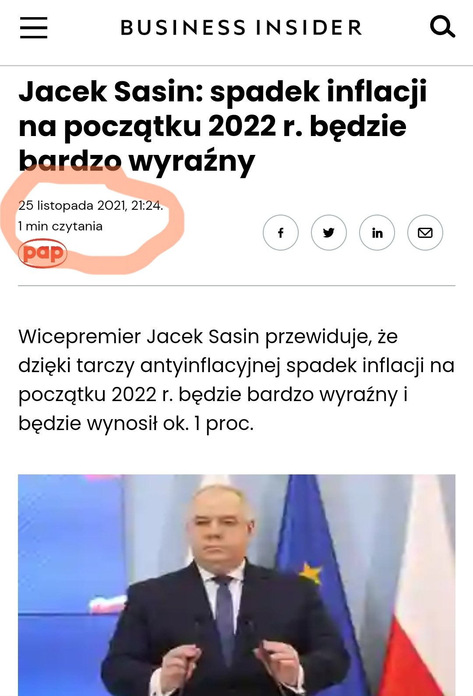
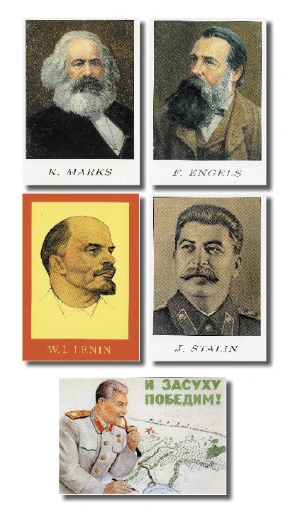
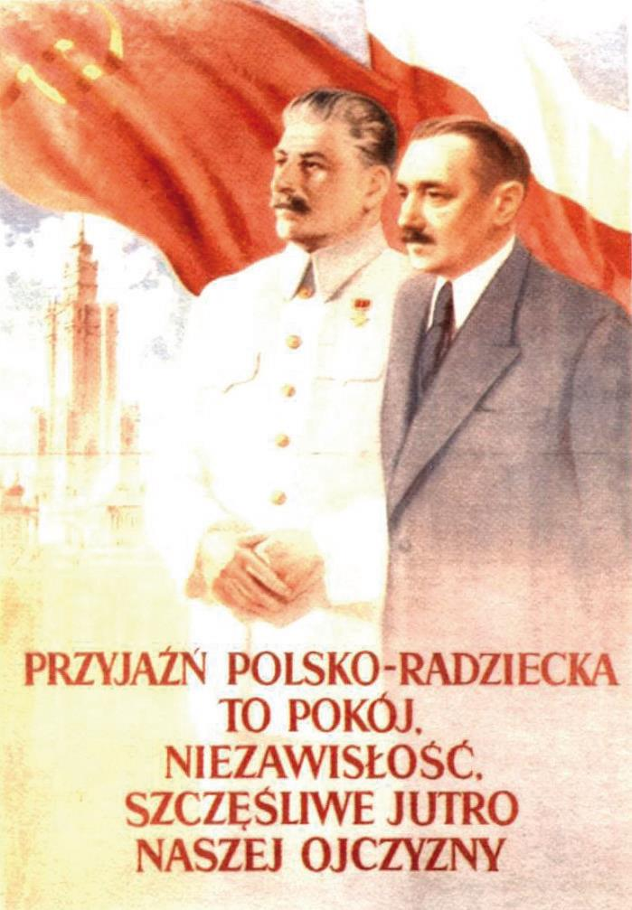
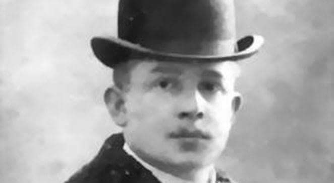
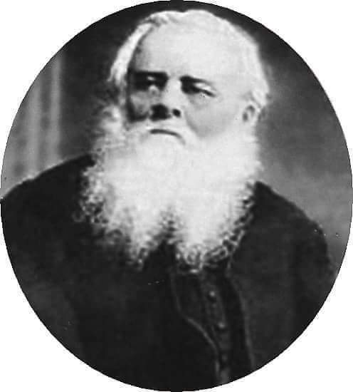

### 2021

  

  

### 2020

Dr Andrzej Sadowski, prezydent Centrum im. Adama Smitha:

> Tu już nie mamy do czynienia z kryzysem, ale totalną destrukcją

– ''Do powszechnej depresji i kłopotów ekonomicznych dochodzi brak wiary w przywództwo polityczne. Bo okazuje się, że nie jest ono w stanie przekonać społeczeństwa, że działania władz będą przynosiły pozytywne skutki. Przykład pierwszy z brzegu – niedawno Rzecznik Małych i Średnich Przedsiębiorców poprosił rząd o przedstawienie przesłanek przemawiających za zamknięciem branży fitness. I okazało się, że nie ma przesłanek dla takich działań. A mimo to działania takie zostały podjęte. Skoro ruchy rządu są nieczytelne, może dojść do chaosu w kraju. I stanie się to już niebawem. Bo brak czytelności pewnych działań sprawia, że ludzie są zdezorientowani. To sytuacja gorsza niż podczas jakiegokolwiek znanego nam kryzysu. Bo tu już nie mamy do czynienia z kryzysem, ale totalną destrukcją.''

Warto też przypomnieć, że podczas niedawnej konferencji prasowej z udziałem premiera padło pytanie o podstawy naukowe na rzecz zakazania normalnego działania lokali gastronomicznych i odpowiedzi udzielił profesor Andrzej Horban, iż badań mogących wskazać jaka liczba chorych zarażała się w restauracjach co prawda nie robiono, ale bazują na fakcie zakażeń... na weselach.

> Skoro ruchy rządu są nieczytelne, może dojść do chaosu w kraju. I stanie się to już niebawem. Bo brak czytelności pewnych działań sprawia, że ludzie są zdezorientowani. To sytuacja gorsza niż podczas jakiegokolwiek znanego nam kryzysu. Bo tu już nie mamy do czynienia z kryzysem, ale totalną destrukcją - mówi dr Andrzej Sadowski, prezydent Centrum im. Adama Smitha.

---

Mija sto lat od dnia, w którym narodził się czerwony terror. Przewrót bolszewicki w listopadzie (październik w Rosji) 1917 r rozpoczął jedną z najbardziej brutalnych tyranii w historii świata. W tym stuleciu ofiarą komunistycznego terroru padło ok. 94 mln ludzi na całym świecie. Historia komunistów pokazuje, jakie były losy państwa polskiego pod ich wladzą. Czym była komuna ? Była przypaloną skórą, wybitymi zębami, zerwanymi paznokciami. Śmiercią bez daty i grobu. Łzami i oczami, które nie dały już rady płakać. To była komuna.!! Łotry, zbrodniarze, oprawcy i bandyci.,, c.d w albumie.

  

  

---

### 2019

China President Xi Jinping extols the virtues of blockchain technology
In a speech yesterday, China President Xi Jinping said that blockchain is necessary for gaining economic advantage.

Chinese President Xi Jinping lavished praise on blockchain technology in a speech today, arguing that it is imperative for China to accelerate its development. According to a local news agency, he said that building on blockchain will help to bring economic and social value.

His comments were made on the same day the Political Bureau of the Central Committee of the Communist Party of China released its 18th study on blockchain technology. Its findings were explained by Chen Chun, a professor at Zhejiang University.

Xi, who is general secretary of the CPC Central Committee, described blockchain as an important breakthough, and one that should be rapidly developed. He pointed to multiple use-cases, from supply chains to IoT technology, and argued that it is necessary for China to continue building out blockchain technology and widely promoting it. He pointed out that China already has a good standing with it.

The President put forward a host of benefits from using blockchain technology, namely that it offers a lot of improvements on current systems, such as helping with data sharing and removing operating costs. And countries that use it, will gain a host of benefits, he said. Specifically, he said that it will help countries to develop their digital economies, while encouraging economic and social development.

This doesn't come as a huge surprise. While China has cracked down on certain use-cases of blockchain technology, such as when a project is a scam or when tokens are issued through ICOs, it hasn't banned the use of cryptocurrencies, nor Bitcoin mining—for now. The country is also developing its own Central Bank Digital Currency (CBDC), hoping to be at the forefront of such development. It even sped up its CBDC efforts in light of Facebook's Libra project, although the latter has been hitting roadblock after roadblock.

### 1945

https://pl.wikipedia.org/wiki/Romuald_Szeremietiew

### 1941

> „Skazujemy na śmierć głodową 1,2 miliona Żydów, nie ma potrzeby wiele mówić. Jest to zrozumiałe, a jeżeli Żydzi nie wymrą z głodu, trzeba będzie przyspieszyć antyżydowskie zarządzenia, i miejmy nadzieję, że tak się stanie.

Autorem tych słów wypowiedzianych 25 października 1941 roku w Krakowie jest Hans Frank (zdjęcie). W ten sposób odniósł się on do wydanego przez siebie dnia 15 października 1941 roku rozporządzenia "O ograniczeniach pobytu w Generalnym Gubernatorstwie", którego pierwszy punkt głosił:
"Żydzi, którzy bez upoważnienia
opuszczają wyznaczoną im dzielnicę,
podlegają karze śmierci. Tej samej karze
podlegają osoby, które takim żydom
świadomie dają kryjówkę."

  

### 1939

"Pojęcie polskiej inteligencji obejmuje
przede wszystkim polskich księży, nauczycieli (łącznie z wykładowcami szkół wyższych), lekarzy, dentystów, weterynarzy, oficerów, wyższych, urzędników, wielkich kupców, wielkich właścicieli ziemskich, pisarzy, redaktorów, jak również wszystkie osoby, które otrzymały wyższe lub średnie wykształcenie."
Powyższy tekst to fragment memoriału Urzędu Polityki Rasowej NSDAP opublikowanego 25 października1939 roku.

### 1918

W Reichstagu wystąpił Wojciech Korfanty (zdjęcie), który w wygłoszonym przez siebie przemówieniu zażądał przyłączenia do Polski ziem zabranych podczas zaboru pruskiego. Chodziło o Prusy Królewskie, Gdańsk, Wielkopolskę, część Prus Książęcych,  Śląsk Górny i Średni.

  

### 1844

W podkieleckiej wsi Krajno funkcjonariusze carskiej policji aresztowali księdza Piotra Ściegiennego- przywódcę niepodległościowej i powstańczej konspiracji chłopskiej, zajadłego wroga władz carskich.
Aresztowanie było wynikiem uzasadnionych obaw władz rosyjskich o wywołanie przez niego powstania chłopskiego na terenie zaboru,a także efektem donosów szlachty i niektórych przedstawicieli inteligencji.
Aresztowanie Ściegiennego doprowadziło do dekonspiracji Związku Chłopskiego i udaremnienia planów wywołania powstania.
W 1846 r., po długim śledztwie, Piotr Ściegienny został skazany na śmierć i
wyłączony ze stanu duchownego. W ostatniej chwili przed egzekucją został jednak dostarczony carski akt łaski, zamieniający karę śmierci na chłostę i bezterminową katorgę, co według świadków, spotkało się z wyraźnym sprzeciwem ze strony samego skazańca. Został zesłany na  ciężkie roboty w kopalniach Aleksandrowska oraz w Nerczyńsku. W  roku 1883, car Aleksander III z okazji swej koronacji ułaskawił ks. Ściegiennego, a władze duchowne przywróciły go do stanu kapłańskiego; został kapelanem w szpitalu Bonifratrów w Lublinie.
Zmarł w Lublinie w roku 1890, przeżywszy 90 lat.

  

---

<a href="https://github.com/TomaszWaszczyk/historia.waszczyk.com/edit/master/src/content/october-25.md" target="_blank">Edytuj tę stronę dzieląc się własnymi notatkami!</a>
