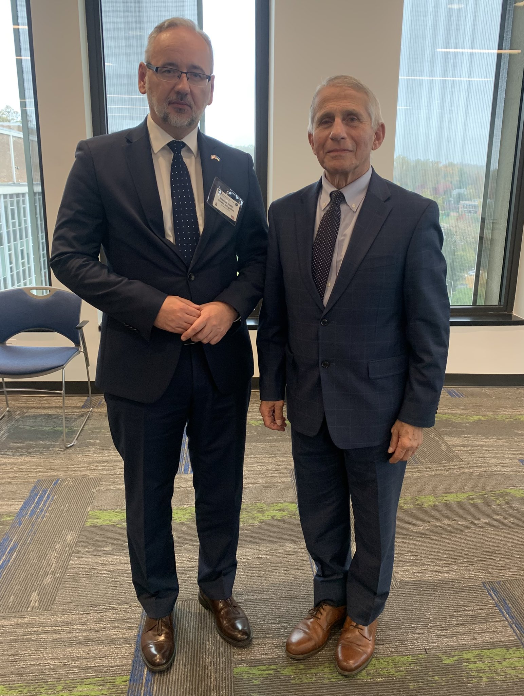
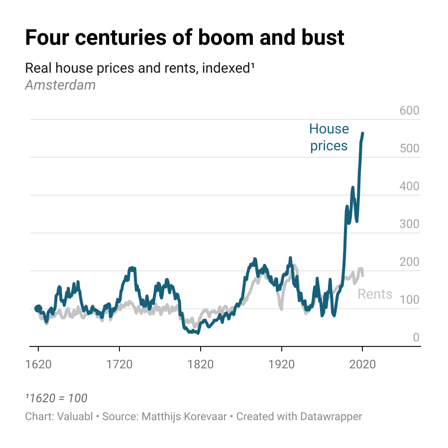
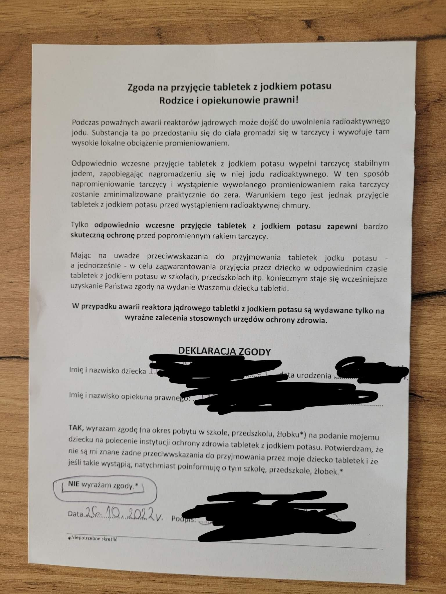
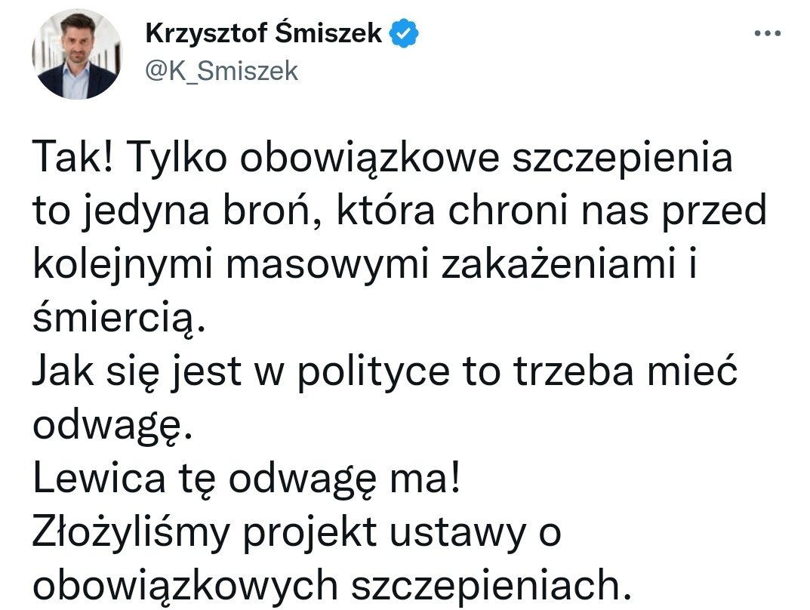
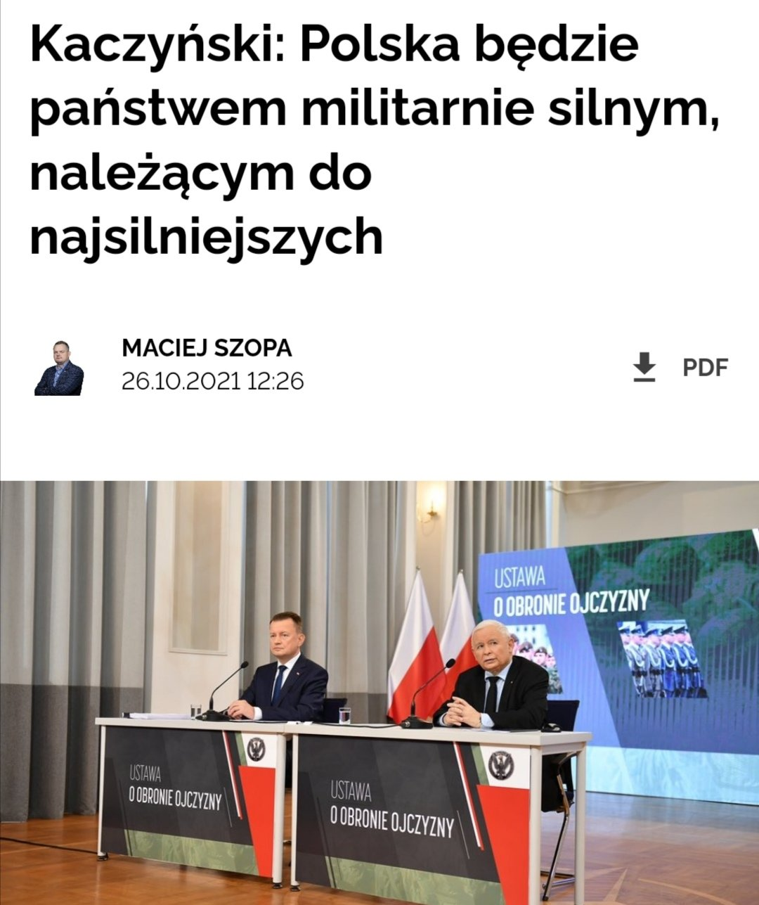
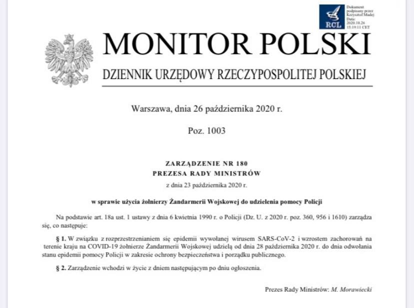
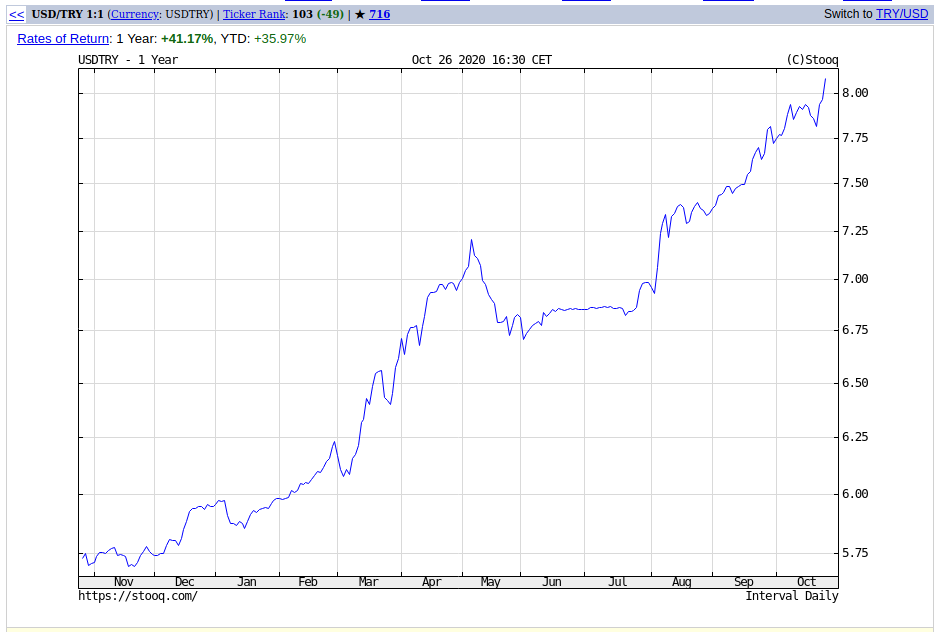
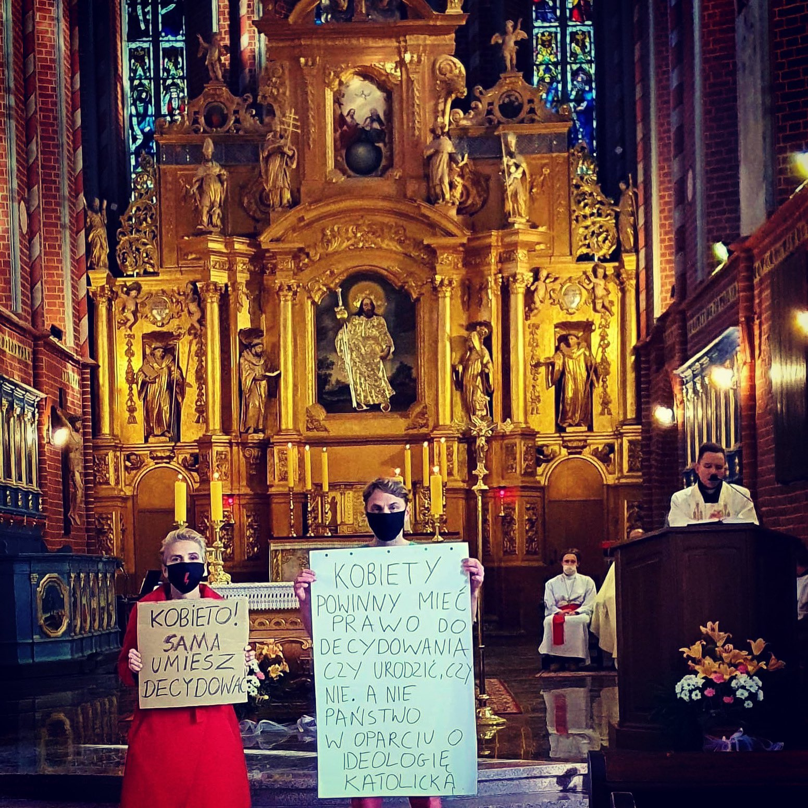
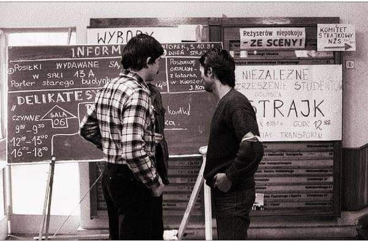
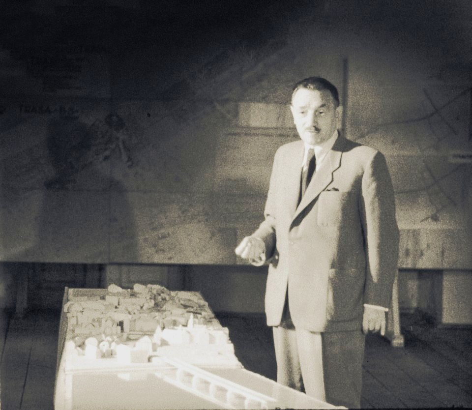

### 2022

  

  

  

  

  

### 2021

  

  

### 2020

Giza Polish Ventures odsunęła Marcin Beme od kierowania audioteka.pl pomimo iż, Marcin jest największym jej udziałowcem.
Tym jednym zdaniem można podsumować ryzyko współpracy z VC, a przede wszystkim zgodę na dyktowane przez nie warunki w umowach inwestycyjnych.
Jedynym celem każdego funduszu jest generowanie wzrostu wartości posiadanych aktywów i zrealizowanie zakładanych wskaźników dla własnych inwestorów, więc nie atakuję tym postem Gizy. Nikt nie daje Wam kasy bo w Was wierzy. Jesteście komórką Excela,  w którą w pewnym momencie można wpisać 0 i układ działa dalej. Miejcie to z tyłu głowy realizując marzenia w oparciu o innych.

---

  

---

  

---

Deprecjacja Kościoła:

  

---

### 2011

https://en.wikipedia.org/wiki/Patriot_Act

### 1991

W Moskwie - Polska i ZSRR parafowały układ o wycofaniu wojsk sowieckich z Polski

### 1981

W Radomiu rozpoczął się trwający 49 dni strajk okupacyjny w Wyższej Szkole Inżynierskiej. Głównym powodem tego najdłuższego ze wszystkich strajków okresu PRL było ponowne  mianowanie na stanowisko rektora byłego pułkownika rezerwy Wojska Polskiego Michała Hebdy, co spotkało się z ostrą krytyką działającej na uczelni  opozycji antykomunistycznej. Sytuacji tej sprzyjała zmieniona ordynacja wyborcza oraz usunięcie z Senatu WSI  przedstawiciele NSZZ Solidarność oraz Niezależnego Zrzeszenia Studentów, którzy nie zgadzali się  na tę nominację z powodu złamania przez  władze  procedur i warunków zawartego wcześniej porozumienia.  Uważano, iż w ten sposób, nie bacząc również na protesty ze strony Konferencji Rektorów Szkół Wyższych, próbuje się wprowadzić na nowo stare porządki i sprawdzone sposoby działania. Narzędziem mającym na celu opanowanie sytuacji na uczelni miała być wystosowała cztery dni później przez Hebdę pod adresem strajkujących pracowników groźba zwolnienia z pracy. Strajk zakończył się 13 grudnia 1981 roku. Tego samego dnia dziekan Wydziału Transportu WSI Leszek Cegłowski w towarzystwie oddziału ZOMO wezwał do rozejścia się. Michał Hebda ustąpił ze stanowiska po ośmiu miesiącach urzędowania.

  

### 1945

"Prezydent" kolaboracyjnej wobec okupanta sowieckiego KRN Bolesław #Bierut wydał dekret "o własności i użytkowaniu gruntów na obszarze m. st. Warszawy", czyli o grabieży na rzecz komunistycznych władz nieruchomości prywatnych położonych w granicach stolicy Polski.

  

### 1911

https://pl.wikipedia.org/wiki/Samuel_Reshevsky

---

<a href="https://github.com/TomaszWaszczyk/historia.waszczyk.com/edit/master/src/content/october-26.md" target="_blank">Edytuj tę stronę dzieląc się własnymi notatkami!</a>
