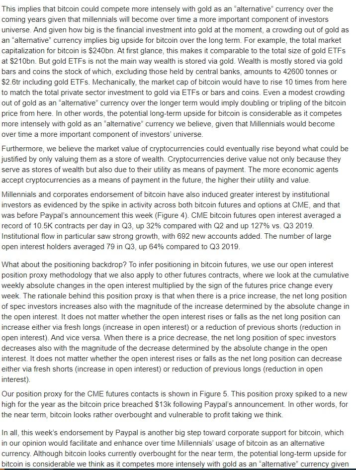

### 2021

  

### 2020

  

---

### Żandarmeria pomoże policji w "ochronie porządku". MON: To nie ma związku z manifestacjami

W Monitorze Polskim zostało opublikowane zarządzenie premiera Mateusza Morawieckiego, które zakłada, że żołnierze Żandarmerii Wojskowej będą pomagać policjantom w "ochronie bezpieczeństwa i porządku publicznego". "To standardowe działania, które nie mają związku z manifestacjami. Żandarmeria pomaga m. in. w kontrolowaniu przestrzegania kwarantanny" - wyjaśnia MON.

"W związku z rozprzestrzenianiem się epidemii wywołanej wirusem SARS-CoV-2 i wzrostem zachorowań na terenie kraju na COVID-19 żołnierze Żandarmerii Wojskowej udzielą od dnia 28 października 2020 r. do dnia odwołania stanu epidemii pomocy Policji w zakresie ochrony bezpieczeństwa i porządku publicznego" - czytamy w zarządzeniu, które zostało opublikowane w poniedziałek w Monitorze Polskim.

---

### 2019

Umiera https://pl.wikipedia.org/wiki/W%C5%82adimir_Bukowski

### 1997

Kryzys azjatycki, DJIA spada o więcej niż 500 pkt , handel na NYSE zawieszony do kolejnego dnia.

### 1994

Polska wyemitowała w dniu 27.10.1994 r. sześć różnych rodzajów obligacji Brady’ego, o łącznej wartości 8,25 mld USD (Afera FOZZ)

### 1986

Tak zwany Big Bank w Wielkiej Brytanii - Wielka Brytania drastycznie zmieniła organizację handlu na giełdzie.

### 1980

We Wrocławiu zakończył się trwający tydzień protest głodowy kolejarzy. 34 osoby biorące w nim udział domagały się uznania przez ówczesne władze tworzącego się na kolei NSZZ "Solidarność" oraz lepszych warunków pracy i wyższego wynagrodzenia.
Protest ten był pokłosiem niespełnienia przez władze zgłaszanych wcześniej postulatów płacowych. Akcja miała charakter ogólnopolski z uwagi na to, że  brali w niej udział również przedstawiciele kolei z Gdańska i Szczecina. Rząd zdecydował się spełnić żądania płacowe kolejarzy. Jednak zawarte między stronami porozumienie zostało zerwane jeszcze w listopadzie tego samego roku.

  

### 1948

https://en.wikipedia.org/wiki/1948_Donora_smog

### 1946

https://en.wikipedia.org/wiki/Wolfgang_Streeck

### 1939

Funkcjonariusze gestapo aresztowali i uwięzili na Pawiaku prezydenta Warszawy Stefana Starzyńskiego.
Dalsze losy prezydenta są owiane tajemnicą. Najstarsza wersja głosi, że został wywieziony do KL Dachau, gdzie został zamordowany ok. 17 października 1943 roku. Ale są też inne wersje: w czasie przesłuchiwań w Heidelbergu, w październiku 1945 r. były gubernator dystryktu warszawskiego Ludwig Fischer zeznał, że Starzyński został wywieziony z Pawiaka i  natychmiast rozstrzelany. 
Przed wybuchem polskiej wojny obronnej prezydent Starzyński zadbał m.in o zabezpieczenie zbiorów Muzeum Narodowego, mobilizację dodatkowych kadr służby zdrowia, Straży Pożarnej i komunikacji miejskiej. Opracował plan ewakuacji stolicy. W czasie wybuchu II wojny światowej nie podporządkował się rozkazowi opuszczenia stolicy i jako Cywilny Komisarz przy Dowództwie Obrony Warszawy, a następnie przy Armii „Warszawa” trwał mężnie na posterunku. Nie uląkł się ni wroga, ni śmierci.
W przemówieniach radiowych budził w Warszawiakach ducha walki. Wzywał do niepoddawania się depresji i stawania w szeregach obrońców stolicy.W swym ostatnim radiowym przemówieniu  wygłoszonym 23 września 1939 roku  powiedział:
"Chciałem, by Warszawa była wielka.
Wierzyłem, że wielką będzie. Ja i moi współpracownicy kreśliliśmy plany, robiliśmy szkice wielkiej Warszawy przyszłości. 
I Warszawa jest wielka. Prędzej to nastąpiło, niż przypuszczano. Nie za lat pięćdziesiąt, nie za sto lat, lecz dziś widzę wielką Warszawę.
Gdy teraz do Was mówię, widzę ją przez okna w całej wielkości i chwale, otoczoną kłębami dymu, rozczerwienioną płomieniami ognia, wspaniałą, niezniszczalną, wielką, walczącą Warszawę. 
I choć tam, gdzie miały być wspaniałe sierocińce, gruzy leżą, choć tam gdzie miały być parki, dziś są barykady gęsto trupami pokryte, choć płoną nasze biblioteki, choć palą się szpitale - nie za lat pięćdziesiąt, nie za sto, lecz dziś Warszawa broniąca honoru Polski jest u szczytu swej wielkości i sławy."

  

---

<a href="https://github.com/TomaszWaszczyk/historia.waszczyk.com/edit/master/src/content/october-27.md" target="_blank">Edytuj tę stronę dzieląc się własnymi notatkami!</a>
