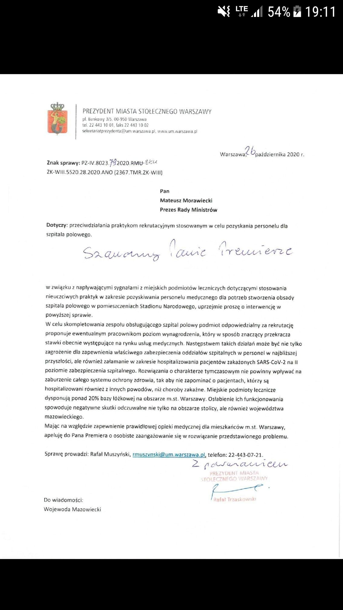
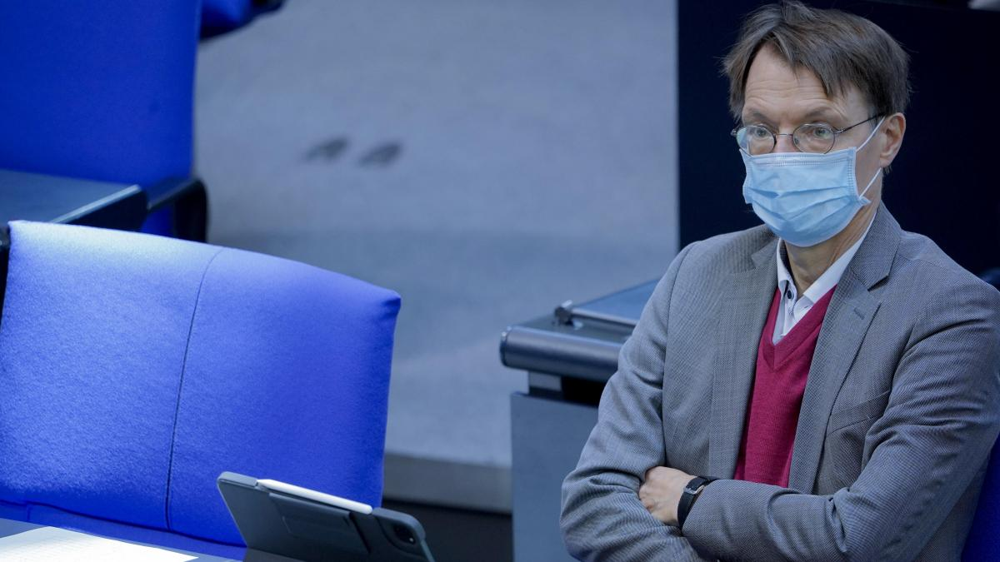
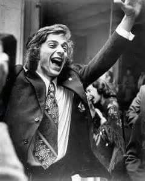
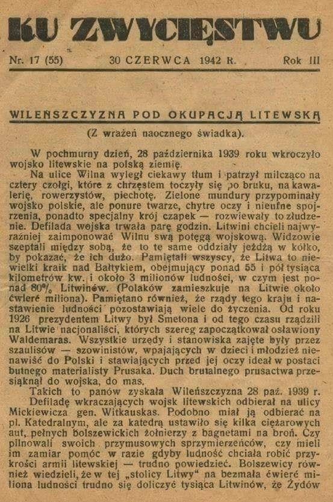
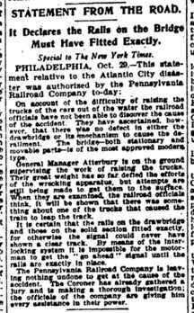
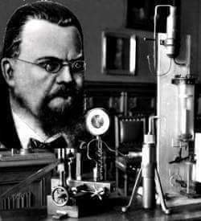

### 2021

Zaproponowana ustawa wprowadza:

✅ 250 tys. żołnierzy zawodowych i 50 tys. żołnierzy Wojsk Obrony Terytorialnej jako minimum.

✅ podwyższenie zdolności wojska do samodzielnej obrony przez dłuższy czas, w razie by nasi sojusznicy zaniemogli/spóźnili się/wyrażali wątpliwość, co zresztą w przeszłości zawsze się zdarzało,

✅ wprowadza system zachęt dla kandydatów do służby wojskowej

✅ Zasadnicza służba jest zawieszona, ale wprowadzają dobrowolną zasadniczą służbę wojskową

✅ studenci studiów wojskowych będą mieli takie uposażenia, jak uposażenia żołnierzy zawodowych

✅ powstaną Wojska Obrony Cyberprzestrzeni

✅ nastąpi intensyfikacja ćwiczeń rezerwy

### 2020

  

---

Der SPD-Politiker Karl Lauterbach schlägt vor, Kontaktbeschränkungen auch in privaten Räumen zu kontrollieren. Die Unverletzbarkeit der Wohnung dürfe der öffentlichen Gesundheit nicht länger im Wege stehen. Alle Entwicklungen zu Corona und den Bund-Länder-Beratungen im Liveticker.
1135

SPD-Gesundheitsexperte Karl Lauterbach will angesichts der drastisch gestiegenen Corona-Infektionszahlen Treffen in privaten Räumen, etwa der eigenen Wohnung, kontrollieren lassen. „Wir befinden uns in einer nationalen Notlage, die schlimmer als im Frühjahr werden kann. Die Unverletzbarkeit der Wohnung darf kein Argument mehr für ausbleibende Kontrollen sein“, sagte Lauterbach der Düsseldorfer „Rheinischen Pos“.

„Wenn private Feiern in Wohnungen und Häusern die öffentliche Gesundheit und damit die Sicherheit gefährden, müssen die Behörden einschreiten können.“ Lauterbach griff in dem Zusammenhang NRW-Ministerpräsident Armin Laschet (CDU) an, der sich dagegen ausgesprochen hatte. „Laschet irrt, wenn er solche Superspreading-Events weiterhin tolerieren will“, sagte Lauterbach.

  

<!-- W polityce, a zwłaszcza na jej najwyższym poziomie, chodzi o takie wytyczenie podziału w społeczeństwie, żeby po naszej stronie było więcej wyborców niż po stronie przeciwnej. W Polsce, za mojego dorosłego życia było dwóch mistrzów w tej sztuce - Donald Tusk i Jarosław Kaczyński. Nie bez powodu rządzą Polską już od 15 lat. Obaj panowie rozumieją też jeszcze jedną rzecz. Przeważająca większość Polaków należy, czy to się komuś podoba, czy nie, do umiarkowanej konserwy. Spójrzmy na ostatnie ponad 20 lat. Najpierw rządy AWS, potem SLD, PiS, PO i teraz znowu PiS. W tym czasie sprawy światopoglądowe nie drgnęły u nas w żadną ze stron. Czy premierem był Miller, czy Tusk, czy Kaczyński, nie zmieniło się nic w sprawie aborcji czy związków partnerskich. Młodsi mogą nie pamiętać, ale Donald Tusk bardzo pilnował tego, żeby PO nie zrobiła nic dla środowisk skrajnej lewicy. Wiedział, czym może się to skończyć. Trzaskowski tej lekcji nie odrobił, co kosztowało go prezydenturę. Z drugiej strony Jarosław Kaczyński od lat odmawiał ruszenia kompromisu aborcyjnego. Przynajmniej kiedy był u władzy. Gdy rządziła Platforma, to oczywiście popierał kolejne próby ograniczenia aborcji.
Nikt w Polsce nie wygrał na prymitywnym antyklerykalizmie. Nikt. Nawet w PRL komuniści musieli się liczyć z Kościołem. Wiem, że czasy się zmieniają, kościoły powoli pustoszeją, a młodych jest w nich niewielu. Ale mimo to, ten przeciętny, umiarkowanie konserwatywny Polak, mieszkający w małym miasteczku lub na wsi, nie zgodzi się z kimś, kto maluje wulgarne hasła na budynku kościoła. Pamiętacie ostatnie eurowybory? Rekordy popularności bił film Sekielskiego o skandalach pedofilskich. Opozycja myślała, że na tym paliwie zdobędzie dużo głosów, że wpłynie to negatywnie na wynik PiS. I jaki był efekt? Rekordowa frekwencja w obozie pisowskim. Na wsiach, w małych miasteczkach, na wschodzie, w najstarszym elektoracie. Ludzie ruszyli do urn głosować na PiS, by bronić Kościoła. W sondażach nie było tego widać, ale w dniu wyborów ci ludzie ruszyli do urn. Młodzi, wykształceni z wielkich miast mogą się zżymać na to, że o wyniku wyborów decydują emeryci ze wsi, ale taka jest rzeczywistość, trzeba to brać pod uwagę. Jeżeli ktoś dalej nie wierzy, to zastanówcie się, czemu liderki Strajku Kobiet nie chcą referendum w sprawie aborcji. Po prostu wiedzą, że je przegrają. Umiarkowana większość chce kompromisu.
Zapamiętajcie bardzo dobrze te dwie sprawy - konieczność właściwego podzielenia społeczeństwa i charakterystykę większości wyborców. Idziemy dalej.   
We wrześniu było już jasne nawet dla naszego rządu, że jesienią będzie dramat w systemie ochrony zdrowia. Nowy minister zdrowia szybko zorientował się, że jego poprzednik - Łukasz Szumowski, nie zrobił kompletnie nic, by przygotować kraj na jesień. Przerażona Nowogrodzka musiała coś wymyślić, by ludzie przez całą jesień nie oglądali obrazków z zapchanych szpitali, żeby nie widzieli umierających osób, którym nie ma kto pomóc. W tej sprawie PiS nie był w stanie być w większości, tak podzielić społeczeństwa, by znaleźć się w większości. Większość nigdy nie uwierzy, że to normalne, że ktoś umiera na wyrostek lub zawał, bo nie ma dla niego karetki. Większość nie uwierzy, że to normalne, że musi stracić pracę, bo przerażony sytuacją w szpitalach rząd znowu zamyka gospodarkę. Mówiłem we wrześniu, że Konfederacja nic nie musi teraz robić. Możemy spokojnie usiąść na brzegu rzeki i poczekać, aż spłyną nią ciała naszych wrogów. Wystarczyło czekać, aż gniew ludzi skupi się na PiS. Ale Kaczyński też to wiedział i postanowił zrobić wszystko, żeby tą rzeką na naszych oczach nie płynąć.
W połowie września, zupełnie niespodziewanie, Trybunał Konstytucyjny ogłosił, że wyrok w sprawie aborcji zapadnie 22 października. Nikt rozsądny nie może mieć żadnych wątpliwości. Ta decyzja nie zapadłaby, gdyby nie wyszła bezpośrednio od Jarosława Kaczyńskiego. Po czarnych marszach sprzed kilku lat, musiał on wiedzieć, jakie to wywoła protesty. Jeżeli dodamy do tego nerwową atmosferę wywołaną ograniczeniami wirusowymi, zamknięcie szkół i uczelni, klubów, pubów i knajp, było zupełnie oczywiste, że młodzież jest beczką prochu, na którą wystarczy rzucić iskrę. A Kaczyński rzucił granat.
Ludzie wyszli na ulicę. Pierwszego wieczoru protesty skupiły się pod domem Kaczyńskiego na Żoliborzu. Ale szybko zmienił się cel ataków. Głupia jak mól lewy but lewica, dostała pierwszy od kilkunastu lat prezent - emocje społeczne jednoznacznie znalazły się po lewej stronie. Przeważająca część społeczeństwa nie zgadzała się z wyrokiem TK. Zdecydowana większość chce kompromisu. Nie chce aborcji na życzenie, nie chce też pełnej ochrony życia. Radykalna lewica dostała paliwo, jakiego jeszcze nigdy nie miała. Okazało się po raz pierwszy, że jest po tej samej stronie, co większość społeczeństwa. Emocje natychmiast wybiły poza skalę, nawet ludzie zwykle niezaangażowani w politykę poczuli, że coś się dzieje, że muszą zabrać głos, wyrazić swój bunt, wyjść na ulicę. I co z tym ogromnym wrzeniem, co z tym masowym poparciem zrobiła lewica? Zaatakowała kościoły.   
W momencie, gdy swój gniew protestujący zaczęli wyładowywać na kościołach, stracili szansę na poparcie większości społeczeństwa. Mieszkając w Warszawie, Poznaniu czy Wrocławiu, można o tym zapomnieć, ale wybory jeszcze wygrywa się w Końskich, nie w metropoliach. Za kilkanaście lat pewnie się to zmieni, ale póki co, decyduje umiarkowanie konserwatywna prowincja. Lewica, w zupełnie typowej dla siebie głupocie, postanowiła zrazić do siebie centrum. W rezultacie elektorat umiarkowanie konserwatywny (większość!) nie będzie miał wyjścia, będzie musiał poprzeć PiS, by ratować się przed rządami ludzi dewastujących kościoły.
Ludzie nie mieli wyjścia, zaczęli się organizować, by bronić swoich świątyń i pomników. Policji nie było, przyjeżdżała za późno i w zbyt małej liczbie. Tak jakby komuś zależało na eskalacji konfliktu, na konfrontacji pomiędzy stronami. W poniedziałek, po niskiej liczebności policji widać już było, jaki jest cel władzy, ale dopiero we wtorek stało się to już zupełnie jasne. Najpierw od samego rana marszałek Terlecki robił wszystko, żeby podgrzać atmosferę, przez co emocje z ludzi przeniosły się do Sejmu. Temperatura rosła, a punkt krytyczny nastąpił wieczorem. Wicepremier ds. bezpieczeństwa, prezes PiS i naczelnik państwa Jarosław Kaczyński w swoim wystąpieniu postanowił eskalować konflikt, wezwać członków PiS do obrony kościołów, przedstawić się jako obrońca porządku.
Powtórzę to jeszcze raz. Liczba zgonów drastycznie rośnie, idzie lockdown, gospodarka się wali, ludzie są wkurzeni, system ochrony zdrowia pada. Na ulicach zamieszki, ciągłe protesty, w miastach klimaty jak z Gotham City. Wszystko wrze, kipi i bulgocze. I wtedy wychodzi Kaczyński, jeszcze podgrzewa temperaturę, de facto zachęca radykalną lewicę do atakowania kościołów. Czemu do jasnej cholery wzywa do obrony członków swojej partii, a nie policję? Czemu porządku nie zaprowadzają powołane do tego służby? Bo zależy mu na wrzeniu i na jak największej awanturze. Przykrywa w ten sposób lockdown, przykrywa upadek systemu ochrony zdrowia, przykrywa dramatyczną niekompetencję swojego rządu, czyli wszystkie te problemy, które jesienią miały w niego uderzyć. Do tego zwiera szeregi własnej partii, konsoliduje się na prawicy, zniechęca potencjalnych rozłamowców do odejścia. Korzystając z tej medialnej zasłony, podnosi w tym tygodniu podatki. Na koniec pewnie zaproponuje zmianę konstytucji, poprzez wpisanie do niej jakiejś formy kompromisu i podniesienie limitu długu. Narobi tym problemów Platformie, której elektorat jest w sprawie aborcji podzielony pomiędzy liberalizację a kompromis. Co więcej, tak podzieli społeczeństwo, że znów większość będzie po jego stronie. Tak. Jarosław Kaczyński jest bardzo skutecznym politykiem, ale też strasznym człowiekiem, gotowym instrumentalnie traktować wszystko i wszystkich.
Kaczyński chce, żeby pod kościołami trwały bitwy, chce eskalacji napięcia, chce protestów rolników i jak największego zamieszania. Im złe emocje bardziej zaćmią ludziom umysły, tym dla niego lepiej. Im protestujący będą bardziej wulgarni, im wścieklej obrażać będą katolików, im dokładniej będą rekonstruować najazd barbarzyńców, tym bardziej będą tracić na sympatii społeczeństwa i tym bardziej zyskiwać będzie PiS, jako obrońca porządku. Jeżeli potwierdzą się plotki o ponownym sprowadzeniu do Polski niemieckiej antify, to cała zabawa się skończy, a radykalna lewica wróci do poparcia z czasów startu Roberta Biedronia w ostatnich wyborach. Świetnie ujęli to na swoim transparencie kibice w Białymstoku, którzy jak widać zbyt konserwatywni i przywiązani do religii to nie są, ale nie pozwolą na zniszczenie ich kościoła. Typowa umiarkowana konserwa. 
Od wczoraj zaczynają to dostrzegać też co bystrzejsi dziennikarze centrowo-lewicowi. Dlatego nawołują do zaprzestania ataków na kościoły, do skupienia się na PiS i rządzie. Protestujący powinni starannie przemyśleć te sugestie. Nie, żebym dobrze życzył lewicy, szczerze mówiąc, życzę jej jak najgorzej, ale nie chcę kolejnej kompromitacji lewicy kosztem dewastowania świątyń. Ochłońcie. Odczepcie się od kościołów. Nie róbcie rzeczy, których będziecie się później wstydzili. Przestańcie atakować wierzących i ważne dla nich miejsca. Nie tańczcie do muzyki granej przez PiS. Nie bądźcie marionetkami w ręku Kaczyńskiego.
Jeżeli uważacie się za wolnościowców i przyłączacie się do niszczenia kościołów, to pozwólcie, że zapytam. Jak tam wasze poszanowanie własności prywatnej? A co z wolnością religijną? Katolicy nie mają prawa do spokojnej modlitwy w kościele? Wandalizm nie ma nic wspólnego z wolnością. Jest niszczeniem czyjejś własności. Nie ma żadnego usprawiedliwienia dla takiego zachowania. Co gorsze,  wzmacnia to tylko władzę PiS, który podobnie jak lewica, do której się przyłączyliście, już czeka na wasze podatki, których podniesienie wspólnie przegłosują, korzystając z zasłony, jaką dla nich robicie. -->

### 1975

Krystian Zimerman (na zdjęciu) został zwycięzcą IX. Międzynarodowego Konkursu Pianistycznego im. Fryderyka Chopina oraz laureatem nagród specjalnych: Polskiego Radia za najlepsze wykonanie mazurków i Towarzystwa im. Fryderyka Chopina za najlepsze wykonanie poloneza.
Drugą nagrodę w konkursie otrzymała reprezentantka ZSRR Dina Joffe a trzecią nagrodę jej rodaczka Tatyana Fedkina.
Wyróżnienia otrzymali  Elżbieta Tarnawska (Polska), Wiktor Wasilyew (ZSRR), John Hendrickson (Kanada),
Katarzyna Popowa-Zydroń (Polska), Neal Larrabee (USA), Alexander Urvalov (ZSRR),  Wiliam Wolfram (USA), Dan Atanasiu (Rumunia)

  

### 1950

<a href="./documents/october/2020/zlotowpolsce.pdf" target="_blank">Zakaz posiadania walut obcych</a>

### 1939

Czwarty po Niemcach, ZSRR i Słowacji okupant wkroczył na tereny należące do Polski.

  

### 1906

Wysłano mediom pierwszą informację prasową. Od "public should be damned" do "public should be informed". Mój ulubiony smaczek - notka dotyczyła sytuacji kryzysowej

  

### 1845

W Grodnie urodził się Zygmunt Wróblewski (zdjęcie)-polski fizyk, któremu razem z chemikiem Karolem Olszewskim 5 kwietnia 1883 roku udało się dokonać pierwszego w historii skroplenia tlenu i azotu, co było kamieniem milowym w dziejach światowej chemii i fizyki.
Wróblewski zmarł tragicznie w 1888 r. w wyniku oparzeń, kiedy podczas pracy w laboratorium wylała mu się na ubranie lampa naftowa.

  

---

<a href="https://github.com/TomaszWaszczyk/historia.waszczyk.com/edit/master/src/content/october-28.md" target="_blank">Edytuj tę stronę dzieląc się własnymi notatkami!</a>
