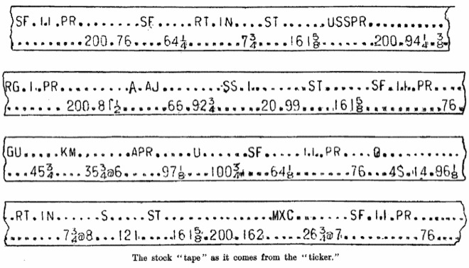

### 2008

Z linii montażowej Zakładów Samochodowych Jelcz S.A zjechał ostatni autobus Jelcz. Był to model M083C, który pojechał do Krakowa wozić pasażerów tamtejszego MPK. Ostatni autobus, który wyjechał z fabryki, był niskopodłogowy, klasy midi. Miał drzwi otwierane do środka.

  

### 1944

Dowodzona przez generała Stanisława Maczka dywizja pancerna po ciężkich walkach wyzwoliła holenderskie miasto Breda.
Niezwykle budującym elementem związanym z tą historią jest fakt, że aż 40 tysięcy mieszkańców Bredy z wdzięczności za to dokonanie złożyło wniosek o przyznanie polskiemu generałowi honorowego obywatelstwa ich miasta.

  

### 1940

Poniższy tekst to fragment listu "kata Warszawy", generała SS, dowódcy Kropsgruppe von dem Bach Ericha von dem Bacha -Zelewskiego (zdjęcie) do Heinricha Himmlera z dnia 29 października 1940 roku, w którym uzasadniał decyzję o zmianie nazwiska:
" Powołując się na naszą rozmowę podjąłem w większym zakresie badania genealogiczne, aby w rezultacie przestać nosić drugie polskobrzmiące nazwisko. (...) przywiązuję wagę do tego, aby moi potomkowie, a zwłaszcza moi trzej synowie, mogli w przyszłości wstąpić do SS i w każdej chwili wykazać działania swego przodka, SS-Gruppenführera przeciwko Polsce".
Przypomnijmy, że Zelewski urodził się w Lęborku (wówczas Lauenburg) jako Eryk Żelewski w roku 1899, w rodzinie  Ottona Jana Żelewskiego i Elżbiety Żelewskiej z domu Szymańskiej.

  

### 1929

### 1925

Na Cmentarzu Obrońców Lwowa dokonano ekshumacji szczątków trzech niezidentyfikowanych polskich żołnierzy. Jedne z nich miały spocząć w Grobie Nieznanego Żołnierza w Warszawie.
Prawie wszystko w tej sprawie było dziełem przypadku, ponieważ lwowski cmentarz, jako miejsce ekshumacji został wybrany w drodze losowania, do którego zakwalifikowano 15 innych nekropolii lub pól bitewnych. Zaś trzy trumny wydobyto po to, by dać możliwość wyboru szczątków Jadwidze Zarugiewiczowej-polskiej Ormiance, której syn zginął w 1920 roku w walce z bolszewikami pod Zadwórzem. Wskazała ona jedną spośród trzech wytypowanych trumien. Spoczywały w niej szczątki młodego człowieka, który zginął wskutek rany postrzałowej czaszki. Najprawdopodobniej był ochotnikiem-legionistą, miał bowiem przy sobie skromną maciejówkę z przytroczonym orzełkiem. Po dziś dzień to właśnie on symbolizuje ofiarę setek tysięcy Polaków, poległych z bronią w ręku.
Na zdjęciu Cmentarz Orląt Lwowskich – grób, z którego zabrano zwłoki Nieznanego Żołnierza do Warszawy – zdjęcie przedwojenne.

  

---

<a href="https://github.com/TomaszWaszczyk/historia.waszczyk.com/edit/master/src/content/october-29.md" target="_blank">Edytuj tę stronę dzieląc się własnymi notatkami!</a>
