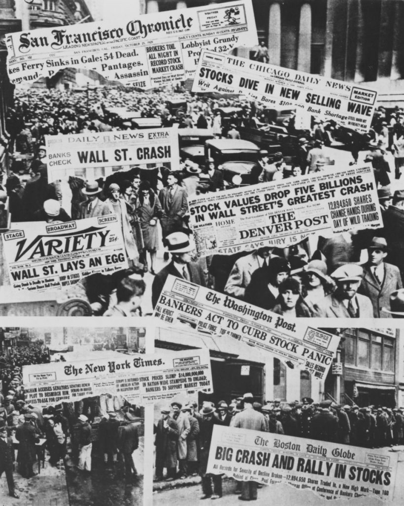

### 2021

> “A society that puts equality before freedom will get neither. A society that puts freedom before equality will get a high degree of both.” - Milton Friedman

### 2020

Aż do XIX wieku w analizach ekonomicznych nie brano pod uwagę faktu, że konsument odnosi inne korzyści z konsumpcji jednostki dobra jeżeli posiada tego dobra niewiele, a inne jeżeli poziom jego konsumpcji jest znacząco wyższy. Ta obserwacja doprowadziła do sformułowania prawa malejącej użyteczności krańcowej, zgodnie z którym korzyść krańcowa każdej kolejnej konsumowanej jednostki dobra jest mniejsza od korzyści krańcowej poprzedniej jednostki dobra.
Opisanie tego zjawiska pozwoliło wyjaśnić tzw. paradoks wody i diamentu, czyli dlaczego woda, która jest niezbędna do życia, jest tania, podczas gdy diamenty są bardzo drogie, choć można się bez nich obejść?
Ten paradoks ma jeszcze inne oblicze. Na pewno często spotykacie się z tezą neoluddystów twierdzących, że postępująca automatyzacja będzie skutkowała katastrofalnymi skutkami społecznymi. Brzmi to mnie więcej tak: "Roboty zabiorą nam pracę i nie będziemy mieli wynagrodzeń potrzebnych do zaspokajania naszych potrzeb. Co prawda automatyzacja od czasów rewolucji przemysłowej zwiększyła jakość naszego życia, ale tym razem będzie inaczej"
Tu właśnie wracamy do prawa malejącej użyteczności krańcowej. Automatyzacja zwiększa efektywność produkcji zalewając rynek większą liczbą produktów lub szybciej wykonywanych usług. To naturalnie wpływa na zwiększenie podaży dóbr i spadek cen (nota bene gdyby nie złodziejska polityka banków centralnych w tandemie z rosnącymi podatkami) obserwowalibyśmy spadki cen, a nie systematyczny wzrost cen (niektóre branże jednak rozwijają się tak szybko, że nawet w obliczu inflacji ceny niektórych produktów spadają). W warunkach totalnej automatyzacji proces zmniejszania się kosztów produkcji byłby tak znaczący, że dostęp do owoców pracy automatów byłby w zasięgu nawet najbiedniejszych. Ludzie mogliby skupić się na realizacji wyższych potrzeb, np. wychowaniu własnych dzieci, rozwoju duchowym i intelektualnym, sztuce, graniu w gry live na youtube, podtrzymywaniu relacji itd. 
Reasumując życie na poziomie zapewniającym godną egzystencję nie wymaga posiadania pracy. Kult pracy widoczny jest chociażby w skupianiu się na statystykach poziomu zatrudnienia. Paradoksalnie uważa się, że większy odsetek bezrobotnych jest negatywnym zjawiskiem. Nikt nie patrzy na to z drugiej strony gdzie brak pracy wynika z faktu, że ktoś nie musi pracować na przysłowiowym etacie, gdyż ma zaspokojone potrzeby na akceptowalnym przez siebie poziomie. 
Mieliśmy już system społeczno-gospodarczy, który wymagał aby każdy miał pracę lub miejsca, w których praca miała czynić wolnym bez względu jak bezsensowne działania ktoś miał wykonywać. Miarą rozwoju cywilizacyjnego jest odsetek ludzi, którzy pracować nie muszą. Bardzo często nawet w świecie biznesu sukces definiuje się, nie jako liczba cyferek na koncie firmy, ale czy organizatorzy biznesu mają odrobinę czasu wolnego do dyspozycji.

  

---

Ekonomiści: Słabszy złoty pomoże gospodarce

Druga fala pandemii uderzyła z pełną siłą, na co od razu zareagowały rynki finansowe. Osłabienie złotego to z jednej strony wyższe raty kredytów walutowych, ale z drugiej bardziej konkurencyjny eksport i wsparcie dla gospodarki w wychodzeniu z kryzysu.

---

Cześć wszystkim. 
Staram się nie pisać o swojej pracy, ale to co dzisiaj się wydarzyło, to już przesada., więc jeśli ktoś ma ochotę poświecić 5 minut, to zapraszam do lektury. 
Media i politycy podają, że jest tak słodko w „służbie zdrowia”. Może i w służbie zdrowia tak, ale ona nie istnieje od 1999 roku. 
System ochrony zdrowia upadł i nie wiem czy się prędko podniesie o ile w ogóle się podniesie. 
Opowiem Wam o mojej dzisiejszej sytuacji na dyżurze. Ja z moim kolegą z zespołu ratownictwa medycznego dostaliśmy wyjazd do nagłego zatrzymania krążenia (inaczej nazywana przez niektórych zatrzymaniem akcji serca lub dla totalnych laików zgonem). 
Nie było by w tym nic dziwnego prawda? GDYBY NIE TO, ŻE DYSPOZYTOR NIE MIAŁ WOLNEGO ZESPOŁU I SYN SWOJEGO OJCA REANIMOWAŁ PRZEZ PRAWIE GODZINĘ!
A przecież do takich przypadków zostaliśmy szkoleni. Proszę pamiętać, że ratownikiem medycznym zostaje się po studiach. 
Więc gdzie były wszystkie zespoły? A no pewnie czekały na zdanie pacjenta pod szpitalami( obecnie od kilku do kilkunastu godzin), były u pacjentów na których wypiął się lekarz rodzinny i przez teleporadę kazał wezwać ZRM-bo tak jest najłatwiej, bądź były na dekontaminacji po pacjencie z COVID. 
Wracając do wyjazdu, syn pacjenta wezwał ZRM o godzinie około 15, dopiero po godzinie dyspozytor znalazł zespół wolny (nas) i wysłał nas na zdarzenie. Byliśmy zaskoczeni tym wyjazdem, ponieważ jak większość ludzi wie, bo o tym się trąbi na każdych kursach pierwszej pomocy, że mózg umiera po około 4 minutach po nagłym zatrzymaniu krążenia, gdy nie podejmiemy RKO-resuscytacji krążeniowo oddechowej. Chłop miał tyle samozaparcia, że reanimował swojego ojca przez godzinę, bo nie było żadnego wolnego zespolu(karetki dla laików)! W momencie przejęcia pacjenta od syna zapytaliśmy jak to się stało. No to on nam na to odpowiedział, że zaczął tak kaszleć jakby chciał płuca wypluć. Poprosiłem wtedy o pokazanie dokumentacji medycznej pacjenta. Czytam i widzę: w płucach obraz matowej szyby-podejrzenie COVID... Na szczęście byliśmy zabezpieczeni. Gdy próbowałem zaintubować pacjenta, zobaczyłem dużo krwi w drogach oddechowych. Niektórzy powiedzą, że ten post jest po to, żeby bigpharma, albo medycy mogli zarabiać. 
Nie! Covid to nie ściema, ja nie mam za to żadnych dodatkowych pieniędzy a jego płuca przez to „eksplodowały”. W trakcie wtłaczania powietrza w płuca, one praktycznie w ogóle się nie unosiły a w rurce pojawiała się krew!
Pewnie jak się domyślacie, po naszych 45 minutach bez efektu, skończyło się to niestety zgonem, ale ile jeszcze ludzi musi zginąć, byście się ogarneli, że chodzenie w kombinezonach nie jest ani dla nas trochę przyjemne. Załóżcie na siebie szczelnie worek na śmieci, załóżcie szczelnie maskę, google, które wżynają wam się w twarz i siedźcie tak przez kilka godzin, nie mogąc załatwić potrzeb fizjologicznych, bo nie ma miejsc w szpitalach. 
Więc, jeśli jakiś mój znajomy uważa, że covid to ściema i tą ochronę zdrowia mamy taką super niech mnie usunie ze znajomych. 
Dziękuje za uwagę. 
Uważajcie na siebie, bo to nie są już żarty. 
Może być jeszcze gorzej. 
Poniżej wstawiam zdjęcie z dzisiejszego wyjazdu, obrazujące naszą obecną sytuacje w ochronie zdrowia.

  

---

### 2008

Z linii montażowej Zakładów Samochodowych Jelcz S.A zjechał ostatni autobus Jelcz. Był to model M083C, który pojechał do Krakowa wozić pasażerów tamtejszego MPK. Ostatni autobus, który wyjechał z fabryki, był niskopodłogowy, klasy midi. Miał drzwi otwierane do środka.

  

### 1950

Władze przeprowadziły trzecią już w ciągu 11 lat wymianę pieniędzy.
Operacja ta pozbawiła z dnia na dzień wielu Polaków sporą część trzymanych w domach oszczędności.
Pieniądze trzymane w skarpecie wymieniano po kursie znacznie bardziej niekorzystnym niż pensje, ceny i wkłady bankowe (pierwsze 100:1, drugie 100:3). Sprawiło to, że oszczędności te straciły dwie trzecie swojej wartości.

  

### 1944

Dowodzona przez generała Stanisława Maczka dywizja pancerna po ciężkich walkach wyzwoliła holenderskie miasto Breda.
Niezwykle budującym elementem związanym z tą historią jest fakt, że aż 40 tysięcy mieszkańców Bredy z wdzięczności za to dokonanie złożyło wniosek o przyznanie polskiemu generałowi honorowego obywatelstwa ich miasta.

  

### 1943

Na murach krakowskich domów pojawił się pierwszy "afisz śmierci" czyli rozporządzenie gubernatora Hansa Franka pt"O zwalczaniu zamachów na niemieckie dzieło odbudowy w Generalnym Gubernatorstwie", co w praktyce było listą 30 nazwisk osób skazanych danego dnia na śmierć.

  

### 1940

Poniższy tekst to fragment listu "kata Warszawy", generała SS, dowódcy Kropsgruppe von dem Bach Ericha von dem Bacha -Zelewskiego (zdjęcie) do Heinricha Himmlera z dnia 29 października 1940 roku, w którym uzasadniał decyzję o zmianie nazwiska:
" Powołując się na naszą rozmowę podjąłem w większym zakresie badania genealogiczne, aby w rezultacie przestać nosić drugie polskobrzmiące nazwisko. (...) przywiązuję wagę do tego, aby moi potomkowie, a zwłaszcza moi trzej synowie, mogli w przyszłości wstąpić do SS i w każdej chwili wykazać działania swego przodka, SS-Gruppenführera przeciwko Polsce".
Przypomnijmy, że Zelewski urodził się w Lęborku (wówczas Lauenburg) jako Eryk Żelewski w roku 1899, w rodzinie  Ottona Jana Żelewskiego i Elżbiety Żelewskiej z domu Szymańskiej.

  

### 1929

### 1925

Na Cmentarzu Obrońców Lwowa dokonano ekshumacji szczątków trzech niezidentyfikowanych polskich żołnierzy. Jedne z nich miały spocząć w Grobie Nieznanego Żołnierza w Warszawie.
Prawie wszystko w tej sprawie było dziełem przypadku, ponieważ lwowski cmentarz, jako miejsce ekshumacji został wybrany w drodze losowania, do którego zakwalifikowano 15 innych nekropolii lub pól bitewnych. Zaś trzy trumny wydobyto po to, by dać możliwość wyboru szczątków Jadwidze Zarugiewiczowej-polskiej Ormiance, której syn zginął w 1920 roku w walce z bolszewikami pod Zadwórzem. Wskazała ona jedną spośród trzech wytypowanych trumien. Spoczywały w niej szczątki młodego człowieka, który zginął wskutek rany postrzałowej czaszki. Najprawdopodobniej był ochotnikiem-legionistą, miał bowiem przy sobie skromną maciejówkę z przytroczonym orzełkiem. Po dziś dzień to właśnie on symbolizuje ofiarę setek tysięcy Polaków, poległych z bronią w ręku.
Na zdjęciu Cmentarz Orląt Lwowskich – grób, z którego zabrano zwłoki Nieznanego Żołnierza do Warszawy – zdjęcie przedwojenne.

  

### 1914

Tekst pochodzi z kalendarza "Nasz Rok 1914" wydanego przez Towarzystwo Akcyjne Wydanictwa "Świat" przy Zgoda 1 pod redakcyą Stanisława Sierosławskiego

  

### 1611

  

---

<a href="https://github.com/TomaszWaszczyk/historia.waszczyk.com/edit/master/src/content/october-29.md" target="_blank">Edytuj tę stronę dzieląc się własnymi notatkami!</a>
