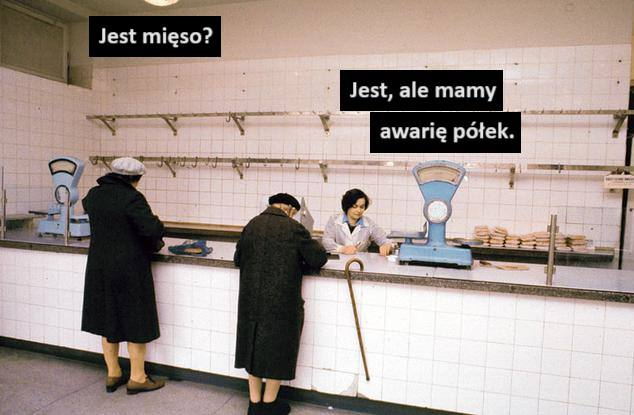
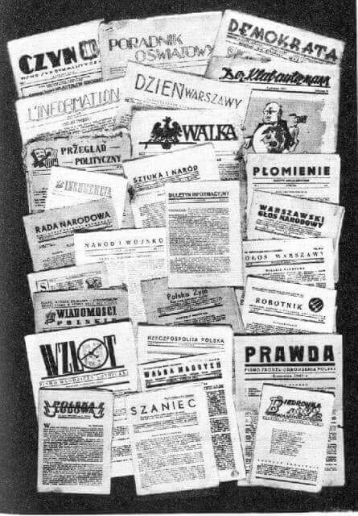
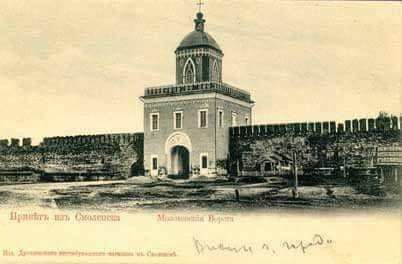

### 2023

  

<video width="640" height="480" controls>
<source src="./movies/october/jozwiak.mp4" type="video/mp4">
Your browser does not support the video tag.
</video>

  

---

### 2022

<a href="./documents/october/vanished.pdf" target="_blank">Millions in Cryptocurrency Vanished as Agents Watched Helplessly</a>

### 1996

Zdjęcie wykonane dokładnie 24 lata temu, 3 października 1996 w Zakopanem w Domu Pracy Twórczej Astoria. To tam Wisława Szymborska odebrała wiadomość o otrzymaniu literackiej Nagrody Nobla. Lem patron naszej fundacji skomentował tę chwilę bardzo prosto: "Wiśce się ten Nobel po prostu należał!".

Są chwile piękne. Są chwile wyjątkowe. Są też takie, których opisać się po prostu nie da. Ale trzeba o nich pamiętać! Chociażby milcząco z braku słów.

  

### 1990

<a href="https://en.wikipedia.org/wiki/German_Unity_Day" target="_blank">Tag der Deutschen Einheit</a>

### 1944

Ulotka z pożegnalnym rozkazem do żołnierzy dowódcy AK generała dywizji Tadeusza Komorowskiego "Bora":

  

### 1942

Na wyspie Uznam Niemcy przeprowadzili pierwszą próbę wystrzelenia rakiety V2. Była to jednak próba nieudana. Kolejne dokonywane na szerszą skalę próby podczas prac nad tą bronią doprowadziły to tego, że 17 sierpnia 1943 roku lotnictwo alianckie zbombardowało niemiecki ośrodek badań rakietowych. Decyzją Hitlera, na naradzie w Wilczym Szańcu ośrodek miał zostać przeniesiony do Blizny koło Dębicy, gdzie istniał już niemiecki poligon SS "Heidelager".

  

### 1939

W Warszawie ukazało się pierwsze polskie pismo konspiracyjne pt "Monitor informacyjny ZPN".
Było to pismo Związku Powstańców Niepodległościowych-organizacji, która właśnie w konspiracji kontynuowała polskie tradycje powstańcze.
Monitor informacyjny ZPN powielany był w drukarni Instytutu Higieny w Warszawie.
Był to początek polskiej prasy konspiracyjnej.

  

### 1896

https://pl.wikipedia.org/wiki/Stanis%C5%82aw_Tatar

### 1882

W Tymoszówce (obecnie Ukraina) urodził się Karol Szymanowski (zdjęcie) uważany obok Szopena i Moniuszki za jednego z najwybitniejszych polskich kompozytorów i pianistów.
Na jego dorobek artystyczny składa się 280 różnych utworów. Są to koncerty, utwory na głosy, chór i orkiestrę, preludia, etiudy, operetki, balety itd.
Karol Szymanowski zmarł w 1937 roku.

  

### 1863

https://pl.wikipedia.org/wiki/Stanis%C5%82aw_Zaremba_(1863%E2%80%931942)

### 1846

Król pruski Fryderyk Wilhelm drugi otworzył nowe połączenie kolejowe między Wrocławiem, a Mysłowicami. Odcinek ten liczył 193 kilometry długości. Towarzystwo Kolei Górnośląskiej (Oberschlesische Eisenbahn AG) w późniejszym okresie zbudowało i przejęło w użytkowanie dziesiątki innych linii kolejowych (m.in. Górnośląskie Koleje Wąskotorowe), stając się przed nacjonalizacją kolei na terenie Królestwa Prus jednym z największych
przedsiębiorstw kolejowych w Europie.

  

### 1654

Podczas IV wojny polsko-rosyjskiej skapitulowała broniona przez Polaków i Litwinów Twierdza Smoleńsk.
Taki opis upokorzenia wojsk Rzeczpospolitej przez Rosjan znajdujemy w wydanej w 1910 roku ksiące pt "Wojna moskiewska 1654-1655" autorstwa Ludwika Kubali.
"Z laski carskiej a nie na podstawie warunków kapitulacji, pozwolono Obuchowiczowi opuścić twierdze smoleńską  wraz ze wszystkiemi, którzy mu towarzyszyć chcieli. Wyjechaliśmy tedy 3 października [1654 roku] o drugiej po południu bramą małachowską.
Zaraz za murami wojsko moskiewskie uszykowane z obydwóch stron drogi stanęło na jakie pół mili. Namioty bogate rozbito, przed którymi stał car na białym koniu. Oficerowie i wojewoda jechali ku niemu, a przystąpiwszy bliżej na kilkanaście kroków, dostali rozkaz paść na kolana, oddać broń klęcząc i chorągiew pod nogi carskie rzucić. Poczem broń im napowrót oddano i wręczywszy Obuchowiczowi list carski i o konwoju zapewniwszy, odejść im kazano, nie dopuszczając do ręki«
Podobno car kazał powiedzieć wojewodzie: »Odejdź, proszę, i donieś królowi o potężnem wojsku, które widzia­ łeś i o nieszczęściu, jakiego doświadczyłeś« — a odwróciwszy się do swoich, zawołał: > Jakżebym nie chciał, aby go który z was naśladował! Ja bym takiego na pal wbić kazał !"

  

### 1633

Miało miejsce nieudane rosyjskie oblężenie Smoleńska, które miało zapobiec wkroczeniu wojsk polskich króla Władysława IV do tego miasta. Zle zorganizowana armia rosyjska pod dowództwem Michaiła Borysowicza Szeina mimo posiadanej nad Polakami przewagi nie była w stanie obronić miasta.
Oficjalna kapitulacja Rosjan nastąpiła 25 lutego 1634 roku.
Po kapitulacji armii Szeina Władysław IV podzielił swą armię na trzy części i ruszył w głąb Rosji. Przodem poszły lotne oddziały jazdy polskiej, które dotarły pod Moskwę siejąc zniszczenie i przerażenie. Główne siły Rzeczypospolitej obległy 22 marca twierdzę Biała, której załogę stanowiło 1000 żołnierzy dowodzonych przez księcia Fiodora Wołkońskiego. Przez 7 tygodni garnizon rosyjski bronił się dzielnie, odpierając wszystkie polskie ataki. Z powodu przedłużającej się zimy wciąż trwały silne mrozy i padał śnieg, co było przyczyną wielu udręk i chorób wśród polskich żołnierzy, przetrzebiając znacznie siły wojsk Władysława IV.
Władysław IV początkowo sądził, że zdobędzie
Moskwę i osadzi na tronie swego brata Jana
Kazimierza, by potem wspólnie z Rosją uderzyć na Szwecję i odzyskać tamtejszy tron. Piętrzące się trudności znacznie osłabiły optymizm króla – armia rosyjska walczyła nadspodziewanie dobrze, a jej wysokie wyszkolenie, wyposażenie techniczne oraz fortyfikacje zaimponowały Władysławowi IV. Ponieważ zbliżał się koniec rozejmu ze Szwecją, a na południu groziła wojna ze sprzymierzoną z Rosjanami Turcją, polski monarcha zdecydował się na rokowania. W tym celu do Moskwy wysłano Mikołaja Woronicza – Rosjanie chętnie przystali na
złożoną przez polskiego posła propozycję rozmów pokojowych.

  

---

<a href="https://github.com/TomaszWaszczyk/historia.waszczyk.com/edit/master/src/content/october-3.md" target="_blank">Edytuj tę stronę dzieląc się własnymi notatkami!</a>
