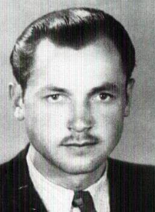
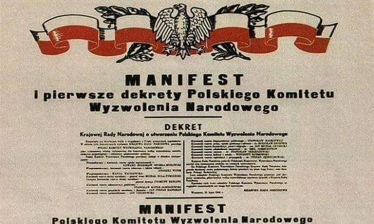
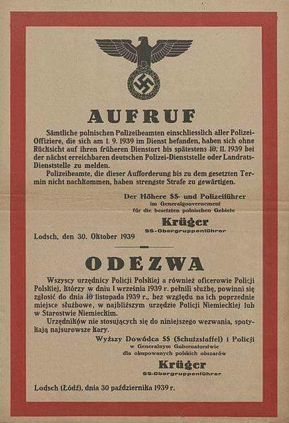
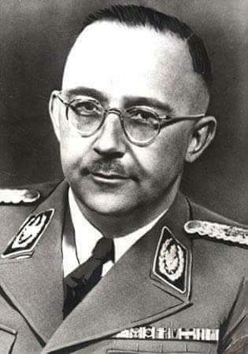
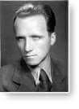
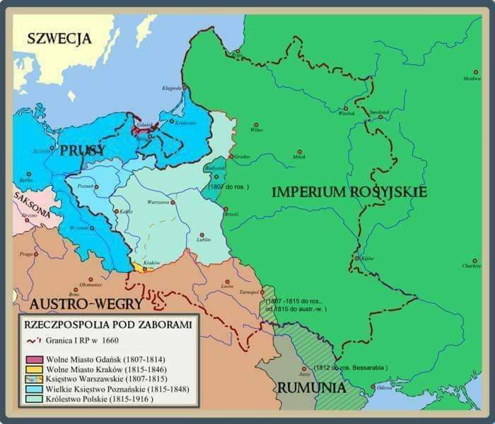

### 1984

Według oficjalnych informacji wyłowiono z Wisły ciało zamordowanego księdza Jerzego Popiełuszki. Dokumenty milicji opisują to zdarzenie następująco: „O godzinie 17.00 [...] przystąpiono do wydobywania zwłok mężczyzny [...] przy użyciu płetwonurków. Przed ich wydobyciem, jak wynika z oświadczenia płetwonurka Krzysztofa Mańko, [...] ubrane były w sutannę, zwrócone twarzą w kierunku jazu, z obciążeniem nóg”. Ksiądz Jerzy został porwany 19 października w okolicach miejscowości Przysiek na trasie Bydgoszcz-Toruń, a następnie zamordowany przez oficerów Samodzielnej Grupy „D” Departamentu IV MSW działających w składzie: Grzegorz Piotrowski, Leszek Pękala, Waldemar Chmielewski. Czwartym, chociaż nie bezpośrednim katem był Adam Pietruszka. Oprawcy wrzucili księdza Jerzego do Wisły w okolicach tamy pod Włocławkiem.  Wcześniej skrępowali mu nogi oraz ręce sznurkami w taki sposób , by próby poruszanie nimi zaciskały pętlę na szyi. Dodatkowo do nóg przywiązali worki z kamieniami. Sekcja zwłok przeprowadzona w Akademii Medycznej w Białymstoku, 31 października wykazała, że przed śmiercią kapelan Solidarności był bestialsko pobity.
Na zdjęciu ulotka kolportowana po śmierci ks. Jerzego Popiełuszki.

  

### 1945

W okolicach dworca PKP w Ciechanowie żołnierze radzieccy zastrzelili Romana Dziemieszkiewicza (zdjęcie) żołnierza podziemia antykomunistycznego, dowódcę Powiatów Ostrołęka i Ciechanów Narodowego Zjednoczenia Wojskowego, starszego brata Mieczysława Dziemieszkiewicza.
Miał 27 lat.

  

### 1944

Polski Komitet Wyzwolenia Narodowego wydał dekret "O ochronie Państwa".
Zasdniczą cechą tego dokumentu reformującego polskie sądownictwo, zawierającego 11 punktów było to, iż łamał on podstawową zasadę, która mówi, że prawo nie może działać wstecz. Dekret był głównym orężem władz komunistycznych w walce z opozycją i podziemiem antykomunistycznym. Każdy z 11 artykułów przewidywał karę śmierci, przy niemalże pełnej dowolności interpretacyjnej popełnionych czynów. 5 punktów dekretu było stosowanych po wojnie wobec ludności cywilnej, która była sądzona do kwietnia 1955 także przez sądy wojskowe PRL, wymierzające z reguły bardzo surowe kary.

  

### 1939

Odezwa do urzędników Policji Polskiej z 30 października 1939 roku.

  

---

Ukazało się
rozporządzenie Heinricha Himmlera, jako
komisarza Rzeszy do spraw umacniania
niemieckości o przesiedleniu Polaków z ziem
wcielonych do Rzeszy na teren Generalnego
Gubernatorstwa, w którym możemy przeczytać:
„W miesiącach listopadzie i grudniu 1939, jak i w miesiącach styczniu i lutym 1940 należy
przeprowadzić następujące przesiedlenia:
Z dawnych polskich terenów, a obecnie prowincji i terenów Rzeszy – wszystkich Żydów.
Z prowincji Gdańsk – Prusy Zachodnie –
wszystkich Polaków z Kongresówki.
Z prowincji Poznań, południowych i wschodnich Prusach i wschodniego Górnego Śląska szczególnie wrogo usposobionej polskiej ludności w liczbie, która zostanie ustalona. (…)
Pkt. 6
Odpowiedzialny za wymarsz i transport na
terenie swego obszaru jest wyższy dowódca SS i policji; odpowiedzialna za umieszczenie na
nowym terenie zamieszkania jest administracja,
względnie samorząd polski.” Scedował on na
nowopowstałą władze administracyjną wszystkie problemy związane z logistyką tego
przedsięwzięcia. W tym samym czasie tj. 8
listopada 1939 na spotkaniu z władzami GG,
poświęconemu stanowi policji niemieckiej w GG oraz o polityce przesiedleńczej, SS –
Obergruppenführer Friedrich Krüger informował:
„(…) Do wiosny GG powinno przyjąć 1 000 000
Polaków i Żydów ze wschodnich i zachodnich
terenów Poznańskiego, z rejony Gdańska,
Pomorza i Górnego Śląska. Sprowadzanie
Volksdeutchów i przejmowanie Polaków i Żydów (codziennie po 10 000 osób) powinno odbywać się planowo. Szczególnie pilną sprawą jest wprowadzenie przymusu pracy dla Żydów.
Ludność żydowską winno się w miarę możności usuwać z miast zażydzonych i zatrudniać przy robotach drogowych. Sprawa pomieszczeń dla nich oraz wyżywienia stanowi trudny, jeszcze nierozwiązany problem”.
Zródło Jewish.org.pl

  

### 1908

W Turce w obwodzie lwowskim urodził się Zygmunt Albert (zdjęcie) lekarz patolog, historyk medycyny, profesor nauk medycznych, naoczny świadek mordu profesorów lwowskich 4 lipca 1940 roku.
Był absolwentem Wydziału Lekarskiego Uniwersytetu Jana Kazimierza we Lwowie. W roku 1945  objął kierownictwo Katedry i Zakładu Anatomii Patologicznej na Wydziale Lekarskim Uniwersytetu i Politechniki we Wrocławiu. Przez 16 lat (1954-70) kierował  Zakładem Onkologii Doświadczalnej w Instytucie Immunologii i Terapii Doświadczalnej Polskiej Akademii Nauk im. L. Hirszfelda we Wrocławiu. W roku 1981 wyjechał do Republiki Federalnej Niemiec, gdzie mieszkał do końca życia. 
Dzięki zebranym przez niego dokumentom (w tym relacjom innych naocznych świadków, członków rodzin zamordowanych, żydowskich uczestników ekshumacji zwłok) powstało na ten temat szereg artykułów i publikacji jego autorstwa. Zmarł w 2001 roku.

  

### 1794

Powstało Generalne Gubernatorstwo Litewskie Imperium Rosyjskiego, które razem z guberniami : mińską, mohylewską i witebską tworzyły ziemie nazywane przez Polaków ziemiami zabranymi. Generalne Gubernatorstwo, które miało siedzibę w Wilnie istniało aż do 1 lipca 1912 roku.

  

---

<a href="https://github.com/TomaszWaszczyk/historia.waszczyk.com/edit/master/src/content/october-30.md" target="_blank">Edytuj tę stronę dzieląc się własnymi notatkami!</a>
