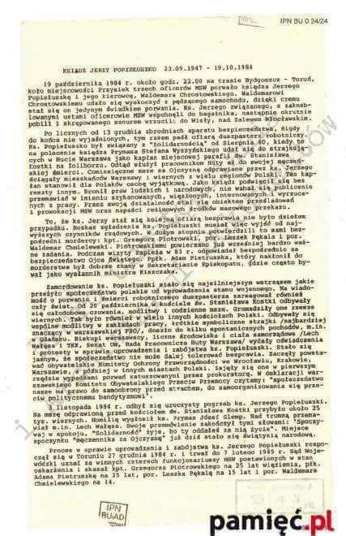

### 2023

<br><br>

```
W organizowanym w Rijadiez, inwestorskim panelu dyskusyjnym w ramach Future Investment Initiative wzięli udział jedni z najbardziej wpływowych ludzi biznesu na świecie. Większość z nich zgodziła się, że największym problemem dla świata zagrożeniem są dziś konflikty zbrojne i terroryzm. W długim terminie wszyscy niemal wskazali na technologię jako główny katalizator wzrostu gospodarczego i ogólnej zamożności społeczeństw. Podkreślili też, że ludzkość ma wrodzoną umiejętność i pragnienie rozwiązywania każdego problemu i ostatecznie świat rozwiąże aktualne bolączki. Prowadzącym dyskusje był David Rubinstein, współzałożyciel Carlyle Group – największego na świecie funduszu private equity. Wśród gości zasiadali m.in.

Yasir Al-Rumayyan – gospodarz program, zarządzający Public Investment Fund (wehikułem majątkowym Arabii Saudyjskiej) oraz prezes i CEO Saudi Aramco, największej spółki z branży ropy i drugiej największej pod względem kapitalizacji spółki na świecie

Ray Dalio – prezes Bridgewater, jednego z największych funduszy hedgingowych i autor publikacji z zakresu gospodarki i polityki

Jamie Dimon – prezes największego i najbardziej zyskownego nie tylko w USA ale także na świecie banku JP Morgan Chase

Laurence D. Fink – założyciel i CEO BlackRock, największego funduszu inwestycyjnego świata z blisko 10 bilionami dolarów w zarządzaniu

Stephen Schwarzmann – prezes Blackstone, największego funduszu z obszaru inwestycji alternatywnych na świecie i jednego z największych funduszy inwestujących w nieruchomości

David Solomon – prezes Goldman Sachs, jednego z największych banków inwestycyjnych w USA

Oraz: Jane Fraser (prezes Citigroup), dr Patrice Motsepe (miliarder i prezes stowarzyszenia piłki nożnej w Afryce), Noel Quinn (prezes banku HSBC), Neil Shen (zarządzający funduszem Sequoia Capital) oraz Shemara Wikramanayak (szefowa australijskiej Macquire Group).

Yasir Al-Rumayyan

    Świat powinien zadbać o regulacje AI na poziomie globalnym
    Być może rozwiniemy tzw. AGI – generalną AI, która zmieni świat
    Popyt na centra danych będzie rósł ale problemem jest cena i źródła energii
    Arabia Saudyjska do 2030 roku będzie korzystać w minimum 50% z odnawialnych źródeł energii
    Świat powinien zacząć inwestować w odnawialną energię więcej o 5 bilionów dolarów – każdego roku

Ray Dalio

    Rzeczy, które zaskoczyły go w życiu zrobiły tak dlatego, że w czasie jego kariery nie przydarzyły się ale historia pokazuje, że zdarzały się często
    Dług jaki ma teraz świat oraz ilość konfliktów jest największa od 1945 roku
    Ryzyko rosnących potęg na horyzoncie i zdestabilizowany świat bez dwóch hegemonów (Rosja, USA)
    Pozostaje pesymistą odnośnie sytuacji w przyszłym roku
    Potężne różnice majątkowe w społeczeństwach, początek populizmu politycznego etc. nigdy nie zwiastowały dobrych lat na ziemi – raczej wojny
    Jeśli przewinąć historyczne taśmy można odnieść wrażenie, że powtarzają się te scenariusze bez końca
    Tylko globalny pokój mógłby odwrócić ten scenariusz i doprowadzić do pozytywnego zjawiska 'konkurencji’ i rozwoju technologii w optymalnych warunkach gospodarczych

Jamie Dimon

    W długim terminie Dimon jest optymistą ale widzi sporo podobieństw do kryzysu z lat 70-tych
    Stany Zjednoczone stoją przed poważnym wyzwaniem by odbudować pozycję globalnego lidera nie tylko od strony militarnej ale także od strony finansowej i dyplomatycznej
    Proliferacja broni jądrowej jest zagrożeniem, czasy są niespokojnie i wydaje się roszczeniowym myśleniem myśleć, że kryzys militarny się nie pogłębi
    Około 10% pracowników JP Morgan z rożnych przyczyn od dawna pracuje z domu i firma nie widzi w tym istotnego problemu

Larry Fink

    Konflikty zbrojne stanowią dziś poważne zagrożenie dla świata. Prawdopodobnie powrót terroryzmu będzie konsekwencją wojny na Bliskim Wschodzie
    Ilość strachu i niestabilności będzie większa niż dziś. Wyższe stopy procentowe w Fed zostaną naprawdę utrzymane na dłużej
    Spore zmiany w skali makro oraz radykalizacja społeczeństw w stronę prawicowych nacjonalizmów
    Fragmentacja łańcuchów dostaw wskazuje, że inflacja będzie wyższa
    Deficyt USA rośnie i cały bilans Fed jest mocno proinflacyjny
    Konsument w USA pozostaje mocny i nie spodziewam się by zmieniło się to w 2024 roku
    Gospodarkę USA może czekać zarówno miękkie jak i twarde lądowanie po cyklu Fed ale nie stanie się to w najbliższej przyszłości
    Transmisja polityki monetarnej w USA trwa dłużej ponieważ kredyty hipoteczne Amerykanów są zaciągane na stałym oprocentowaniu, w innych gospodarkach są na zmiennym lub ulegają zmianie oprocentowania co kilka lat
    Europę czeka prawdopodobnie poważniejszy kryzys
    AI i robotyka oznacza dosłownie zastrzyk produktywności ale nie pojawi się to w kilka miesięcy czy lat, raczej zajmie kilka lat
    Możemy mieć kilka lat zawirowań ale po tym czasie wiele rzeczy zmieni się na lepsze
    Jestem większym optymistą niż byłem 4 lata temu ale wyłącznie jeśli mówimy o długim terminie, cierpliwość opłaci się wielu inwestorom

Stephen Schwarzmann

    Inwestycje alternatywne i aktywa o stałym oprocentowaniu notują potężne zainteresowanie zarówno od instytucji jak i klientów indywidualnych
    Praca zdalna i cały trend odchodzenia od biur spowodował kryzys nieruchomości komercyjnych natomiast nie wszystkie z nich czeka kryzys
    Mniej więcej 50% przestrzeni biurowej nie jest obecnie używanej w USA i nie jest to możliwe do utrzymania ekonomiczne
    Po wojnach na początku lat 70-tych przyszła recesja i choć historia nie mu się powtórzyć – obecne konflikty obciążą globalną gospodarkę
    Sytuacja inflacyjna w USA znacznie poprawiła się w ostatnich miesiącach

Neil Shen

    Inwestycje w Chinach są wymagające i wymagają olbrzymiej cierpliwości oraz długoterminowego nastawienia ponieważ rynek notuje skoki zmienności

Źródło: https://bithub.pl
```

### 2021

Przykład poziomu publicznej debaty ekonomicznej w społeczeństwie gdzie standardem jest "wyższe wykształcenie":

> Tusk, twierdzi, że przeciwieństwem inflacji jest stagflacja. Wczoraj po ogłoszeniu przez GUS, tzw. szybkiego szacunku wskaźnika cen towarów i usług konsumpcyjnych w październiku w wysokości 6,8% w ujęciu rok do roku, Donald Tusk zorganizował konferencję prasową, na której mówił o wręcz szalejącej inflacji w naszym kraju.

> Oczywiście ani słowem nie odniósł się do silniejszych niż zwykle procesów inflacyjnych, z którymi ma do czynienia większość krajów na świecie w tym także kraje UE, a szczególnie te, będące w strefie euro.

### 2020

Jak wynika z raportu Euler Hermes liczba niewypłacalności polskich firm opublikowanych w oficjalnych źródłach była w trzecim kwartale na rekordowym poziomie – 369 firm. Lipiec, sierpień i wrzesień to miesiące z trzema najwyższymi dotychczas liczbami niewypłacalności. W ciągu 3 kwartałów 2020 opublikowano informacje o 849 niewypłacalnościach, czyli o 12 proc. więcej niż przed rokiem i najwięcej w obecnej dekadzie.

---

<br><br>

<br><br>

<br><br>

<br><br>

---

### 1989

Swoją premierę miał dramat obyczajowy pod tytułem "300 mil do nieba".
Scenariusz filmu, autorstwa Cezarego Harasimowicza, a wyreżyserowanego przez Macieja Dejczera oparty był na prawdziwej historii braci Zielińskich, którzy w roku 1985, ukrywając się pod naczepą ciężarówki uciekli do Szwecji.
W rolach głównych wystąpili Wojciech Klata i Rafał Zimowski.

### 1984

Według oficjalnych informacji wyłowiono z Wisły ciało zamordowanego księdza Jerzego Popiełuszki. Dokumenty milicji opisują to zdarzenie następująco: „O godzinie 17.00 [...] przystąpiono do wydobywania zwłok mężczyzny [...] przy użyciu płetwonurków. Przed ich wydobyciem, jak wynika z oświadczenia płetwonurka Krzysztofa Mańko, [...] ubrane były w sutannę, zwrócone twarzą w kierunku jazu, z obciążeniem nóg”. Ksiądz Jerzy został porwany 19 października w okolicach miejscowości Przysiek na trasie Bydgoszcz-Toruń, a następnie zamordowany przez oficerów Samodzielnej Grupy „D” Departamentu IV MSW działających w składzie: Grzegorz Piotrowski, Leszek Pękala, Waldemar Chmielewski. Czwartym, chociaż nie bezpośrednim katem był Adam Pietruszka. Oprawcy wrzucili księdza Jerzego do Wisły w okolicach tamy pod Włocławkiem.  Wcześniej skrępowali mu nogi oraz ręce sznurkami w taki sposób , by próby poruszanie nimi zaciskały pętlę na szyi. Dodatkowo do nóg przywiązali worki z kamieniami. Sekcja zwłok przeprowadzona w Akademii Medycznej w Białymstoku, 31 października wykazała, że przed śmiercią kapelan Solidarności był bestialsko pobity.
Na zdjęciu ulotka kolportowana po śmierci ks. Jerzego Popiełuszki.

<br><br>

### 1947

The General Agreement on Tariffs and Trade (GATT), signed on October 30, 1947, by 23 countries, was a legal agreement minimizing barriers to international trade by eliminating or reducing quotas, tariffs, and subsidies while preserving significant regulations. The GATT was intended to boost economic recovery after World War II through reconstructing and liberalizing global trade.

---

Zostaje znaleziony, powieszony na drzewie w hrabstwie Somerset (Wielka Brytania) Iwan Kriwoziercew (Иван Кривозерцев).

<br><br>

---

### 1945

W okolicach dworca PKP w Ciechanowie żołnierze radzieccy zastrzelili Romana Dziemieszkiewicza (zdjęcie) żołnierza podziemia antykomunistycznego, dowódcę Powiatów Ostrołęka i Ciechanów Narodowego Zjednoczenia Wojskowego, starszego brata Mieczysława Dziemieszkiewicza.
Miał 27 lat.

<br><br>

### 1944

Polski Komitet Wyzwolenia Narodowego wydał dekret "O ochronie Państwa".
Zasdniczą cechą tego dokumentu reformującego polskie sądownictwo, zawierającego 11 punktów było to, iż łamał on podstawową zasadę, która mówi, że prawo nie może działać wstecz. Dekret był głównym orężem władz komunistycznych w walce z opozycją i podziemiem antykomunistycznym. Każdy z 11 artykułów przewidywał karę śmierci, przy niemalże pełnej dowolności interpretacyjnej popełnionych czynów. 5 punktów dekretu było stosowanych po wojnie wobec ludności cywilnej, która była sądzona do kwietnia 1955 także przez sądy wojskowe PRL, wymierzające z reguły bardzo surowe kary.

<br><br>

### 1939

Odezwa do urzędników Policji Polskiej z 30 października 1939 roku.

<br><br>

---

Ukazało się
rozporządzenie Heinricha Himmlera, jako
komisarza Rzeszy do spraw umacniania
niemieckości o przesiedleniu Polaków z ziem
wcielonych do Rzeszy na teren Generalnego
Gubernatorstwa, w którym możemy przeczytać:
„W miesiącach listopadzie i grudniu 1939, jak i w miesiącach styczniu i lutym 1940 należy
przeprowadzić następujące przesiedlenia:
Z dawnych polskich terenów, a obecnie prowincji i terenów Rzeszy – wszystkich Żydów.
Z prowincji Gdańsk – Prusy Zachodnie –
wszystkich Polaków z Kongresówki.
Z prowincji Poznań, południowych i wschodnich Prusach i wschodniego Górnego Śląska szczególnie wrogo usposobionej polskiej ludności w liczbie, która zostanie ustalona. (…)
Pkt. 6
Odpowiedzialny za wymarsz i transport na
terenie swego obszaru jest wyższy dowódca SS i policji; odpowiedzialna za umieszczenie na
nowym terenie zamieszkania jest administracja,
względnie samorząd polski.” Scedował on na
nowopowstałą władze administracyjną wszystkie problemy związane z logistyką tego
przedsięwzięcia. W tym samym czasie tj. 8
listopada 1939 na spotkaniu z władzami GG,
poświęconemu stanowi policji niemieckiej w GG oraz o polityce przesiedleńczej, SS –
Obergruppenführer Friedrich Krüger informował:
„(…) Do wiosny GG powinno przyjąć 1 000 000
Polaków i Żydów ze wschodnich i zachodnich
terenów Poznańskiego, z rejony Gdańska,
Pomorza i Górnego Śląska. Sprowadzanie
Volksdeutchów i przejmowanie Polaków i Żydów (codziennie po 10 000 osób) powinno odbywać się planowo. Szczególnie pilną sprawą jest wprowadzenie przymusu pracy dla Żydów.
Ludność żydowską winno się w miarę możności usuwać z miast zażydzonych i zatrudniać przy robotach drogowych. Sprawa pomieszczeń dla nich oraz wyżywienia stanowi trudny, jeszcze nierozwiązany problem”.
Zródło Jewish.org.pl

<br><br>

### 1908

W Turce w obwodzie lwowskim urodził się Zygmunt Albert (zdjęcie) lekarz patolog, historyk medycyny, profesor nauk medycznych, naoczny świadek mordu profesorów lwowskich 4 lipca 1940 roku.
Był absolwentem Wydziału Lekarskiego Uniwersytetu Jana Kazimierza we Lwowie. W roku 1945  objął kierownictwo Katedry i Zakładu Anatomii Patologicznej na Wydziale Lekarskim Uniwersytetu i Politechniki we Wrocławiu. Przez 16 lat (1954-70) kierował  Zakładem Onkologii Doświadczalnej w Instytucie Immunologii i Terapii Doświadczalnej Polskiej Akademii Nauk im. L. Hirszfelda we Wrocławiu. W roku 1981 wyjechał do Republiki Federalnej Niemiec, gdzie mieszkał do końca życia. 
Dzięki zebranym przez niego dokumentom (w tym relacjom innych naocznych świadków, członków rodzin zamordowanych, żydowskich uczestników ekshumacji zwłok) powstało na ten temat szereg artykułów i publikacji jego autorstwa. Zmarł w 2001 roku.

<br><br>

### 1794

Powstało Generalne Gubernatorstwo Litewskie Imperium Rosyjskiego, które razem z guberniami : mińską, mohylewską i witebską tworzyły ziemie nazywane przez Polaków ziemiami zabranymi. Generalne Gubernatorstwo, które miało siedzibę w Wilnie istniało aż do 1 lipca 1912 roku.

<br><br>

---

<a href="https://github.com/TomaszWaszczyk/historia.waszczyk.com/edit/master/src/content/october-30.md" target="_blank">Edytuj tę stronę dzieląc się własnymi notatkami!</a>
