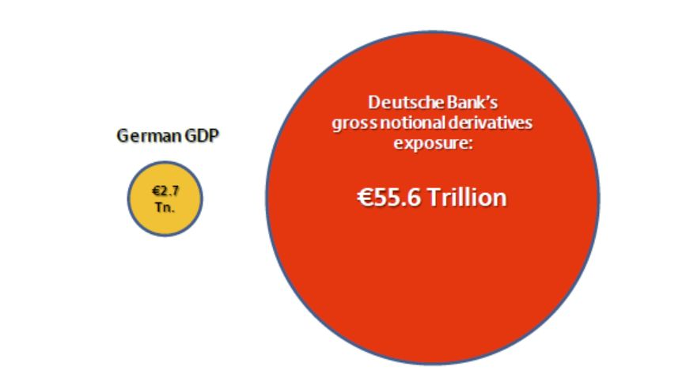
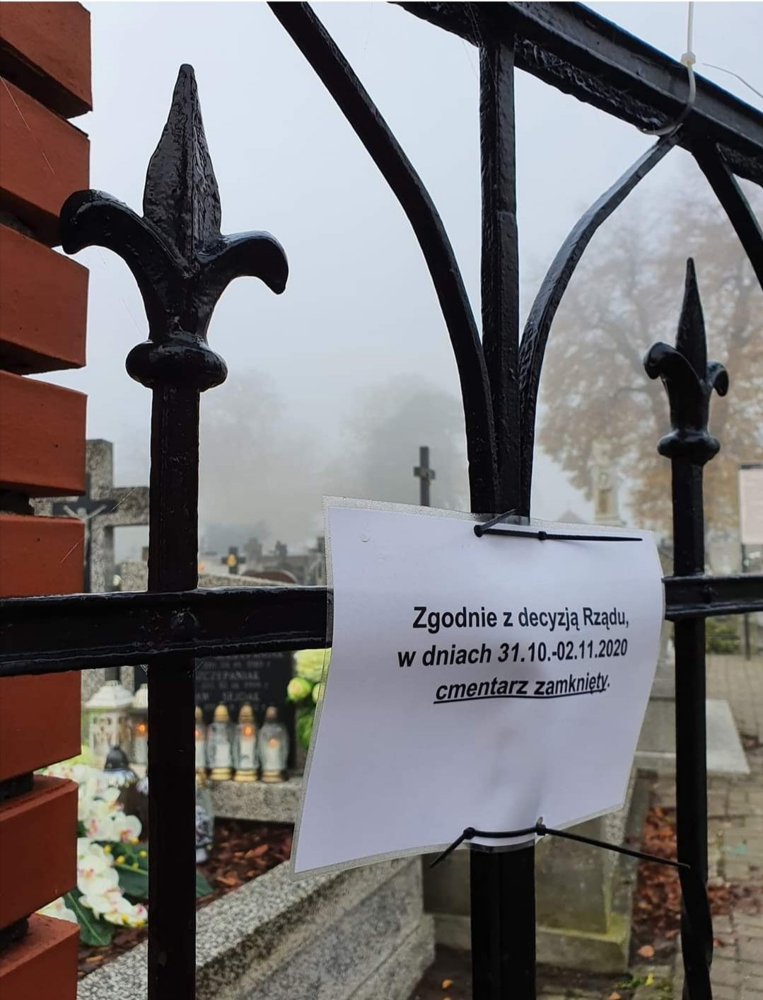
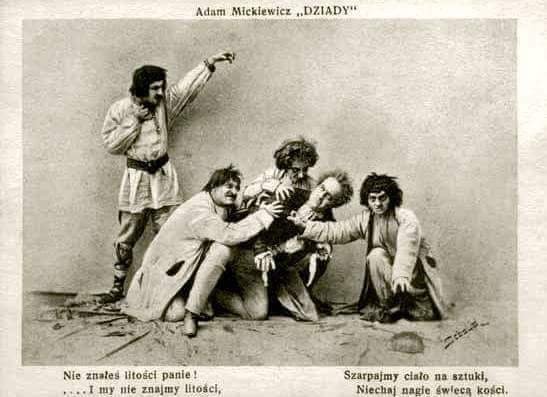

### 2022

---

> Wiceprezes NBP: inflacja zacznie silnie spadać od marca

---

$1.2 quadrillion is the "notional value" of the worldwide derivatives market. To put that in perspective, the world’s annual gross domestic product is between $50 trillion and $60 trillion.

How the hoax works:
You have an bond for $100. Even though you think the bond is good, you still want to buy insurance on it. The CDS desk guy says sure I’ll insure your bond for $2/year. Both happy. If the bond issuer defaults, you get your 100 bucks back.

Then your friend finds out about your $2 insurance and goes to the CDS desk guy and says, I want to take out $2 insurance on Simon’s bond. The CDS desk guy says, sure. Both happy.

A dentist finds out your friend bought $2/yr insurance on some Simon guy’s bond, and he goes to the CDS desk guy, who says “No Prob! Insured!” (But now the CDS guy is on the hook for $300 if the bond goes south.)

Pretty soon 100 people, whom you have no clue about, have taken out $2/yr insurance on your $100 bond, and the CDS desk guy is on the hook for $10,000 if the bond defaults.

But he’s also making $200/yr on insurance from these 100 people.
So the CDS desk guy hedges his exposure by going out and getting insurance on his $10,000 exposure. He gets it for a $200/year. Now he’s making $180 gravy.

But wait there is more:
(1) There is no requirement to reveal the name of the people paying insurance on your bond through a public regulated exchange.
(2) You have no idea how many other people have a claim against your bond.
(3) You have no way of knowing if the CDS desk man has hedged his bets so that he CAN ACTUALLY pay you back.

This is the land of "funny money" and OTC derivative contracts..

For context:
1,000,000,000 Billion
1,000,000,000,000 Trillion
1,000,000,000,000,000 Quadrillion
Assuming 7 billion people, it’s $171,428 for every man, woman & child on the planet..

If you earn $50,000 per year,
it would take you 20 years to earn a million dollars.
It would take you 20,000 years to earn a billion dollars.
It would take you 20 million years to earn a trillion dollars.

Lastly:
Take the notorious Deutsche Bank (DB) that has outstanding derivatives of €55 trillion against total equity of €62 billion. Thus the derivatives position is 1200X the equity. Or to put it in a different way, the equity is 0.09% of the outstanding derivatives. So a loss of 0.1% on the derivatives will wipe the share capital and the bank out!

Derivatives can only be netted down on the basis that counterparties pay up. But in a real systemic crisis, counterparties will disappear and gross exposure will remain gross. Just ask Lehman, if they has survived, after the last CDS round in 2007, like DB today still peddling the same pass the parcel game...

  

### 2021

Covidowy PEPP wygasa w marcu 22. PEPP był fajny. PEPP na wiele pozwalał. Pozwalał kupować Europejskiemu Bankowi Centralnego dług rządowy krajów strefy euro poza limitem ograniczającym zakupy do 1/3 emisji. Pozwalał też kupować obligacje o ratingu nieinwestycyjnym, co było istotne np. dla Greków.
Będzie teraz w EBC mała bitwa o to, co zrobić z normalnymi, sięgającymi 20 mld euro miesięcznie, znacznie już mniej elastycznymi niż PEPP, zakupami aktywów.
Będzie też bitwa o to, czy zwiększyć ponad dzisiejszy 10% limit zakupy długu ponadnarodowego. EBC na rynku w czasie, gdy KE będzie intensywnie emitować 800 mld euro w ramach programu NG EU, może oznaczać niższe koszty finansowania programu odbudowy. Ale oznaczać będzie też kolejne wydłużenie bilansu EBC. I to w czasie, kiedy Fed zacznie swój bilans skracać.
Masywna i aktywna obecność instytucjonalna banku centralnego na rynku długu jest jednym z najbardziej kontrowersyjnych elementów post-kryzysowej globalnej gospodarki. Ta obecność zniekształca funkcjonowanie rynku finansowego i wycenę aktywów. Wpływa istotnie na percepcję ryzyka inwestycyjnego. Powoduje olbrzymie problemy, kiedy pod wpływem rosnących oczekiwań inflacyjnych rynkowe stopy rosną, a te nominalne banki centralne trzymają blisko zera. Co ciekawe, programy QE nie wpływają natomiast zauważalnie - jak dotąd- na samą inflację.

Jeśli EBC przedłuży aż po rok 23, a być może zwiększy nawet i uelastyczni program skupu aktywów, to polaryzacja kierunków polityk monetarnych między Stanami i strefą euro zaznaczy się jeszcze silniej niż dziś. Z korzyścią dla USA, jaką na długą metę dają zawsze rynkowe relacje między podmiotami gospodarczymi.

---

Jesteśmy na początku drogi do budowy metawersum, to jest projekt na 5-15 lat; to ma być internet, w którym będziemy, a nie na który patrzymy - mówi PAP Angelika Gifford, wiceprezes Meta (d. Facebooka) na Europę Środkową.

---

### 2020

  

---

Kryzys to transfer z tych którzy żyją na kredyt na tych którzy mają kapitał.

  

---

  

---

Firma Lajkonik zapobiegawczo wycofuje z polskiego rynku kilka produktów, które w składzie zawierają sezam. Jak czytamy na stronie Głównego Inspektora Sanitarnego, chodzi o Paluszki z sezamem 150g z datami minimalnej trwałości 12.04.2021 oraz 26.04.2021
Koktajlowy Mix 230g z datami minimalnej trwałości 19.04.2021, 20.04.2021, 21.04.2021 oraz 17.05.2021
Wypiekarnia Bajgle z ziołami prowansalskimi 70 g z datami minimalnej trwałości 25.04.2021, 26.04.2021 oraz 10.05.2021
Wypiekarnia Paluchy Oryginalne 70 g z z datami minimalnej trwałości 26.03.2021 i 10.04.2021
Producent poinformował, że ziarna sezamu zawarte w produktach opisanych w tabeli mogą zawierać pozostałości tlenku etylenu, środka ochrony roślin. Jest on sklasyfikowany jako szkodliwy dla zdrowia, a jego stosowanie i wprowadzanie na rynek w Unii Europejskiej jest niedozwolone.

---

### 2001

https://en.wikipedia.org/wiki/William_Binney_(intelligence_official)

https://pl.wikipedia.org/wiki/Romulus_Augustulus

### 1985

Wytwórnia Sprzętu Komunikacyjnego w Świdniku wyprodukowała ostatni motocykl WSK. Motocykl produkowano od roku 1955.
Ostatnim typem tego motocyklu był model Kos. Świdnicka fabryka wyprodukowała dwa miliony Wuesek.

  

### 1982

W Lubinie, w czasie demonstracji upamiętniającej drugą rocznicę Porozumień Sierpniowych oddziały Milicji Obywatelskiej i ZOMO dopuściły się zbrodni na trzech uczestnikach tego wydarzenia. Od kul zginęli: Michał Adamowicz, Andrzej Trajkowski i Mieczysław Poźniak.
Wspomina jeden z uczestników:
"Popłoch się zrobił niesamowity, ale nie od razu, bo nikt się nie spodziewał, że to są ostre naboje. Dopiero jak kilku rannych padło, ludzie zaczęli uciekać (…) Jak oni zobaczyli, że ludzie uciekają (…), to wsiedli do nysek, chyba z pięciu. I ruszyli w pościg za ludźmi. Na łąkach pod samotną brzozą postrzelili od tyłu chłopaka, tego młodszego z oficjalnej listy."

  

### 1942

Decyzją szefa IV Departamentu Głównego Urzędu Bezpieczeństwa Rzeszy Heinricha Mullera ukazała się dyrektywa o  „ewakuowaniu Polaków w dystrykcie Lublin (Zamość) dla zrobienia miejsca w celu osiedlenia Volksdeutschów”.
Konieczność tego posunięcia propaganda niemiecka tłumaczyła istnieniem w tym regionie dużej ilości krwi niemieckiej”.
Na zdjęciu przesiedlanie ludności powiatu biłgorajskiego.

  

### 1940

Dobiegła końca trwająca od 10 lipca Bitwa o Wielką Brytanię. Bitwa o Wielką Brytanię to całość zwycięskich walk lotnictwa brytyjskiego Royal Air Force i alianckiego oraz innych sił zbrojnych i paramilitarnych przeciwko powietrznej ofensywie niemieckiego lotnictwa Luftwaffe skierowanej na Wyspy Brytyjskie.
W Bitwie o Wielką Brytanię najpierw w składzie, a potem u boku RAF, walczyły 4 polskie dywizjony: 2 bombowe (300 i 301), 2 myśliwskie (302 i 303) oraz 81 polskich pilotów w dywizjonach brytyjskich, w sumie 144 polskich pilotów (poległo 28).
Polacy zestrzelili około 170 samolotów niemieckich, uszkodzili 36, co stanowiło około 11, 7 % ogółu strat niemieckich.
Dywizjon 303 był najlepszą jednostką lotniczą, biorącą udział w bitwie o Anglię – zgłosił zestrzelenie 126 maszyn Luftwaffe.
Na fotografii król Wielkiej Brytanii Jerzy VI Windsor i generał Władysław Sikorski z wizytą u lotników polskich.

  

### 1901

W Teatrze Miejskim w Krakowie odbyła się prapremiera dramatu ,,Dziady'' Adama Mickiewicza.
Spektakl wyreżyserował Stanisław Wyspiański.
Na zdjęciu scena z Dziadów w inscenizacji Stanisława Wyspiańskiego.

  

### 1885

https://pl.wikipedia.org/wiki/Karol_Radek

---

<a href="https://github.com/TomaszWaszczyk/historia.waszczyk.com/edit/master/src/content/october-31.md" target="_blank">Edytuj tę stronę dzieląc się własnymi notatkami!</a>
