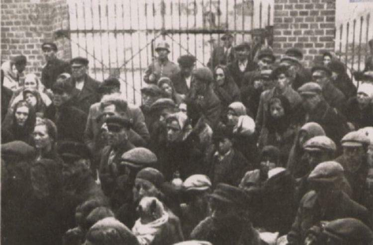
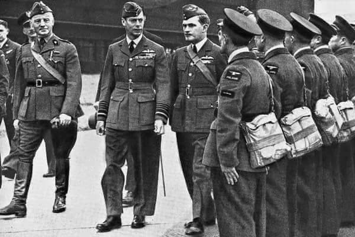

### 2001

https://en.wikipedia.org/wiki/William_Binney_(intelligence_official)

https://pl.wikipedia.org/wiki/Romulus_Augustulus

### 1985

Wytwórnia Sprzętu Komunikacyjnego w Świdniku wyprodukowała ostatni motocykl WSK. Motocykl produkowano od roku 1955.
Ostatnim typem tego motocyklu był model Kos. Świdnicka fabryka wyprodukowała dwa miliony Wuesek.

  

### 1942

Decyzją szefa IV Departamentu Głównego Urzędu Bezpieczeństwa Rzeszy Heinricha Mullera ukazała się dyrektywa o  „ewakuowaniu Polaków w dystrykcie Lublin (Zamość) dla zrobienia miejsca w celu osiedlenia Volksdeutschów”.
Konieczność tego posunięcia propaganda niemiecka tłumaczyła istnieniem w tym regionie dużej ilości krwi niemieckiej”.
Na zdjęciu przesiedlanie ludności powiatu biłgorajskiego.

  

### 1940

Dobiegła końca trwająca od 10 lipca Bitwa o Wielką Brytanię. Bitwa o Wielką Brytanię to całość zwycięskich walk lotnictwa brytyjskiego Royal Air Force i alianckiego oraz innych sił zbrojnych i paramilitarnych przeciwko powietrznej ofensywie niemieckiego lotnictwa Luftwaffe skierowanej na Wyspy Brytyjskie.
W Bitwie o Wielką Brytanię najpierw w składzie, a potem u boku RAF, walczyły 4 polskie dywizjony: 2 bombowe (300 i 301), 2 myśliwskie (302 i 303) oraz 81 polskich pilotów w dywizjonach brytyjskich, w sumie 144 polskich pilotów (poległo 28).
Polacy zestrzelili około 170 samolotów niemieckich, uszkodzili 36, co stanowiło około 11, 7 % ogółu strat niemieckich.
Dywizjon 303 był najlepszą jednostką lotniczą, biorącą udział w bitwie o Anglię – zgłosił zestrzelenie 126 maszyn Luftwaffe.
Na fotografii król Wielkiej Brytanii Jerzy VI Windsor i generał Władysław Sikorski z wizytą u lotników polskich.

  

### 1901

W Teatrze Miejskim w Krakowie odbyła się prapremiera dramatu ,,Dziady'' Adama Mickiewicza.
Spektakl wyreżyserował Stanisław Wyspiański.
Na zdjęciu scena z Dziadów w inscenizacji Stanisława Wyspiańskiego.

  

---

<a href="https://github.com/TomaszWaszczyk/historia.waszczyk.com/edit/master/src/content/october-31.md" target="_blank">Edytuj tę stronę dzieląc się własnymi notatkami!</a>
