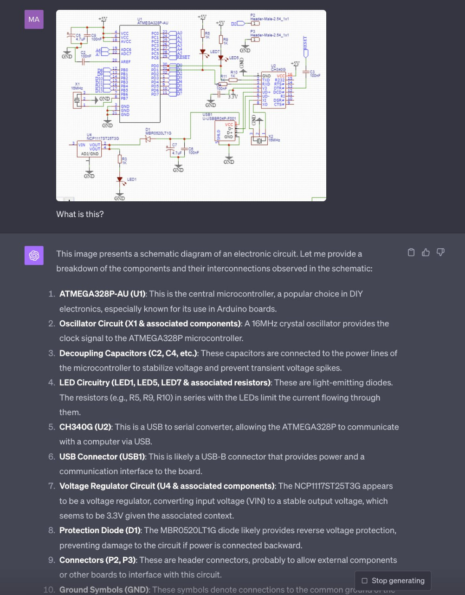
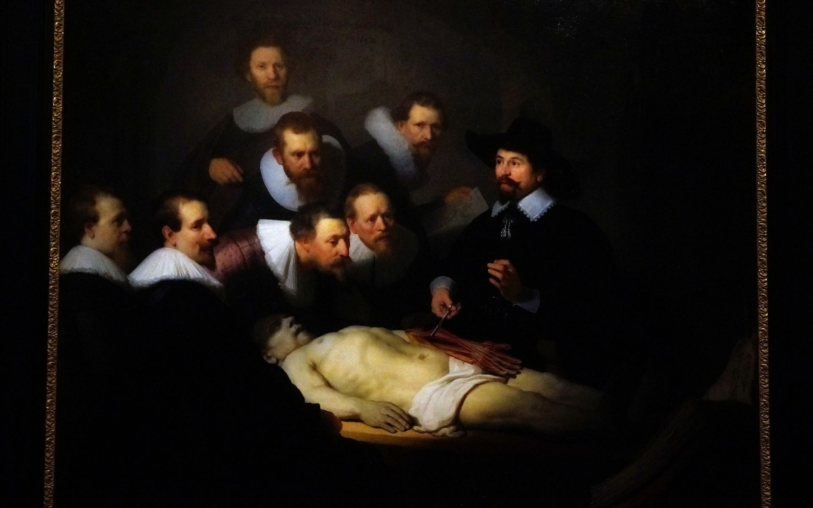
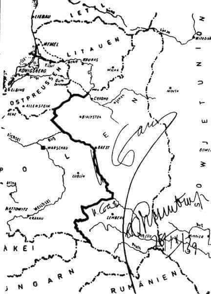
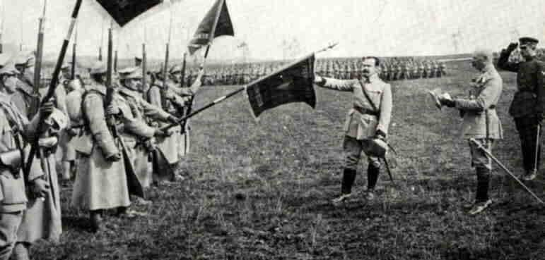
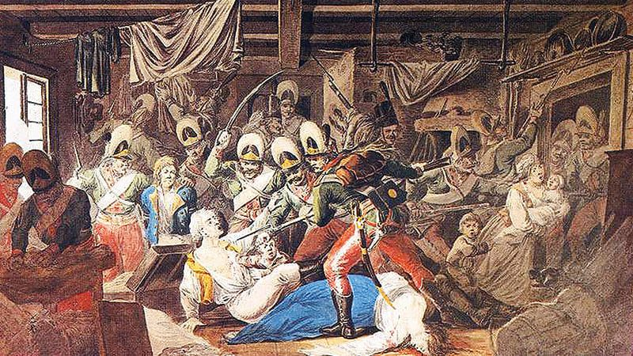

### 2023

<a href="./documents/october/DEPUTY-SECRETARY-OF-DEFENSE-MEMO-POTENTIAL-FOR-LAPSE-IN-FUNDING.PDF" target="_blank">DEPUTY-SECRETARY-OF-DEFENSE-MEMO-POTENTIAL-FOR-LAPSE-IN-FUNDING</a>

---

> ..next seismic shift..

  

GPT4

---

### 2022

  

### 2019

Mija 350 lat od śmierci Rembrandta – jednego z największych mistrzów malarstwa, rysunku i grafiki XVII wieku. Muzeum Śląskie w Katowicach włącza się w międzynarodowe obchody Roku Rembrandta poprzez prezentację dwóch rycin, które znajdują się w kolekcji grafiki obcej: Ucieczki do Egiptu (1654) oraz Świętych Piotra i Jana uzdrawiającego kalekę (1659). Prezentacji rycin będzie towarzyszył wykład dr. Seweryna Kutra poświęcony twórczości graficznej holenderskiego mistrza, w trakcie którego poznamy znaczenie i przesłanie prezentowanych na rycinach scen.

  

### 1939

Utworzono radziecko- niemiecką centralną komisję graniczną dla wyznaczenia granic między państwowymi interesami ZSRR i Niemiec (10 października w Moskwie rozpoczęła prace). Wojska Pograniczne NKWD otrzymały rozkaz wzięcia pod ochronę granicy państwowej (linii demarkacyjnej) 8 października 1939 roku.

  

---

Elżbieta Zahorska która została rozstrzelana w pierwszej oficjalnej egzekucji w Warszawie 4 listopada 1939 r. za zerwanie plakatu propagandowego „Anglio! Twoje dzieło”.

  

Na zdjęciu w chwili schwytania przez Niemców. Miała 24 lata.

---

### 1918

Generał Józef Haller (zdjęcie) objął dowództwo nad Armią Polską we Francji tzw "Błękitną Armią". Zastąpił tym samym na tym stanowisku francuskiego generała Louisa Arnicharda.
Na zdjęciu Józef Haller przysięga na sztandar Armii

  

### 1794

Rosyjscy żołnierze gen. Aleksandra Suworowa dokonali rzezi mieszkańców warszawskiej Pragi. Liczba zamordowanych jest trudna do ustalenia, szacuje się, że zgineło od 13 do 20 tys. mieszkańców miasta. Mordowano kobiety i dzieci, w klasztorze Bernardynek zgwałcono i zamordowano niemal wszystkie zakonnice. W klasztorze Bernardynów zabito 19 zakonników i wszystkich kalekich starców przebywającyh w tamtejszym przytułku.

"Do samej Wisły na każdym kroku spotkać się dawali zabici i umierający różnego stanu ludzie; na brzegu rzeki piętrzyły się stosy żołnierzy, cywilnych, Żydów, księży, zakonników, kobiet i dzieci. Na widok tego wszystkiego serce zamierało w człowieku, a obmierzłość obrazu duszę jego oburzała. W czasie bitwy człowiek nie tylko nie czuje w sobie żadnej litości, ale rozzwierzęca się jeszcze, lecz morderstwa po bitwie, to hańba".- Relacja jednego z rosyjskich dowódców gen. Lwa Nikołajewicza Engelharda.
„Widok Pragi był okropny, ludzie obojej płci, starcy i niemowlęta u piersi matek pomordowane leżały na kupie; krwią zbroczone i obnażone ciała żołnierzy, połamane wozy, pozabijane konie, psy, koty, nawet świnie. Tu i ówdzie drgały jeszcze członki umierających. Całe miasto Praga stało w płomieniach i w dymie, a dachy zawalały się z trzaskiem, któremu odpowiadało przeraźliwe wycie kozaków, klątwa rozjuszonego żołdactwa”. -Tak notował pruski kronikarz prowiantowy.
„Z najwyższym żalem informuję Waszą Lordowską Mość, że atakowi na linie obrony Pragi towarzyszyło najstraszliwsze i zupełnie niepotrzebne barbarzyństwo...” – raportował premierowi Wielkiej Brytanii jej warszawski ambasador, pułkownik Wiliam Gardiner

  

### 1605

https://pl.wikipedia.org/wiki/Spisek_prochowy

### 1582

Na terenie Rzeczypospolitej wprowadzony został w miejsce kalendarza juliańskiego kalendarz gregoriański. Za sprawą tej reformy ówcześni Polacy stali się nagle starsi 11 dni, ponieważ po 4 października nastąpił odrazu 15 października.

---

<a href="https://github.com/TomaszWaszczyk/historia.waszczyk.com/edit/master/src/content/october-4.md" target="_blank">Edytuj tę stronę dzieląc się własnymi notatkami!</a>
