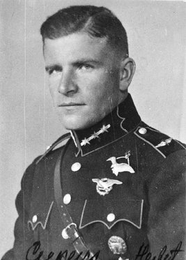
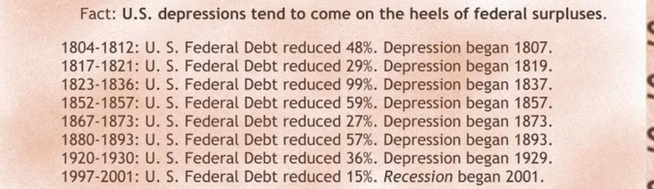
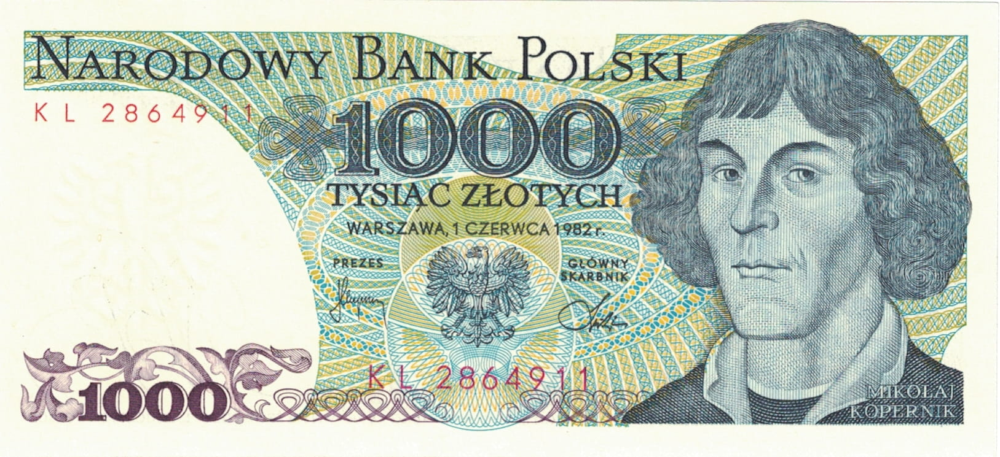
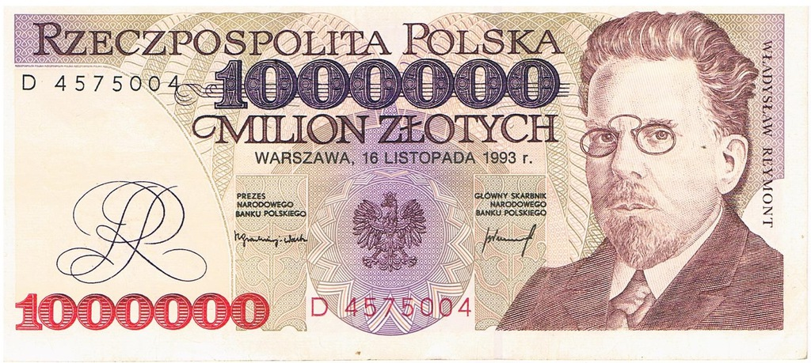
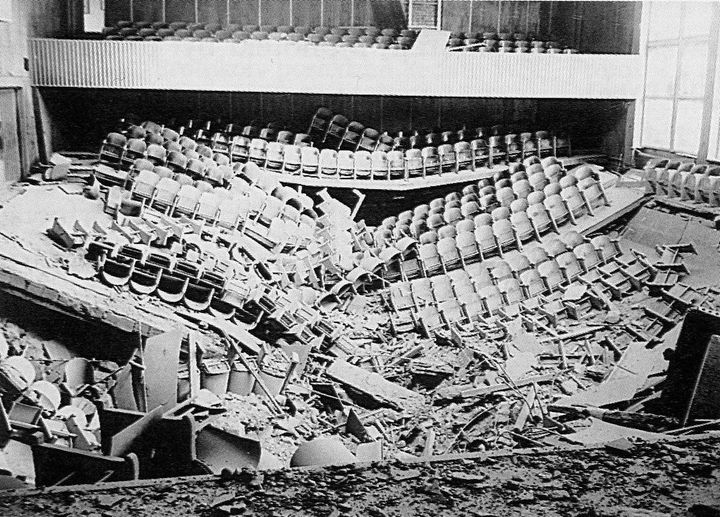
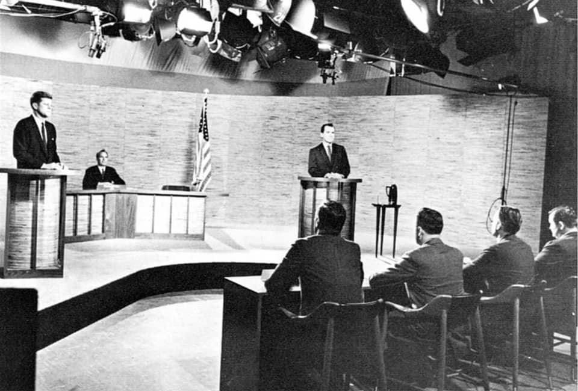
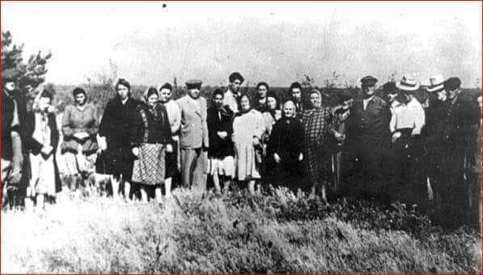
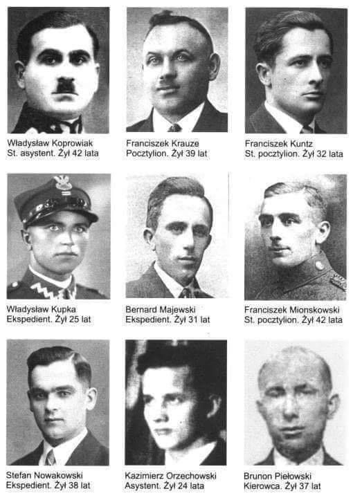
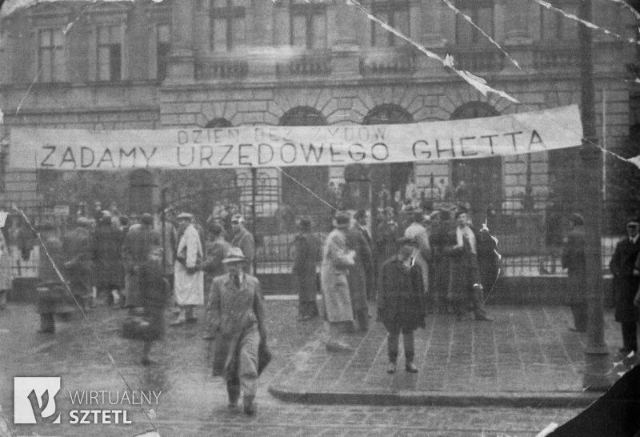
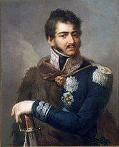

### 2023

There are thousands of cities and villages to choose from in Ukraine to write about as there is a saying Jewish grandparents who survived the Holocaust say that:

> Ukrainian soil is soaked in Jewish blood

<video width="640" height="480" controls>
<source src="./movies/october/ukraine.mp4" type="video/mp4">
Your browser does not support the video tag.
</video>

[Yahadinunum](http://www.yahadinunum.orgwww.yahadmap.org/#map/)

[Rtrfoundation](https://www.rtrfoundation.org/kiev-1.shtml)

[Shoah Atrocities Map - Ukraine (SAMU)](https://map4us.com/MapViewer/1587565299837)

In light of recent events, a lot of people have asked me why Mossad is not hunting down Nazis anymore. The truth is that Mossad went after 10 top Nazis and only managed to capture one, kill another, and injure a third one.

There was one Nazi Mossad could not just let go of, and the only one liquidated by Israel . It was Herberts Cukurs, aka "The Butcher of Riga." The level of cruelty he showed to the Jews of Latvia was so Sadistic and cruel; he had to die! He was bludgeoned to death in 1965 in Montevideo, Uruguay. Mossad Agents wrote **"Jewish Revenge"** in English and stabbed the note with a dagger to his chest.

<br><br>

PS. The Butcher of Wola (Warsaw) „after war became the mayor of the town of Westerland, on the isle of Sylt, and member of the Schleswig-Holstein Landtag. Polish demands for extradition were never accepted, and Reinefarth was never convicted of any war crime”

PSS. Ante Pavelic leader of Ustashas who killed hundreds of thousands of Serbs and tens of thousands of Jews and Romas in Croatia in WWII, died in 1959 2yrs after Serb, Blagoje Jovović tried to assassinate him in Argentina.

<a href="./documents/october/shoah.pdf" target="_blank">Shoah</a>

---

```
**Ask the Rabbi: Is revenge a Jewish value? The Talmud greatly praises those who are unjustly insulted or reproached but remain silent and suppress the temptation for revenge.**


The horrific slaying this past summer of east Jerusalem teenager Muhammad Abu Khdeir, following the terrible murders of yeshiva students Naftali Fraenkel, Gil-Ad Shaer and Eyal Yifrah, and the subsequent killing of their terrorist murderers, raised larger questions regarding revenge within Jewish thought.
Ostensibly, one might claim that the Bible clearly shuns vengeance through its direct prohibition against taking revenge (nekama): “You shall not take revenge or bear a grudge – love your neighbor as you love yourself” (Leviticus 19:18).

The Sages applied the prohibition to situations where people refuse to offer basic financial courtesy (e.g. lending a tool) to another person, because the latter had previously refused the same courtesy to them. Medieval scholars debated whether this prohibition of retaliation would also apply in cases where someone had verbally insulted them; they also discussed whether we can demand that people feel no sense of vengeance, even at the time of insult.
Significantly, the Sages did allow such forms of vengeance if it served some greater educational purpose, and was done with purity of heart – undoubtedly a difficult threshold to meet. Moreover, this prohibition does not prevent a person from seeking reparations, such as tort damages.
Be that as it may, the Talmud greatly praises those who are unjustly insulted or reproached but remain silent and suppress the temptation for revenge. Subsequently, many pietistic texts preach the importance of shunning vengeful feelings while offering tips to avoid these natural inclinations.

Yet careful readers of the Bible will note there are a plethora of verses that seem to celebrate the prospect of revenge. Regarding the future punishment to the nation of Edom, Isaiah proclaims, “The Lord has a sword, it is sated with blood… for it is the Lord’s day of retribution” (34:6-8). In Deuteronomy, we similarly find, “O nations, acclaim His people! For He’ll avenge the blood of His servants, wreak vengeance on his foes…” (32:43).

Most prominently, the Psalmist prays, “God of retribution, Lord, God of retribution – appear!” (94:1). Within biblical narratives, God enjoins Israel to partake in His vengeance against the Midianites (Numbers 31:2), with the midrash further elaborating that their participation was appropriate because the Jewish people had suffered at their hands for being God’s chosen people.
As Rabbi Shlomo Ephraim Luntschitz (d. 1619) noted, it seems clear that the prohibition against revenge only applies to our brethren but not to hated enemies.
This vengeful sentiment is further expressed in Jewish law and liturgy. In the Avinu Malkeinu prayer, Jews beseech God to “avenge before our eyes the spilt blood of Your servants.” Jews killed by gentile enemies are customarily buried in their bloody clothing, scholars explain, in order to arouse God’s wrath toward revenge.
As Rabbi Yaakov Ariel has passionately argued, the Bible apparently understands God’s vengeance as the ultimate manifestation of justice in this world. “The righteous man will rejoice when he sees revenge… There is, then, a reward for the righteous; there is, indeed, divine justice on earth” (Psalms 58:11-12). The promise of and prayer for His vengeance, therefore, reflects the belief that evildoers will ultimately be punished for their sins, and the enemies of the Jewish people will suffer for their centuries of vicious hatred.
Divine vengeance should thus not be confused with the rash, impulsive nature of human wrath which can be rooted in raw emotions, not rational judgment. When executed thoughtfully and properly, however, even human retribution can be a form of justice. As such, the Bible demands vengeance for one of society’s potentially ignored members, the Jewish servant, who has been struck dead by his owner (Exodus 21:20). Willy-nilly, the emotional call for vengeance is what sometimes propels the enactment of justice in this world.

The ambivalence toward human vengeance was well-reflected in a talmudic embellishment of a central scene in the Purim story. According to the Talmud, Mordecai kicked Haman while using him as a ladder to climb onto his parade horse. Haman challenged this triumphalism by citing the biblical aphorism, “Do not rejoice when your enemy falls” (Proverbs 24:17). Yet Mordecai responded, “That only applies to Jews, but with regard to your people, the Torah states, ‘And you shall tread on their high places.’” Many commentators noted that such joyful triumphalism is allowed only with the downfall of evil and national enemies, yet not in cases of personal rivalries or matters of lesser importance.
The danger of human vengeance was clearly manifested in the murder of Abu Khdeir, who had absolutely no connection with the death of the three Jewish youths and was tortured simply because he was an Arab. Such brutality has nothing to do with the biblical notion of vengeance, and must be shunned and condemned by God-fearing seekers of peace and justice.

In contrast, the calculated elimination of the two terrorists by the Israeli army, following the responsible decision of the political echelon, was much more in keeping with biblical notions of vengeance and justice. As the Bible states, “When evildoers are destroyed, there is joy” (Proverbs 11:10).

In our imperfect world, humans must join the divine mission of rooting out evil and bringing justice to the world. But we must remain watchful that our actions stem from calculated judgments of justice, and are not rash expressions of pain and anger.
Striking the proper balance is a difficult task, yet will ultimately make our country a holy nation. 
The writer directs the Tikvah Overseas Seminars, teaches at Yeshivat Hakotel and is a junior research fellow at the Israel Democracy Institute. He recently published A Guide to the Complex: Contemporary Halakhic Debates (Maggid Books), an anthology of his “Ask the Rabbi” columns.
```

---

<br><br>

---

### 2022

<a href="./documents/october/Joanna_Tyrowicz_komentarz.pdf" target="_blank">Joanna Tyrowicz NBP</a>

### 2021

> jeśli powierzone mi będzie pełnienie zaszczytnej funkcji Prezesa NBP na kolejną kadencję, będę proponował wprowadzenie do obiegu banknotu o nominale tysiąca złotych.
> To będzie pierwszy wśród obecnych w powszechnym obiegu banknot z wizerunkiem kobiety. Będę proponował św. Jadwigę Andegaweńską.
Prof. Adam Glapiński, Prezes NBP, „Polska Times w wywiadzie ze Zbigniewem Biskupskim (Strefa Biznesu, 5–6.10.2021)

<br><br>

<br><br>

<br><br>

### 2020

Gazeta Wyborcza

✅ sukces zawdzięcza związkowi i logo Solidarności

✅założyciele uwłaszczyli się na majątku publicznym

✅założyciele rozdali sobie akcje i zostali milionerami

✅ założyciele i zarząd wywalili połowę pracowników na śmieciówki

✅ zwalnia szefa Solidarności za ostrzeżenie przed zwolnieniami 🤷‍♂️

To jest historia polskiej transformacji w pigułce. Ta choroba neoliberalizmu promowana przez Wyborczą od 1989 roku jest po prostu ideologią władzy, która opiera się na niszczeniu związków zawodowych, prywatyzowaniu tego co wspólne i wykorzystywaniu pracowników. Wyborcza stworzyła dzisiejszą Polskę a teraz staje już zwykłą karykaturą. Trzymam kciuki za związki zawodowe w firmie, które powinny rozpocząć strajk i odebrać to co swoje. Liczę na elementarną solidarność pracowników tej koszmarnej korporacji.

---

Znacjonalizowany bank Pekao zaczyna osuwać się w niebezpieczną dla siebie śmieszność. Do wielu tradycyjnych już opłat dosłownie od wszystkiego dorzucił swoim klientom biznesowym teraz haracze za wysłane do nich kody autoryzacyjne SMS (20 gr. od sztuki), oraz za przelew wewnątrzbankowy z jednego rachunku na inny (1.40 PLN).
Wiem doskonale: banki są przez rząd, NBP i KNF prześladowane. Również te znacjonalizowane. Stąd Pekao nie ma też skrupułów wobec swoich klientów. Kto dla paru złotych podejmie upierdliwy trud zmiany banku, prawda?
Ale buractwo, to to jednak jest. I brak klasy. Bez dwóch zdań.

PEKAO S.A.

---

### 2018

Bank Anglii ODMAWIA wydania Wenezueli 14 ton złota.

### 2001

Na Florydzie zmarł fotoedytor tabloidu „Sun”, pierwsza z 5 śmiertelnych ofiar zarażonych bakteriami wąglika, rozsyłanych drogą pocztową do instytucji publicznych po zamachach z 11 września 2001 roku.

### 1971

Niecały rok po masakrze na Wybrzeżu, w nocy z 5 na 6 października 1971 roku - wyleciała w powietrze aula Wyższej Szkoły Pedagogicznej w Opolu. Zamachu dokonali bracia Kowalczykowie, pracownicy uczelni.
Nazajutrz miała się w niej odbyć uroczystości nagradzania milicjantów z okazji ich święta. Miano odznaczać funkcjonariuszy milicji biorących udział w tłumieniu strajków na Wybrzeżu w grudniu 1970 r. Świętować miał m.in. podpułkownik Julian Urantówka, komendant wojewódzki MO w Opolu. W czasie grudniowej rewolty pełniąc obowiązki komendanta wojewódzkiego MO w Szczecinie wydawał rozkazy strzelania do strajkujących robotników.
Bezpośrednim sprawcą wybuchu był młodszy z braci Kowalczyków, Jerzy (ur. 1943), tokarz zatrudniony na uczelni. W konstruowaniu bomby pomagał mu jego starszy brat, Ryszard (ur. 1937) dr fizyki, pracownik naukowy.
Eksplozja zdewastowała aulę Wyższej Szkoły Pedagogicznej, ale nikt nie odniósł obrażeń. Jerzy Kowalczyk – wbrew późniejszym oskarżeniom prokuratorów – dokładnie sprawdził, czy w godzinie detonacji w auli oraz jej pobliżu znajdowały się jakiekolwiek osoby.
Sprawie wyjaśnienia okoliczności wysadzenia auli władze peerelowskie nadały najwyższy priorytet. Przesłuchano niemal 600 osób. Bracia szybko stali się głównymi podejrzanymi w śledztwie. W ich mieszkaniu zainstalowano podsłuchy.
Pod koniec lutego 1972 r. Kowalczykom postawiono zarzuty o udział w wysadzeniu auli WSP oraz planowanie kolejnych zamachów. 29 lutego Jerzy i Ryszard Kowalczykowie zostali aresztowani, a 8 września 1972 r. Jerzy został skazany na karę śmierci, a Ryszard – na 25 lat pozbawienia wolności.
Tak drakońskie wyroki wywołały protesty w Polsce i na świecie. Petycję w obronie braci podpisało w Polsce sześć tysięcy osób – w tym znani twórcy i ludzie Kościoła. W efekcie Rada Państwa zamieniła Jerzemu Kowalczykowi karę śmierci na 25 lat więzienia. Niezależna opinia publiczna i rodząca się opozycja co jakiś czas ponawiała apele o uwolnienie Kowalczyków. Warunkowo wyszli na wolność w pierwszej połowie lat 80. – najpierw Ryszard, a później Jerzy. Ze zmarnowanym zdrowiem i brakiem nadziei na przyszłość.
W 2010 roku obok Pomnika Poległych Stoczniowców w Gdańsku umieszczona została tablica upamiętniająca protest Kowalczyków. Uniwersytet w Opolu na podobną tablicę nie wyraził zgody.

<br><br>

### 1960

Waszyngton, debata telewizyjna kandydatów na prezydenta USA – Johna F. Kennedy’ego i Richarda Nixona. Kennedy, zwłaszcza w pierwszej debacie, ma dużą przewagę – jest młodszy, przystojniejszy i świetnie przygotowany merytorycznie. Zagrożeniem jest jego choroba Addisona, mogąca skutkować drgawkami w przypadku zbyt niskiej temperatury. Tuż przed wejściem na wizję sztabowcy Partii Demokratycznej podkręcają więc w tajemnicy termostat, co dodatkowo uderza w Nixona, mającego z kolei tendencję do nadmiernego pocenia się. Ponieważ urzędujący republikański wiceprezydent zrezygnował z makijażu, podczas zbliżeń kamery sto milionów Amerykanów obserwuje kropelki potu na jego twarzy. W zgodnej opinii komentatorów to telewizyjne debaty przesądzą o minimalnym zwycięstwie Kennedy’ego: 49,72% do 49,55% (różnica 112 tysięcy głosów), co przełoży się na różnicę 303 do 219 w Kolegium Elektorów. Nixon wyciągnie wnioski z niespodziewanej porażki – podczas swoich dwóch zwycięskich kampanii prezydenckich (w 1968 i 1972 roku) odmówi kontrkandydatowi demokratów dyskusji przed kamerą.

<br><br>

### 1957

<br><br>

### 1942

Hermann Friedrich Graebe, niemiecki inżynier budowlany opowiada o eksterminacji Żydów w Dubnie na Wołyniu, 5 października 1942 r.

„ Gdy 5 października 1942 roku przybyłem do biura budowy w Dubnie mój majster Hubert Mönnikes, [...] opowiedział mi, że w pobliżu budowy w trzech wielkich rowach, z których każdy miał długość 30 metrów i był głęboki na 3 metry, rozstrzeliwano Żydów z Dubna. Dziennie uśmiercano 1500 osób. Wszyscy żyjący jeszcze do czasów akcji w Dubnie Żydzi w liczbie około 5000 osób mieli być zlikwidowani.
W towarzystwie Mönnikesa pojechałem na budowę i w jej pobliżu ujrzałem wielkie nasypy. Każdy miał długość około 30 metrów i wysokość mniej więcej dwóch metrów. Przed nasypami stało kilka ciężarówek. Ludzie z tych ciężarówek byli poganiani przez uzbrojonych policjantów ukraińskich pod nadzorem esesmana. Policjanci na ciężarówkach stanowili straż i jeździli od rowu do rowu. Wszystkie ofiary nosiły na ubraniach z przodu i z tyłu żółtą oznakę żydowską.
Mönnikes i ja podeszliśmy do samych rowów. Nikt nam w tym nie przeszkadzał. W pewnym momencie usłyszałem oddawane w krótkich odstępach strzały karabinowe dochodzące zza jednego z tych nasypów. Ludzie, którzy schodzili z ciężarówek, mężczyźni, kobiety i dzieci w różnym wieku, musieli się rozbierać na rozkaz esesmana, który miał w ręku pejcz. W określonym miejscu kładli odzież posortowaną na buty, bieliznę i ubrania wierzchnie. Widziałem stos butów składający się z 800 do 1000 par, sterty bielizny i ubrań. Bez płaczu i krzyku ci rozebrani ludzie stali dookoła, trzymając się w grupach rodzinnych, całowali się na pożegnanie i czekali na znak innego esesmana, który stał nad brzegiem dołu, także trzymając pejcz. Podczas 15 minut, gdy stałem w pobliżu, nie słyszałem ani jednej skargi lub prośby o litość. Obserwowałem rodzinę złożoną z ośmiu chyba osób, kobietę i mężczyznę w wieku pięćdziesięciu lat, ich dzieci, mniej więcej jednoroczne, ośmio- i dziesięcioletnie oraz dwie dorosłe córki w wieku 20-24 lata. Stara kobieta o śnieżnobiałych włosach trzymała na ręku roczne dziecko, nucąc mu coś i zabawiając. Dziecko śmiało się zadowolone. Rodzice przypatrywali się tej scenie ze łzami w oczach. Ojciec trzymał za rękę chłopca może dziesięcioletniego, i cicho coś do niego mówił. Chłopcu łzy cisnęły się do oczu. Ojciec wskazał ręką na niebo, pogładził go po głowie i wydawał się coś mu tłumaczyć. Nagle jeden z esesmanów stojących nad dołem krzyknął w stronę swego kolegi. Ten szybko odliczył dwadzieścia osób i kazał im się ustawić za wałem rozkopanej ziemi. Rodzina, o której wspomniałem, znajdowała się między nimi. Pamiętam doskonale smukłą, czarnowłosą dziewczynę, która, mijając mnie rzekła wskazując na siebie: «Mam dwadzieścia trzy lata.»
Obszedłem wówczas usypisko ziemi i stanąłem nad ogromnym grobem. Ludzie leżeli pokotem jeden przy drugim, poukładani warstwami, tak że widać było tylko ich głowy. Ramiona prawie wszystkich skąpane były we krwi broczącej z czaszek. Niektórzy z rozstrzelanych dawali jeszcze znaki życia. Kilku z nich wznosiło swe ramiona i ruszało głową na znak, że są żywi. Głęboki dół był już w dwóch trzecich zapełniony ciałami. Moim zdaniem znajdowało się w nim około tysiąca zwłok. Rozejrzałem się, aby zobaczyć tego, który rozstrzeliwał tych ludzi. Był to esesman. Siedział na krawędzi po wyższej stronie rowu ze spuszczonymi nogami. Na kolanach trzymał pistolet maszynowy i palił papierosa.
Rozebrani do naga ludzie schodzili kilka kroków w dół po stopniach wyżłobionych w gliniastej ścianie rowu i stąpając po głowach leżących tam ofiar, kierowali się ku miejscu które wskazał im esesman. Potem kładli się na ciałach zabitych i rannych. Niektórzy ściskali serdecznie żyjących i coś im szeptem mówili. Potem usłyszałem strzały. Spojrzałem w dół i zobaczyłem drgające jeszcze ciała i inne już nieruchome, leżące na zwłokach ludzi rozstrzelanych przed nimi.
Zbliżała się już następna grupa. Zeszli w dół do rowu, położyli się na ciałach dopiero co rozstrzelanych i też zostali zabici. Gdy wracając okrążyłem nasyp, ujrzałem nowy transport, który właśnie przybył. Tym razem były to osoby chore i słabowite. Nadzy ludzie rozbierali jakąś starą, przeraźliwie chudą kobietę, którą podtrzymywały inne osoby. Widocznie kobieta ta był sparaliżowana. Nadzy ludzie przenieśli ją poza nasyp. Odszedłem wraz z Mönnikkesem i wróciłem samochodem do Dubna."

Źródło: Joe J. Heydecker, Johannes Leeb, „Proces w Norymberdze”, Warszawa 2006, s. 379-380

Foto: Ocaleni z Holokaustu nad masowym grobem, Dubno, 1945 r.

<br><br>

### 1939

Niemcy rozstrzelali trzydziestu ośmiu żołnierzy polskich - Obrońców Poczty Polskiej w Gdańsku- wziętych do niewoli 1 września 1939 r. Rankiem, Obrońców Poczty Polskiej przewieziono na teren ówczesnej strzelnicy na Zaspie. Tam wszyscy zostali rozstrzelani przez niemiecki pluton egzekucyjny. Stało się tak na podstawie bezprawnego wyroku wydanego przez hitlerowski sąd wojenny - wyrok ten łamał postanowienia konwencji haskiej.
Ciała Obrońców Poczty Polskiej  odnaleziono dopiero 28 sierpnia 1991 roku. Bohaterska załoga Poczty Polskiej została  pośmiertnie odznaczona Krzyżami Virtuti Militari. W 1999 roku niemiecki wymiar sprawiedliwości uniewinnił Obrońców Poczty Polskiej, oraz przyznał ich rodzinom odszkodowania finansowe.

<br><br>

### 1937

UW wprowadziło getto ławkowe. Siedział w nim między innymi Leonid Hurwicz, jeden z noblistów związanych z UW. Dziś na rocznicy upamiętnienia tego wydarzenia zabraklo rektora uczelni.
Szkoda, gdyby przyszedł, toby się dowiedział, że getto ławkowe zostało wprowadzone decyzja rektora Włodzimierza Antoniewicza, który podobnie jak minister wyznań religijnych i oświecenia publicznego Wojciech Świętosławski, ugiął się pod naciskiem żądań skrajnej prawicy.
A to był dopiero początek — kilka miesięcy później, w lutym 1938 nadzwyczajne walne zebranie Zrzeszenia Asystentów Uniwersytetu Warszawskiego podjęło postanowienie niemianowania w przyszłości na stanowiska naukowe Żydów i osób pochodzenia żydowskiego oraz stopniowego zastępowania zatrudnionych na UW asystentów Żydów Polakami. Polscy i żydowscy studenci wyrażający sprzeciw (np. Irena Sendler) byli ofiarami przemocy.
Piszę o tym, bo obecne władze RP promują wizję historii, w której zagraniczni Żydzi mający złe wspomnienia z Polski są traktowani jak niewdzięcznicy.
Przypominam o tym, bo historia lubi się powtarzać, zwłaszcza gdy nie pamięta się o jej czarnych kartach.

<br><br>

### 1807

Powołano rząd Księstwa Warszawskiego w miejsce rozwiązanej Komisji Rządzącej. Prezesem Rady Ministrów został Stanisław Małachowski, a na czele ministerstwa wojny stanął ks. Józef Poniatowski (grafika).

<br><br>

---

<a href="https://github.com/TomaszWaszczyk/historia.waszczyk.com/edit/master/src/content/october-4.md" target="_blank">Edytuj tę stronę dzieląc się własnymi notatkami!</a>
