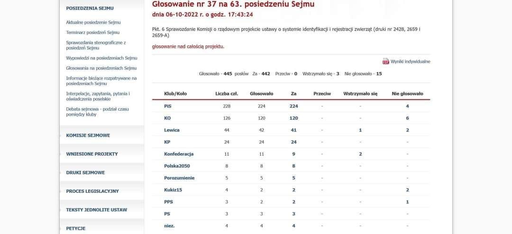

### 2023

<br><br>

```Sunset over river valley, 1887 by Albert Bierstadt```

---

<video width="640" height="480" controls>
<source src="./movies/october/BankructwoPolski2024.mp4" type="video/mp4">
Your browser does not support the video tag.
</video>

<video width="640" height="480" controls>
<source src="./movies/october/JakPolska-ma-splacic-miliardy-dlugu.mp4" type="video/mp4">
Your browser does not support the video tag.
</video>

<br><br>

<a href="./documents/october/Emisja_pieniądza_Alternatywne_systemy_monetarne.KPMG.pdf" target="_blank">Alternatywna emisja</a>

> wstęp do ultraliberalizmu

<a href="./documents/october/Raport-Ile-moge-zarabiac.pdf" target="_blank">Raport-Ile-moge-zarabiac.pdf</a>

<a href="./documents/october/Zalacznik-do-raportu-Ile-moge-zarabiac.pdf" target="_blank">Zalacznik-do-raportu-Ile-moge-zarabiac.pdf</a>

---

### 2022

> Każdy punkt procentowy inflacji daje ok. 4,7 mld zł wpływów do budżetu państwa – wynika z wypowiedzi wiceministra finansów Artura Sobonia.

---

<br><br>

---

### 2021

> JPMorgan Chase CEO Jamie Dimon: Bitcoin is a little bit of fool's gold

---

Stopa referencyjna NBP w górę, zmiana z 0,1% do 0,5%

---

<video width="640" height="480" controls>
<source src="./movies/october/neonowkachleb.mp4" type="video/mp4">
Your browser does not support the video tag.
</video>

### 1994

"History has shown that the peasant class in ancient days when they has revolted were easily crushed. There was no resistance but now had grown a super class of people in the United States, called the Middle class, who had long term employment, job security, who were well paid, and the Club of Rome Zero Growth paper said, this has got to stop, of the United States. The way we will do this, the way we will accomplish this is by crushing their industries."

Was former intelligence agent, John Coleman correct? He made this speech in 1994.

Is it money that gives people the courage to revolt against oppression? I would argue that while financial independence is somewhat important, not fearing death or imprisonment, gives you the courage to defend yourself and others.

Wealth in itself does not mean one is free. The difference between having an internal locus of control and external. One who is free within, no matter what their financial circumstances, will find a way to overcome 💪, especially in the face of great harm.

"Internal locus of control means that control comes from within. You have personal control over your own behavior. When you have an internal locus of control, you believe you have personal agency over your own life and actions."

<video width="640" height="480" controls>
<source src="./movies/october/john-colemann.mp4" type="video/mp4">
Your browser does not support the video tag.
</video>

### 1939

"Wiemy już, że Warszawa padła.
Mimo to bijemy się ofiarnie.
Myślimy o przebiciu się przez
wojska niemieckie i rosyjskie na
południe" - tak poeta i
dramatopisarz, dowódca jednej z
baterii artylerii konnej, Bronisław
Przyłuski (zdjęcie) mówił o ostatnich
godzinach bitwy pod Kockiem na
falach Radia Wolna Europa.
6 października 1939 roku skapitulowała walcząca z niemiecką 13 i 29 zmotoryzowaną dywizją Wermachtu Samodzielna Grupa Operacyjna "Polesie" generała Franciszka Kleeberga.

<br><br>

### 1937

Na Uniwersytecie Jagiellońskim rozpoczęły się liczne wykłady na wydziałach filozofii i medycyny. Niemal wszędzie studenci endeccy występowali przeciwko Żydom, domagając się od nich zajmowania miejsc w ostatnich ławkach po lewej stronie. Studenci żydowscy sprzeciwiali się temu kategorycznie, a nie chcąc wywołać incydentów słuchali wykładów na stojąco.
7 października 1937 roku z wizytą u najwyższych władz polskich zjawiła się delegacja żydowskich parlamentarzystów ...
(Nowy Dziennik 8.X.1937 r.)

<br><br>

https://pl.wikipedia.org/wiki/Getto_%C5%82awkowe

### 1862

Władze Królestwa Polskiego zapowiedziały przeprowadzenie branki, czyli poboru do wojska na zimę 1862/1863 r. Miała ona zostać przeprowadzona na podstawie imiennych list, w odróżnieniu od wcześniejszych, które odbywał się na drodze losowania. Celem władz było wzięcie do wojska carskiego polskiej młodzieży zaangażowanej w działalność patriotyczną.

<br><br>

---

<a href="https://github.com/TomaszWaszczyk/historia.waszczyk.com/edit/master/src/content/october-6.md" target="_blank">Edytuj tę stronę dzieląc się własnymi notatkami!</a>
