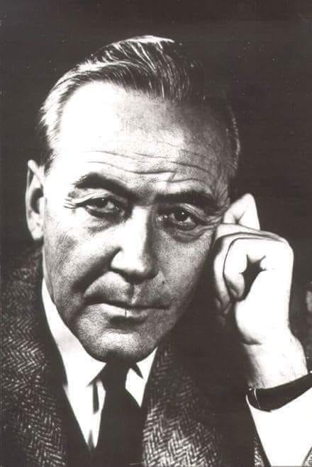
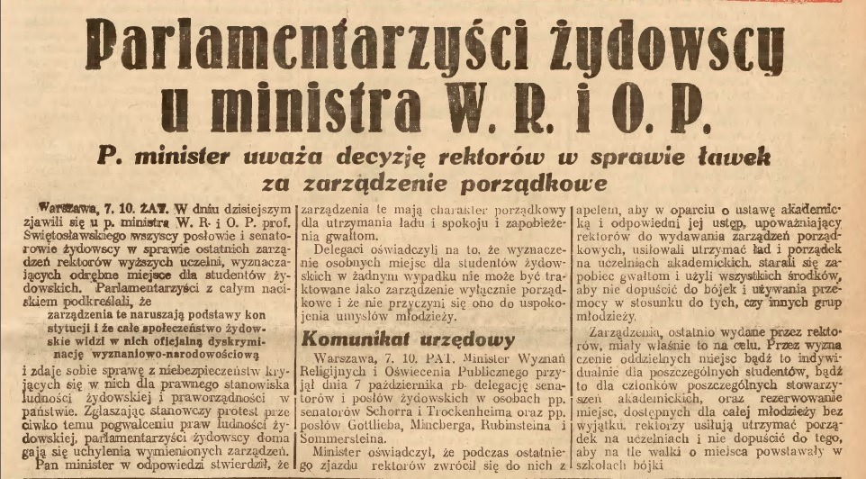
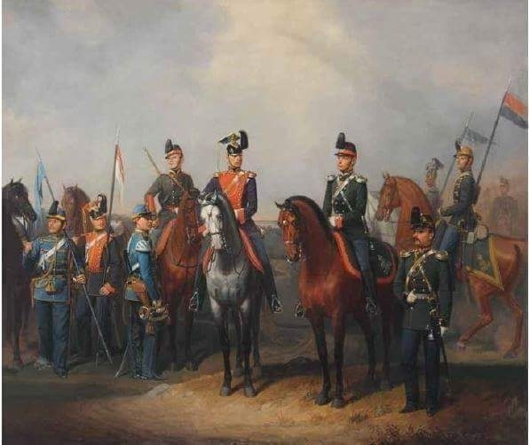

### 2022

> Każdy punkt procentowy inflacji daje ok. 4,7 mld zł wpływów do budżetu państwa – wynika z wypowiedzi wiceministra finansów Artura Sobonia.

### 2021

> JPMorgan Chase CEO Jamie Dimon: Bitcoin is a little bit of fool's gold

---

Stopa referencyjna NBP w górę, zmiana z 0,1% do 0,5%

---

<video width="640" height="480" controls>
<source src="./movies/october/neonowkachleb.mp4" type="video/mp4">
Your browser does not support the video tag.
</video>

### 1939

"Wiemy już, że Warszawa padła.
Mimo to bijemy się ofiarnie.
Myślimy o przebiciu się przez
wojska niemieckie i rosyjskie na
południe" - tak poeta i
dramatopisarz, dowódca jednej z
baterii artylerii konnej, Bronisław
Przyłuski (zdjęcie) mówił o ostatnich
godzinach bitwy pod Kockiem na
falach Radia Wolna Europa.
6 października 1939 roku skapitulowała walcząca z niemiecką 13 i 29 zmotoryzowaną dywizją Wermachtu Samodzielna Grupa Operacyjna "Polesie" generała Franciszka Kleeberga.

  

### 1937

Na Uniwersytecie Jagiellońskim rozpoczęły się liczne wykłady na wydziałach filozofii i medycyny. Niemal wszędzie studenci endeccy występowali przeciwko Żydom, domagając się od nich zajmowania miejsc w ostatnich ławkach po lewej stronie. Studenci żydowscy sprzeciwiali się temu kategorycznie, a nie chcąc wywołać incydentów słuchali wykładów na stojąco.
7 października 1937 roku z wizytą u najwyższych władz polskich zjawiła się delegacja żydowskich parlamentarzystów ...
(Nowy Dziennik 8.X.1937 r.)

  

https://pl.wikipedia.org/wiki/Getto_%C5%82awkowe

### 1862

Władze Królestwa Polskiego zapowiedziały przeprowadzenie branki, czyli poboru do wojska na zimę 1862/1863 r. Miała ona zostać przeprowadzona na podstawie imiennych list, w odróżnieniu od wcześniejszych, które odbywał się na drodze losowania. Celem władz było wzięcie do wojska carskiego polskiej młodzieży zaangażowanej w działalność patriotyczną.

  

---

<a href="https://github.com/TomaszWaszczyk/historia.waszczyk.com/edit/master/src/content/october-6.md" target="_blank">Edytuj tę stronę dzieląc się własnymi notatkami!</a>
