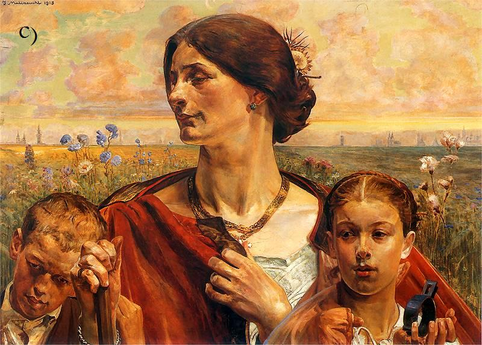

### 1929

W Krakowie zmarł Jacek Malczewski. "Gdy Polaków pozbawiono terytorium, a naród został podzielony, dziedzictwo duchowe, czyli kultura przejęta od przodków, przetrwało w nich" - W książce "Pamięć i tożsamość", wśród głównych twórców kultury papież Jan Paweł II wymienia m. in. Jacka Malczewskiego.
Urodził się 14 lipca 1854 r. w Radomiu, tu też znajduje się Muzeum jego imienia. Reprezentant Młodej Polski, rysownik oraz malarz, współcześnie uznawany za ojca symbolizmu w malarstwie polskim przełomu XIX i XX w. Wychowany w patriotycznej rodzinie w atmosferze narodowego mesjanizmu oraz silnych uczuć do ojczyzny wyrażał te wartości w swojej niepowtarzalnej sztuce. Jego dzieła charakteryzują się wrażliwością na piękno rodzimego krajobrazu, podziwem nad folklorem oraz wrażliwą obserwacją rzeczywistości.

  

### 1882

Urodził się <a href="https://en.wikipedia.org/wiki/Jan_Czekanowski" target="_blank">Jan Czekanowski</a>

---

<a href="https://github.com/TomaszWaszczyk/historia.waszczyk.com/edit/master/src/content/october-8.md" target="_blank">Edytuj tę stronę dzieląc się własnymi notatkami!</a>
