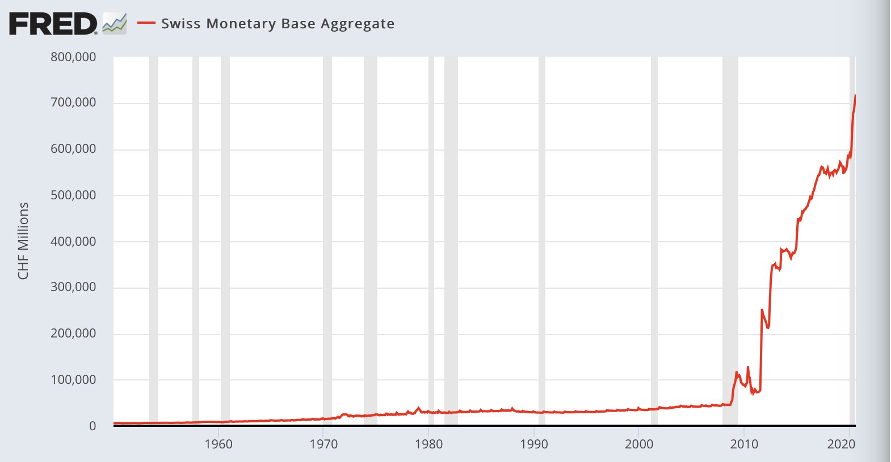
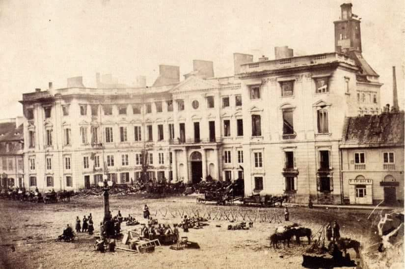

### 2020

  

### 1982

Sejm PRL przyjął ustawę o związkach zawodowych. W rzeczywistości pod tą dosyć enigmatycznie brzmiącą nazwą kryła się przyjęta przy sprzeciwie 12 głosów i 10 wstrzymujących się delegalizacja NSZZ Solidarność.
W miejsce Solidarności miały zostać powołane nowe związki, których struktury miały być zorganizowane jedynie na szczeblu zakładowym.Ustawa ta dopuszczała tworzenie struktur pozazakładowych, ale dopiero po 31 grudnia 1983 roku.
Po tej decyzji rozlała się fala gwałtownych
protestów - zwłaszcza w Gdańsku i Nowej Hucie, gdzie zginął od kuli funkcjonariusza SB młody robotnik Bogdan Włosik .
Tymczasowa Komisja Koordynacyjna NSSZZ Solidarność w specjalnym oświadczeniu wydanym w tej sprawie stwierdzała:
"Nieprzystąpienie do nich (nowych związków zawodowych,przyp. B.D)
będzie formą ogólnonarodowego referendum, w którym społeczeństwo polskie wypowie się
przeciw polityce represji, przeciw zniewoleniu
narodu, przeciw postępującej nędzy
społeczeństwa, przeciw 37 latom katastrofalnej polityki społecznej i gospodarczej. Łamanie solidarnego bojkotu jest zdradą ideałów niezależnego ruchu związkowego. Będzie to pierwsze w dziejach PRL referendum, którego rządzący nie będą w stanie sfałszować".

### 1939

Niemcy utworzyli w Piotrkowie Trybunalskim pierwsze w okupowanej Europie żydowskie getto. Stłoczenie Żydów na niewielkim obszarze stanowiło wstęp do nazistowskiej polityki eksterminacyjnej."

---

Na mocy dekretu Adolfa Hitlera do Rzeszy wcielone zostały województwa: pomorskie, poznańskie, śląskie, większa część łódzkiego, zachodnia część krakowskiego, część warszawskiego i część kieleckiego. W sumie 92 tys. km kw., na których mieszkało ponad 9 mln osób. Wymienione obszary zostały włączone do istniejących prowincji niemieckich oraz do dwóch
nowych okręgów: Wartheland (Kraj Warty) oraz
Gdańsk-Prusy Zachodnie.

### 1929

W Krakowie zmarł Jacek Malczewski. "Gdy Polaków pozbawiono terytorium, a naród został podzielony, dziedzictwo duchowe, czyli kultura przejęta od przodków, przetrwało w nich" - W książce "Pamięć i tożsamość", wśród głównych twórców kultury papież Jan Paweł II wymienia m. in. Jacka Malczewskiego.
Urodził się 14 lipca 1854 r. w Radomiu, tu też znajduje się Muzeum jego imienia. Reprezentant Młodej Polski, rysownik oraz malarz, współcześnie uznawany za ojca symbolizmu w malarstwie polskim przełomu XIX i XX w. Wychowany w patriotycznej rodzinie w atmosferze narodowego mesjanizmu oraz silnych uczuć do ojczyzny wyrażał te wartości w swojej niepowtarzalnej sztuce. Jego dzieła charakteryzują się wrażliwością na piękno rodzimego krajobrazu, podziwem nad folklorem oraz wrażliwą obserwacją rzeczywistości.

  

### 1882

Urodził się <a href="https://en.wikipedia.org/wiki/Jan_Czekanowski" target="_blank">Jan Czekanowski</a>

### 1863

W czasie powstania styczniowego miał miejsce w Warszawie pożar pałacu Jabłonowskich.
Budowlę podpalili sami powstańcy w celu zniszczenia list ewidencji ludności przechowywanych tu przez policję carską.

  

### 1610

Wojska polskie dowodzone przez hetmana Stanisława Żółkiewskiego zdobyły Kreml.
Genezą tego wydarzenia jest rok 1605,kiedy to lojalny wobec Polaków Dymitr Samozwaniec zostaje carem Rosji. Fakt ten nie był po myśli Bojarów Szujskich, którzy szybko ,bo już w 1606 roku  uśmiercili nowego cara,paląc jego zwłoki,a następnie w spektakularny sposób wystrzeliwując jego prochy z działa. W tym samym roku wybuchło w Moskwie antypolskie powstanie,na którego czele stanął Wasyl Szujski,który w 1608 roku został carem. Co prawda zawarł on wkrótce pokój z Polską,ale obawiając się kolejnych polskich ataków i mając słabe poparcie pośród poddanych zdecydował się też na sojusz z wrogą Polsce Szwecją. Na efekty takich działań nie trzeba było długo czekać. 4 lipca 1610 roku miała miejsce bitwa pod Kałuszynem w czasie której pieciokrotnie mniejsze siły polskie rozbiły doszczętnie wojska rosyjskie.
W tej bitwie najbardziej uwidoczniła się wartość
bojowa husarii. Towarzyszy husarskich było pod Kłuszynem 5 556. Niektóre roty musiały
szarżować po kilka razy by pobić pięciokrotnie
liczniejszego wroga. W tej bitwie towarzysze
husarscy pokazali swoją uniwersalność. Husaria doskonale poradziła sobie z lekką jazdą typu wschodniego, jak i ciężką zachodnioeuropejską rajtarią. W nocy z 20 na 21 września 1610 ddziały Żółkiewskiego weszły do Moskwy października 1610 wojska polskie zajęły Kreml.

---

<a href="https://github.com/TomaszWaszczyk/historia.waszczyk.com/edit/master/src/content/october-8.md" target="_blank">Edytuj tę stronę dzieląc się własnymi notatkami!</a>
