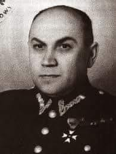

### 2022

NATO media before and after 2022

  

---

We Francji zniesiono karę śmierci. Ostatnim katem był Marcel Chevalier.

  

---

### 2020

W skrócie: Rząd USA podnosi koszt zakupu "twardego dobra" jakim jest srebro.

The United States Mint recently adopted a new strategy for pricing products in its silver numismatic products portfolio. Prices for products containing silver will change EFFECTIVE October 13, 2020—applicable to silver products already on sale/those yet to be released. In order for the United States Mint to cover rising costs, meet its fiduciary responsibility to operate at no net cost to taxpayers, and return money to the Treasury General Fund, re-setting silver prices is necessary. The Mint’s goal, as a financially responsible Federal agency, is to always provide the best quality numismatic products while maintaining fair prices.

The first objective is to ensure that the numismatic portfolio (all product lines together) be self-sufficient and cover all associated costs. The new silver prices reflect a sound business decision aimed at meeting these obligations.

(No tax dollars are used to fund numismatic operations.) The United States Mint will continue to look for operations optimization and cost reduction efforts to deliver superior quality numismatic products at a fair price.

---

  

---

(unknown year) Luis de Guindos counting bricks of paper notes:

  

2020:

  

---

<!-- Lekarz Dawid Ciemięga
5 października o 22:38  · 
Podjąłem niedawno decyzje o częściowej rezygnacji z zawodu, w związku z tym mój tryb pracy się znacząco zmieni od listopada. Będę wciąż zajmować się działalnością edukacyjną, pisaniem itd
Pracuje z pacjentami 7 lat i dziś pierwszy raz wyrzuciłem rodziców z gabinetu, otworzyłem drzwi i kazałem im wyjść. 
Przez 5-6 lat mojej pracy zdarzały się sporadycznie nieporozumienia, ale od roku coraz częściej spotykam się nie tylko z coraz większą bezmyślnością rodziców, ale przede wszystkim skrajną nieodpowiedzialnością. I nie będę tego tolerować i nie będę brać za to odpowiedzialności. 
Dwa lata temu nie pomyślałbym, że rodzic może świadomie ukrywać chorobę dziecka, aby dostać zgodę na treningi, które zagrażają jego życiu, a dziś to dla mnie nie jest już zaskakujące. Czasami myślę, że niektórzy lepiej jakby oddali swoje dzieci, bo chyba chcą je uśmiercić. To co się dzieje jest szokujące. 
I chciałbym tu zaznaczyć, że to nie jest tak, jak dziś rodzicom się wydawało – mamy prawo wyboru, prawo robić co chcemy, a lekarz – którego się i tak nie słuchamy, nie ma nic do gadania i ma nam usługiwać. Otóż ma:
Zgodnie z art. 38 u.z.l i zgodnie z art. 7 Kodeksu Etyki Lekarskiej – Lekarz może odmówić opieki nad pacjentem z istotnych powodów. 
Powtórzę publicznie to, co powiedziałem dziś w gabinecie – jeśli ktoś stwierdzi, że będzie bez żadnego uzasadnienia rozdzielać wszystkie szczepienia i przychodzić sobie co tydzień i z jednej wizyty szczepiennej robi 5, to działa na szkodę dziecka i dodatkowo utrudnia innym dostanie się na wizytę. 
Szczególnie w obecnej sytuacji. I takie postępowanie (rozdzielanie szczepień i mnożenie niepotrzebnie wizyt) nie ma żadnego uzasadnienia medycznego. A każdy rozsądnie myślący rodzic wie, że chodzenie bez potrzeby po przychodni jest potencjalnie szkodliwe dla dziecka. Co z resztą spokojnie wyjaśniłem miesiąc temu, zostałem zignorowany.
Lekarz powinien wyjaśniać rodzicom takie kwestie, ale czasy są teraz takie, że coraz więcej rodziców ma totalnie gdzieś  naszą wiedzę, wykształcenie, szkolenie bo z góry deklarują, że wiedzą lepiej i nie interesuje ich to, co mówię. To nie jest tak, że ktoś przychodzi i pyta, to jest tak, że ktoś przychodzi i go już nic nie interesuje, bo wie lepiej. 
Jeśli ktoś powołuje się na to, co ktoś pisze w internecie, albo bo jak dziś usłyszałem – „mamy w rodzinie kogoś ze służby zdrowia kto ma inne zdanie” – to proszę niech ten ktoś zajmuje się dzieckiem, niech je leczy, szczepi i ratuje. Ja nie będę brać odpowiedzialności za pacjenta, kiedy rodzice mają mnie gdzieś. Bo coraz częściej jest tak, że rodzic postępuje bezmyślnie ale chce żeby lekarz za wszystko odpowiadał, wydał zgodę, receptę itd. Ja nie będę, jeśli rodzic mnie okłamuje, ukrywa ważne kwestie albo nie słucha argumentów – w takich sytuacjach lekarz ma prawo odmówić współpracy. 
Ja dziś zacząłem grzecznie – nie wyrażamy zgodny na takie postępowanie i jeśli Państwo chcecie tak postępować z dzieckiem, proszę zmienić przychodnie. Usłyszałem stek bezwartościowych bzdur typu – pan nam odbiera prawo do opieki medycznej, gdzie pana przysięga Hipokratesa itd. A ponieważ zdarza się to coraz częściej, to jasno podkreślam – lekarz nie jest od spełniania bezmyślnych zachcianek rodziców, bierze za pacjenta odpowiedzialność i jak się rodzic zaleceń nie słucha, to współpraca się kończy. 
A na koniec proszę sobie dobrze zapamiętać – przynajmniej 50% problemów z dostępnością do lekarza, brakiem miejsca, wynika z bezmyślności i egoizmu innych. Naprawdę mnie już nie zdziwi jak ktoś w ramach teleporady zapyta jak się gotuje makaron. 
I ja mówię dość. Kiedyś do tego wrócę, ale teraz nie będę opisywać co się regularnie dzieje, ale to jest po prostu szokujące. Mam dość bycia okłamywanym, ignorowanym, obrażanym, poniżanym. 
Dość. -->

### 2019

Turcja rozpoczęła ofensywę w syryjskim Kurdystanie, otrzymawszy wcześniej zielone światło od USA. Amerykańskie wojska zeszły z drogi inwazji, by zapewnić sobie bezpieczeństwo. Kurdowie byli jeszcze przed chwilą kluczowym sojusznikiem USA przeciwko Państwo Islamskiemu. Teraz, zrobiwszy swoje, mogą odejść.
Tak niestety działa realna polityka, gdy zasoby zaprzyjaźnionych imperiów się kurczą, nie starczając już do panowania na wszystkich frontach. Kurdowie stracili 11 tys. ludzi w wojnie z Państwem Islamskim. Liczyli na sojuszniczą wdzięczność, można też powiedzieć, że wierzyli w "kapitał krwi". Tak jak my wielokrotnie w historii, zwłaszcza podczas II wojny światowej. Niestety, do dziś trudno się w Polsce przebić z krytyką tych idei i opartej na nich polityki.
Sojusz z USA jest nam fundamentalnie potrzebny i oby był jak najmocniejszy. Ale musi być oparty na chłodnej kalkulacji, przemyślanej strategii i wspólnocie interesów, nie na miłych frazesach i romantycznych złudzeniach. Tak samo jak wszystkie inne sojusze.
Walka, poświęcenie życia za ojczyznę - są czasem konieczne i zawsze godne najwyższego uznania. Ale muszą być częścią racjonalnej kalkulacji i strategii, inaczej oscylują między krwawą loterią a samobójstwem. Na tym polega wielka odpowiedzialność polityków.
Obyśmy nigdy więcej nie opierali polityki państwa na takich złudzeniach jak nasi przodkowie i dzisiejsi Kurdowie.
Na zdjęciach cywile uciekający z bombardowanych przez Turków kurdyjskich miast. Publikuję je w ślad za tweetem red. Jarosława Kociszewskiego.

  

Szyszko Szyszką, wybory wyborami, ale jest sprawa naprawdę ważniejsza. Dosłownie kilka godzin temu turecka armia przypuściła atak na tereny północnej Syrii.
Znajdują się one obecnie pod administracją Kurdów związanych z partią polityczną o nazwie PYD (Partia Unii Demokratycznej - to jej barwy mam na profilowym) i są określane jako Rożawa. To właśnie Rożawa, rękami swoich żołnierzy z Powszechnych Jednostek Ochrony (YPG) i żołnierek z Kobiecych Jednostek Ochrony (YPJ), ma zasługę dla całego świata, gdyż pokonała Państwo Islamskie (ISIS). Nie bez pomocy, ale bez tych dzielnych ludzi i ich poświęcenia ISIS miałoby się świetnie do tej pory.
Kilka dni temu Donald Trump dał prezydentowi Turcji Erdoganowi zielone światło do napaści na Rożawę. Ta niepoczytalność i zwykły debilizm Trumpa jest krytykowana od lewa do prawa w Stanach. Ta decyzja to hańba, to zdrada, to wystawienie milionów ludzi na ogromne zagrożenie, pierwsze jej ofiary już zresztą są.
Ktoś może pomyśleć, że w sumie co z tego? Kolejny konflikt gdzieś na końcu świata, co mnie to obchodzi? Nie wartościując niczyjego cierpienia i życia trzeba zauważyć, że różnica polega na tym, iż autonomiczna Rożawa oprócz tego, że wytłukła i więzi szalenie niebezpiecznych dla całego świata islamskich fundamentalistów z ISIS, za co wszyscy powinniśmy być dozgonnie wdzięczni, to jeszcze niesie na Bliskim Wschodzie idee i wartości, które mogłyby tam zaprowadzić w końcu trochę porządku i spokoju. A porządek i spokój na Bliskim Wschodzie oznacza zmniejszenie fali uchodźców do Europy. Zaczynacie trybić?
Rożawa wprowadza jako standard takie idee jak równouprawnienie kobiet oraz zakaz poligamii, swobodę wyznania, równość wszystkich grup etnicznych, zakaz tortur i kary śmierci. Opiera się na zasadach demokracji bezpośredniej i ideach feministycznych (np. każdy urząd główny jest dwuczłonowy, obejmuje go na równych zasadach mężczyzna i kobieta). Nie tylko na tle tego regionu są to idee niezwykle progresywne i wnoszące wysokie standardy.
Co zaś stoi za Turcją Erdogana? Turcja Erdogana to zwierzęcy nacjonalizm, fanatyczny i równocześnie instrumentalnie traktowany islam, militaryzm, zamordyzm i drwina z  demokracji, to imperialistyczne (póki co w skali regionu) zapędy. To popieranie dżihadystów, religijnych maniaków zdolnych do każdej zbrodni: niewolenia kobiet, gwałcenia dzieci, obcinania głów. Turcja oficjalnie i bez cienia żenady wspiera islamskie, fundamentalne bojówki. Zaś turecką agresję na Rożawę oficjalnie poparła Al Kaida (!).
Rozważcie sami po czyjej stronie w tym konflikcie należy stanąć. Zastanówcie się dlaczego należy się tą sprawą interesować, dlaczego to jest ważne. Wiele zrobić nie możemy, ale przynajmniej nie bądźmy obojętni. Tyle możemy, to wręcz nasz, jako ludzi, obowiązek.

  

---

Andreessen Horowitz Leads $300 Million Investment in RigUp Financing brings the valuation of the startup aimed at energy contractors to $1.9 billion

RigUp Inc., which operates a marketplace for contract workers in the energy sector, surged to a $1.9 billion valuation with a new infusion of capital, according to a person familiar with the situation.

Andreessen Horowitz led the $300 million Series D financing in the Austin, Texas-based startup, using its recently formed late-stage fund.

### 1997

  

### 1989

https://de.wikipedia.org/wiki/Wir_sind_ein_Volk

### 1980

Czesław Miłosz otrzymał Literacką Nagrodę Nobla  za “bezkompromisową wnikliwość w ujawnianiu zagrożenia człowieka w świecie pełnym gwałtownych konfliktów”.

### 1948

W Berlinie porwany został, a następnie osadzony w więzieniu na Mokotowie Tadeusz Bejt były żołnierz Armii Krajowej, uczestnik Powstania Warszawskiego , kurier KG AK, agent do zadań specjalnych.
Bejt organizował granicy polsko-niemieckiej, a także przerzuty z kraju na Zachód osób ściganych przez służby bezpieczeństwa i rodzin pozostających za granicą oficerów 2. Korpusu gen. Władysława Andersa.
18 listopada 1948 roku warszawski Wojskowy Sąd Rejonowy pod przewodnictwem pułkownika Józefa Badeckiego (zdjęcie) skazał go na karę śmierci, którą wykonano 11 lutego 1949 roku.

  

### 1944

>To miasto ma całkowicie zniknąć z powierzchni Ziemi i służyć jedynie jako punkt przeładunkowy dla transportu Wermachtu. Kamień na kamieniu nie powinien pozostać. Wszystkie budynki należy zburzyć do fundamentów. Pozostaną tylko urządzenia techniczne i budynki kolei żelznych"

Tak brzmiał rozkaz zburzenia Warszawy wydany 9 października 1944 roku przez Reichsfuhrera SS Heinricha Himmlera.
O tym jak bardzo Niemcy zaangażowali się w realizację tego planu niech świadczy fakt, że Warszawa została zniszczona niemal w 100 procentach, a jedynym nienaruszonym budynkiem mieszkalnym był dom przy ulicy Długiej.
Planowe burzenie stolicy dokonane w głównej mierze przez żołnierzy jednostki saperskiej Technische Nothilfe trwało do stycznia 1945 roku, kiedy to do Warszawy dotarła sowiecka ofensywa.

---

Opuściły Warszawę ostatnie oddziały AK, zabezpieczające ewakuację ludności cywilnej z miasta. Jeszcze raz Niemcy przejęli pełną kontrolę nad umęczoną stolicą. Ich zamiary w stosunku do miasta natychmiast stały się jasne.

### 1921

https://pl.wikipedia.org/wiki/Tadeusz_R%C3%B3%C5%BCewicz

### 1621

Pod Chocimiem zawarto układ pokojowy kończący toczące się od ponad miesiąca walki między wojskami polsko-kozackimi dowodzonymi przez Jana Karola Chodkiewicza i Piotra Konaszewicza Sahajdacznego, a armią turecko-tatarską pod wodzą sułtana Osmana II.

  

### 1610

Polacy zdobyli Kreml. Rosja przestała istnieć jako suwerenne państwo. Dowództwo nad nimi Żółkiewski oddał w ręce Aleksandra Gosiewskiego. Mennica moskiewska rozpoczęła bicie srebrnych kopiejek z imieniem nowego cara Władysława Zygmuntowicza.

---

<a href="https://github.com/TomaszWaszczyk/historia.waszczyk.com/edit/master/src/content/october-9.md" target="_blank">Edytuj tę stronę dzieląc się własnymi notatkami!</a>
