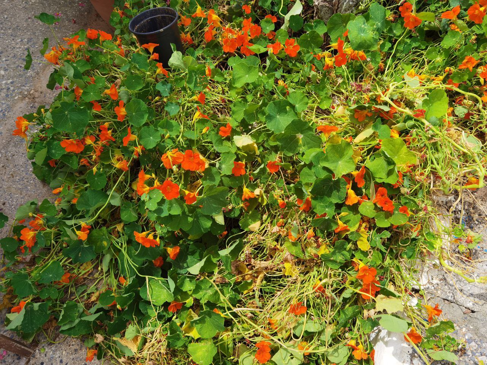

### Naturalne oczyszczanie powietrza

Oczyszczanie jest głównie korzeniowe, można mieć skrzydłokwiaty.

1. Doniczka Airly
2. Sansewieria

### Kwiatki

1. Sansewieria
2. [Figowiec benjamina](https://pl.m.wikipedia.org/wiki/Figowiec_benjamina)
3. Zioła

Bazylia, mięta, rozmaryn (do stejków), lawenda, pietrucha, szczypior. Wiele ziół lubi tzn dobrze rośnie razem i super wygląda wspólnie w korytku na parapecie. Główna rada, nie kupuj tych z marketu tylko idź do sklepu ogrodniczego po sadzonki lub nasiona jeśli masz cierpliwość. Kawa nie jest też ciężka w utrzymaniu. Kolejne dla wyglądu i już samodzielnego wyhodowania polecam: awokado i ostre papryczki (te ist bez owoców czy z owocami, ale są w smaku raczej dzikie, wiem co mówię bo zjadłam około 1 kg świeżego chili tyg). Kiełki

### Info o nasturcji

```
Gleba przepuszczalna (czyli nie taki ziemisty ulepek), umiarkowane podlewanie, ale dobrze jeśli będzie mieć zawsze wilgotno (jak przy większości kwiatów unikaj przesuszenia ziemi), dość słoneczne miejsce/ciepłe miejsce szczególnie na początku wzrostu. Za miesiąc mniej więcej zobaczysz już kwiaty, po około 2 tyg zacznie wschodzic roślinka. Będzie się piąć, mocno rozrastać, więc w doniczce niech będzie sama. Nasiona żeby były suche trzymaj na papierze np. dobre. Około 3 sztuki nasion na małą doniczke wystarcza. Zanim w jedzie trzymaj w domu. Potem już na balkon, ogród etc. Chyba że pogoda się znów zmieni na letnia 😅 to od razu może być balkon. Z kwiatów potem nasz nowe nasinka. Jesz liście i kwiaty, nasiona trzymasz ma mowy sezon. Więcej info (nasturcja mała), np. 
1. https://poradnikogrodniczy.pl/nasturcja-pnaca-wieksza-wysiew-nasion-i-uprawa.php
2. https://zielonyogrodek.pl/pielegnacja/uprawa-roslin/3723-uprawa-nasturcji-w-ogrodzie-i-w-doniczce
```

### Rośliny jadalne

1. Habanero
2. Nasturcja większa
<!-- https://zielonyogrodek.pl/katalog-roslin/pnacza/9526-nasturcja-wieksza -->

Lokalni nazywają to Cappuccino plant 🧡 Łatwa w utrzymaniu, na balkon dobre, pomarańczowe.

<br><br>

## Inne

Wierzba energetyczna

---

<a href="https://github.com/TomaszWaszczyk/historia.waszczyk.com/edit/master/src/content/ogrodnictwo.md" target="_blank">Edytuj tę stronę dzieląc się własnymi notatkami!</a>
