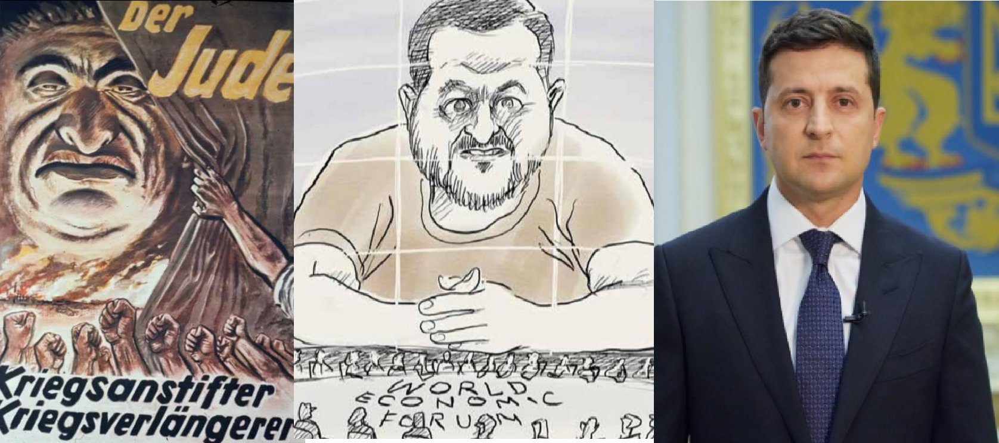
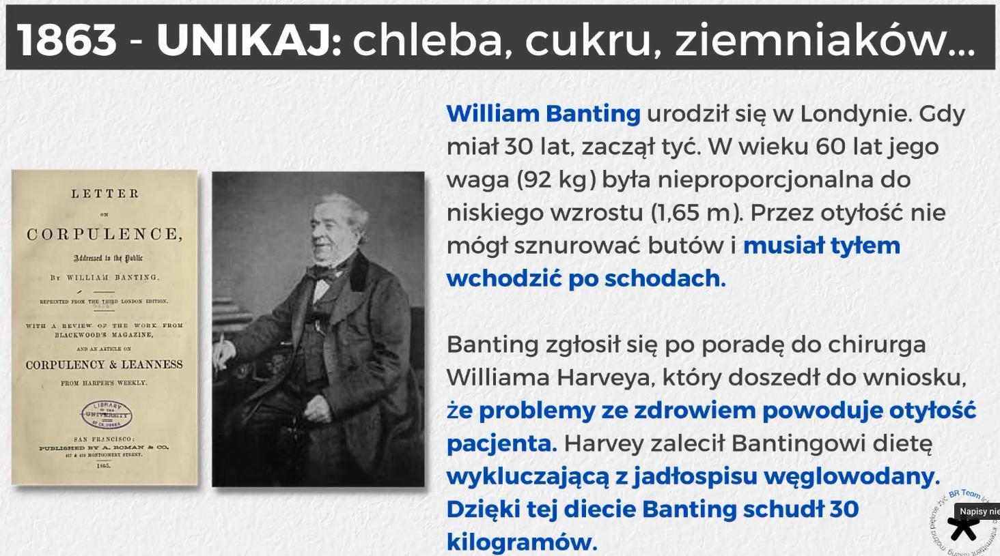
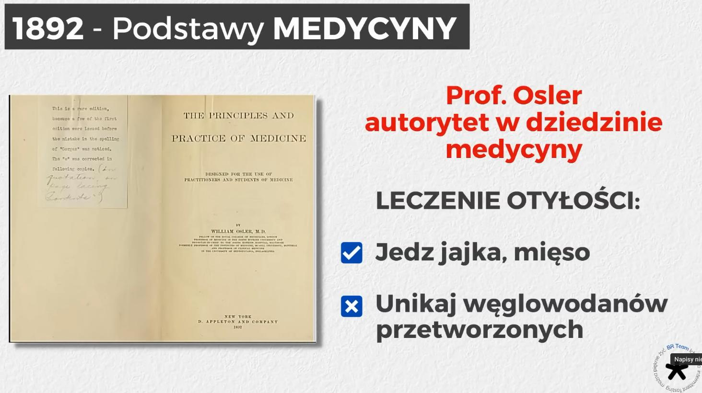
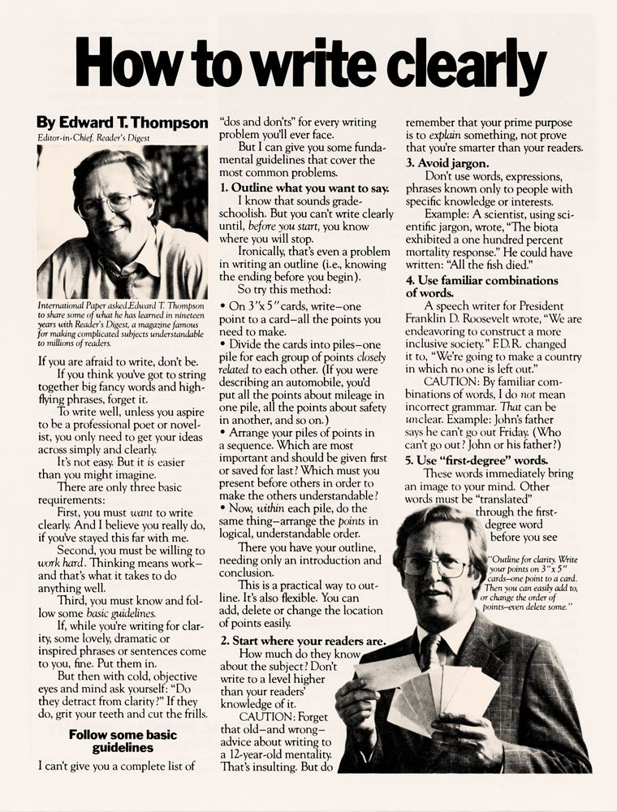

### Linki

-1. <a href="https://historia.waszczyk.com/chinese-language" target="_blank">Chinese language</a>

0. <a href="https://historia.waszczyk.com/wychowanie-mlodego-czlowieka" target="_blank">Wychowanie młodego człowieka</a>

1. <a href="https://historia.waszczyk.com/ogrodnictwo" target="_blank">Ogrodnictwo</a>

2. <a href="https://historia.waszczyk.com/economy" target="_blank">Ekonomia</a>

3. <a href="https://historia.waszczyk.com/year-by-year" target="_blank">Rok po roku</a>

4. <a href="https://historia.waszczyk.com/china" target="_blank">Chiny</a>

5. <a href="https://historia.waszczyk.com/dictionary" target="_blank">Słowników terminów historycznych</a>

6. <a href="https://historia.waszczyk.com/ziemianstwo" target="_blank">Ziemiaństwo polskie</a>

7. <a href="https://historia.waszczyk.com/sport" target="_blank">Sport</a>

8. <a href="https://historia.waszczyk.com/religion" target="_blank">Religia</a>

9. <a href="https://historia.waszczyk.com/computer-science" target="_blank">Computer science</a>

10. <a href="https://historia.waszczyk.com/education" target="_blank">Historia edukacji</a>

11. <a href="https://historia.waszczyk.com/philosophy" target="_blank">Filozofia</a>

https://www.werandaweekend.pl/sprawdzone-miejsca/muzea/te-muzea-odwiedzisz-bez-wychodzenia-z-domu

https://en.wikipedia.org/wiki/Aleksandr_Dugin

https://pl.wikipedia.org/wiki/Fides_et_ratio

### Książki

* Karol, Diana, Camilla. Opowieści z angielskiego dworu

* Roztrzaskane lustro. Upadek cywilizacji zachodniej, Wojciech Roszkowski

* Kody Wojny - Marian Zacharski

* KWESTIA WŁOŚCIAŃSKA W POLSCE półskórek 1849 Lipsk

* Wobec nadchodzącej drugiej wojny światowej, Studnicki Władysław

* Militarium I, Andrzej Maksymilian Fredro

* Optymizm nie zastąpi nam Polski, Józef Mackiewicz: Dzieła (tom 18)

17 Books for web3 builders 📓

1/ The Man from the Future: The Visionary Life of John von Neumann by Ananyo Bhattacharya

2/ A Graduate Course in Applied Cryptography by Dan Boneh and Victor Shoup

3/ Proof of Stake: The making of ethereum and the philosophy of blockchains by Vitalik Buterin

4/ Algorithms to Live By: The Computer Science of Human Decisions by Brian Christian and Tom Griffiths

5/ Designing an Internet by David Clark

6/ The Beginning of Infinity: Explanations That Transform the World by David Deutsch

7/ Selected Short Stories by Philip Dick

8/ A Crack in Creation: Gene Editing and the Unthinkable Power to Control Evolution by Jennifer Doudna and Samuel Sternberg

9/ The Idea Factory: Bell Labs and the Great Age of American Innovation by Jon Gertner

10/ Alan Turing: Enigma by Andrew Hodges

11/ The Hard Thing about the Hard Things by Ben Horowitz

12/ The Ride of a Lifetime: Lessons Learned from 15 Years as CEO of the Walt Disney Company by Bob Iger

13/ The Death and Life of Great American Cities by Jane Jacobs

14/ Pentagon’s Brain: An uncensored history of DARPA, America’s top-secret military research agency by Annie Jacobsen

15/ Extra Life: A Short History of Living Longer by Steven Johnson

16/ Empires of Light: Edison, Tesla, Westinghouse, and the Race to Electrify the World by Jill Jonnes

17/ Masters of Doom by David Kushner

### Audycje, podcasty

<video width="640" height="480" controls>
<source src="./movies/others/komorowskiusa.mp4" type="video/mp4">
Your browser does not support the video tag.
</video>

:one: "O czym milczy historia" @ RadioKatowice(YouTube)

:two: Szeptana historia Polski. Jak "handlowano" ludźmi w dawnej Polsce(TokFM) @ Dr hab. Kacper Pobłocki

### Historycy

* https://pl.wikipedia.org/wiki/Karol_Modzelewski mówił o "niewolnictwie państwowym"

### Zasady wojny i wywiadu

https://pl.wikipedia.org/wiki/Carl_von_Clausewitz

https://pl.wikipedia.org/wiki/Erich_von_Manstein

analiza hipotez konkurencyjnych - szukanie zaprzeczeń a nie potwierdzeń

### Żydzi, jude, Jewish

  

https://pl.wikipedia.org/wiki/Sefardyjczycy

1012 rok - Cesarz Niemiecki Henryk II wypędza Żydów z Moguncji

1288 rok - Regent Królestwa Neapolu Robert d'Artois nakazuje wypędzenie Żydów z całych południowych Włoch

1290 rok - Król Anglii Edward I wydaje edykt o wygnaniu Żydów (wszystkich Żydów, w liczbie ok. 16 tys., załadowano na statki i odesłano na kontynent, dotarli tylko nieliczni, bo większość Anglicy najpierw obrabowali, a potem potopili)

1346 rok - wygnano Żydów z Bazylei w Szwajcarii

1360 rok - wygnano ich z Węgier

1394 rok - z Francji

1421 rok - z Austrii

1491 rok - wygnanie Żydów z Rawenny

1492 rok - Królowie Hiszpanii Izabela I Kastylijska i Ferdynand II Aragoński wydali edykt nakazujący wypędzenie Żydów z Królestwa Hiszpanii i wszystkich jej posiadłości

1493 rok - Król Sycylii Ferdynand II Aragoński wyrzuca Żydów ze swojego królestwa

1495-1503 Żydzi zostali wygnani z Litwy

1496 rok - Żydów wypędzono z Portugalii (edykt Króla Manuela I Szczęśliwego), również w tym samym roku Cesarz Rzymski Maksymilian I Habsburg wypędził Żydów ze wszystkich swoich dziedzicznych ziem

1510 rok - Żydzi zostają wygnani z Brandenburgii

1547 rok - Car "Wszech Rusi" Iwan Grozny odmawia Żydom prawa zamieszkania w Rosji, a nawet przejazdu przez swoje państwo!

1550 rok - Żydzi zostają wygnani z Genui

1571 rok - Republika Wenecka podejmuje decyzje o wygnaniu wszystkich Żydów z Wenecji i z wysp adriatyckich
Kiedy w 1528 roku Niderlandy dostają się pod władzę Cesarza Rzymskiego Karola V Habsburga wszyscy Żydzi zostają wypędzeni

1590 rok - Król Hiszpanii Filip II nakazuje wyrzucenie Żydów z Lombardii...
...wszystkim wygnaniom Żydów towarzyszyły krwawe pogromy i powszechne prześladowanie... uciekali głównie do Polski, która sami nazwali "Paradisus Ludaeorum" (Żydowski Raj). W XVI wieku 3/4 wszystkich Żydów żyjących na świecie mieszkało w Polsce! Teraz doszło do tego, ze ich premier, Benjamin Netanjahu w przemówieniu wygłoszonym w dniu 14.02.br., na terenie Polski, w gmachu Muzeum Historii Żydów Polskich (wybudowanym przez Polaków kosztem 300 mln zł i utrzymywanym przez Polaków kosztem ponad 10 mln zł rocznie!), oskarża nas, czyli cały Naród Polski, o to ze współpracowaliśmy z nazistowskim reżimem w zabijaniu Żydów w ramach Holokaustu!

---

17 faktów, które warto wiedzieć o chasydzkich Żydach:

1. Ruch chasydzki to ruch społeczności żydowskiej pełen miłości, radości i pokory. Chasydzi należą do ruchu założonego przez Rabina Izraela Baala Szem Towa, który nauczał miłości, radości i pokory - zarówno w naszej służbie dla B-ga, jak i w naszym traktowaniu innych ludzi. Na początku XVII wieku, na obszarze znanym dziś jako Ukraina, chłopak, sierota o imieniu Izrael ben Eleazar  lubił wędrować po okolicznych lasach, nawet nocując tam. Ostatnie słowa jego ojca rozbrzmiewały echem w jego umyśle: „Nie lękaj się niczego, nie bój się nikogo, ale samego B-ga, i kochaj każdego, tak jak siebie kochasz”.  W końcu trafił i dołączył do grupy "ukrytych cadyków", którzy podróżowali po Europie Wschodniej, zachęcając Żydów do podtrzymywania żydowskich tradycji oraz studiowania Tory, Talmudu i innych ksiąg żydowskiej mądrości.
Młody Izrael mówił o miłości B-ga do każdego bliźniego i o tym, jak Stwórca bardzo ceni ich każdy dobry uczynek.
Dzięki swoim naukom, nieustannym wędrówkom stał się znanym, zdobył zaufanie społeczności żydowskiej.
W 1740 r. znany już jako „Baal Szem Tow" („Mistrz Dobrego Imienia”) osiadł w miasteczku Międzybóż, Ukraina. Tysiące Żydów przybywało tam, aby słuchać jego nauk, porozmawiać, prosić o radę.
Baal Szem Tow nauczał, że każdy Żyd, uczony i niewykształcony, może łączyć się z B-giem poprzez studiowanie Tory i przestrzeganie micw z miłością, radością i prostotą, gorliwą pokorą. 
2. Chasydzcy mędrcy są mistykami, znawcami nauki chasydyzmu są przedłużeniem kabbalistycznych dzieł Rabina Szymona bar Jochaja, Rabina Jicchaka Lurii i innych. Mistrzowie chasydzcy uczynili te mistyczne nauki dostępnymi i praktycznymi dla każdego. Chasyd studiuje dogłębnie i zastanawia się nad tym, w jaki sposób te nauki mają wpływ na nasz związek z B-giem, Jego relacją ze światem i tym, jak micwot (przykazania) wzmacniają ten związek i każdego, kto spełnia. Te studia nazywają się Chassidus. Chasyd jest zatem tym, który stara się stać się lepszą osobą, bardziej pobożną osobą poprzez studiowanie, kontemplowanie i zgłębianie nauk chasydzkich. 
3. Nie wszyscy chasydzi są tacy sami. Każda grupa chasydzka ma swój niepowtarzalny charakter. Na przykład grupy chasydzkie z ruchu mistrzów Pszischy i (zwłaszcza Gur Hasidimów dzisiaj) cenią prostotę, wyrzeczenie i oddanie się surowej, szczerej prawdzie. Chasydzi z Breslawia przywiązują najwyższą wagę do zachowania radosnego usposobienia, „hitbodedut ” („prywatna rozmowa z B- giem”) i bezgranicznej wierze w B-ga. Jeszcze inni chasydzi skupiają się na życzliwości dla innych jako nadrzędnej jakości. Wiele grup chasydzkich przyjęło dziś „wyspiarskie” podejście do samozachowawczości - niektóre bardziej inni mniej. Chasydyzm Chabadu bierze osobistą odpowiedzialność za każdego Żyda. 
4. Żydzi chasydzcy korzystają z nowoczesnych technologii.                 Chasydzi jak najbardziej korzystają z wszystkich osiągnięć techniki - używają komputerów, telefonów komórkowych, jeżdżą samochodami i używają innych technologii. Jednym słowem żyją w pełnie z duchem czasu i współczesności. Dlaczego nie? Przecież mędrcy nauczali, że „Wszystko, co B-g stworzył w swoim świecie, stworzył dla Swej sławy”     (Awot 6:11). W Chabadzie się uważa, że dotyczy to zwłaszcza odkryć naukowych ostatnich lat - ich celem jest dodanie czci B-gu dzięki wykorzystaniu ich do studiowania ksiąg, Tory i micwot oraz doprowadzeniu świata do ostatecznego, mesjańskiego Zbawienia. Jednocześnie chasydzi są bardzo ostrożni i uważni w korzystaniu z Internetu, podobnie jak każdy, kto jest zainteresowany swoim moralnym i psychicznym dobrostanem. W praktycznie wszystkich społecznościach chasydzkich małe dzieci mają zerowy lub bardzo ograniczony dostęp do Internetu. Osoby korzystające z Internetu dla biznesu powinny stosować filtry i inne zabezpieczenia. 
5. Chasydzi a  wskazówki Rebbe. 
Wyraz „rebbe” to po prostu wymowa wyrazu „rabin” w języku jidysz. Jednak zaczęło się odnosić do przywódców różnych grup chasydzkich. Nie ma formalnego opisu "stanowiska Rebbe", ani nie istnieje procedura składania wniosków lub selekcji, aby zostać jednym z nich. Czym/kim jest Rebe? Przez cały czas byli ludzie, którzy poświęcili swoje życie zjednoczeniu z B-giem i służbie Jemu. Ale często oddalali się od zwykłego ludu, aby zanurzyć się w nauce, kontemplacji i modlitwie. Pierwsi przywódcy ruchu chasydzkiego powierzyli takim ludziom zadanie udzielania wskazówek i inspiracji każdemu członkowi swojej społeczności, aby każdy mógł czuć się blisko Boga i służyć Mu z miłością, podziwem i radością. Związek między chasydem a jego lub jej rebe jest bliski i intymny - o wiele głębszy, niż nauczyciela i ucznia. Chasyd musi podejmować własne decyzje i ciężko pracować, aby osiągnąć swoje cele, ale rebbe zawsze służy pomocą i wsparciem, aby prowadzić i pomagać. 
6. Chasidim Value Song. 
Nie bez powodu współczesna muzyka żydowska jest często określana jako muzyka chasydzka. Wielki chasydzki mistrz, rabin Schneur Zalman z Ladów, nauczał, że „muzyka jest piórem duszy”. Niektóre utwory chasydzkie budzą i ożywiają, a niektóre są kontemplacyjne i otrzeźwiające, z których każdy wyraża inny aspekt ludzkiego doświadczenia i połączenie man-G-d. 
7. Chasydzi lubią opowiadać historie. 
Opowieść chasydzka może przybierać różne formy. Często jest to opowieść starannie przygotowana, z puentą. W innych przypadkach historia chasydzka opowiada o czynach, pobożności lub o przygodach lub walce chasydów z poprzednich pokoleń. Pięknie opowiadania i chasydzkie historie stanowią bogatą tradycję ustną i pisemną. W tym obrazie chasydzki artysta Zalman Kleinman pokazuje „ farbrengen ”, chasydzkie zgromadzenie, które zawiera pieśń, opowieści, nauki Tory i inspirację. 
8. Hojność i dobroczynność Chasydzów. 
Chasydzi działają w ochotniczych korpusach pogotowia ratunkowego i innych społecznych organizacjach pomocy ludności w swoich krajach. Bikur cholim - odwiedziny chorych w szpitalu społeczności chasydzkiej są legendarne, podobnie jak gemachim - bezpłatne organizacje pożyczkowe na każdą potrzebę: od nauki po suknie ślubne. Chabadnicy mawiają: „ten kawałek chleba jest twój jak mój”, umieszczając „twój” przed „mój”…. Chodzi o pomoc drugiej osobie. 
9. Ubrania wyróżniają chasydów. Nakrycia głowy i ubrania chasydów mogą wskazywać na grupę, do której należy. Szeroki aksamitny kapelusz jest znakiem rozpoznawczym węgierskiego chasyda, wyższy aksamitny kapelusz noszony do tyłu jest‚ wyróżnikiem’ dla chasydów Wisznicerów, zaokrąglony filcowy kapelusz wskazuje na chasydów Gur - zwykle (ale nie zawsze) jest noszony na szczycie głowy chasyda z Chabadu. Jednak ubranie nie zawsze jest bezbłędnym wskaźnikiem. Naprawdę istnieją dwa sposoby definiowania chasydzkich Żydów: jako grupy socjologicznej lub jako zwolenników określonej ideologii i określonego sposobu życia. Naprawdę, aby być chasydem, istnieje bardzo prosta formuła: jeśli studiujesz nauki chasydzkich mistrzów i mocno łączysz się z jednym z kierunków, okazujesz miłość każdemu Żydowi, starasz się spełniać micwy B-ga i poznawać Jego Torę z miłością i radością, wtedy jesteś chasydem, niezależnie od tego jak się ubierasz . 
10. Chasydzi byli kiedyś prześladowani. 
Kiedy chasydzi pojawili się w drugiej połowie XVIII wieku, wielu z nich tworzyli nowe grupy, wobec których była nieufność ze strony społeczności żydowskiej. Czy chasydzcy Żydzi byli naprawdę pobożni? Czy pozostawali wierni przestrzeganiu Tory i micw? Niektórzy nadgorliwi przedstawiciele społeczności powzięli na siebie nękanie i zastraszanie chasydzkich Żydów. W 1798 r. Rabin Schneur Zalman z Liadi został aresztowany przez władze carskie na podstawie zmyślonych oskarżeń o działalność rewolucyjną wymyśloną przez zazdrosnych przeciwników. Jego uwolnienie z więzienia w dniu 19 Kislew jest obchodzony w Chabadzie jako „Nowy Rok Chasydyzmu”. Wiele lat później, w komunistycznej Rosji, chasydzi ryzykowali życiem, aby utrzymać żydowskie życie i tradycje w Związku Radzieckim. Podczas gdy wielu chasydów zginęło z rąk władz sowieckich, a inni prze dziesiątki lat w gułagu, ale zwyciężyli, a płomień judaizmu płonął jasno nawet w najciemniejszych czasach caratu i komuny. 
11. Chasydzcy Żydzi nie identyfikują się jako „ultra-ortodoksyjni”.
Jeśli chodzi o chasydzkich Żydów, to są oni po prostu Żydami, którzy starają się postępować właściwie i zachować żydowską tradycję w najlepszy możliwy sposób. Wielu uważa termin „ultra-ortodoksyjny” za pejoratywny. Więc jaki jest lepszy termin? Chasydzcy Żydzi lub
Chasydzi? Lub wspólnoty chasydzkie mogą zostać włączone do większego grona „Hareidim”, terminu odnoszącego się do wszystkich, którzy naprawdę troszczą się o zachowanie Tory B-ga z największą możliwą starannością. Albo po prostu nazywaj ich Żydami. 
12. Chasydzi są najszybciej rozwijającą się grupą w judaizmie.
Do połowy XIX wieku co najmniej połowa Żydów wschodnioeuropejskich uważała się za chasydów - a większość światowego żydostwa żyła w Europie Wschodniej. Ale w XX wieku antyreligijne reżimy komunistyczne, wraz ze zniszczeniami w okresie Holokaustu, niemal całkowicie zmiotły chasydzkie żydostwo z mapy. Jednak dzisiaj wspólnota chasydzka rozwija się w sposób, w jaki ocaleni z Holokaustu, którzy zasiedlili korzenie swoich zrujnowanych młodych Europejczyków w Izraelu i Ameryce Północnej, nie mogliby nawet sobie tego wyobrazić. Jak doszło do takiego cudu? Po pierwsze, charyzmatyczni przywódcy o silnej woli ciężko pracowali, aby podnieść na duchu tych uchodźców z Europy, aby budować dzielnice ze szkołami i miejscami pracy. Po drugie, chasydzcy Żydzi mają tendencję do poślubiania młodych, mają duże rodziny, w których się pielęgnuje tradycje. Nauki chasydzkie szybko zaczynają nadążać za nowoczesnością. Chociaż nie wszyscy studiujący te nauki dołączają do grupy chasydzkiej, to jednak często przyjmują chasydzki styl życia. 
13. Największe grupy chasydzkie. 
Nie ma oficjalnych wykazów i spisów grup chasydzkich i trudno byłoby w wielu przypadkach je określić. Na przykład szacunki liczby chasydów Chabadu wahają się od 50 000 do 200 000 osób. W sumie, licząc dorosłych i dzieci, liczba chasydów na całym świecie w 2005 r. została oszacowana na 400 000 osób i szybko rosła z powodu wysokiego wskaźnika urodzeń. Prawdopodobnie połowa mieszka w Izraelu, kolejne 30-40% w Ameryce (głównie Brooklyn i New Jersey), a reszta rozciąga się na cały świat, szczególnie w Wielkiej Brytanii, Antwerpii i Montrealu. Grupy chasydzkie są na ogół nazywane po mieście, w którym ich Rebbe mieli skupione grono zwolenników, uczniów (tzw „dwór”). Niektóre z największych i najbardziej rzucających się w oczy grup dzisiaj (bez szczególnej kolejności) to:
Gur (Polska, dziś głównie zamieszkali w Izraelu).
Chabad Lubawicz (Litwa i Białoruś, dziś głównie zamieszkali w Crown Heights, Brooklyn USA oraz Kfar Chabad, Izrael, ale również rozprzestrzenił się po całym świecie).
Satmar (pochodzący z Satu Mara, Rumunia, dziś skoncentrowani w Williamsburg, Brooklyn, a także Kiryas Yoel , Monsey i in.).
Bobow (Galicja, dziś bardzo znani w Borough Park, Brooklyn).
Belz (Galicja, dziś głównie w Izraelu ze znaczącymi społecznościami w Nowym Jorku i Montrealu).
Visznitz (pochodzący z Ukrainy, głównie w Izraelu i Monsey, NY).
Breslow (Ukraina, dziś rozpowszechniony na całym świecie).
Czarnobyl (pochodzący z Ukrainy, dziś w New Square, NY i na całym świecie).
Sanz-Klausenburg (Galicja, dziś skoncentrowani w Netanji, Izrael).
14. Kobiety zamężne zakrywają włosy. 
Nie jest to wyjątkowe dla chasydów, ponieważ prawo żydowskie tego wymaga od wszystkich kobiet zamężnych. Podczas gdy niektóre chasydzkie kobiety wolą chustki lub chusty. Lubawiczer Rebbe zachęcał kobiety do używania peruk. Często wykonana z ludzkich włosów dobrej jakości peruka może być elegancka i atrakcyjna. 
15. Mężczyźni zapuszczają swoje brody Pełna broda nie jest „zastrzeżona” wyłącznie dla chasydów, ponieważ Żydzi zapuszczali sobie brody od czasów biblijnych. Bierze się to z przykazań Tory - Tora zabrania mężczyźnie ciąć zarost dwóch różnych miejscach na twarzy. Ponadto Kabbała przywiązuje wielką wagę do brody, nauczając, że „broda odzwierciedla trzynaście niebiańskich atrybutów B-skiego Miłosierdzia”. 
16. Jidysz jest „lingua franca” chasydzkich Żydów . 
Ruch chasydzki rozpoczął się w Europie Wschodniej, gdzie ogromna większość Żydów mówiła w jidysz. Nawet dzisiaj język jidysz jest językiem podstawowym z wyboru wielu chasydzkich Żydów. Ponieważ chasydzi są ruchem otwartym, który stale zdobywa nowych zwolenników, wielu chasydów mówi po hebrajsku , angielsku, francusku, rosyjsku i hiszpańsku. 
17. Chasydzi są zwykłymi ludźmi. 
Chasydzi są ludźmi, jak każdy człowiek, z własnymi upodobaniami, skłonnościami, niechęciami, hobby, zainteresowaniami i doświadczeniami życiowymi. Podobnie jak każdy z nas, mają złe dni, dobre dni i dni między nimi. Niektórzy są nieśmiali, inni są hałaśliwi; niektórzy są pracowici, a inni są marzycielami, „fruwającymi w niebie”; niektórzy są liderami, a niektórzy są naśladowcami. Więc następnym razem, gdy spotkasz chasyda. Pamiętaj, że jest on zwykłym człowiekiem, który stara się jak najlepiej służyć B-gu w świecie, który On stworzył dla nas wszystkich. 
(Na dołączonym  obrazie chasydzki artysta Zalman Kleinman pokazuje „ farbrengen ” - chasydzkie zgromadzenie, podczas którego są śpiewy, opowieści, nauki Tory i inspirację...)
 (Opracowanie na podstawie tekstu Tzvi Freeman i Menachem Posner, Chabad.org)

---

Trzeba przypominać - czerwone dynastie. Wszak pierwszym i najważniejszym miejscem kształtowania naszej osobowości, charakteru, skali wartości, nawyków - jest dom rodzinny. Syn Tomasz Cimoszewicz były poseł PO (w tej kadencji nie dostał się do Sejmu), ojciec Włodzimierz Cimoszewicz były premier, poseł, senator, marszałek m.in. z ramienia SLD, europoseł Koalicji Obywatelskiej (PO-PSL-SLD), dziadek Marian Cimoszewicz zdeklarowany komunista, agent NKWD, oficer Informacji Wojskowej i WSW.
Włodzimierz Cimoszewicz od 1971r. należał do Polskiej Zjednoczonej Partii Robotniczej aż do jej rozwiązania w styczniu 1990r. Był m.in. członkiem Związku Młodzieży Socjalistycznej w latach 1968–1973. W 1980r. został wysłany na 3 miesiące do pracy w konsulacie w Malmö a we wrześniu tego roku wyjechał na stypendium Fulbrighta do USA dzięki decyzji władz PRL. W tym czasie był tajnym współpracownikiem wywiadu PRL - „Carex” (figuruje w archiwum Zarządu Wywiadu. Nr rejestr. 13613, data rejestr. 25.09.80. Organ rejestr. wydz. II dep. I Warszawa. Nr arch. J- 8938, data archiwizacji 24.08.84.)
Marian Mikołaj Cimoszewicz ur. W 1917 r. w Uljanowsku. Zamieszkały w Endrychowce pow. Wołkowysk, komunista, agent NKWD. Robotnik drogowy, w 1939 r. nie powołany do wojska polskiego - był już wówczas agentem NKWD. Po napaści Sowietów na Polskę szybko awansował. Został poborcą dostaw obowiązkowych w Wołkowysku, czyli rekwirował płody rolne na rzecz bolszewików. W początkach roku 1940 został seksotem - tajnym donosicielem komisarza NKWD, później skierowano go do Armii Czerwonej, do Szkoły Podoficerów Radiotechnicznych w Rostowie nad Donem. W czasie wojny służbę pełnił w Jednostce Specjalnej NKWD Smiersz. W 1943 r. przeszedł kurs pracowników oświatowych, czyli politycznych i przeniesiony został do Armii Berlinga. Od zakończenia wojny do 1972r. był oficerem w organach Informacji Wojskowej i WSW. W latach 1945-46 uczestniczył w likwidacji podziemia AK. Był szefem Informacji Wojskowej w Wojskowej Akademii Technicznej w latach 1951-54. Wzbudzał powszechny strach i grozę w WAT, był gorszy od sowieckiego Komendanta WATu gen. Leoszeni który wielu Polaków- jak zeznają świadkowie, wybronił z łap „Polaka” Cimoszewicza. Aresztował pierwszego komendanta i twórcę WATu gen. Grabczyńskiego. Z jego rozkazu aresztowano też kilkunastu oficerów WATu, którzy wcześniej byli w AK. Nakazał zbudować celę pod schodami o nieludzkich warunkach, w której więził m.in. kpt. Słowika (którego żona była wówczas w ciąży) przez 11 miesięcy, przesłuchiwał go z bronią w ręku - tzw. metodą konwejera - do utraty przytomności, niszcząc go fizycznie i psychicznie. Stosował powszechnie wprowadzane przez sowietów metody: wyrzucał AK-owców z pracy, zabierał domy prawowitym właścicielom i umieszczał w nich informatorów WSI. Sam również zamieszkał w takim domu. Nie można się dziwić, że tak oddany służbie towarzysz, stał się z czasem jednym z najbardziej zaufanych i wiernych funkcjonariuszy systemu. Dla wielu szlachetnych i wiernych ojczyźnie Polaków był po prostu katem.

### Socjologia

https://pl.wikipedia.org/wiki/Habituacja

https://en.wikipedia.org/wiki/Pitirim_Sorokin

### Jedzenie, food

  

  

Zupa: Kasza pęczak, pieczarki, marchewka, cebula, piepsz, pietruszka

https://ncez.pl/przepisy

Do karafki GROHE Blue Water możesz dodać np.:

– Sok z połowy

 + 2 plasterki oraz 3 plasterki świeżego imbiru

– 2-3 łodygi bazylii, szałwii, tymianku lub rozmarynu i 2-3 plasterki 

– garść malin, borówek, truskawek lub dowolnych jagód

 kurkuma, imbir

< < < < KOKSOPLACKI > > > >
 4 jajka wymieszać, pokrojone jabłko, owiec do potrzeby, cynamon na mocno nagrzanej patelni

Co do herbaty proste: najlepiej lipton earl grey, pozniej jak lekko ostygnie zeby nie stracil wlasciwosci miod, świeży tarty cynamon, w pomarańcze wbijasz gożdziki, świeży imbir plastry albo z sokowirówki wyciskasz troche, cytryna :) wszystkiego wg uznania

Szakszuka

Może oni po prostu nie wiedzą, że poziom WITAMINY D3, który gwarantuje sprawne działanie układu odpornościowego to 50-70ng/ml i że w Naszej szerokości geograficznej przy standardowym trybie życia jest po prostu nie możliwy do osiągnięcia bez suplementacji.
Że CYNK nie jest niczym nadzywczajnym i powinien być uzupełniany jeśli w Naszym żywieniu nie ma pestek, pełnych ziaren i orzechów na codzień.
Że SELEN jest jednym z mocniejszych odtruwaczy organizmu i modulatorem odpornosci, a osławione w jego wysoką zawartość orzechy brazylijskie pochodzą z Boliwi i wcale go nie zawierają.
Że ekspozycja na niebieskie światło (z TV, smartfonów i tabletów) przed, którym przeciętny Polak spedza dziennie 5h! (szok!) blokuje wydzielanie melatoniny, która to jest najmociejszym wewnetrznym antyoksydantem, a jej niedobór jest także jednym z głównych czynników rozwoju nowotworów.
Że MAGNEZ działa przeciwlękowo i reguluje nadciśnienie przyczynowo, a nie objawowo jak leki.
Że kwasy tłuszczowe OMEGA 3, szczególnie DHA zmniejszają stany zapalne, a te automatycznie wpływają na odporność organizmu.
Smażąc na kujawskim czy innym badziewiu skutecznie blokujesz nawet te minimalne ilości dostarczone w modnym i toksycznym łososiu.
Że serek wiejski i bułeczka to najgorszy (prozapalny) posiłek jaki możesz zafundować swoim jelitom.
Że odporność pochodzi z jelit i że to jedyna prawdziwa informacja jaką możesz usłyszeć w TV.
Że OTYŁOŚĆ TO CHOROBA, która niesie za sobą bardzo dużo obciążeń nie tylko w gorszym funkcjonowaniu narządów i hormonów, ale często jest też powiązana z wieloma przewlekłymi infekcjami.
Że każdy kilogram dodatkowej tkanki tłuszczowej to PRZEWLEKŁY STAN ZAPALNY, nie widoczny w podstawowym badaniu CRP i OB. W Polsce mamy 60% ludzi z nadmierną masą ciała, a polskie dzieci są najszybciej tyjącymi w Europie (na przestrzeni ostatnich lat).
Mamy stadnie skrajne niedobory WITAMINY B12, ponieważ jednym z ulubionych leków Polaków są IPP (inhibitory pompy protonowej) czyli słynne "osłonowe", które blokują wydzielanie kwasów żoładkowych, automatycznie blokując wchłanianie tej witaminy. Jej niedobór prowadzi do anemii, a to z kolei znów obniża odporność. 
Nie wiedzą, że każdy zbędny gram CUKRU obniża ilość leukocytów (komórek odpornościowych) po posiłku o 70%. Też nie wiedzą, że chleb, sok czy ukochane kluski to cukier.
Negatywne emocje: ZŁOŚĆ, ŻAL, ZAZDROŚĆ skutecznie niszczą nawet dobrze odżywiony organizm.
Że ALKOHOL jest tak mocną toksyną, że na jego usunięciecie organizm musi uruchomić specjalne procesy, czyli znów niepotrzebnie jest eksploatowany. Wiec lepiej wybierz kiszoną kapustę, której składniki skracają infekcję niż wódkę z pieprzem, ten sławetny polski lek na każde zło.
Że GLIFOSAT (Roundup) to większe świństwo niż DDT. Oni nie wiedzą co to jest glifosat...
Że uziemianie i KONTAKT Z NATURĄ zmniejszają stany zapalne oraz poziom glukozy, znów bezpośrednio powiązane z odpornością.

---

Kolejność jedzenia:

1. warzywa
2. tłuszcze/mięso/białko
3. węglowodany po ~10minutach (ostatnie)

---

<!-- glifosat -->

#### Co jeść żeby unikać przeziebień

* cynk
* rośliny z ciemną skórką (jagody, aronia, jeżyny, borówka amerykańska)
* sauna
* kurkuma

### Zioła

Czystek

### Służby specjalne

Oleg Pieńkowski

Sylwester Kaliski

Marian Pękalski - http://www.rytm-wydawnictwo.pl/nowosci/klamstwo-i-podstep-we-wspolczesnym-swiecie_p_1894.html

Leszek Chróst

### Pisanie, jak pisać

wstęp, rozwinięcie, zakończenie

logiczne połączenie akapitów

  

<!-- 10 sposobów manipulacji
W toku swoich analiz Noam Chomsky opracował 10 strategii manipulacji, które stosują media w omamianiu społeczeństwa.

Wiele z nich obecnych jest w naszym codziennym życiu.

Odwracanie uwagi – jeśli chcesz odwrócić społeczeństwo od zainteresowania podstawową wiedzą z zakresu nauki, ekonomii, psychologii, neurobiologii i cybernetyki, oddalić ich od spraw istotnych i wszelkich zmian wprowadzanych przez rząd, odwróć ich uwagę. Ta strategia to klucz do manipulowania społeczeństwem. Jej celem jest zaprzątanie myśli obywatela informacjami błahymi, nieistotnymi – takimi, które „wypełnią głowę” i nie pozwolą na myślenie.
 

Jest problem, jest rozwiązanie – „problem – reakcja – rozwiązanie”, czyli strategia, w której tworzony jest problem (np. kryzys ekonomiczny), mający na celu wywołanie u odbiorców określonych oczekiwań i reakcji (sprzeciw, obawy, protesty). Następnie podawane jest gotowe rozwiązanie (obniżenie zasiłków itp.). W taki oto sposób władza się usprawiedliwia i jest bez winy, bo przecież problem trzeba było jakoś rozwiązać.
 

Stopniowanie zmian – zmiany należy wprowadzać stopniowo, krok po kroku, długotrwale, przez lata. Jednoczesne zaostrzenie przepisów, wzrost kar, odebranie świadczeń, podniesienie wieku emerytalnego itp. byłoby szokiem i wywołało bunt oraz rewolucję. A tak – powoli i do celu.
 

Odraczanie, czyli wszystko będzie dobrze – jeśli jakaś zmiana jest niemile widziana przez społeczeństwo, należy ją odroczyć i wprowadzić w przyszłości. Wówczas ludzie przyzwyczają się myśli, że „jakoś to będzie”, „przetrawią” to co ma im do zaproponowania rząd i bezboleśnie przyjmą wprowadzane zmiany.
 

Traktowanie dorosłych jak dzieci – infantylne słownictwo, uproszczony język, łagodność komunikatów, wypowiedzi w tonie skierowanym do dzieci i osób chorych umysłowo, stosowane w większości reklam i komunikatów przekazywanych opinii publicznej są sposobem na skuteczną manipulację. To proste działanie w myśl zasady: „Jeśli będziesz mówić do osoby, jakby miała ona 12 lat, to po wpływem sugestii prawdopodobnie odpowie lub zareaguje bezkrytycznie, tak jakby rzeczywiście miała 12 lub mniej lat”.
 

Przywoływanie emocji – kolejną strategią jest manipulowanie emocjami i odrzucenie racjonalnego podejścia do życia. Emocjonalnie nacechowane komunikaty, budzące lęki, pragnienia, niepokoje itp. i odrzucające trzeźwość racjonalnej analizy i myślenia, sprzyjają wywoływaniu u odbiorcy określonych, pożądanych przez władzę zachowań.
 

Ignorowanie społeczeństwa – w dążeniu do celu należy skupić się na obniżeniu poziomu inteligencji społeczeństwa. Obywatel musi stać się niezdolny do zrozumienia technik oraz metod stosowanych kontroli i zniewolenia.
 

Przeciętność mile widziana – kim się najlepiej manipuluje? Ludźmi przeciętnymi. Dlatego też media muszą promować wulgaryzmy, głupotę, brak wykształcenia oraz przeciętność jako elementy bycia „na topie”, „cool”, „ekstra” itd.
 

Bunt kontra poczucie winy – jeśli ludzie zaczną się buntować, zmień ich agresję w poczucie winy. Taka strategia pozwala wytworzyć w jednostce poczucie bycia winnym za wszelkie niepowodzenia, obniżyć jej poczucie własnej wartości, a w konsekwencji doprowadzić do depresji i zahamowania podejmowania jakiejkolwiek aktywności w kierunku zmian.
 

Poznaj bliźniego swego lepiej, niż on zna siebie samego – współczesna, zaawansowana technologia i postęp w każdej dziedzinie nauki pozwoliły systemowi poznać jednostkę lepiej, niż ona sama zna siebie. Dzięki temu władza w większości przypadków wie o swoich społeczeństwach więcej i może sprawować większą kontrolę. -->

<video width="640" height="480" controls>
<source src="./movies/others/banks.mp4" type="video/mp4">
Your browser does not support the video tag.
</video>

### Programowanie / Software Engineering

https://en.wikipedia.org/wiki/Therac-25

---

<a href="https://github.com/TomaszWaszczyk/historia.waszczyk.com/edit/master/src/content/others.md" target="_blank">Edytuj tę stronę dzieląc się własnymi notatkami!</a>
