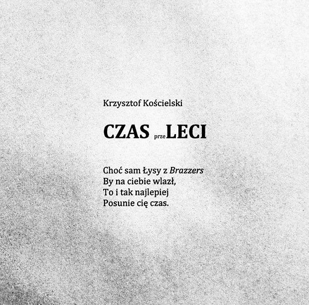

  

### Pan Cogito o potrzebie ścisłości

(...)

a przecież w tych sprawach konieczna jest aktualność

nie wolno się pomylić

nawet o jednego

 

jesteśmy mimo wszystko

stróżami naszych braci

niewiedza o zaginionych

podważa realność świata

 

wtrąca w piekło pozorów

diabelską sieć dialektyki

głoszącej że nie ma różnicy

między subiekcją a widmem

 

musimy zatem wiedzieć

policzyć dokładnie

zawołać po imieniu

opatrzyć na drogę

w miseczce z gliny

proso mak kościany grzebień

groty strzał

pierścień wierności

### Konstanty Ildefons Gałczyński, Zima z wypisów szkolnych

Któż to tak śnieżkiem prószy z niebiosów?
Dyć oczywiście pan wojewoda;
módl się, dziecino, z całą krainą -
niech Bóg mu siły doda;
śnieżku naprószył, śnieżek poruszył
dobry pan wojewoda.

A któż na szybach maluje kwiaty,
czy mróz, czy mróz, dziecino?
Nie, to rączuchną dla siebie, żabuchno,
starosta ze starościną;
srebrzyste prążki, listki, gałązki
dla ciebie, dziwna dziecino.

A któż te śliczne zawiesił sople
za oknem u okapu?
Czy może także mróz niedobry
swą fantastyczną łapą?
Bie, moje złoto, to referenci,
podkierownicy, nadasystenci
nocą nie spali, hurra! wołali,
sople poprzyklejali.

Hej, tam w Warszawie jest pan minister
siwy i taki miły,
przez okno rzuca spojrzenia bystre,
bo chce, by dla ciebie były
zimą sopelki, śniegi i lody:
wszystkie zimowe wygody.

Jeżeli tedy sanki usłyszycz
i dzwonki ich tajemnicze,
wiedz: to minister w skupionej ciszy
nacisnął taki guziczek,
że gwiazdki dzwonią i gwiazdki lśnią
nad miastem i nad wsią.

Konstanty Ildefons Gałczyński
1936

### Herbert Zbigniew - Potęga smaku

Pani Profesor Izydorze Dąmbskiej
Potęga smaku

To wcale nie wymagało wielkiego charakteru
nasza odmowa niezgoda i upór
mieliśmy odrobinę koniecznej odwagi
lecz w gruncie rzeczy była to sprawa smaku
Tak smaku
w którym są włókna duszy i cząstki sumienia

Kto wie gdyby nas lepiej i piękniej kuszono
słano kobiety różowe płaskie jak opłatek
lub fantastyczne twory z obrazów Hieronima Boscha
lecz piekło w tym czasie było jakie
mokrt dół zaułek morderców barak
nazwany pałacem sprawiedliwości
samogonny Mefisto w leninowskiej kurtce
posyłał w teren wnuczęta Aurory
chłopców o twarzach ziemniaczanych
bardzo brzydkie dziewczyny o czerwonych rękach

Zaiste ich retoryka była aż nazbyt parciana
(Marek Tulliusz obracał się w grobie)
łańcuchy tautologii parę pojęć jak cepy

dialektyka oprawców żadnej dystynkcji w rozumowaniu
składnia pozbawiona urody koniunktiwu

Tak więc estetyka może być pomocna w życiu
nie należy zaniedbywać nauki o pięknie

Zanim zgłosimy akces trzeba pilnie badać
kształt architektury rytm bębnów i piszczałek
kolory oficjalne nikczemny rytuał pogrzebów

Nasze oczy i uszy odmówiły posłuchu
książęta naszych zmysłów wybrały dumne wygnanie

To wcale nie wymagało wielkiego charakteru
mieliśmy odrobinę niezbędnej odwagi
lecz w gruncie rzeczy była to sprawa smaku
Tak smaku
który każe wyjść skrzywić się wycedzić szyderstwo
choćby za to miał spaść bezcenny kapitel ciała
głowa

### C.K. Norwid

“Ogromne wojska i bitne generały
Policje jawne, tajne i dwupłciowe
Przeciwko komu się tak pojednały?
Przeciwko kilku myślom, co nie nowe”

### Przesłanie Pana Cogito

Idź dokąd poszli tamci do ciemnego kresu
po złote runo nicości twoją ostatnią nagrodę

idź wyprostowany wśród tych co na kolanach
wśród odwróconych plecami i obalonych w proch

ocalałeś nie po to aby żyć
masz mało czasu trzeba dać świadectwo

bądź odważny gdy rozum zawodzi bądź odważny
w ostatecznym rachunku jedynie to się liczy

a Gniew twój bezsilny niech będzie jak morze
ilekroć usłyszysz głos poniżonych i bitych

niech nie opuszcza ciebie twoja siostra Pogarda
dla szpiclów katów tchórzy – oni wygrają
pójdą na twój pogrzeb i z ulgą rzucą grudę
a kornik napisze twój uładzony życiorys

i nie przebaczaj zaiste nie w twojej mocy
przebaczać w imieniu tych których zdradzono o świcie

strzeż się jednak dumy niepotrzebnej
oglądaj w lustrze swą błazeńską twarz
powtarzaj: zostałem powołany – czyż nie było lepszych

strzeż się oschłości serca kochaj źródło zaranne
ptaka o nieznanym imieniu dąb zimowy
światło na murze splendor nieba
one nie potrzebują twego ciepłego oddechu
są po to aby mówić: nikt cię nie pocieszy

czuwaj – kiedy światło na górach daje znak – wstań i idź
dopóki krew obraca w piersi twoją ciemną gwiazdę

powtarzaj stare zaklęcia ludzkości bajki i legendy
bo tak zdobędziesz dobro którego nie zdobędziesz
powtarzaj wielkie słowa powtarzaj je z uporem
jak ci co szli przez pustynię i ginęli w piasku

a nagrodzą cię za to tym co mają pod ręką
chłostą śmiechu zabójstwem na śmietniku

idź bo tylko tak będziesz przyjęty do grona zimnych czaszek
do grona twoich przodków: Gilgamesza Hektora Rolanda
obrońców królestwa bez kresu i miasta popiołów

Bądź wierny Idź

### Passa

Sąsiad, wpadając niespodziewanie,

Zwłaszcza gdy sobie ciut golnie,

Zawsze zadaje mi to pytanie:

Kiedy to wreszcie…? Tra la la la la.

 

Co dzień się zmiany wprowadza nowe,

Czyniąc to dość nieudolnie.

Sąsiad się ciągle łapie za głowę:

Przecież to zaraz… tra la la la la.

 

Ja mu tłumaczę, że taką władzę

Wybraliśmy dobrowolnie,

A on mi na to: Nic nie poradzę,

Ale to wkrótce… tra la la la la.

 

Tak jak przed laty, proces odnowy

Musi się zacząć oddolnie.

Naród po rozum pójdzie do głowy,

I w końcu wszystko… tra la la la la.

 

Z tego powodu logiczny wniosek

Nasuwa się mimowolnie:

Gdy prawda dotrze do miast i wiosek,

Wtedy to z hukiem… tra la la la la.

 

Koła historii, jak uczą dzieje,

Toczą się szybciej lub wolniej,

Lecz każdy reżim, mam tę nadzieję,

Wcześniej czy później… tra la la la la.

 

Wybaczcie, proszę, że poemacik

Zakończę nieco frywolnie,

Ale pocieszyć pragnę współbraci,

Że to niebawem… tra la la la la.

### Władysław Szlengel , Nasz Przegląd, 1.04.39 r.

Prima Aprilis

boki zrywać panowie...
uczta prawdziwa panowie...
spojrzałem panowie mili
gdy gazeciarz pismo mi dawał
wiedziałem - prima aprilis
więc na kawale - kawał...
z nagłówków chichotał nonsens -
ze szpalt szaleństwo drwiło -
i żartu dobry kąsek
więc nic mnie nie zdziwiło:
że Fuhrer i Duce niszczeniem traktatów
chcą gwarantować pokój światu
że ofiara przychodzi prosić przemoc -
że wolność swą ludzie oddają niemo -
że kraj swój obcym rzucają pod stopy
że znowu zmienia się mapa Europy -
że znowu się Żydom grunt gdzieś zapalił
że ledwie spoczęli znów trzeba dalej
że przez twarde pigułki z Essen
ludzie w Niemczech nie mają zu essen...
że dał się bezczelnie wywieść w pole
stary i mądry lis z parasolem...
że wszystkie ludzkie umowy na nic
że giną że płoną słupy granic
czytałem spokojnie brednie gazety
prima aprilis! gniewać się?! Nietakt!
a potem spostrzegłem niestety że to... wczorajsza gazeta

### Bieda

Choć jestem lekarzem
I o niczym innym nie marzę
Pieniędzy brakuje
Nawet, kiedy nie wariuję

Powiecie: „jak zwykle kłamie!”
Konowale bogaty, Ty chamie!
Lecz, gdy moja działalność ruszyła
Zatrudnienie znacznie utrudniła

Jestem więc bez pracy
Bo zarządcy tacy
Wolą pracować w spokoju
Niż potrzebnym znoju

Morał z tego taki
Lepiej bądź nijaki
Nie walcz o poprawy
Pier... wszystkie sprawy.

B. Fiałek

### Gotowy zestaw, nie zawiera baterii

Składa się z powłoki skórnej, skóra naturalna
W niektórych egzemplarzach napięta,
W niektórych wiotka,
Zazwyczaj jednak całkiem ładna.

Pod skórą mięso,
Nazwane czulej: mięśnie.
Tych w zależności od modelu
Zestaw różnie mieści.

Pod mięśniami różne instrumenty,
Zwane także organami.
Sympfonia dźwięków
Wspomagana krwiobiegami.

I jeszcze parę innych dziwnych rzeczy,
Ciężko je w instrukcji opisać,
Tworzący instrukcję się męczył.
Bo dla przykładu,
Mogłoby być wszystko jasne: mózg to mięsień?
Ale jak się okazało,
W tym nibymięśniu zawarł się umysł jeszcze.
I o nim instrukcji nie sposób napisać,
Każdy umysł inny, nieseryjny wychodzi,
A w instrukcji nie wolno zmyślać.
I to samo z sercem,
A jakże, także,
Ale zaczęli go rysować inaczej,
Niż wygląda wszakże
I się "pokrzaczyło",
Raz serce boli, zawala się zawałem,
Raz w nim miło...

Gotowy zestaw, całkiem ładny,
Tylko nie zawiera baterii
Ani ładowarki.
Skąd je wziąć? Nie jestem pewien...
Niech każdy sam to rozważy.

### Kornel Filipowicz, wiersz z tomu "Powiedz to słowo", 1984

> W państwie totalitarnym
> Wolność
> Nie będzie nam odebrana
> Nagle
> Z dnia na dzień
> Z wtorku na środę
> Będą nam jej skąpić powoli
> Zabierać po kawałku
> (Czasem nawet oddawać
> Ale zawsze mniej, niż zabrano)
> Codziennie po trochę
> W ilościach niezauważalnych
> Aż pewnego dnia
> Po kilku lub kilkunastu latach
> Zbudzimy się w niewoli
>
> Ale nie będziemy o tym wiedzieli
> Będziemy przekonani
> Że tak być powinno
> Bo tak było zawsze.

### NARODOWO

W NARODOWYM szpitalu, z NARODOWEJ apteki,

NARODOWY pielęgniarz, NARODOWE ma leki.

W NARODOWYM lockdownie NARODOWA gehenna,

NARODOWA mitręga ,skisła, nudna i senna.

NARODOWO zamknięte NARODOWE markety,

NARODOWA policja bije NARÓD niestety.

NARODOWE podatki NARODOWY Sejm daje,

bo takie są ostatnio NARODOWE zwyczaje.

NARODOWE złodziejstwo, NARODOWE przekręty

NARODOWY bandyta ,co kreuje się świętym.

Czasem marsz NARODOWY ludzi z lekka przerazi

zgodnie z wolą i chęcią NARODOWYCH włodarzy.

W NARODOWEJ pandemii NARODOWA "prywatka"

NARODOWEGO skarbu - "nadzakonnika Tadka".

NARODOWY poeta pozostaje na szańcu,

ale w coraz ciaśniejszym NARODOWYM kagańcu.

I tak sobie żyjemy bez perspektyw i celu,

w tym naszym ,zwariowanym, NARODOWYM BURDELU.”

### Bezsilność

to bez­sil­ność uszmin­ko­wa­ła świat

do fo­to­gra­fii

śnieg upu­dro­wal kieł­ki kon­wa­lii

i drze­wa mają wy­gię­te rzę­sy

prze­świe­tlo­ne okrą­głym księ­ży­cem

- świat jest taki ład­ny -

na uli­cy

dłu­gi cień la­tar­ni

wplą­tał się w de­ski pło­tu

mil­czą­ce­go po­dłuż­nie

w bra­mie - na prze­kór

skrzy­pią­cym kro­kom

kwit­ną po­ca­łun­ki

sły­szysz - dzwo­nią

jak drze­mią­ce głów­ki kon­wa­lii

- świat jest taki ład­ny-

po dru­giej stro­nie

za­mknię­tych okien

*H.Poświatowska

---

Kiedy przyszli...
Martin Niemöller, 1892-1984
(niemiecki pastor luterański; wiersz napisany w obozie w Dachau w 1942 r.)
Kiedy przyszli po Żydów, nie protestowałem. Nie byłem przecież Żydem.
Kiedy przyszli po komunistów, nie protestowałem. Nie byłem przecież komunistą.
Kiedy przyszli po socjaldemokratów, nie protestowałem.
  Nie byłem przecież socjaldemokratą.
Kiedy przyszli po związkowców, nie protestowałem. Nie byłem przecież związkowcem.
Kiedy przyszli po mnie, nikt nie protestował. Nikogo już nie było.

---

<https://pl.wikipedia.org/wiki/Juan_Ram%C3%B3n_Jim%C3%A9nez>

https://pl.wikipedia.org/wiki/Iwan_Franko

https://pl.wikipedia.org/wiki/Taras_Szewczenko

https://pl.wikipedia.org/wiki/Litopys_UPA

https://pl.wikipedia.org/wiki/Sergiusz_Piasecki

https://pl.wikipedia.org/wiki/Sylvia_Plath

---

<a href="https://github.com/TomaszWaszczyk/historia.waszczyk.com/edit/master/src/content/poezja.md" target="_blank">Edytuj tę stronę dzieląc się własnymi notatkami!</a>

<!-- 

Hłasko, Jarmusch, Noe, Bertolucci, Lennon, Komeda.

"W dupie mam Polskę i jebać za grosze.
Anglia czy Niemcy tam się wynoszę.
Liczą się funty, liczy się euro, 
Spieprzam na zachód tam tego pełno. 
   Mijają lata, wieśniak jest Panem, 
   Choć na zachodzie ma przejebane. 
   Niby ma euro, funty, dolary, 
   Lecz przed innymi, wciąż będzie szary. 
Inny zarabia trzy razy więcej, 
A Polak w gównie tapla swe ręce. 
Bo chociaż z Polski uciekł z przed laty, 
To pokazuje, że jest bogaty. 
   I teraz popatrz Drogi Rodaku, 
   Jak Ty kurewsko boisz się piachu. 
   Nie chcesz już euro, nie chcesz dolara, 
   I czemu każdy tak z Was spierdala?! 
Tydzień wakacji i trzy dni święta, 
Myślisz że tutaj nikt nie pamięta. 
A teraz czekasz na samoloty, 
Byś mógł do Polski wrócić z powrotem. 
   Grunt pod nogami zaczął się palić, 
   Nie jesteś skory by zachód chwalić. 
   Kiedy już ludzi wywożą w workach, 
   To Ty narzekasz że stoisz w korkach. 
Kiedy ostatnio bliskich widziałeś, 
Na dwa tygodnie bana im dałeś. 
A kiedy wszystko wróci do normy, 
Ty znów spierdolisz, spakujesz torby.." -->

---

<a href="https://github.com/TomaszWaszczyk/historia.waszczyk.com/edit/master/src/content/poezja.md" target="_blank">Edytuj tę stronę dzieląc się własnymi notatkami!<a>
