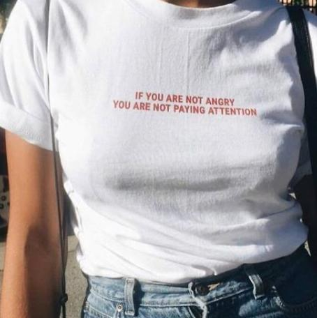

  

> Ludzie wolni są braćmi

> Poznacie prawdę a prawda was wyzwoli- Ewangelia Jana 8:32

Rosja nigdy nie jest tak silna jak się sądzi, ani nigdy taka słaba jak sie wydaje.

Naturalną konsekwencją dużej zmienności dodatniej (z punktu widzenia jednostki), jest duża zmienność ujemna dla innej jednostki(a ta jest destrukcyjna, a nawet potencjalnie śmiertelna).

Nauczenie się definiujemy jako zmianę w zachowaniu. Niczego się nie nauczyłeś, dopóki nie możesz podjąć działania i wykorzystać tego, czego się uczyłeś. - Ken Blanchard

Słowianie to naród niewolników, pytają się tylko kto jest ich panem i komu mają służyć. - Hitler

nie można nie zrobić niczego, tylko dlatego, że nie możesz zrobić wszystkiego

Nadmiar myślenia to niedobór przeżywania

  

na wojnie prawda umiera pierwsza

...musimy zrobić w Polsce to co zaakceptuje Fundusz Walutowy, Bank Światowy i nasi inni nasi kredytodawcy bo Polska jest bankrutem, a inaczej umrzemy z głodu i zimna - Jacek Żakowski o 1989

mój naród (żydowski) przetrwał tylko dlatego, że my pamiętamy - Jakub Berkman

examine the world you interact with

<!-- emocje są dla mas, ale nie dla nas -->

Slaves produces surples that master gets, employees produce a surplus which the employer gets

chaotyczne czasy rodzą wielkich bohaterów

umieć żyć rzeczywistością

Only the Paranoid Survive

  

Factis ut credam facis.

Learn a skill you can barter with.

Wojna już się skończyła i nie potrzebujemy was, spełniliście swoją powinność. - Winston Churchill do Andersa po wojnie

szukam, pytam, błądzę

wyższy level wiąże knebel

artysta płodny, artysta głodny

Too many people desire a promotion when it will make them more miserable. They're on the fiat treadmill, climbing a status ladder they don't particularly like.

"If you're not going to tell your grandchildren about the stuff you're working on now, you're probably not working on the right stuff."

A recipe has no soul. You, as the cook, must bring soul to the recipe.

Twoje pieniądze w banku nie są Twoje, nie są w banku i nie są pieniądze

Putin: "95% światowych ataków terrorystycznych jest organizowanych przez CIA".

Własna niemoc jest groźniejsza niż obca przemoc

Masz tu rower, stare buty, wypierdalaj z Nowej Huty'

Kto prawdę mówi, ten niepokój wszczyna

słychać wycie znakomicie

In the absence of the gold standard, there is no way to prevent confiscation of savings through inflation. ~ Alan Greenspan (1966)

"Sovereignty is not given, it is taken." – Atatürk

dwa razy się pomyśli, zanim nic się nie powie

"Być sobą" to najlepszy sposób, by być nikim; "żyć po swojemu" to najlepszy sposób, by żyć byle jak; "iść za głosem serca" to najlepszy sposób, by zagłuszyć rozum; a "łapać chwilę" to najlepszy sposób, by zmarnować wieczność. Słowem - im więcej swawoli, tym więcej niewoli, a im więcej frywolności, tym mniej wolności.

“The welfare of humanity is always the alibi of tyrants.” -Camus

And Nature allows the evolution of parasitism and predation as well as the evolution of symbiotic relationships.

'the idea is to decentralize control' ~ John Forbes Nash Jr., Parallel Control, 1954

Socialists want to create a world free from material possessions... for you, but not for them.

Drugą Wojnę Światową wygrali amerykanie rękami i krwią rosyjskich żołnierzy (i polskich - w mniejszej części).

real is rare

clarify, do not simplify

health is wealth

Attitude is a little thing that makes a big difference. - Winston Churchill.

Human beings are born with different capacities. If they are free, they are not equal. And if they are equal, they are not free. - Aleksandr Solzhenitsyn

Always find a way to unplug

Thomas Jefferson 250 lat temu mówił o tym, że gorsze są banki od stacjonujących armii.

„This is the West. They raised Hitler, Stalin, and now they are raising Putin.” - 2004, Generał Kukliński

„Der Krieg ist darin schlimm, daß er mehr böse Menschen macht, als er deren wegnimmt.“ - Immanuel Kant

  

> Economists have learned higher levels of technology or of industrial or agricultural arts derive from long histories of the "feed-back" of earned assets into components of the economy forming capacity for production at comparatively higher levels of technology, science, or arts

  

Nie ma co kruszyć kopii na xyz - nie ma sensu się sprzeczać o xyz

Cryptography is the ultimate form of non-violent direct action.

"First, solve the problem. Then, write the code." - This quote by John Johnson emphasizes the importance of understanding and resolving the underlying issue before jumping into coding.

  

Minister Morawiecki (19.10.2017): „Jesteśmy w sytuacji w pewnym sensie nie do odwrócenia, ponieważ jesteśmy „krajem posiadanym przez kogoś z zagranicy”.

sprzedawaj krowe, sprzedaj konie, kup zegarek marki błonie

wielke umysly myślą podobnie

czas spadania łusek

kto był rozsądny na Tytanicu? orkiestra?

  

  

tools don't matter, creation does

Ordo Ab Chao

> Myśl jak człowiek działający, działaj jak człowiek myślącyHenri Bergson

  

cymbalistów było wielu

First, you learn. And then you remove the "L".

nie staniesz, nie dostaniesz

"Managing a volunteer open source project is a lot like herding kittens, except the kittens randomly appear and disappear because they have day jobs." -- Matt Mackall

Pieniądz, który człowiek posiada to swoboda, ten za którym goni, to niewola - Jean Jacques Rousseau

I do not copy-paste from the Internet, I monomorphize it.

Najpierw tworzymy swoje nawyki. Potem one tworzą nas.

"The strong do what they have the power to do. The weak accept what they have to accept." - Thucydides

Zgubić się to żaden wstyd. Wstydem jest nie szukać właściwej drogi.

  

5% brain, 95% consistency and discipline

Jest prawda czasu i jest prawda ekranu.

ktoś podwinął te rękawy

You should never regret anything in life. If it's good, it's wonderful. If it's bad, it's experience.

Europa to stara dziewica która by chciała, ale nie chciała.

“And then I looked at the stars, and considered how awful if would be for a man to turn his face up to them as he froze to death, and see no help or pity in all the glittering multitude.” - “Great Expectations” Charles Dickens - 1860

  

  

memoria fragilis est

W dzisiejszym świecie kapitał wynajmuje władze polityczne - forma wynajmuje nazywa się wybory.

„Pierwszym panaceum na źle zarządzany naród jest inflacja waluty; drugim jest wojna. Obydwa przynoszą tymczasowy dobrobyt; oba przynoszą trwałą ruinę. Ale oba są schronieniem dla oportunistów politycznych i gospodarczych”.
- Ernest Hemingway (1899-1961)

"The first panacea for a mismanaged nation is inflation of the currency; the second is war. Both bring a temporary prosperity; both bring a permanent ruin. But both are the refuge of political and economic opportunists."
- Ernest Hemingway (1899-1961)

"There is no national security without cybersecurity, and there is no modernization without informatization" - President Xi Jinping

Believe what you see, not what you’re told

Ludzie nie myślą. Ludzie myślą, że myślą. - Mark Twain

Słychać wycie? Znakomicie.

Szukał chłop w dupie szczęścia.. gówno znalazł.

---

<a href="https://github.com/TomaszWaszczyk/historia.waszczyk.com/edit/master/src/content/powiedzenia-bis.md" target="_blank">Edytuj tę stronę dzieląc się własnymi notatkami!</a>
