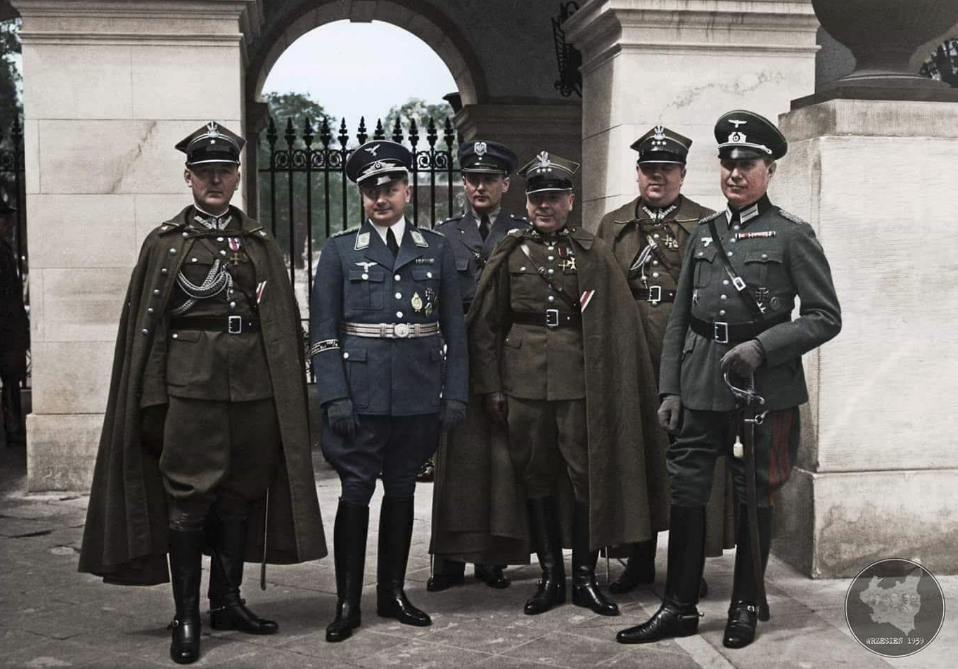

### 2017

The demand for long-term data storage is reaching unprecedented levels. By 2023, it’s expected that over 100 zettabytes of data will be stored in the cloud. Operating at such scales requires a fundamental re-thinking of how we build large-scale storage systems, as well as the underlying storage technologies that underpin them.

Project Silica is developing the first-ever storage technology designed and built from the media up, for the cloud. We are leveraging recent discoveries in ultrafast laser optics to store data in quartz glass by using femtosecond lasers, and building a completely new storage system designed from scratch around this technology. This opens up an incredibly exciting opportunity to challenge and completely re-think traditional storage system design, and to co-design the future hardware and software infrastructure for the cloud.

### 1992

Zamordowano Piotra Jaroszewicza https://pl.wikipedia.org/wiki/Piotr_Jaroszewicz

### 1943

Obwieszczenie wydane przez Kierownictwo Walki Podziemnej.

  

### 1939 - Polska jako "państwo sezonowe" - Saisonstadt

O godz. 4:40 Niemcy zrzucili kilkaset śmiercionośnych pocisków na bezbronne miasto Wieluń (miasto które spało). Tu została dokonana pierwsza wojenna zbrodnia na bezbronnej ludności miasta. Zabili co najmniej kilkuset mieszkańców. Wielu ludzi nie obudziło się już więcej..

Nalot przeprowadzono nagle, bez wypowiedzenia wojny Polsce przez III Rzeszę.

Bombardowanie trwało do 27 września 1939. Bomby były zrzucane celowo na szpitale i cmentarze, a niemieckie samoloty latały bardzo nisko nad miastem, by móc ostrzeliwać ludzi z karabinów maszynowych. W samym tylko nalocie dywanowym przeprowadzonym 25 września zginęło ok. 10 tys. mieszkańców, 35 tys. zostało rannych.

o godzinie 4:30 rano niemiecki pancernik Schleswig-Holstein powoli zaczął zbliżać się do Westerplatte. W kwadrans później działa pancernika otworzyły ogień. Do szturmu na Wojskową Składnicę Tranzytową ruszyło ponad 3 tysiące niemieckich żołnierzy z morza, lądu i powietrza.

Pancernik przybył z misja szkolną i kurtuazyjną do Wolnego Miasta Gdańsk, a rankiem 1 wrzesnia 1939 roku otworzył ogień bez wypowiedzenia wojny. Przyjacielska i kurtuazyjna wizyta okrętu szkolnego sasiedniego państwa.

Fragment rozkazu Adolfa Hitlera do ataku na Polskę z 31 sierpnia 1939 roku:
> Atak przeciwko Polsce powinien być przeprowadzony zgodnie z przygotowaniem do „Fall Weiss”, ze zmianami dotyczącymi armii lądowej w
> związku z zakończoną w międzyczasie koncentracją. Podział zadań i cel operacji pozostają niezmienione. Dzień ataku: 1 września 1939. Czas
> ataku: godzina 4 minut 45. Czas ten obowiązuje również dla operacji w Gdyni, Zatoce Gdańskiej i przy moście w Tczewie."

Fragment wystąpienia Adolfa Hitlera w niemieckim parlamencie z dnia 1 września 1939 roku:

> Moje umiłowanie pokoju i moją bezkresną cierpliwość opacznie uznano za słabość lub nawet tchórzostwo! Dlatego wczoraj wieczorem podjąłem decyzję,
> by powiadomić rząd brytyjski, że w takich okolicznościach nie odnajduję już po stronie polskiej szczerej woli do prowadzenia z nami poważnych
> rozmów. Tym samym misja mediacji nie powiodła się. Bo w tym czasie na jej propozycję Polska odpowiedziała najpierw ogłoszeniem powszechnej mobilizacji, > a później nowymi okrucieństwami. Te zajścia znowu miały miejsce dziś w nocy. Podczas, gdy nie tak dawno temu w ciągu jednej nocy odnotowano 21
> takich incydentów granicznych, dziś w nocy było ich 14, w tym 3 całkiem poważne.
> Dlatego też zostałem zmuszony do podjęcia decyzji, aby prowadzić rozmowy z Polską w tym samym języku, w jakim Polacy rozmawiają z nami.

Wojska niemieckie zgodnie z planem Fall Weiss uderzyły na Polskę na całej 1600 km długości polsko-niemieckiej granicy oraz z terytorium Moraw i Słowacji. Prezydent Rzeczypospolitej Polskiej Ignacy Mościcki wezwał naród do obrony wolności i niepodległości kraju.

Założeniem planu Fall Weiss było okrążenie i zniszczenie Wojska Polskiego na zachód od linii Wisły nie później niż w czternastym dniu od uderzenia Wehrmachtu. Wojsko polskie pokrzyżowało jednak niemieckie plany.

Już w pierwszych dniach września udało się Niemcom przełamać polskie linie obronne i zająć Kujawy, część Wielkopolski i Śląsk. Na północy główne siły polskie, skoncentrowane w rejonie Mławy i na Pomorzu, zostały 1–3 września rozbite, a Armia Modlin, atakowana przez niemiecką 3 Armię podczas bitwy pod Mławą, zmuszona była wycofać się na linię rzek Wisły i Narwi.

Broniły się Westerplatte, Gdynia, Kępa Oksywska i Hel – aż do 2 października. Warszawa skapitulowała 28 września.

Również Armia Poznań pod dowództwem gen. Tadeusza Kutrzeby i Armia Pomorze pod dowództwem gen. Władysława Bortnowskiego cofnęły się aż za linię Warty i tam w okolicy Kutna nad rzeką Bzurą w dniach 9-18 września stoczyły jedną z największych bitew kampanii wrześniowej. Starły się z niemiecką 8 Armią dowodzoną przez gen. Johannesa Blaskowitza i 10 Armią gen. Waltera von Reichenau z Grupy Armii Południe. Gen. Kutrzeba postanowił wykorzystać to, że Wehrmacht zachowywał się dość biernie wobec wojsk Armii Poznań i zaatakował skrzydło 8 Armii niemieckiej. Planował on atak na pozycje niemieckie już parę dni wcześniej – 4 i 5 września podczas rozwinięcia natarcia 8 Armii na linię rzek Warta i Widawka na pozycje Armii Łódź. Nie zgadzał się na to Naczelny Wódz, ale pozycja obronna Armii Łódź została przełamana, zaś gen. Kutrzeba podtrzymał swoją propozycję zwrotu zaczepnego wobec wojsk niemieckich zmierzających bez istotnej osłony z lewej flanki w kierunku Warszawy. Do powodzenia operacji w początkowej fazie ataku według planów gen. Kutrzeby miał się przyczynić także czynnik psychologiczny, czyli chęć do walki z wrogiem żołnierzy Armii Poznań, która dotychczas tylko się wycofywała nie biorąc udziału w walkach na froncie.

---

O tej godzinie 4.45 niemiecki pancernik szkolny "Schleswig Holstein" oddał strzał w kierunku Składnicy Tranzytowej na Westerplatte, a samoloty Legionu Condor zrzuciły na Wieluń pierwsze bomby. Niemcy przypuścili również atak na budynek Poczty Polskiej w Wolnym Mieście Gdańsk, zbombardowali Oksywie, Puck i Hel. 7 września 1939 roku Wermacht dotarł do Warszawy.
Na terenie całej Polski został wprowadzony stan wojenny. Oto treść zarządzenia wydanego przez prezydenta Ignacego Mościckiego:
" „Obywatele Rzeczypospolitej! Nocy dzisiejszej odwieczny wróg nasz rozpoczął działania zaczepne wobec Państwa Polskiego, co stwierdzam wobec Boga i Historii. W tej chwili dziejowej zwracam się do wszystkich obywateli państwa w głębokim przeświadczeniu, że cały naród w obronie swojej wolności, niepodległości i honoru skupi się dookoła Wodza Naczelnego i sił zbrojnych oraz da godną odpowiedź napastnikowi, jak to się już nieraz działo w historii stosunków polsko-niemieckich. Cały naród polski, błogosławiony przez Boga, w walce o swoją świętą i słuszną sprawę, zjednoczony z armią, pójdzie ramię przy ramieniu do boju i pełnego zwycięstwa”

---

Sojusznicy? Attache wojskowy Ambasady Niemiec w Polsce ppłk. von Gerstenberg (drugi z lewej) w asyście polskich wojskowych na tle Grobu Nieznanego Żołnierza, 17 kwietnia 1938 r. Zdjęcie ze stron Wrzesień 1939.

Kiedyś, wiele lat temu, kiedy dyskusje o historii były na poziomie, bez przypinania łatki ''nazisty'', był pewien człowiek. Miał okulary, kędzierzawą siwą brodę i spokojny, nieco chrapliwy głos. On jako jeden z pierwszych zwrócił uwagę, że Polska popełniła katastrofalny błąd w 1939 roku. Że powinna była postąpić inaczej. Nie bał się kontrowersyjnych tez i burzył romantyczne mity historyczne.

Chociaż pana profesora Pawła Wieczorkiewicza nie ma z nami już od dziesięciu lat, jego idee są dalej żywe i przekazywane - choćby przez Piotra Zychowicza.

W przededniu okrągłej, 80. rocznicy wybuchu II wojny światowej, jak bumerang wraca do nas pytanie - czy Polska postąpiła słusznie, sprzeciwiając się Niemcom i stając do walki, czy może było inne wyjście.

Odrzućmy więc z tej dyskusji rozemocjonowane sofizmaty, histeryczne wrzaski o ''podludziach'', romantyczną martyrologię ''Chrystusów Europy'' i ''moralnych zwycięzców'', marksistowski determinizm, i spróbujmy zastanowić się nad faktami.

Problemem tej teorii - mającej przecież sensowne podstawy i dość prawdopodobnej - jest to, że najczęściej jest ona zakrzykiwana pełnymi oburzenia zdaniami i przerażającymi wizjami dymiących kominów, co niestety, pomija najważniejszy jej aspekt. Militarny.

Całą dyskusję należy zacząć od ponadczasowego cytatu Henry'ego Temple, 3. wicehrabiego Palmerston:

''Wielka Brytania nie ma wiecznych sojuszników, ani wiecznych wrogów. Wieczne są tylko interesy Wielkiej Brytanii, oraz obowiązek ich ochrony''

Wojsko Polskie w XX-leciu międzywojennym przygotowywało się do walki z Sowietami, a nie Niemcami, czy kimkolwiek innym. Temu służyć miał sprzęt, który uznawano za przejawy megalomanii w okresie PRL, a który po prostu nie został użyty zgodnie z przeznaczeniem. ORP ''Gryf'' i duże niszczyciele miały prowadzić walkę w rejonie Zatoki Fińskiej, a nie bronić Wybrzeża. Tam też miały operować duże okręty podwodne jak ORP ''Orzeł''. Z tego powodu zainwestowano w szybkie bombowce PZL. 37 ''Łoś''. Utrzymywano liczne jednostki kawalerii - nieprzydatnej w walce z jednostkami pancernymi, ale użytecznej na rozległych stepach, pozbawionych dróg. Po to wyposażano hojnie - jak na 1939 rok - piechotę w broń przeciwpancerną i próbowano nadążyć w liczbie czołgów za światową czołówką - Polska, mając 880 czołgów i tankietek, była na 6. miejscu na świecie.

Dojście do władzy nazistów doprowadziło do czasowego unormowania stosunków polsko-niemieckich. Adolf Hitler był Austriakiem i nie podzielał prusko-junkierskich resentymentów. W swojej książce ''Mein Kampf'' poświęcił Polsce... jedno zdanie, w dodatku krytykując politykę kajzerowskich Niemiec wobec Polaków (!!!). W Polsce upatrywał silnego gracza, rosnące z roku na rok regionalne mocarstwo, które jeszcze przed wojną zdystansowało wiele dłużej istniejących krajów, i które zdołało wywalczyć swoją niepodległość zbrojnie i odeprzeć bolszewicką nawałę w 1920 r. Józef Piłsudski w III Rzeszy cieszył się dużym szacunkiem i estymą, jako potencjalny sojusznik i mąż stanu. Zawarty w 1934 roku 10-letni pakt o nieagresji spowodował znaczne odprężenie w relacjach polsko-niemieckich, a niemiecki kanclerz pojawiał się w polskich publikacjach jako głowa zaprzyjaźnionego państwa.

Piłsudski pozostawił Polskę w rękach ludzi niekompetentnych i chwiejnych. Marszałek przed śmiercią żądał, by wszelkimi sposobami nie dopuścić do tego,by przyszła wojna w Europie zaczęła się od Polski i toczyła się na polskich ziemiach. Im później i im dalej - tym lepiej. Józef Beck, ufny w zapewnienia swojego bliskiego współpracownika, płk. Tadeusza Kobylańskiego, w swoich kalkulacjach o rozkładzie sił w Europie, całkowicie pominął rolę ZSRR. Prof. Wieczorkiewcz do końca życia utrzymywał, że Kobylański był w rzeczywistości sowieckim agentem, który zapewnił Sowietom całkowity wgląd w pracę polskich dyplomatów i wywiadu. Warto tu wspomnieć, że marszałek Erich von Manstein w swoich wspomnieniach pisze, że do wiosny 1939 roku nie było żadnego planu wojny przeciw Polsce. Zwrot w niemieckiej polityce był zemstą zawiedzionego, odtrąconego kochanka, który postanowił zetrzeć z powierzchni ziemi kraj, który odrzucił jego zaloty. Pewny swego Beck, ufny w siły sojusznicze, przekonany, że Niemcy to ''papierowy tygrys z 9 dywizjami'', wplątał swój kraj w wojnę w obronie niemieckiego miasta, jakim był Gdańsk, przed Niemcami.

A gdyby było inaczej? Gdyby i tak zdominowany przez Niemców Gdańsk trafił do Niemiec, a Polacy, jak proponowali w latach 20., zbudowaliby eksterytorialną autostradę przez Pomorze?

Scenariusz byłby ciekawy, ale i ryzykowny.

Niemcy planowali działać etapami. Najpierw - pokonać Francję, podczas gdy Polacy będą osłaniać wschodnie granice, a następnie wspólnie uderzyć na ZSRR.

Wojsko Polskie w roku 1941 byłoby z pewnością silniejsze i najpewniej przewyższałoby zarówno uzbrojeniem, jak i wyposażeniem, większość niemieckich sojuszników roku 1941. Opisując Unternehmen ''Barbarossa'' byłem zdziwiony, że w zasadzie większość niemieckich sojuszników prezentowała poziom słabszy od Wojska Polskiego - pokonanego przecież dwa lata wcześniej. Węgrzy, Finowie, Rumuni - oni wszyscy dysponowali zbieraniną sprzętu, nierzadko zdobycznego, z dużymi brakami w uzbrojeniu i transporcie. Na tym tle prawdopodobny kontyngent WP (zapewne liczący 350-500 tys. ludzi) prezentowałby się wręcz luksusowo. ;) Skoro polski sprzęt wziął udział, dość skutecznie, w walkach z Sowietami w ramach armii węgierskiej, czy rumuńskiej - to pewnie w rękach polskich by się sprawdził, zwłaszcza, że zdążono by go unowocześnić i rozpowszechnić w większym stopniu.

Jednakże, należy pamiętać, że podpisanie hipotetycznego paktu Ribbentrop-Beck wykluczyłoby przecież zawarcie paktu Ribbentrop-Mołotow. A to właśnie przez postanowienia owego paktu, a konkretnie przez jego tajny protokół, wiele państw dołączyło do Osi - mam tu na myśli przede wszystkim ograbioną przez ZSRR z Besarabii Rumunię, oraz ograbioną z Karelii Finlandię (która, gwoli ścisłości, została napadnięta 1941 r.). Niewiadomą byłby też los państw bałtyckich - czy zostałyby anektowane przez ZSRR, czy nie - chociaż można założyć, że Sowieci, ubiegając działania Niemiec, właśnie tak by postąpili. Jednakże, Rumuni byli związani z Polską sojuszem przeciw ZSRR od 1921 r.

Warto też dodać, że podpisanie paktu R-M zostało uznane zarówno we Włoszech, jak i w Japonii za zdradę paktu antykominternowskiego w 1936 r. i potwarz dla tych krajów. Dlatego też osamotniona w walce z Sowietami Japonia, pozostawiona przez Niemcy, nie miała oporów przed podpisaniem w 1941 r. z ZSRR paktu o nieagresji. Można więc założyć, że w tym alternatywnym scenariuszu Japonia dołączyłaby do wojny.

Ale ryzyko było, i to spore. Stalin zdawałby sobie sprawę z istnienia bloku antysowieckiego przeciw sobie i przygotowywałby obronę, opierając się na linii własnego imienia, która nie zostałaby uszczuplona na rzecz Linii Mołotowa. Zapewne ZSRR zawarłby sojusz z Francją i, być może, z Wielką Brytanią. Nie wiadomo, czy Niemcom, bez sowieckiego paliwa i zboża udałoby się pokonać Francuzów. Sowiecka polityka lat 30. traktowania szeroko pojmowanego ''faszyzmu'' za głównego wroga nie zostałaby zawieszona. Nie doszłoby - zapewne - do zaskoczenia sowieckich oddziałów, jak to miało miejsce w rzeczywistości.

Ale należy też pamiętać, że Armia Czerwona nie przeszłaby sprawdzianu swoich możliwości. To dopiero katastrofa wojny zimowej z Finlandią doprowadziła do gorączkowych reform sowieckiej armii (które zdołano częściowo przeprowadzić przed niemiecką inwazją), obnażyła nieudolność sowieckich dowódców i nieprzygotowanie do walki. Armia Czerwona, dysponując znakomitym sprzętem i nowatorskimi rozwiązaniami, była tak naprawdę kolosem na glinianych nogach, prowadzącym wojnę na ''urrraaa''. Działania Armii Czerwonej, nawet na poligonach doświadczalnych (gdzie walczyli na swoich warunkach!) w Hiszpanii, Mandżurii i Mongolii udowodniły, że Sowieci nie mają bladego pojęcia o dowodzeniu, współdziałaniu oddziałów i logistyce, a kulminacją był, mówiąc wprost, łomot, jaki sprzedali im ''białofińscy faszyści''.

Scenariusze są dwa - albo Niemcy by zwyciężyli, albo by przegrali. Scenariusz przegranej zakłada, że po krótkim zaskoczeniu Niemcy zostają zatrzymani we Francji, a Armia Czerwona wdziera się do Polski i wojna się kończy po kilku miesiącach. Czy w przypadku przegranej Niemiec los Polski byłby gorszy? Biorąc pod uwagę, że taki sam, a nawet lepszy los spotkał sojuszników III Rzeszy - uważam, że nie, zwłaszcza, że gdyby Niemcy zaczęły przegrywać wojnę, najpewniej Polacy - jak Rumuni w rzeczywistości - zmieniliby front, po upewnieniu się, że im się uda, unikając toczenia walk na swoim terytorium. Nawet pokonana Polska poniosłaby zapewne znacznie mniejsze straty ludności i zabudowie. Uważam - i nie jestem w tym osamotniony - że los Polski, najwierniejszego z Aliantów, który najhojniej szafował swoją krwią, był najgorszy ze wszystkich. Za polską ofiarę, nieugiętość i lojalność podziękowano w Jałcie. Ograbiona z ziem, zrujnowana, wyludniona, niesuwerenna Polska została gorzej potraktowana, niż same Niemcy. Nie było nic gorszego od tego losu. Nawet lojalne do samego końca Niemcom Węgry poniosły niższe straty i wróciły do przedwojennych granic. Powojenna sytuacja sojuszników III Rzeszy niczym się nie różniła od losu Polski, a poniosły one znacznie mniejsze straty w ludności (przykładowo, Bułgarzy i Finowie stracili zaledwie 2-3 tys. zabitych cywilów, Polska z wojny wyszła z liczbą ludności mniejszą o 6 milionów).

A w przypadku wygranej? Zwycięstwo byłoby bardzo prawdopodobne, bo z udziałem wojsk polskich Niemcy być może nie musieliby zmieniać kierunku natarcia na Kijów, lub oblegać Linii Stalina, tylko ruszyć ku Moskwie, i ją zająć. Czy doszłoby do wspólnej, niemiecko-polskiej parady w podbitej Moskwie, gdy generał Guderian ściskałby dłoń generałowi Kutrzebie? Bardzo możliwe. Prof. Wieczorkiewicz sugerował, że powstałaby nowa, zjednoczona Europa, pod przywództwem Niemiec i Polski, Polski jako sojusznika nr 1 w Europie, z kontrolowaniem ziem na wschodzie. A wiernych sojuszników Niemcy traktowali jak równorzędnych partnerów i godzili się na ustępstwa względem nich. Czy Polska zyskałaby coś terytorialnie? Możliwe, zwłaszcza na Białorusi. Tak, jak w naszej rzeczywistości wierchuszka ZSRR pomału wymierała i była potępiana przez następców, tak pewnie by się stało i z Niemcami i nazistami.

Czy doszłoby do ludobójstwa tzw. ''niższych ras''? Możliwe, ale na pewno w mniejszym stopniu. Należy pamiętać, że obłąkany plan ''Ostatecznego rozwiązania'' został opracowany pod wpływem niemieckich porażek na Wschodzie, gdy jasnym było, że Blitzkrieg w ZSRR zawiódł, a wojna znacznie się przeciągnie. Apogeum ludobójstwa przypadło dopiero na rok 1944, kiedy jasnym było już, że Niemcy wojnę przegrają. A to wtedy komory Auschwitz ''pracowały'' pełną parą. Warto też dodać, że żaden z niemieckich sojuszników - poza Rumunią - nie brał czynnego udziału w Holocauście. Dopóki Mussolini rządził we Włoszech, a Horthy na Węgrzech, ani jeden Żyd nie trafił do niemieckich obozów. Dopiero, gdy te kraje próbowały zmienić front, a Niemcy zaczęli ich okupację, ludobójstwo się zaczęło. Nie liczę tu marionetkowych państw, jak Chorwacja i Słowacja, których pozycja była na poziomie wasali. Warto też dodać, że niemieckie plany ludobójstwa, czyli Generalplan Ost, opracowano dopiero w 1941 r., kiedy Polska została już dawno pokonana.

Kwestię etycznych sofizmatów zamknę cytatem:

''Teraz postawmy sobie fundamentalne pytanie etyczne, czy bardziej moralna byłaby współpraca ze zbrodniarzem Stalinem, czy ze zbrodniarzem Hitlerem? Ja nie widzę większej różnicy. (...) Nazizm był ideologią przemijającą a komunizm jest niestety ideologią ciągle żywą. Naprawdę bardzo trudno wytrzebić i dobić tego gada w jego legowisku, bo rozprzestrzenił się po całym świecie!''

To wręcz zadziwiające, że współpraca z Niemcami budzi taki opór i wrzask, ale współpraca z Sowietami, największymi ludobójcami w historii - już nie. Cóż, polskie tradycje kolaboracji z Moskwą są długie...

Gorzką ironią losu jest to, że polskie samoloty, ciężarówki i działa wzięły udział w walce przeciw ZSRR, czołowym wrogu Polski - ale bez Polaków.

Kończąc ten przydługi wpis, przypomina mi się parada w Moskwie 9 maja 2005 roku, kiedy Polaków upchnięto gdzieś z tyłu, a prezydent Rosji dziękował ''niemieckim i włoskim antyfaszystom''. To by było na tyle, jeśli idzie o szacunek dla najwierniejszego Alianta. Cóż, ''wygraliśmy moralnie''...

Trzeba to jasno powiedzieć. W II WŚ Polska stanęła po złej stronie barykady.

---

Krakowskie lotnisko Rakowice stało się celem niemieckiego bombardowania. Udział w tym nalocie wzięło 150 samolotów 4 Floty Luftwaffe. Mogło być ich więcej,ale jedna eskadra pomyliła drogę i ominęła Kraków. Około godziny siódmej rano z rozkazu kapitana Mieczysława Medweckiego wystartowały pierwsze polskie patrole rozpoznawcze.

## 1940

Fragment pamiętnika Ireny Glück, nastoletniej żydowskiej dziewczynki z Krakowa.

Dziś jest rocznica rozpoczęcia wojny niemiecko - polskiej. Już rok trwa ta męka i cierpienie, które dotknęło prawie całą ludność Europy i wstrząsnęło światem. Bowiem świat nie pamięta takiego zniszczenia i barbarzyństwa, które szerzą Niemcy. Dziś dranie mają święto. Rozwiesili na Rynku Krakowskim wspaniałe flagi obramowane złoconymi wstęgami. Od dziś Rynek ma się zwać Adolf Hitlerplatz. Na Rynku ma przemawiać Frank i tam też ma się odbyć cała uroczystość. Ma również przyjechać drań Gebels, najbardziej zacięty wróg Żydów. Z wszystkich okien Niemców powiewają flagi. Chciałabym bardzo, żeby na ten dzień do Krakowa przyleciało kilka samolotów angielskich, ale przecież Anglicy są powolni (...). Podobno polska tajna organizacja wypuściła ulotki, aby ani Polacy, ani Żydzi nie pokazywali się tego dnia na mieście, ani nie jeździli tramwajami, a lekarze tylko w ważnej sprawie (...).

## 1925

https://pl.wikipedia.org/wiki/Tadeusz_Ste%C4%87

---

## Wspomnienia

> Jestem już nie młody,pochodzę z Górnego Śląska. Matka była rodowitą Ślązaczką a ojciec rodowitym Pomorzaninem. Oboje przed  > wojną byli obywatelami III Rzeszy.Z ich relacji oraz z opowieści cioć i wujów wiem dlaczego zwykli ludzie gorąco popierali > Hitlera w latach 30-tych.
> Przede wszystkim zdławił kryzys gospodarczy i dał ludziom pracę,dzieciom szkoły.Do tego opieka socjalna i medyczna państwa > dostępna dla każdego. Urzędy były dla obywateli a nie ich wrogami.Istniało sporo organizacji dbających o to,żeby 
> dzieci,młodzież oraz pracownicy się nie nudzili i czuli się dowartościowani. Zlikwidował istniejące jeszcze 
> w latach 20 tych > bandy czerwonych zbirów.Generalnie był porządek i dyscyplina.Prostym obywatelom to w zupełności 
> wystarczało. Gdyby dzisiaj był w Polsce polityk tego formatu z pewnością miałby kilkadziesiąt procent poparcia w sondażach.

---

## Książki

* Churchil, Hitler i Niepotrzebna Wojna, Patrick J. Buchanan

* Historia Polityczna Polski 1935 - 1945, Paweł Wieczorkiewicz

* Pakt Ribbentrop-Beck, Piotr Zychowicz

* Historia Polski od 11 listopada 1918 do 17 września 1939, Stanisław Cat-Mackiewicz

## Muzyka

* Krzysztof Penderecki - "Polish Requiem"

---

<a href="https://github.com/TomaszWaszczyk/historia.waszczyk.com/edit/master/src/content/september-1.md" target="_blank">Edytuj tę stronę dzieląc się własnymi notatkami!</a>
