<!-- https://straty-wojenne.pl/ -->

### 2022

Charts I'm watching in Europe:

* EU10Y - Cost of EU borrowing is increasing.

* EURUSD - Euro losing purchasing power.

* Italy-Germany 10 year spread - Spreads rising = more pressure to use the TPI (ECB buys Italian bonds)

* DAX - Market sentiment on rekt German industry

I expect EU countries to be forced into massive stimulus **this winter** as folks struggle to afford food and energy.

Issuance of debt will be at higher rates. Ultimately the ECB will be the buyer of the debt with printed Euros.

Weak Euro = less purchasing power of imported energy.

🇮🇹 Italy debt-to-GDP is > 150% and they're facing a wave of small business insolvency due to energy prices.

Debt-to-GDP will worsen as tax receipts fall and social support increases.

They won't afford interest payments on debt. ECB will print Euros to buy Italian debt.

Repeat this scenario for multiple countries in the EU.

All while the primary breadwinner (Germany) is looking at factory closures due to energy prices and trade deficits for the first time in recent history.

Europe has buildings, machines, knowledge and trust took many centuries to accumulate have been debased the last 50 years. How much longer before this accumulated capital has been spent down?

---

> Inflation is a process. Deflation is an event.

---

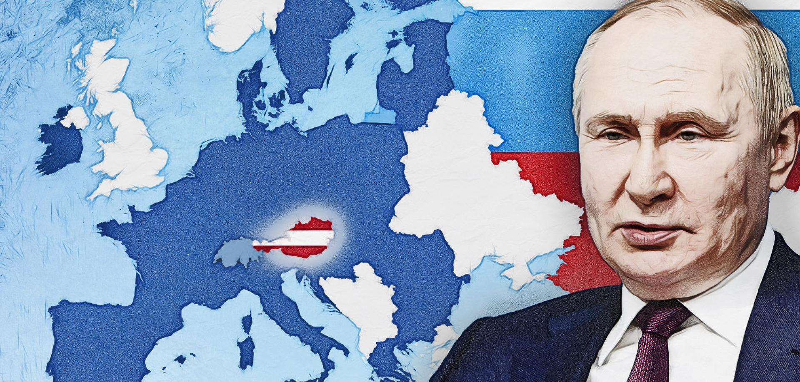  

---

Na Ukrainie zaczyna się REPRYWATYZACJA!

---

### 2021

> Lech Wałęsa i władze Gdańska miały swoje uroczystości, a rząd i NSZZ "Solidarność" - swoje.

Po 41 latach od porozumień sierpniowych Polacy są podzieleni. Nawet obchody były osobne Otworzyły drogę do powstania Solidarności i do wolności. Podpisane 41 lat temu porozumienia sierpniowe stały się początkiem przełomu. We wtorek w Gdańsku odbyły się obchody rocznicowe. Lech Wałęsa i władze Gdańska miały swoje uroczystości, a rząd i NSZZ "Solidarność" - swoje. Kiedy Polacy będą świętować wspólnie? - Jak wymrze nasze pokolenie - ocenił były prezydent Lech Wałęsa.

### 2017

The demand for long-term data storage is reaching unprecedented levels. By 2023, it’s expected that over 100 zettabytes of data will be stored in the cloud. Operating at such scales requires a fundamental re-thinking of how we build large-scale storage systems, as well as the underlying storage technologies that underpin them.

Project Silica is developing the first-ever storage technology designed and built from the media up, for the cloud. We are leveraging recent discoveries in ultrafast laser optics to store data in quartz glass by using femtosecond lasers, and building a completely new storage system designed from scratch around this technology. This opens up an incredibly exciting opportunity to challenge and completely re-think traditional storage system design, and to co-design the future hardware and software infrastructure for the cloud.

### 2019

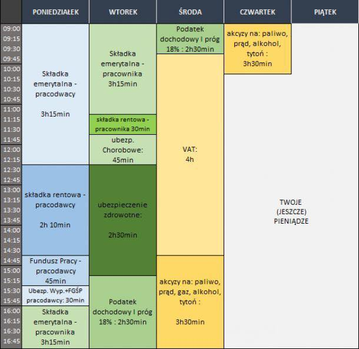  

### 1992

Zamordowano Piotra Jaroszewicza https://pl.wikipedia.org/wiki/Piotr_Jaroszewicz

### 1981

Gdańsk, hasło „Telewizja kłamie!” wymalowane przed Halą Olivii w trakcie I Zjazdu NSZZ „Solidarność”. Wykonane bez szablonu olbrzymie kontury to dzieło Zygmunta Błażka z działu propagandowego związku (prywatnie miłośnika liternictwa). Opozycyjne hasła maluje zawsze w biały dzień, przy świadkach, nie zwracając uwagi na milicjantów - gdy ci próbują go legitymować, zamiast dowodu osobistego wyjmuje legitymację Solidarności, tłumacząc, że „jest w pracy”. „Dziennik telewizyjny tak się ma do informacji jak pałka milicyjna do rurki z kremem” – opisuje sytuację w państwowych mediach jeden z delegatów. Kilka miesięcy później, już w trakcie stanu wojennego, na wyjątkowo dowcipny sposób walki z reżimową dezinformacją wpadnie lokalne koło emerytów Solidarności ze Świdnika, inicjując w całym kraju modę na demonstracyjne spacery w okolicach godziny 19:30 - porze emisji Dziennika Telewizyjnego. Komunistyczne władze zareagują wyłączaniem ulicznych latarni oraz masowanym legitymowaniem, a nawet zatrzymaniami spacerowiczów. Wobec niskiej skuteczności takich metod jedynym rozwiązaniem okaże się przesunięcie godziny milicyjnej na 19:00.

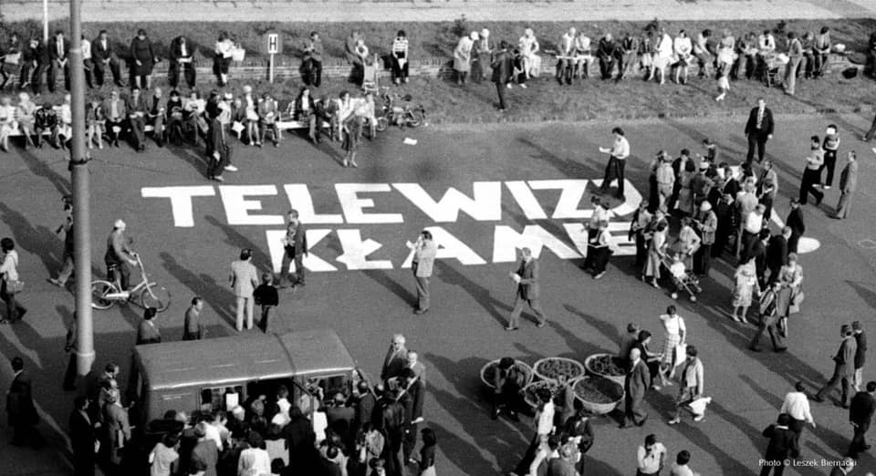  

Zdjęcie: Leszek Biernacki

### 1943

Obwieszczenie wydane przez Kierownictwo Walki Podziemnej.

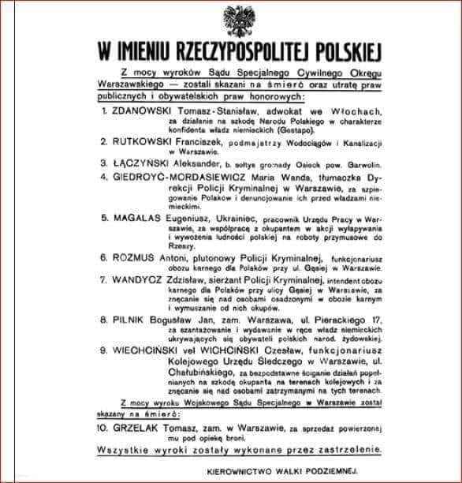  

---

Ekonomia II Wojny Światowej

Rok 1943. Sankt-Florian, niedaleko Linzu. Minister Uzbrojenia i Amunicji III Rzeszy ( Reichsminister für Bewaffnung und Munition) podczas konferencji z udziałem przedstawicieli niemieckich producentów broni i amunicji, prezentuje prognozę wzrostu produkcji zbrojeniowej na 1944 rok.
Pozwoliłem sobie zamieścić kilka wykresów, które ilustrują wzrost produkcji zbrojeniowej w III Rzeszy i to pomimo alianckich bombardowań i ograniczonych zasobów surowcowych. Wzrost produkcji związany był nie tylko z faktem ograniczania do minimum produkcji cywilnej i rozbudową istniejących i budową nowych fabryk uzbrojenia. Ważnym czynnikiem sprzyjającym wzrostowi produkcji były też działania, którym osobiście patronował Speer, takie jak:
1. Wzrost produktywności. Przyjmując lata 1941-42 za 100% to w następnych latach mamy 1942-43 157%; 1943-44 189% i rekordowe miesiące czerwiec-lipiec 1944 234%. Dzisiaj wskaźnik produktywności jest z reguły prezentowany jako OEE (Overall Equipment Effectiveness). Wykorzystanie więźniów obozów koncentracyjnych i robotników przymusowych miało również wpływ na zwiększenie produktywności.
2. Zużycie materiałów i surowców. Pomiędzy rokiem 1941 a 1944 wskaźnik średniego zużycia został zredukowany z 4:1 do 2:1 – oznacza to np., że z 4 ton stali uzyskiwano 1 tonę wyrobu gotowego. Za tym stało usprawnianie procesów wytwórczych np.: eliminacja obróbki skrawaniem na rzecz tłoczenia.
Zamieszczam również wykres, który ilustruje różnicę pomiędzy PKB (GDP - gross domestic product) Państw Osi (Axis). W 1940 roku był najkorzystniejszy - przed przystąpieniem USA do wojny i po wyeliminowaniu Francji PKB Aliantów wynosiło 158% PKB Państw Osi

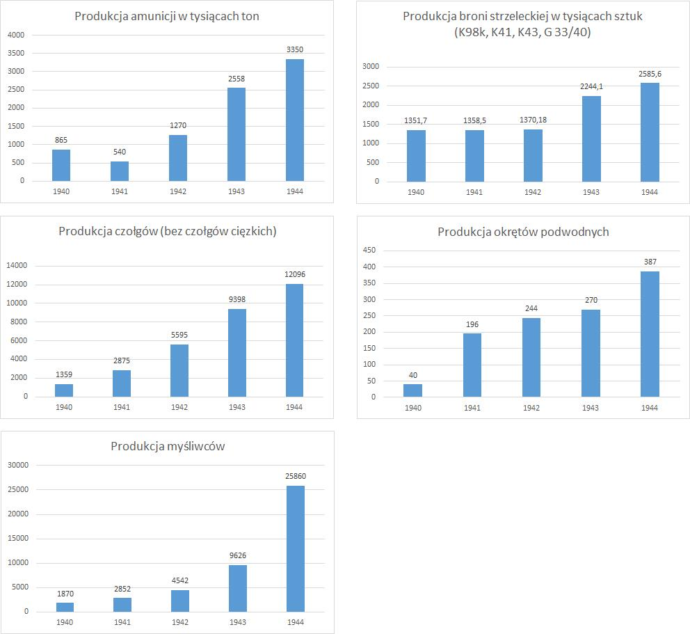  

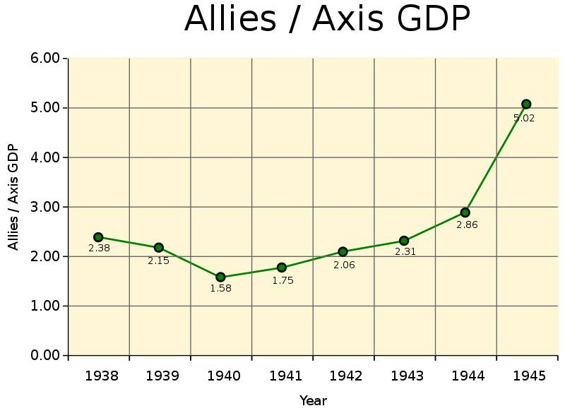  

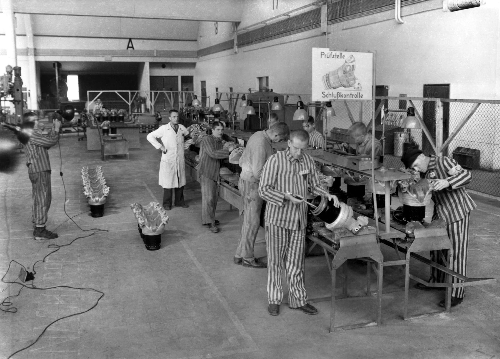  

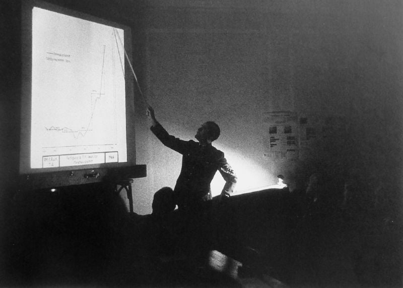  

Źródło: Alfred C. Mierzejewski: The Collapse of the German War Economy, 1944-1945, US, The University of North Carolina Press-Chapel Hill, 1988,

---

### 1940

Fragment pamiętnika Ireny Glück, nastoletniej żydowskiej dziewczynki z Krakowa.

Dziś jest rocznica rozpoczęcia wojny niemiecko - polskiej. Już rok trwa ta męka i cierpienie, które dotknęło prawie całą ludność Europy i wstrząsnęło światem. Bowiem świat nie pamięta takiego zniszczenia i barbarzyństwa, które szerzą Niemcy. Dziś dranie mają święto. Rozwiesili na Rynku Krakowskim wspaniałe flagi obramowane złoconymi wstęgami. Od dziś Rynek ma się zwać Adolf Hitlerplatz. Na Rynku ma przemawiać Frank i tam też ma się odbyć cała uroczystość. Ma również przyjechać drań Gebels, najbardziej zacięty wróg Żydów. Z wszystkich okien Niemców powiewają flagi. Chciałabym bardzo, żeby na ten dzień do Krakowa przyleciało kilka samolotów angielskich, ale przecież Anglicy są powolni (...). Podobno polska tajna organizacja wypuściła ulotki, aby ani Polacy, ani Żydzi nie pokazywali się tego dnia na mieście, ani nie jeździli tramwajami, a lekarze tylko w ważnej sprawie (...).

### 1939 - Polska jako "państwo sezonowe" - Saisonstadt

> [Drang nach Osten](https://pl.wikipedia.org/wiki/Drang_nach_Osten)

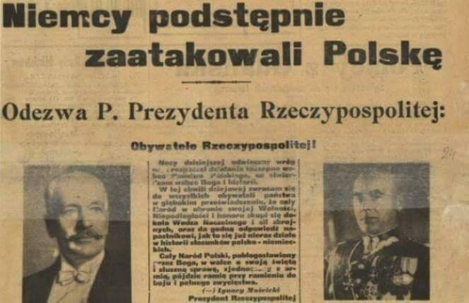  

O godz. 4:40 Niemcy zrzucili kilkaset śmiercionośnych pocisków na bezbronne miasto Wieluń (miasto które spało). Tu została dokonana pierwsza wojenna zbrodnia na bezbronnej ludności miasta. Zabili co najmniej kilkuset mieszkańców. Wielu ludzi nie obudziło się już więcej..

(4.45 rano wojska niemieckie zgodnie z planem Fall Weiss uderzyły na Polskę na całej 1600 km długości polsko-niemieckiej granicy oraz z terytorium Moraw i Słowacji. Prezydent Rzeczypospolitej Polskiej Ignacy Mościcki wezwał naród do obrony wolności i niepodległości kraju.

Założeniem planu Fall Weiss było okrążenie i zniszczenie Wojska Polskiego na zachód od linii Wisły nie później niż w czternastym dniu od uderzenia Wehrmachtu. Wojsko polskie pokrzyżowało jednak niemieckie plany.)

Nalot przeprowadzono nagle, bez wypowiedzenia wojny Polsce przez III Rzeszę.

Bombardowanie trwało do 27 września 1939. Bomby były zrzucane celowo na szpitale i cmentarze, a niemieckie samoloty latały bardzo nisko nad miastem, by móc ostrzeliwać ludzi z karabinów maszynowych. W samym tylko nalocie dywanowym przeprowadzonym 25 września zginęło ok. 10 tys. mieszkańców, 35 tys. zostało rannych.

o godzinie 4:30 rano niemiecki pancernik Schleswig-Holstein powoli zaczął zbliżać się do Westerplatte. W kwadrans później działa pancernika otworzyły ogień. Do szturmu na Wojskową Składnicę Tranzytową ruszyło ponad 3 tysiące niemieckich żołnierzy z morza, lądu i powietrza.

Pancernik przybył z misja szkolną i kurtuazyjną do Wolnego Miasta Gdańsk, a rankiem 1 wrzesnia 1939 roku otworzył ogień bez wypowiedzenia wojny. Przyjacielska i kurtuazyjna wizyta okrętu szkolnego sasiedniego państwa.

Fragment rozkazu Adolfa Hitlera do ataku na Polskę z 31 sierpnia 1939 roku:
> Atak przeciwko Polsce powinien być przeprowadzony zgodnie z przygotowaniem do „Fall Weiss”, ze zmianami dotyczącymi armii lądowej w
> związku z zakończoną w międzyczasie koncentracją. Podział zadań i cel operacji pozostają niezmienione. Dzień ataku: 1 września 1939. Czas
> ataku: godzina 4 minut 45. Czas ten obowiązuje również dla operacji w Gdyni, Zatoce Gdańskiej i przy moście w Tczewie."

Fragment wystąpienia Adolfa Hitlera w niemieckim parlamencie z dnia 1 września 1939 roku:

> Moje umiłowanie pokoju i moją bezkresną cierpliwość opacznie uznano za słabość lub nawet tchórzostwo! Dlatego wczoraj wieczorem podjąłem decyzję,
> by powiadomić rząd brytyjski, że w takich okolicznościach nie odnajduję już po stronie polskiej szczerej woli do prowadzenia z nami poważnych
> rozmów. Tym samym misja mediacji nie powiodła się. Bo w tym czasie na jej propozycję Polska odpowiedziała najpierw ogłoszeniem powszechnej mobilizacji, > a później nowymi okrucieństwami. Te zajścia znowu miały miejsce dziś w nocy. Podczas, gdy nie tak dawno temu w ciągu jednej nocy odnotowano 21
> takich incydentów granicznych, dziś w nocy było ich 14, w tym 3 całkiem poważne.
> Dlatego też zostałem zmuszony do podjęcia decyzji, aby prowadzić rozmowy z Polską w tym samym języku, w jakim Polacy rozmawiają z nami.

Wojska niemieckie zgodnie z planem Fall Weiss uderzyły na Polskę na całej 1600 km długości polsko-niemieckiej granicy oraz z terytorium Moraw i Słowacji. Prezydent Rzeczypospolitej Polskiej Ignacy Mościcki wezwał naród do obrony wolności i niepodległości kraju.

Założeniem planu Fall Weiss było okrążenie i zniszczenie Wojska Polskiego na zachód od linii Wisły nie później niż w czternastym dniu od uderzenia Wehrmachtu. Wojsko polskie pokrzyżowało jednak niemieckie plany.

Już w pierwszych dniach września udało się Niemcom przełamać polskie linie obronne i zająć Kujawy, część Wielkopolski i Śląsk. Na północy główne siły polskie, skoncentrowane w rejonie Mławy i na Pomorzu, zostały 1–3 września rozbite, a Armia Modlin, atakowana przez niemiecką 3 Armię podczas bitwy pod Mławą, zmuszona była wycofać się na linię rzek Wisły i Narwi.

Broniły się Westerplatte, Gdynia, Kępa Oksywska i Hel – aż do 2 października. Warszawa skapitulowała 28 września.

Również Armia Poznań pod dowództwem gen. Tadeusza Kutrzeby i Armia Pomorze pod dowództwem gen. Władysława Bortnowskiego cofnęły się aż za linię Warty i tam w okolicy Kutna nad rzeką Bzurą w dniach 9-18 września stoczyły jedną z największych bitew kampanii wrześniowej. Starły się z niemiecką 8 Armią dowodzoną przez gen. Johannesa Blaskowitza i 10 Armią gen. Waltera von Reichenau z Grupy Armii Południe. Gen. Kutrzeba postanowił wykorzystać to, że Wehrmacht zachowywał się dość biernie wobec wojsk Armii Poznań i zaatakował skrzydło 8 Armii niemieckiej. Planował on atak na pozycje niemieckie już parę dni wcześniej – 4 i 5 września podczas rozwinięcia natarcia 8 Armii na linię rzek Warta i Widawka na pozycje Armii Łódź. Nie zgadzał się na to Naczelny Wódz, ale pozycja obronna Armii Łódź została przełamana, zaś gen. Kutrzeba podtrzymał swoją propozycję zwrotu zaczepnego wobec wojsk niemieckich zmierzających bez istotnej osłony z lewej flanki w kierunku Warszawy. Do powodzenia operacji w początkowej fazie ataku według planów gen. Kutrzeby miał się przyczynić także czynnik psychologiczny, czyli chęć do walki z wrogiem żołnierzy Armii Poznań, która dotychczas tylko się wycofywała nie biorąc udziału w walkach na froncie.

---

O tej godzinie 4.45 niemiecki pancernik szkolny "Schleswig Holstein" oddał strzał w kierunku Składnicy Tranzytowej na Westerplatte, a samoloty Legionu Condor zrzuciły na Wieluń pierwsze bomby. Niemcy przypuścili również atak na budynek Poczty Polskiej w Wolnym Mieście Gdańsk, zbombardowali Oksywie, Puck i Hel. 7 września 1939 roku Wermacht dotarł do Warszawy.
Na terenie całej Polski został wprowadzony stan wojenny. Oto treść zarządzenia wydanego przez prezydenta Ignacego Mościckiego:
" „Obywatele Rzeczypospolitej! Nocy dzisiejszej odwieczny wróg nasz rozpoczął działania zaczepne wobec Państwa Polskiego, co stwierdzam wobec Boga i Historii. W tej chwili dziejowej zwracam się do wszystkich obywateli państwa w głębokim przeświadczeniu, że cały naród w obronie swojej wolności, niepodległości i honoru skupi się dookoła Wodza Naczelnego i sił zbrojnych oraz da godną odpowiedź napastnikowi, jak to się już nieraz działo w historii stosunków polsko-niemieckich. Cały naród polski, błogosławiony przez Boga, w walce o swoją świętą i słuszną sprawę, zjednoczony z armią, pójdzie ramię przy ramieniu do boju i pełnego zwycięstwa”

---

Za komuny Jaroszewicz na Westerplatte jechał jedną delegacją a Gierek drugą delegacją. Kaczyński jedną, Tusk drugą.

---

Sojusznicy? Attache wojskowy Ambasady Niemiec w Polsce ppłk. von Gerstenberg (drugi z lewej) w asyście polskich wojskowych na tle Grobu Nieznanego Żołnierza, 17 kwietnia 1938 r. Zdjęcie ze stron Wrzesień 1939.

Kiedyś, wiele lat temu, kiedy dyskusje o historii były na poziomie, bez przypinania łatki ''nazisty'', był pewien człowiek. Miał okulary, kędzierzawą siwą brodę i spokojny, nieco chrapliwy głos. On jako jeden z pierwszych zwrócił uwagę, że Polska popełniła katastrofalny błąd w 1939 roku. Że powinna była postąpić inaczej. Nie bał się kontrowersyjnych tez i burzył romantyczne mity historyczne.

Chociaż pana profesora Pawła Wieczorkiewicza nie ma z nami już od dziesięciu lat, jego idee są dalej żywe i przekazywane - choćby przez Piotra Zychowicza.

W przededniu okrągłej, 80. rocznicy wybuchu II wojny światowej, jak bumerang wraca do nas pytanie - czy Polska postąpiła słusznie, sprzeciwiając się Niemcom i stając do walki, czy może było inne wyjście.

Odrzućmy więc z tej dyskusji rozemocjonowane sofizmaty, histeryczne wrzaski o ''podludziach'', romantyczną martyrologię ''Chrystusów Europy'' i ''moralnych zwycięzców'', marksistowski determinizm, i spróbujmy zastanowić się nad faktami.

Problemem tej teorii - mającej przecież sensowne podstawy i dość prawdopodobnej - jest to, że najczęściej jest ona zakrzykiwana pełnymi oburzenia zdaniami i przerażającymi wizjami dymiących kominów, co niestety, pomija najważniejszy jej aspekt. Militarny.

Całą dyskusję należy zacząć od ponadczasowego cytatu Henry'ego Temple, 3. wicehrabiego Palmerston:

''Wielka Brytania nie ma wiecznych sojuszników, ani wiecznych wrogów. Wieczne są tylko interesy Wielkiej Brytanii, oraz obowiązek ich ochrony''

Wojsko Polskie w XX-leciu międzywojennym przygotowywało się do walki z Sowietami, a nie Niemcami, czy kimkolwiek innym. Temu służyć miał sprzęt, który uznawano za przejawy megalomanii w okresie PRL, a który po prostu nie został użyty zgodnie z przeznaczeniem. ORP ''Gryf'' i duże niszczyciele miały prowadzić walkę w rejonie Zatoki Fińskiej, a nie bronić Wybrzeża. Tam też miały operować duże okręty podwodne jak ORP ''Orzeł''. Z tego powodu zainwestowano w szybkie bombowce PZL. 37 ''Łoś''. Utrzymywano liczne jednostki kawalerii - nieprzydatnej w walce z jednostkami pancernymi, ale użytecznej na rozległych stepach, pozbawionych dróg. Po to wyposażano hojnie - jak na 1939 rok - piechotę w broń przeciwpancerną i próbowano nadążyć w liczbie czołgów za światową czołówką - Polska, mając 880 czołgów i tankietek, była na 6. miejscu na świecie.

Dojście do władzy nazistów doprowadziło do czasowego unormowania stosunków polsko-niemieckich. Adolf Hitler był Austriakiem i nie podzielał prusko-junkierskich resentymentów. W swojej książce ''Mein Kampf'' poświęcił Polsce... jedno zdanie, w dodatku krytykując politykę kajzerowskich Niemiec wobec Polaków (!!!). W Polsce upatrywał silnego gracza, rosnące z roku na rok regionalne mocarstwo, które jeszcze przed wojną zdystansowało wiele dłużej istniejących krajów, i które zdołało wywalczyć swoją niepodległość zbrojnie i odeprzeć bolszewicką nawałę w 1920 r. Józef Piłsudski w III Rzeszy cieszył się dużym szacunkiem i estymą, jako potencjalny sojusznik i mąż stanu. Zawarty w 1934 roku 10-letni pakt o nieagresji spowodował znaczne odprężenie w relacjach polsko-niemieckich, a niemiecki kanclerz pojawiał się w polskich publikacjach jako głowa zaprzyjaźnionego państwa.

Piłsudski pozostawił Polskę w rękach ludzi niekompetentnych i chwiejnych. Marszałek przed śmiercią żądał, by wszelkimi sposobami nie dopuścić do tego,by przyszła wojna w Europie zaczęła się od Polski i toczyła się na polskich ziemiach. Im później i im dalej - tym lepiej. Józef Beck, ufny w zapewnienia swojego bliskiego współpracownika, płk. Tadeusza Kobylańskiego, w swoich kalkulacjach o rozkładzie sił w Europie, całkowicie pominął rolę ZSRR. Prof. Wieczorkiewcz do końca życia utrzymywał, że Kobylański był w rzeczywistości sowieckim agentem, który zapewnił Sowietom całkowity wgląd w pracę polskich dyplomatów i wywiadu. Warto tu wspomnieć, że marszałek Erich von Manstein w swoich wspomnieniach pisze, że do wiosny 1939 roku nie było żadnego planu wojny przeciw Polsce. Zwrot w niemieckiej polityce był zemstą zawiedzionego, odtrąconego kochanka, który postanowił zetrzeć z powierzchni ziemi kraj, który odrzucił jego zaloty. Pewny swego Beck, ufny w siły sojusznicze, przekonany, że Niemcy to ''papierowy tygrys z 9 dywizjami'', wplątał swój kraj w wojnę w obronie niemieckiego miasta, jakim był Gdańsk, przed Niemcami.

A gdyby było inaczej? Gdyby i tak zdominowany przez Niemców Gdańsk trafił do Niemiec, a Polacy, jak proponowali w latach 20., zbudowaliby eksterytorialną autostradę przez Pomorze?

Scenariusz byłby ciekawy, ale i ryzykowny.

Niemcy planowali działać etapami. Najpierw - pokonać Francję, podczas gdy Polacy będą osłaniać wschodnie granice, a następnie wspólnie uderzyć na ZSRR.

Wojsko Polskie w roku 1941 byłoby z pewnością silniejsze i najpewniej przewyższałoby zarówno uzbrojeniem, jak i wyposażeniem, większość niemieckich sojuszników roku 1941. Opisując Unternehmen ''Barbarossa'' byłem zdziwiony, że w zasadzie większość niemieckich sojuszników prezentowała poziom słabszy od Wojska Polskiego - pokonanego przecież dwa lata wcześniej. Węgrzy, Finowie, Rumuni - oni wszyscy dysponowali zbieraniną sprzętu, nierzadko zdobycznego, z dużymi brakami w uzbrojeniu i transporcie. Na tym tle prawdopodobny kontyngent WP (zapewne liczący 350-500 tys. ludzi) prezentowałby się wręcz luksusowo. ;) Skoro polski sprzęt wziął udział, dość skutecznie, w walkach z Sowietami w ramach armii węgierskiej, czy rumuńskiej - to pewnie w rękach polskich by się sprawdził, zwłaszcza, że zdążono by go unowocześnić i rozpowszechnić w większym stopniu.

Jednakże, należy pamiętać, że podpisanie hipotetycznego paktu Ribbentrop-Beck wykluczyłoby przecież zawarcie paktu Ribbentrop-Mołotow. A to właśnie przez postanowienia owego paktu, a konkretnie przez jego tajny protokół, wiele państw dołączyło do Osi - mam tu na myśli przede wszystkim ograbioną przez ZSRR z Besarabii Rumunię, oraz ograbioną z Karelii Finlandię (która, gwoli ścisłości, została napadnięta 1941 r.). Niewiadomą byłby też los państw bałtyckich - czy zostałyby anektowane przez ZSRR, czy nie - chociaż można założyć, że Sowieci, ubiegając działania Niemiec, właśnie tak by postąpili. Jednakże, Rumuni byli związani z Polską sojuszem przeciw ZSRR od 1921 r.

Warto też dodać, że podpisanie paktu R-M zostało uznane zarówno we Włoszech, jak i w Japonii za zdradę paktu antykominternowskiego w 1936 r. i potwarz dla tych krajów. Dlatego też osamotniona w walce z Sowietami Japonia, pozostawiona przez Niemcy, nie miała oporów przed podpisaniem w 1941 r. z ZSRR paktu o nieagresji. Można więc założyć, że w tym alternatywnym scenariuszu Japonia dołączyłaby do wojny.

Ale ryzyko było, i to spore. Stalin zdawałby sobie sprawę z istnienia bloku antysowieckiego przeciw sobie i przygotowywałby obronę, opierając się na linii własnego imienia, która nie zostałaby uszczuplona na rzecz Linii Mołotowa. Zapewne ZSRR zawarłby sojusz z Francją i, być może, z Wielką Brytanią. Nie wiadomo, czy Niemcom, bez sowieckiego paliwa i zboża udałoby się pokonać Francuzów. Sowiecka polityka lat 30. traktowania szeroko pojmowanego ''faszyzmu'' za głównego wroga nie zostałaby zawieszona. Nie doszłoby - zapewne - do zaskoczenia sowieckich oddziałów, jak to miało miejsce w rzeczywistości.

Ale należy też pamiętać, że Armia Czerwona nie przeszłaby sprawdzianu swoich możliwości. To dopiero katastrofa wojny zimowej z Finlandią doprowadziła do gorączkowych reform sowieckiej armii (które zdołano częściowo przeprowadzić przed niemiecką inwazją), obnażyła nieudolność sowieckich dowódców i nieprzygotowanie do walki. Armia Czerwona, dysponując znakomitym sprzętem i nowatorskimi rozwiązaniami, była tak naprawdę kolosem na glinianych nogach, prowadzącym wojnę na ''urrraaa''. Działania Armii Czerwonej, nawet na poligonach doświadczalnych (gdzie walczyli na swoich warunkach!) w Hiszpanii, Mandżurii i Mongolii udowodniły, że Sowieci nie mają bladego pojęcia o dowodzeniu, współdziałaniu oddziałów i logistyce, a kulminacją był, mówiąc wprost, łomot, jaki sprzedali im ''białofińscy faszyści''.

Scenariusze są dwa - albo Niemcy by zwyciężyli, albo by przegrali. Scenariusz przegranej zakłada, że po krótkim zaskoczeniu Niemcy zostają zatrzymani we Francji, a Armia Czerwona wdziera się do Polski i wojna się kończy po kilku miesiącach. Czy w przypadku przegranej Niemiec los Polski byłby gorszy? Biorąc pod uwagę, że taki sam, a nawet lepszy los spotkał sojuszników III Rzeszy - uważam, że nie, zwłaszcza, że gdyby Niemcy zaczęły przegrywać wojnę, najpewniej Polacy - jak Rumuni w rzeczywistości - zmieniliby front, po upewnieniu się, że im się uda, unikając toczenia walk na swoim terytorium. Nawet pokonana Polska poniosłaby zapewne znacznie mniejsze straty ludności i zabudowie. Uważam - i nie jestem w tym osamotniony - że los Polski, najwierniejszego z Aliantów, który najhojniej szafował swoją krwią, był najgorszy ze wszystkich. Za polską ofiarę, nieugiętość i lojalność podziękowano w Jałcie. Ograbiona z ziem, zrujnowana, wyludniona, niesuwerenna Polska została gorzej potraktowana, niż same Niemcy. Nie było nic gorszego od tego losu. Nawet lojalne do samego końca Niemcom Węgry poniosły niższe straty i wróciły do przedwojennych granic. Powojenna sytuacja sojuszników III Rzeszy niczym się nie różniła od losu Polski, a poniosły one znacznie mniejsze straty w ludności (przykładowo, Bułgarzy i Finowie stracili zaledwie 2-3 tys. zabitych cywilów, Polska z wojny wyszła z liczbą ludności mniejszą o 6 milionów).

A w przypadku wygranej? Zwycięstwo byłoby bardzo prawdopodobne, bo z udziałem wojsk polskich Niemcy być może nie musieliby zmieniać kierunku natarcia na Kijów, lub oblegać Linii Stalina, tylko ruszyć ku Moskwie, i ją zająć. Czy doszłoby do wspólnej, niemiecko-polskiej parady w podbitej Moskwie, gdy generał Guderian ściskałby dłoń generałowi Kutrzebie? Bardzo możliwe. Prof. Wieczorkiewicz sugerował, że powstałaby nowa, zjednoczona Europa, pod przywództwem Niemiec i Polski, Polski jako sojusznika nr 1 w Europie, z kontrolowaniem ziem na wschodzie. A wiernych sojuszników Niemcy traktowali jak równorzędnych partnerów i godzili się na ustępstwa względem nich. Czy Polska zyskałaby coś terytorialnie? Możliwe, zwłaszcza na Białorusi. Tak, jak w naszej rzeczywistości wierchuszka ZSRR pomału wymierała i była potępiana przez następców, tak pewnie by się stało i z Niemcami i nazistami.

Czy doszłoby do ludobójstwa tzw. ''niższych ras''? Możliwe, ale na pewno w mniejszym stopniu. Należy pamiętać, że obłąkany plan ''Ostatecznego rozwiązania'' został opracowany pod wpływem niemieckich porażek na Wschodzie, gdy jasnym było, że Blitzkrieg w ZSRR zawiódł, a wojna znacznie się przeciągnie. Apogeum ludobójstwa przypadło dopiero na rok 1944, kiedy jasnym było już, że Niemcy wojnę przegrają. A to wtedy komory Auschwitz ''pracowały'' pełną parą. Warto też dodać, że żaden z niemieckich sojuszników - poza Rumunią - nie brał czynnego udziału w Holocauście. Dopóki Mussolini rządził we Włoszech, a Horthy na Węgrzech, ani jeden Żyd nie trafił do niemieckich obozów. Dopiero, gdy te kraje próbowały zmienić front, a Niemcy zaczęli ich okupację, ludobójstwo się zaczęło. Nie liczę tu marionetkowych państw, jak Chorwacja i Słowacja, których pozycja była na poziomie wasali. Warto też dodać, że niemieckie plany ludobójstwa, czyli Generalplan Ost, opracowano dopiero w 1941 r., kiedy Polska została już dawno pokonana.

Kwestię etycznych sofizmatów zamknę cytatem:

''Teraz postawmy sobie fundamentalne pytanie etyczne, czy bardziej moralna byłaby współpraca ze zbrodniarzem Stalinem, czy ze zbrodniarzem Hitlerem? Ja nie widzę większej różnicy. (...) Nazizm był ideologią przemijającą a komunizm jest niestety ideologią ciągle żywą. Naprawdę bardzo trudno wytrzebić i dobić tego gada w jego legowisku, bo rozprzestrzenił się po całym świecie!''

To wręcz zadziwiające, że współpraca z Niemcami budzi taki opór i wrzask, ale współpraca z Sowietami, największymi ludobójcami w historii - już nie. Cóż, polskie tradycje kolaboracji z Moskwą są długie...

Gorzką ironią losu jest to, że polskie samoloty, ciężarówki i działa wzięły udział w walce przeciw ZSRR, czołowym wrogu Polski - ale bez Polaków.

Kończąc ten przydługi wpis, przypomina mi się parada w Moskwie 9 maja 2005 roku, kiedy Polaków upchnięto gdzieś z tyłu, a prezydent Rosji dziękował ''niemieckim i włoskim antyfaszystom''. To by było na tyle, jeśli idzie o szacunek dla najwierniejszego Alianta. Cóż, ''wygraliśmy moralnie''...

Trzeba to jasno powiedzieć. W II WŚ Polska stanęła po złej stronie barykady.

---

Krakowskie lotnisko Rakowice stało się celem niemieckiego bombardowania. Udział w tym nalocie wzięło 150 samolotów 4 Floty Luftwaffe. Mogło być ich więcej,ale jedna eskadra pomyliła drogę i ominęła Kraków. Około godziny siódmej rano z rozkazu kapitana Mieczysława Medweckiego wystartowały pierwsze polskie patrole rozpoznawcze.

---

Ustawa o wcieleniu Wolnego Miasta Gdańska do Rzeszy Niemieckiej z dnia 1 września 1939 r.
§ l
Wydana przez głowę państwa Wolnego Miasta Gdańska zasadnicza ustawa państwowa o wcieleniu Gdańska do Rzeszy Niemieckiej - nabiera niniejszym mocy ustawy Rzeszy. Brzmienie jej jest następujące:
Artykuł I. Znosi się z mocą natychmiastową konstytucję Wolnego Miasta Gdańska.
Artykuł II. Całą władzę ustawodawczą i wykonawczą sprawuje wyłącznie głowa państwa.
Artykuł III. Wolne Miasto Gdańsk wraz ze swym terytorium i ludnością staje się - z mocą natychmiastową - częścią składową Rzeszy Niemieckiej.
Artykuł IV. Do czasu ostatecznego uregulowania przez Wodza sprawy wprowadzenia niemieckiego prawa Rzeszy pozostają w mocy wszystkie postanowienia ustawowe z wyjątkiem konstytucji obowiązujące w chwili wydania niniejszej zasadniczej ustawy państwowej.
Gdańsk, 1 września 1939 r.
Albert Forster
§ 2.
Obywatele dotychczasowego Wolnego Miasta Gdańska są obywatelami niemieckimi zgodnie z przepisami szczegółowymi.
§ 3.
Na terenie dotychczasowego Wolnego Miasta Gdańska pozostaje na razie w mocy prawo obowiązujące dotychczas — z wyjątkiem konstytucji Wolnego Miasta Gdańska
§ 4.
1) W dotychczasowym Wolnym Mieście Gdańsku nabiera mocy obowiązującej od dnia 1 stycznia 1940 r. całe prawo Rzeszy oraz pruskie prawo krajowe.
2) Właściwy minister Rzeszy w porozumieniu z ministrem spraw wewnętrznych Rzeszy może postanowić, że prawo Rzeszy lub pruskie prawo krajowe nie nabiera mocy obowiązującej w dotychczasowym Wolnym Mieście Gdańsku, albo że nabiera jej w terminie późniejszym, albo też nabiera jej zgodnie z przepisami szczególnymi. Takie postanowienie wymaga ogłoszenia w Dzienniku Ustaw Rzeszy.
3) Minister spraw wewnętrznych Rzeszy w porozumieniu z właściwymi ministrami może w drodze rozporządzenia wprowadzić w życie prawo niemieckie i pruskie prawo krajowe do dnia 31 grudnia 1939 r.
§ 5.
1) Instancją centralną do spraw wcielenia Gdańska do Rzeszy Niemieckiej jest minister spraw wewnętrznych Rzeszy.
2) Minister spraw wewnętrznych Rzeszy jest upoważniony do wydania rozporządzeń prawnych i administracyjnych, potrzebnych do wykonania i uzupełnienia niniejszej ustawy
§ 6.
Niniejsza ustawa obowiązuje od dnia 1 września 1939 r.
Berlin, 1 września 1939 r.
Wódz i Kanclerz Rzeszy
Adolf Hitler
Minister Spraw Wewnętrznych Rzeszy
Frick
Zastępca Wodza
R. Heß
Przedstawiciel do spraw Planu Czteroletniego
Göring, Feldmarszałek, pruski Prezes Rady Ministrów
Minister Spraw Zagranicznych Rzeszy
von Ribbentrop
Minister Rzeszy i Szef Kancelarii Rzeszy
Dr. Lammers
Foto: Albert Forster - gauleiter Wolnego Miasta Gdańska odczytuje proklamację o przyłączeniu Gdańska do Rzeszy. Była ona transmitowana na żywo przez radio. 1 września 1939 r.

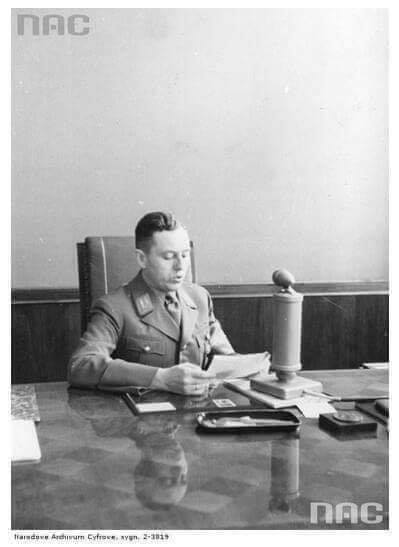  

---

Poprzez agresje Niemiec na Polskę rozpoczęła się wojna. Mało kto w ówczesnej Polsce wierzył w wojnę. Dzieci szły do szkoły. Pierwsze bomby, niemiecka Luftwaffe zrzuciła na Wieluń, spokojnie śpiące miasto nie dające żadnego powodu aby w nalocie dywanowym je zniszczyć, a mieszkańców wymordować. W sukurs Niemcom przyszły jeszcze 2 państwa Słowacja i ZSRR. Polska napadnięta ze wszystkich stron i zdradzona przez wszystkich sojuszników nie miała szans obrony. Dziś już wiadomo że w maju 1939 r sztab generalny armii francuskiej podjął decyzje o nie reagowaniu czynnym na agresje Niemiec na Polskę. Mimo udzielonych gwarancji bezpieczeństwa nie zawiadomili nas o tym. W ich planach po trzech latach II wojny światowej mieli nas wyzwolić od okupacji niemieckiej Rzeczpospolitą. Polska nigdy się nie poddała. W odróżnieniu od Czech, Francji, Belgii, Holandii, Danii, Norwegii, które ochoczo rozpoczęły współprace z Niemcami. Zamiast współpracy zafundowaliśmy Niemcom państwo podziemne, ewenement w skali świata. Z własnym szkolnictwem dbaniem o kulturę i pamięć narodu polskiego. Państwo podziemne stworzyło struktury wojskowe, które w szczytowym momencie liczyły ponad 300 tys. żołnierzy. Poza granicami państwa polskiego Polacy zdołali utworzyć pod sztandarami polskimi potężne związki taktyczne. Pływaliśmy po morzach i oceanach, walczyliśmy w Afryce, Europie zach. i na foncie wschodnim. Broniliśmy nieba ( o ironio ) nad Francją i włożyliśmy potężny wkład w obronę Wielkiej Brytanii. Naszym lotnikom należały się słowa uznania wypowiedziane przez Winstona Churchilla.
„Nigdy tak wielu nie zawdzięczało tak wiele, tak nielicznym”
Te wszystkie dokonania są wynikiem wyjątkowego hartu ducha Polaków, przywiązania do ojczyzny i przywiązania do własnej historii, w której nie ma ani jednego akcentu agresywnej postawy wobec sąsiadów.
Dziś nie ma już żadnej wątpliwości, że Polska została wciągnięta w wir polityki światowej, w której poza naszymi plecami, nasi sojusznicy dogadywali się, jak nie wywiązać się z traktatów, a Niemcy z Rosją jak podzielić łupy. II wojna światowa przyniosła Polsce zagładę 1/3 narodu oraz straty materialne sięgające 2 bilionów euro. Polska jest jedynym krajem, któremu nie zostały wypłacone reparacje wojenne. Nigdy nie usłyszeliśmy słowa przepraszam od Brytyjczyków i Francuzów za pozostawienie nas samych. Tę historię, którą przed chwilą opowiedziałem trzeba opowiadać co roku, aby zapamiętać, że przyjaciół szuka się blisko, a wrogów daleko. Ale zawsze należy liczyć tylko i wyłącznie na siebie. Tego uczy nas historia.

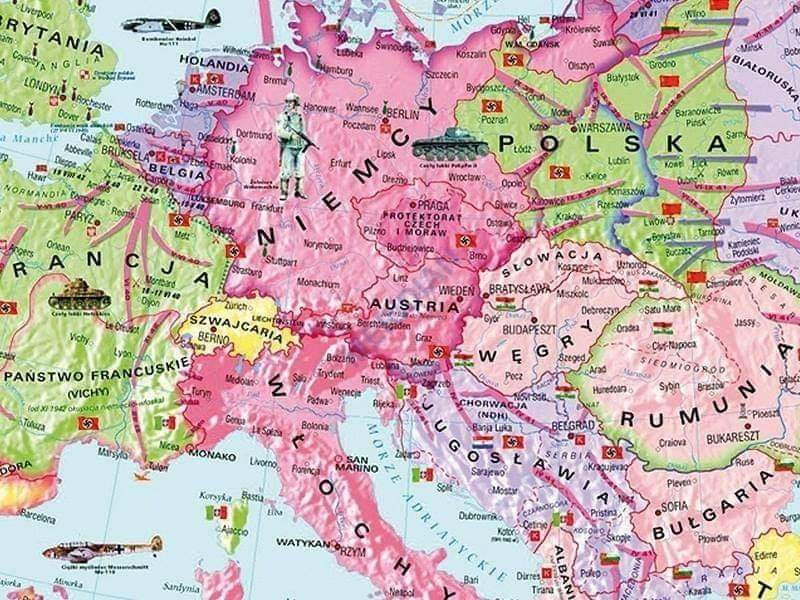  

---

Losy polskiego złota po 1939:

  

---

### 1925

https://pl.wikipedia.org/wiki/Tadeusz_Ste%C4%87

---

## Wspomnienia

> Jestem już nie młody,pochodzę z Górnego Śląska. Matka była rodowitą Ślązaczką a ojciec rodowitym Pomorzaninem. Oboje przed  > wojną byli obywatelami III Rzeszy.Z ich relacji oraz z opowieści cioć i wujów wiem dlaczego zwykli ludzie gorąco popierali > Hitlera w latach 30-tych.
> Przede wszystkim zdławił kryzys gospodarczy i dał ludziom pracę,dzieciom szkoły.Do tego opieka socjalna i medyczna państwa > dostępna dla każdego. Urzędy były dla obywateli a nie ich wrogami.Istniało sporo organizacji dbających o to,żeby 
> dzieci,młodzież oraz pracownicy się nie nudzili i czuli się dowartościowani. Zlikwidował istniejące jeszcze 
> w latach 20 tych > bandy czerwonych zbirów.Generalnie był porządek i dyscyplina.Prostym obywatelom to w zupełności 
> wystarczało. Gdyby dzisiaj był w Polsce polityk tego formatu z pewnością miałby kilkadziesiąt procent poparcia w sondażach.

---

### 1910

Papież Pius X wprowadził obowiązek składania tzw. "Przysięgi antymodernistycznej" przez wszystkich księży i biskupów przed uzyskaniem święceń oraz przez nauczycieli religii i profesorów w seminariach duchownych.

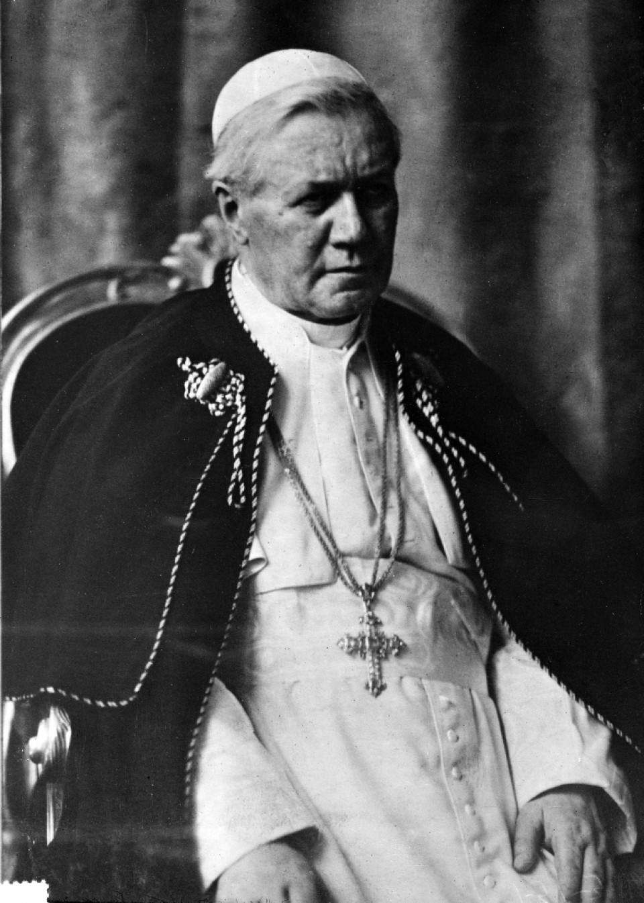  

---

<a href="https://github.com/TomaszWaszczyk/historia.waszczyk.com/edit/master/src/content/september-1.md" target="_blank">Edytuj tę stronę dzieląc się własnymi notatkami!</a>

<!-- ◾️ Dziś przypada 82 rocznica ataku Niemiec na Polskę, co zapoczątkowało II WŚ. W dzisiejszym wpisie będzie o tym, kto sfinansował machinę wojenną Hitlera, jest to o tyle ważnie, że byli to nie tylko Niemcy.
◾️ W szkole uczy się nas, że naziści wzięli się nagle... nie wiadomo skąd. Mało kto zadaje pytanie: jak to możliwe: że kraj TOTALNIE zniszczony po I WŚ, walczący do 1923 roku z drenującą hiperinflacją (w czasach Republiki Weimarskiej), w 1939 roku był w stanie rzucić wyzwanie niemal całemu cywilizowanemu światu, spacyfikować Francję i inne kraje, po pierwszych wygranych bitwach zagrozić Londynowi i Moskwie.
◾️ Hitlera sfinansowała elita z Wall Street. Dlaczego? W trakcie I WŚ bank Morgana i jego wspólnicy zbierali ogrom środków finansowych dla Francji i Wielkiej Brytanii zadłużając je po uszy. Niemcy (wraz z państwami centralnymi) niemal wojnę wygrały, co zagroziło zyskom banków anglosaskich. Społeczeństwo USA nie chciało dołączać do europejskiego konfliktu, ale elita kontrolująca media w końcu urobiła amerykanów i US Army przeważyła szale zwycięstwa na rzecz ententy.
◾️ Interesy banków były wstępnie zabezpieczone, ale był problem: spłaty kredytów wojennych przez Francję i Wielką Brytanię były w dużej cześć uzależnione od reparacji z Niemiec. A Niemcy były bardzo osłabione, nie były w stanie płacić reparacji. Francja była nieugięta w tej sprawie, ponieważ po wojnie francusko-pruskiej, Francuzi musieli latami płacić uciążliwe reparacje.
◾️ Ludziom Morgana udało się zaszantażować Francuzów, żeby przyjęli plan Dawesa (1924 rok). Plan polegał na złagodzeniu reparacji i uzyskaniu przez Niemcy tanich kredytów z USA. Od tego czasu do Niemiec napłynęły kapitały z Wallstreet, a niektóre firmy zaczęły transferować kluczowe wojskowe technologie WBREW interesom USA, co było później przedmiotem dochodzenia. Warto wspomnieć, ze Henry Ford był wielkim fanem Hitlera i osobiście przekazywał mu środki na działanie. Jego syn Edsel kontynuował rodzinną tradycję.
📜 Z okazji rocznicy wybuchu II WŚ publikuję moje streszczenie książki uznanego anglosaskiego historyka Antonego Suttona pt. "Wall Street i Hitler", zapraszam do lektury.
🟥 Wall Street i Hitler
◾️ Poniżej znajduje się streszczenie książki pt. „Wall Street i Hitler”, autorstwa Antonego Suttona. Zależało mi na przekazaniu, jak największej liczby faktów historycznych, w celu ich promowania, dzięki czemu czytelnik może lepiej zrozumieć złożoność historii, a nie polegać jedynie na narracji przyjętej przez zwycięzców II Wojny Światowej. Prezentując i promując streszczenie, mam nadzieję zainteresować tymi faktami większą liczbę osób, być może część z Państwa sięgnie po oryginalną pracę.
◾️ Antony C. Sutton (1925 – 2002) był brytyjskim i amerykańskim ekonomistą, historykiem, profesorem i pisarzem. Wykładał w California State University Los Angeles. Był człowiekiem poważanym. Jego twórczość cechuje się wysokimi standardami i oparta jest na wiarygodnych dowodach. Zaznaczam to na wstępie, ponieważ niektórym może wydać się niedorzeczne twierdzenie, że Amerykanie wynieśli Hitlera do władzy i współpracowali z nim nawet podczas II WŚ. Nie mam tu na myśli bezpośrednio państwa amerykańskiego, ale kręgi biznesowe, które na władzę w USA miały znaczny wpływ.
➡️ Amerykanie wpływają na politykę w Europie
◾️ Zacznijmy od końca I WŚ, wskutek której Niemcy zostały zobligowane do wypłaty reparacji wojennych w kwocie ponad 130 mld marek (Traktat Wersalski). Płatność miała zostać rozłożona na 50 lat. W ten sposób Francja chciała zdusić potencjał Niemiec na lata. W tym kontekście pojawia się już wątek amerykański.
◾️ Renegocjacje płatności niemieckich reparacji były prowadzone pod kontrolą banków z Wall Steet - plan Dawesa (1924) i plan Younga (1929). Owen Young, czyli człowiek z General Electric, reprezentował również interesy J. P. Morgan.
➡️ Plan Dawesa 1924
◾️ Zgodnie z planem Dawesa, a potem Younga, dług reparacyjny został rozłożony na raty i przewidywał możliwość uzyskania preferencyjnych kredytów dla niemieckich karteli z amerykańskich banków. Obydwa plany zostały opracowane przez komisje kontrolowane przez bankierów, z korzyścią dla nich samych. Zdaniem uznanego historyka Corrolla Quigleya, plan Dawesa w znacznej mierze został stworzony w J. P. Morgan. Powstał jako odpowiedź na okupację Zagłębia Ruhry. Francja i Belgia okupowały ten przemysłowy rejon, ponieważ Niemcy, nie miały środków do płacenia reparacji wojennych. Kredyty udzielone przez USA umożliwiły postawienie na nogi I. G. Farben i Vereinigte Stahlwerke. Te dwa kartele umożliwiły Hitlerowi objęcie władzy i były odpowiedzialne za zmasowaną i zaawansowaną technologicznie produkcję broni i sprzętu wysyłanych na front II WŚ.
➡️ Plan Younga 1929
◾️ Zdaniem Hjalmara Schachta, hitlerowskiego geniusza finansowego (prezesa Banku Rzeszy), to właśnie plan Younga umożliwił dojście Hitlera do władzy. Plan Dawesa zakładał spłaty reparacji w dobrach niemieckiego przemysłu, natomiast plan Younga wymagał płatności w gotówce. Doprowadziło to do załamania niemieckiej gospodarki (zbiegło się z Wielkim Kryzysem), masowego bezrobocia i niezadowolenia społecznego. W takiej sytuacji pozycja wspieranego kapitałowo z USA Hiltera szybko urosła na bazie radykalnych haseł i obietnicy uporania się z bezrobociem.
◾️ Między 1924 a 1931 rokiem, dzięki planom Dawesa i Younga, Niemcy spłaciły Aliantom 36 mld marek reparacji, a w tym czasie pożyczyły od USA 33 mld marek. Zatem z „własnego kapitału” nie płaciły prawie nic.
➡️ Henry Ford – hojny patron Hitlera
◾️ Henry Ford od 1922 (!) roku wspierał Hitlera, a jego syn Edsel Ford kontynuował rodzinną tradycję. W 1942 roku zachęcał francuski oddziału Forda do zarabianiu na zbrojeniu Wehrmachtu. Wyprodukowane pojazdy używano przeciwko amerykańskim żołnierzom, po wylądowaniu we Francji w 1944 roku. Zakłady produkowały we Francji dla Niemiec i dla krajów będących pod ich okupacją.
◾️ Henry Ford w 1938 roku otrzymał nazistowski medal uznania. Portret Henrego Forda wisiał w bardzo dobrze eksponowanym miejscy w biurze Hitlera.
➡️ Nazistowska twierdza gospodarcza – I. G. Farben
◾️ Trzy domy bankowe: Dilon Read, Hariis-Forbes oraz National City Company – przekazały ¾ pożyczek reparacyjnych używanych do stworzenia niemieckiego systemu kartelowego, w tym dominujących I. G. Farben i Vereinigte Stahlwerke. Te dwa molochy produkowały 95% materiałów wybuchowych dla Hitlera w czasie II WŚ.
◾️ Senator Homer T. Bone powiedział przed senacką Komisją do Spraw Wojskowych „Farben to Hitler, a Hitler to Farben”. W przededniu II WŚ I. G. Farben była największą spółką chemiczną na świecie, ze szczególną pozycją w III Rzeszy. Założona została w 1925 roku przez geniusza organizacyjnego Hermanna Schmitza, który po wojnie zasiadł na ławie oskarżonych w Norymberdze za zbrodnie wojenne popełnione przez I. G. Farben. Obok niego znaleźli się również pozostali dyrektorzy i zarząd spółki – wszyscy poza amerykańskimi kooperantami i Amerykanami zatrudnionymi w firmie. Ich udział przemilczano.
◾️ „Bez kapitału z Waall Street z pewnością nie byłoby I.G. Farben, a zapewne i Adolfa Hitlera i II wojny światowej” – cytat z książki Antonego Suttona
◾️ W radzie nadzorczej Farben znajdował się Max Warburg. Jego brat, Paul Warburg, był jednym z twórców Rezerwy Federalnej. Paul znalazł się później w Radzie Nadzorczej amerykańskiej fili I. G. Farben. Wszyscy Niemcy na stanowiskach, takich jak piastował Max Warburg, byli sądzeni, jako zbrodniarze wojenni, on nie. W radzie nadzorczej I.G. Farben, w filii w USA, zasiadali Henry Ford, Paul Warburg z Bank of Manhattan i Charles E. Mitchell z Fed w NY.
➡️ Standard Oil of New Jersey – Rockefellerowie transferują technologie do Hitlera
◾️ I. G. Farben wypłacił 400 000 RM Schachtowi i Hessowi, w celu sfinansowania przejęcia władzy w 1933 roku. Firma była kluczowa dla rozwoju wojskowości w hitlerowskich Niemczech. Farben nie tylko była źródłem finansowania nazizmu, ale również strategicznym przedsiębiorstwem pod względem technologicznym.
◾️ W 1934 roku Niemcy produkowały zaledwie 300 000 ton paliwa pochodzącego z przerobu ropy naftowej i niecałe 300 000 ton benzyny syntetycznej, resztę były zmuszone importować. W 1934 roku 85% gotowych produktów naftowych pochodziło z importu. Już dekadę później, pod koniec II WŚ dzięki transferowi technologii z Standard Oil do I. G. Farben produkcja paliwa wynosiła aż 6,5 mln ton! Z czego 85% było to paliwo syntetyczne wytwarzane za pomocą wodorowania węgla (patent Standard Oil). Amerykańska firma dokonała kluczowych transferów technologii do rozwoju syntetycznego kauczuku i benzyny.
◾️ Standard Oil z New Jersey, na żądanie I.G. Farben, ograniczyła badania nad kauczukiem syntetycznym. W 1945 roku dr Oskar Loehr menedżer I. G. potwierdził, że I. G. Farben i Standard Oil z New Jersey zawarły porozumienie, by ograniczyć ilość przedsiębiorstw zajmujących się produkcją kauczuku syntetycznego w USA, co po wybuchu II WŚ okazało się szkodliwe dla US Army, a korzystne dla Wehrmachtu.
◾️ Zgodnie z opinią Komisji Kilgora kontrolowana przez Rockefellerów Standard Oil osiągnęła cel z I. G. Farben blokując rozwój produkcji syntetycznego kauczuku w USA. Standard Oil była oskarżana w USA o zdradę stanu, ale jej przedstawiciele wypierali się zarzutów i nadal kontynuowali współpracę, w tym przez spółki zależne, przekazali środki finansowe na prywatny Fundusz Himmlera i przynależeli do Kręgu Przyjaciół Himmlera do 1944 roku.
◾️ Standard Oil of New Jersey do 1944 roku dokonywała płatności w imieniu Niemiec w celu opracowywania syntetycznego paliwa do celów wojennych. Środki były transferowane również przez spółki zależne do Koła Przyjaciół SS Heinricha Himmlera. Firma Ethyl Gasoline Company (współwłasność Standard Oil of New Jersey i General Motors) odegrała kluczową rolę w dostarczeniu ołowiu etylowego dla Niemiec. Transfer ten odbył się mimo pisemnego protestu Departamentu Wojny USA i wiedzy, że ołów etylowy był przeznaczony na cele wojenne.
Dyrektorzy amerykańskiego oddziału I. G. Farben to:
👉 Walter Teagle – człowiek Roosevelta i administrator New Deal,
👉 Paul Warburg – amerykański bankier, jego brak Max Warburg był członkiem zarządu I. G. Farben w Niemczech,
👉 Edsel Ford – syn Henrego Forda.
➡️ Szeroki strumień z Wall Street do Berlina
◾️ Finansowanie Hitlera i SS częściowo pochodziło z oddziałów lub spółek zależnych od firm amerykańskich, w tym Henrego Forda w 1922 roku, I. G. Farben i General Electric w 1933 roku. Następnie przez spółki zależne od Standard Oil of New Jersey i I. T. T. (International Telephone and Telegraph Company). Środki wpływały na konto Heinricha Himmlera aż do 1944 roku.
◾️ Krąg Przyjaciół Keplera było to stowarzyszenie przedsiębiorców wspierających nazizm przed i w trakcie 1933 roku. W połowie lat 30. Krąg Keplera wszedł pod opiekę Heinricha Himmlera, który był przywódcą SS. W wewnętrznym kręgu nazistów zarezerwowanym dla najbardziej zaufanych osób Wall Street, było reprezentowane od 1933 do 1944 roku przez przedstawicieli takich firm, jak Standard Oil of New Jersey i I. T. T.
◾️ Niemiecki General Electric (25-30% udziałów miało amerykańskie G.E) przekazał darowiznę o sumie 60 000 RM Hitlerowi. Ludzie odpowiedzialni za tę darowiznę wywodzili się z Wall Street, byli to:
👉 Gerard Swope (pomysłodawca New Deal, czyli programu odbudowy USA po Wielkim kryzysie rozpoczętym w 1929 roku) prezes General Electric, ale i dyrektor wielu francuskich I niemieckich spółek,
👉 Owen Young z Rezerwy Federalnej w Nowym Yorku, dyrektor German General Electric i Osram w Niemczech, był też w zarządach General Motors, NBC i RKO, był radnym Narodowej Konferencji ds. Przemysłu i dyrektorem Międzynarodowej Izby Handlowej,
👉 Clark Minor z International General Electric.
➡️ Bez rozliczenia, ponad polityką
◾️ Międzynarodowe elity z Wall Street były promotorami nazizmu i pomogli Hitlerowi zdobyć władzę. W połowie lat 20. Wall Street sfinansowało niemieckie kartele i wywindowało Hitlera na szczyty władzy. Globalna finansjera ma kluczowy wpływ na wydarzenia polityczne. Zdaniem Herberta Hoovera, F. D. Roosevelt wygrał w 1932 roku, dlatego że instytucje Wall Street na niego postawiły (na Roosevelta), a jemu (Herbertowi) odmówiły finansowania.
◾️ International Telephone and Telegraph Company podczas II WŚ pracowała dla obu stron poprzez osobę Kurta von Schrodera. I. T. T. posiadało również 28% udziałów w zakładach lotniczych Focke-Wolfe, które produkowały niemieckie myśliwce. Bank Morgana i Chase współpracowały z nazistami, gdy szalała wojna. Wielki kapitał liczył zyski w trakcie potwornej globalnej wojny. Narody się wykrwawiały, ale kapitał miał władzę nad politykami i wojskowymi.
◾️ W 1939 roku niemiecki przemysł był silnie powiązany z amerykańskimi firmami (German) General Electric i International Telephone and Telegraph. Co ciekawe, mimo że obiekty (infrastruktura tych firm) miały strategiczne znaczenie dla Niemiec, były bombardowane jedynie incydentalnie.
◾️ Poza tymi działaniami prowadzono w USA odpowiednią propagandę. Spółka Ivy Lee & T.J Ross, która prowadziła kampanię wybielającą Rockefellerów i promującą pozytywny wizerunek ZSRR, zaangażowała się w budowanie dobrego wizerunku I. G. Farben. Ivy Lee był wezwany przez Komisję Izby Reprezentantów do Badania Działalności Antyamerykańskiej za pronazistowską propagandę w 1934 roku.
◾️ Wpływowi biznesmeni użyli swoich kontaktów politycznych, aby uniknąć kary za wojenną współpracę z nazistami. W tym celu infiltrowali amerykańską Komisję Kontroli Niemiec. Kary za rozpętanie II WŚ i zbrodnie wyrządzone na jej frontach dotknęły tylko części sprawców. W obecnie dominującej narracji naziści pojawili się nagle, niemieckie społeczeństwo fanatycznie ich poparło z dnia na dzień i dało Hitlerowi władzę dyktatora. Książka Antonego Suttona pomaga zrozumieć, że bez pomocy amerykańskich finansistów i przemysłowców naziści nie odjęliby władzy, co więcej III Rzesza nie byłaby w stanie prowadzić wojny przez brak zasobów, przemysłu i technologii.

Kręgi biznesowe z USA wspierały Hitlera i kolejne transze kredytowe pomogły Niemcom bardzo. USA raz, że były zainteresowane odzyskaniem pożyczek wojennych od UK (UK zarabia na Niemcach by spłacac jankesów, trzeba zapewnic płynnośc Niemcom - jak najbardziej było to w interesie USA - czy firm USA, ale że siedziały w tym największe firmy w USA stawało się to interesem USA). Podobnie np maszyny (komputery na karty perforowane) IBMa. Nie będę odnosił się do liczb, bo raz, że autor podał ich pieron, dwa - jeśli korzystał z Suttona to mam zaufanie, że podaje dobrze. Z tego co pamiętam, dobrze zgadza sie i baboli nie znalazłem. Swoją droga, również polecam Suttona. Za to radzę też wziąć kogoś obok - jak już sięgasz po książki z IIWŚ weź kilku historyków. To szeroki temat, wiele (WIEEEEEEELE) źródeł, wiele kwestii jest wciąż upolitycznionych, w pogoni za narracją rzeczy umykają. Lub tylko umykają, bo jakby trochę omijają założony na wstępie temat książki. Albo dlatego, że autor będzie zafiksowany outlookiem ze swojego kawałka geografii - tak jak czasem skrzywia się Sutton kiedy przychodzi do wschodniej Europy (po prostu nie kuma tego kawałka świata i kultury 🤷 oraz miał ograniczony dostęp do źródeł przez większość swojej kariery - język oraz polityka - co jest chyba głównym powodem tego, że ma tendencję do ignorowania tego kawałka planety; nie jest w tym odosobniony wśród historyków anglosaskich, którzy mają tendencję do spłycania kwestii wschodnioeuropejskich).
Dodatkowo jakby, wychodząc poza kwestie gospodarcze, USA były zafascynowane faszyzmem. Nie były wyjątkowe w latach międzywojnia - po Wielkiej Wojnie m.in te idee rozkwitały, ale jednak USA wydają się zafascynowane bardziej takimi rzeczami jak eugenika niż większość innych państw.
Mam głównie do zarzucenia bardzo odważną (zbyt) tezę, że to USA stworzyła potencjał III Rzeszy.
Tak i nie. Tak, bo kredyty wyciągały Niemcy z kupy, a transfer technologii pomógł bardzo przy zbrojeniach, a pamiętajmy, że Niemcy były pod pewnym 'embargiem' technologicznym (zakaz posiadania i rozwoju wielu rodzajów broni).
Nie, ponieważ USA nie wypełniają nam obrazka. Od 1922 (Rapallo) ZSRR współpracuje bardzo mocno z Niemcami w zakresie transferu technologii - ZSRR dostaje pomysły niemieckich inżynierów i może je testować na swoich poligonach razem z Niemcami, którzy dostają poligony w głębi Rosji to właśnie (ukrytego przed zachodem) testowania pojazdów - czołgów i samolotów. Istotny jest też transfer surowcowy i pieniężny, szczególnie transfery pieniężne DLA NSDAP (nie dla niemiec - dla nsdap) w latach 30tych. w latach 1931-32 nsdap chwiała się w posadach i miała upaść, nawet Hitler pisał, że to był czarny okres dla partii i rozważano rozwiązanie. Tak, jeszcze zanim cokolwiek skosztowali pełni władzy. Stalin tymczasem spacyfikował niemieckich komunistów i pchnął dla hitlerka pieniążki ratując partie przed bankructwem. Arguably, dzięki tej pomocy w ogóle odnieśli sukces wyborczy w 1933 roku. Przedmiotem badań (czy spekulacji, skoro archiwa zaplombowane) jest dlaczego Stalin to zrobił, ale nie ulega wątpliwości, że to właśnie zrobił. Wiodąca teza jest taka, że ZSRR chciał rewizji porządku wersalskiego (wielu dorzuca eksport rewolucji) i chciał wykorzystać do tego Niemcy. By nie było - jest to teza historyków rosyjskich, która rodziła się jeszcze przed latami 90tymi (pierwsze podskoki chyba po śmierci Stalina się zaczeły) ale to głasnost przyniósł im wolnośc badawcza w tym zakresie i ukazywały sie książki, które wprost deklarowały, że 'nazistowski miecz wykuto w zsrr' - to jest zreszta tytuł jednej ze sławniejszych prac promujących tę tezę (nie pamiętam autorów, chyba nie była ta książeczka przetłumaczona na PL - teraz nie moge tej pracy nigdzie znaleźć bo nie pamiętam oryginalnego tytułu po rosyjsku albo z tłumaczenia niemieckiego 🙄). Pozwolę sobie tez zauwazyc, że odkąd przyszedł Putin historycy rosyjscy przestali pisac o tej tezie, a organy państwowe zaczeły jej wprost zaprzeczać. Powiem tylko - typowe 🙂 To się bardzo dobrze łączy z transferami surowcowymi i pieniężnymi. Niemniej, obojętnie jaką intencje Stalina założymy, powtórzę, ZSRR było instrumentalne np dla stworzenia broni pancernej technicznie i cześciowo doktrynalnie (testy poligonowe), podobnie sprawa się ma z artyleria i lotnictwem taktycznym, silnikami rakietowymi, itd - nawet jeśli pominiemy podejrzane działania sowieckich służb z roku 1932, współpraca z ZSRR była dla Niemców bezcenna.
Poza USA i ZSRR Niemcy miały mniejszych sojuszników, którzy pomagali im obchodzić traktat wersalski. Np. w Holandii założyli shill-corpa (powiedzmy, dzisiaj chyba tak można by to nazwać), który pracował nad okrętami podwodnymi i innymi konstrukcjami morskimi.
Generalnie, informacje z tekstu nie są nieznane historykom. Mam jednak wrażenie, że są bliżej nieznane opinii publicznej w PL. Z racji naszych sympatii/antypatii częściej (wszystko moje subiektywne wrażenie) zwracamy uwagę na role ZSRR w budowaniu potencjału III Rzeszy. Jeśli autor miał tutaj na celu popularyzacje wiedzy historycznej w tym sensie by zwrócic uwagę 'hej, a o USA pamiętacie' - to dobrze. Wolałbym jednak by dodał że omawia tutaj częśc problemu - tj związaną z USA. Teza "Hitlera sfinansowała elita z Wall Street" jest niestety manipulacją jesli pomija całkiem udział ZSRR - btw jest to też teza lansowana przez historyków żyjących w zgodzie z komunistycznym establishmentem w państwach Układu Warszawskiego z epoki minionej. Nie mówię tutaj, że autor chce manipulowac, co to to nie - mam wrażenie, że po prostu skoncentrował się na Suttonie, tym bardziej, że nie podał innych prac 🙂 W tym też chyba leży sedno zarzutu o ahistoryczność z komentarzy powyżej, że przedstawia tylko ten jeden punkt widzenia i formuje przy tym zdania dość... autorytatywnie. Można by tych oskarżeń uniknąć poprzez kilka kwantyfikacji i złagodzenie kilku zdań, np. zamiast 'elity z wallstreet sfinansowały Hitlera i bez nich nie byłoby mozliwe prowadzenie wojny' vs 'pomoc z usa była jednym z głównych przyczyn odbudowy niemieckiego potencjału militarnego i gospodarczego, w tym tekście koncentruję sie na tym aspekcie' czy coś w tym stylu. Gdyby autor był historykiem byłbym pewnie ostrzejszy tutaj, ale tak samo jak ja rezerwuje sobie prawo do mylenia się w kwestiach ekonomicznych, nie będe autorowi zarzucał chęci manipulacji czy ahistoryczności skoro zajmuje się ekonomia i inwestycjami. Mam nadzieje, że autor wyciągnie naukę z mojego komentarza i nie odbierze mnie wrogo 🙂
A jeszcze narracja... otóż można mieć narrację i zarazem nie 'narzucać się' z interpretacją. Tekst jest wtedy przyjemniejszy i łatwiej przyswajalny - za to najpewniej dłuższy jeśli chcesz zawrzeć tyle liczb co autor powyżej. Nie tylko to - narracja pozwala nam lepiej przedstawic kontekst czasów i/lub charakterów i na kontekście osadzić wydarzenia - co z kolei przekłada się na głębsze zrozumienie epoki (powtarzam, że najczestszym błędem tak amatorów jak profesjonalnych historyków jest 'zapomnienie' o tym, narracja pomaga zdyscyplinować myślenie tak czytelnikowi jak autorowi) Barbara Tuckman, moja ulubiona historyczka, znakomicie się posługuje narracją w swoich pracach i nawet podpowiada jak jej używać lub nie używac (zbiór esejów "Practicing History"), za to niewielu jej zarzuca cokolwiek, bo jej książki wciąż kopią dupska i rozdają karty. Ale to już pobocznie, autor wybrał opcje 'nalotu dywanowego' liczbami, bo jak napisał, chciał wiele przekazać. Mysle po prostu, że jeśli celem jest popularyzacja wiedzy czy szerzej edukacja - narracyjnie są lepsze efekty. 

-->
