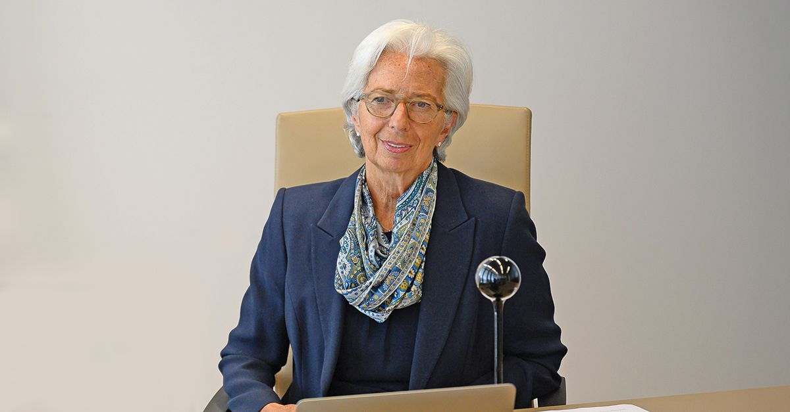
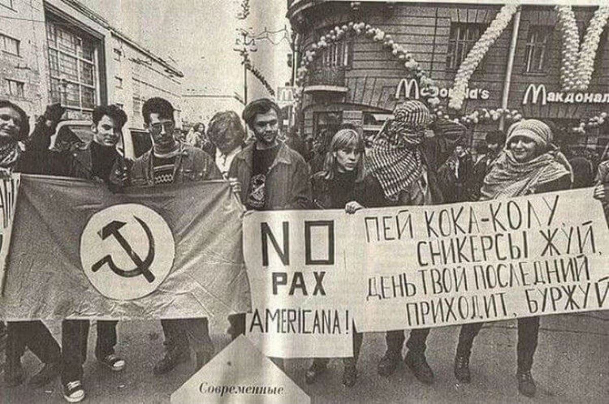
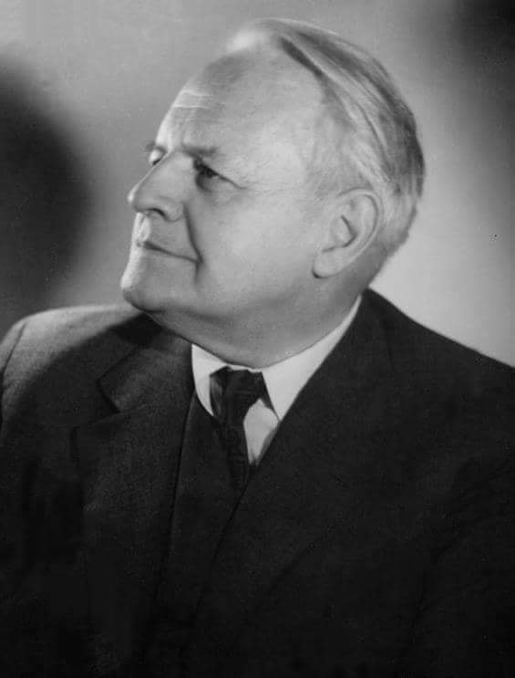
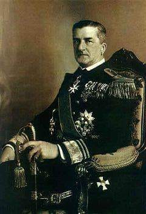
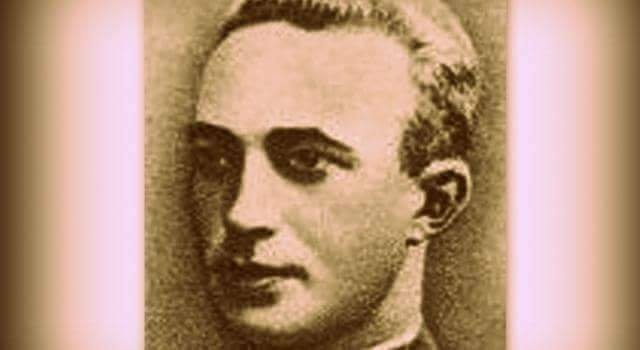
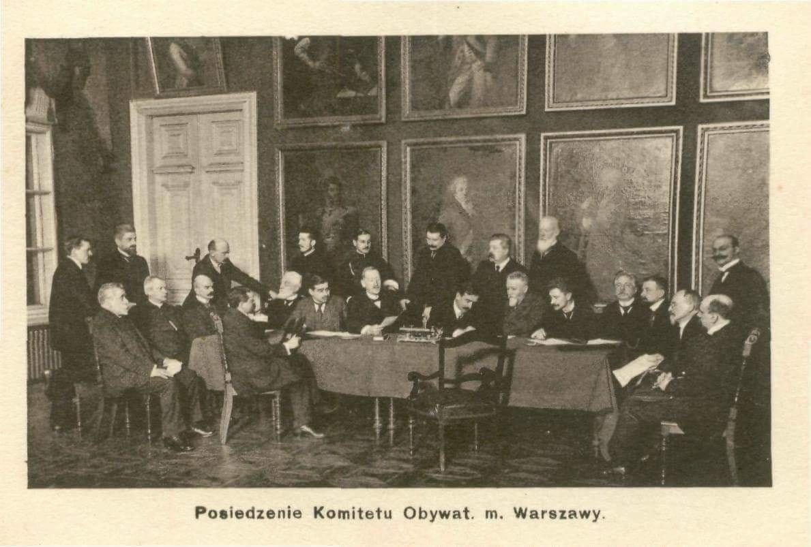
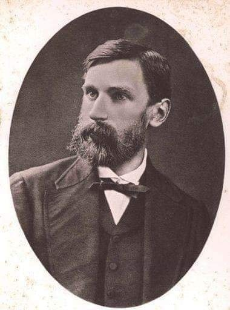

### 2021

Central bank digital currency: the future starts today

Speech by Benoît Cœuré, Head of the BIS Innovation Hub, at The Eurofi Financial Forum, Ljubljana, Friday 10 September 2021.

Distinguished guests, ladies and gentlemen.

Thank you for inviting me to speak here today. We all experienced how the pandemic accelerated the shift to virtual events, but I am pleased that today we are gathering in person. 

Yet the world is not returning to the old normal. Payments are a case in point. The pandemic has accelerated a longer-running move to digital. Mobile and contactless payments are already part of our daily lives; QR codes and "buy now, pay later" options are gaining popularity; gloves, badges and Olympic uniforms with payment functions are being prepared for the Beijing Winter Olympics; and the tech-savvy generation will soon dream about money and payments for the metaverse.

Alongside these developments, the world's central banks are stepping up efforts to prepare the ground for digital cash – central bank digital currency (CBDC).1 They have a job to do – delivering price stability and financial stability – and they must retain their ability to do it.

Let me explain.

Central bank money has unique advantages – safety, finality, liquidity and integrity. As our economies go digital, they must continue to benefit from these advantages. Money is at the heart of the system and it has to continue to be issued and controlled by trusted and accountable institutions which have public policy – not profit – objectives. Central bank money will have to evolve to be fit for the digital future.

So what are the priorities now? Know where you are going – as Dag Hammarskjöld once said2, "only he who keeps his eye fixed on the far horizon will find the right road". And get going. 

Let me elaborate.

Why do we need to know where are we going? Because today, the financial system is shifting under our feet.

Big techs are expanding their footprint in retail payments. Stablecoins are knocking on the door, seeking regulatory approval. Decentralised finance (DeFi) platforms are challenging traditional financial intermediation. They all come with different regulatory questions, which need fast and consistent answers.

Banks are worried about the implications of CBDCs for customer deposits. Central banks are mindful of these concerns and are working on answers. They see banks as part of future CBDC systems. But make no mistake: global stablecoins, DeFi platforms and big tech firms will challenge banks' models regardless.

Stablecoins may develop as closed ecosystems or "walled gardens", creating fragmentation. With DeFi protocols,3 any concerns about the assets underlying stablecoins could see contagion spread through a system. And the growing footprint of big techs in finance raises market power and privacy issues, and challenges current regulatory approaches.4

Will the new players complement or crowd out commercial banks? Should central banks open accounts to these new players, and under which regulatory conditions? Which kind of financial intermediation do we need to fund investment and the green transformation? How should public and private money coexist in new ecosystems – for example, should central bank money be used in DeFi rather than private stablecoins?

We urgently need to ask ourselves these kinds of questions about the future. This is the far horizon for the financial system  but we are approaching it ever faster. Central banks need to know where they want to go as they embark on their CBDC journey.

CBDC will be part of the answer. A well-designed CBDC will be a safe and neutral means of payment and settlement asset, serving as a common interoperable platform around which the new payment ecosystem can organise. It will enable an open finance architecture that is integrated while welcoming competition and innovation.5 And it will preserve democratic control of the currency.

This brings me to my second message: the time has passed for central banks to get going. We should roll up our sleeves and accelerate our work on the nitty-gritty of CBDC design. CBDCs will take years to be rolled out, while stablecoins and cryptoassets are already here. This makes it even more urgent to start. 

In the design thinking methodologies we use in the BIS Innovation Hub, the ideal product stands in a sweet spot at the intersection of desirability, viability and feasibility. When applied to CBDCs, these translate into three dimensions: consumer use cases, public policy objectives and technology.

We have to ask ourselves why consumers would want a CBDC and what would they want it to do? The recent European Central Bank (ECB) public consultation showed that they value privacy, security and broad usability.6 In order to meet consumers' expectations, CBDCs need to be made to work most conveniently. Payment data must be protected. Digital functions that are not available with cash can be developed, such as programmability or viable micro-payments.

Then CBDCs should meet public policy objectives.7 Central banks exist to safeguard monetary and financial stability for the public good. CBDCs are a tool to pursue this through enhancing safety and neutrality in digital payments, financial inclusion and access, innovation and openness. Important questions remain. How can CBDC systems interoperate, and should offshore use be discouraged?

Technology opens up design choices. System design will be complex. It involves a hands-on operational and oversight role for central banks and public-private partnerships to develop the core features of the CBDC instrument and its underlying system. These features are: ease of use, low cost, convertibility, instant settlement, continuous availability and a high degree of security, resilience, flexibility and safety.8 Complex trade-offs will be addressed by central banks including how to balance scale, speed and open access with security; and how to balance offline functionality with complexity and security.

Across the world, central banks are coming together to focus on their common mission. Charged with stability, they will not rush. They want to move fast, but not to break things. Consultations with payment systems and providers, banks, the public and a broad range of stakeholders have begun in some countries. To build a CBDC for the public, a central bank needs to understand what they need, and work closely with other authorities. The BIS Innovation Hub is helping central banks. We already have six CBDC-related proofs of concept and prototypes being developed in our centres, and more to come.9

The European Union is uniquely placed to face the future. You can build on a state-of-the-art fast payment system, on the strong protections provided by the General Data Protection Regulation and on the open philosophy of the Second Payment Services Directive. The ECB's report on a digital euro sets the stage.

A CBDC's goal is ultimately to preserve the best elements of our current systems while still allowing a safe space for tomorrow's innovation. To do so, central banks have to act while the current system is still in place – and to act now.

I thank you for your attention.

Source: https://www.bis.org/speeches/sp210910.htm

### 2020

> I was honoured to speak at the Deutsche Bundesbank about payments in today’s fast-moving world. With our lives going digital, it's natural for people to change the way they pay. We must ensure that our payment systems continue to modernise along with European consumers’ preferences.

  

---

  

---

<!-- 10.09.2014 -- > > Co zrobić żeby nie mieć kaca moralnego z powodu że się traci czas ? ? To bardzo proste- należy czas wykorzystywać dobrze i nie marnować go i skupiać się na jednej rzeczy a nie robiąc tysiąca rzeczy na raz, to ułatwia życie, uspokaja i powoduje porządek w głowie i duchu ;-) -->

### 1996

Demonstracja przeciwko otwarciu pierwszej w Sankt Petersburgu restauracji sieci McDonald's. W 1992 jak pamiętam otwarli McDonalda w Warszawie na ul. Świętokrzyskiej. Byłem wtedy w wojsku w Zegrzu i koledzy, którzy wyszli na "stałkę" (przepustka stała) przynieśli nam na spróbowanie po hamburgerze. Padł wtedy chyba rekord gości w jednym dniu - coś koło 30.000 ludzi? Drugi raz wracając do domu, na przepustce, zaliczyłem otwarcie McDonalda na Francuskiej w Katowicach - grudzień 1992 - 33.000 ludzi w jeden dzień.

  

### 1974

W Warszawie zmarł Melchior Wańkowicz - pisarz, publicysta, prozaik, korespondent wojenny, mistrz opowieści reportażowej.
Brał udział w walce z bolszewikami. Współzałożył Towarzystwo Wydawnicze ,,Rój''.  W latach 1939-58 przebywał na emigracji. Podczas kampanii włoskiej i walk o Monte Cassino był korespondentem wojennym przy II. Korpusie Polskim gen. Andersa; w hołdzie heroicznym żołnierzom generała Władysława Andersa napisał swoje najlepsze dzieło zatytuowane Bitwa o Monte Cassino. Inne znane i cenione dzieła Wańkowicza to: Na tropach Smętka, Westerplatte, Szczenięce lata, Ziele na kraterze, Tworzywo, Karafka Lafantaine'a. W swej twórczości artysta nawiązywał do tradycji gawędy szlacheckiej.

  

### 1939

Jego Najjaśniejsza Wysokość Regent Węgier Miklós Horthy (na zdjęciu) odmówił Niemcom przepuszczenia niemieckich wojsk przez terytorium węgierskie przeciwko Polsce. Kilka tygodni przed rozpoczęciem niemieckiej inwazji na Polskę premier Węgier Pal Teleki wysłał depeszę do kanclerza Rzeszy niemieckiej, w której oświadczył, że: „Węgrzy ze względów na kategorie moralne nie mogą przedsięwziąć żadnej akcji militarnej przeciw Polsce”. Władze węgierskie nakazały zaminowanie tuneli kolejowych i ich wysadzenie w przypadku próby przedarcia się Niemców siłą.

  

---

Po zakończonej niepowodzeniem, trwającej dwie doby bohaterskiej obronie Wizny (województwo podlaskie) rozerwał się granatem jej dowódca kapitan Korpusu Ochrony Pogranicza Władysław Raginis (zdjęcie).
Przypomnijmy, że 360 dowodzonych przez niego żołnierzy stawiło na bronionym na szerokości 9 kilometrów pasie, który był fragmentem linii obronnej Samodzielnej Grupy Operacyjnej "Narew" zdecydowany opór liczącemu 42 000 żołnierzy XIX Korpusowi Armijnemu pod dowództwem Heinza Guderiana.
Raginis dotrzymał w ten sposób przysięgi, w której przyrzekł, że nie odda twierdzy żywy. Swoim żołnierzom rozkazał złożyć broń i oddać się do niewoli.
13 maja 1970 roku został pośmiertnie odznaczony Złotym Krzyżem Virtuti Militari.

  

### 1914

W Warszawie powstał Centralny Komitet Obywatelski. Była to organizacja społeczno- gospodarcza utworzona za przyzwoleniem władz carskich.
Działalność CKO finansowana była ze środków rządu rosyjskiego i Komitetu Wielkiej Księżnej Tatiany. Po zajęciu Warszawy przez wojska niemieckie w sierpniu 1915 roku, władze okupacyjne początkowo zezwoliły na kontynuowanie działalności CKO, jednak już 12 września 1915 roku nakazały jego rozwiązanie, które nastąpiło w listopadzie tegoż roku. Część działaczy opuściła Warszawę i. utworzyła Centralny Komitet Obywatelski Królestwa Polskiego w Rosji.

  

### 1891

Urodził się Ignacy Matuszewski <https://pl.wikipedia.org/wiki/Ignacy_Matuszewski>

### 1838

W Kaliszu urodził się Adam Asnyk pseudonim El...y, poeta, dramatopisarz. Wykształcenie zdobywał w Instytucie Agronomicznym w Marymoncie (1856), w Akademii Medyko-Chirurgicznej w Warszawie (1857-1859), na wydziale medycznym uniwersytetu wrocławskiego oraz na Uniwersytecie w Heidelbergu, gdzie uzyskał stopień doktora nauk filozoficznych.

Czynnie angażował się w życie polityczne. Za udział w patriotycznym ruchu spiskowym został osadzony w warszawskiej Cytadeli. Uczestniczył w pracach radykalnego rządu wrześniowego.
Po upadku Powstania styczniowego przebywał w Heidelbergu.
Osiadł w Krakowie w 1870 roku. Był radnym miasta Krakowa. Współredagował krakowski dziennik ,,Nowa Reforma''.
Był jednym z organizatorów i prezesem Towarzystwa Szkoły Ludowej. Jako artysta tworzył erotyki, wiersze satyryczne, liryki poświęcone ukochanym Tatrom, utwory dramatyczne oraz sonety. Jego twórczość oscylowała wokół liryki refleksyjnej łączącej elementy stylu romantycznego z problemami natury filozoficznej i społecznej pozytywizmu. 
Znane dzieła Asnyka to: Sen grobów, Nad głębiami, Cola Rienzi. 
Adam Asnyk zmarł 2 sierpnia 1897 roku w Krakowie. 
Spoczął w Krypcie Zasłużonych na krakowskiej Skałce.
Niech przytoczone dwa wiersze Adama Asnyka będą dla nas strawą duchową na dzisiejszy pochmurny dzień...
Wiersz pierwszy zatytułowany ,,Pod stopy krzyża''
Dużo cierpiałem lecz koniec się zbliża
Z uspokojeniem po przebytej męce - 
Pójdę, o Chryste, do stóp twego krzyża 
Wyciągnąć znowu z utęsknieniem ręce 
I witać ciszę zachodzącej zorzy, 
Która mnie w prochu u stóp twych położy!
Nie pomnę modlitw, com niegdyś ze skruchą 
Przy boku matki powtarzał niewinny 
Te utonęły w fali życia głucho, 
I odkąd w gruzy padł mój raj dziecinny, 
Odkąd mi zabrakło ojczyzny i domu, 
Nie otworzyłem mej duszy nikomu!
Nawet przed Tobą, nie mogłem, o Panie, 
Wydobyć płaczu z mej piersi ściśniętej, 
Bo wzrok mój padał w bezdenne otchłanie, 
A tyś mi zniknął na krzyżu rozpięty, 
Spośród pokoleń rozrzuconych kości, 
Za ciemną chmurą krwi, łez i nicości
Ręką ziemskiego dotknąłem się błota,
Widziałem zbrodnie, nie widziałem kary, 
Oprócz boleści i nędzy żywota 
Nic nie znalazłem, i zbrakło mi wiary, 
I dalej w ciemność poszedłem z rozpaczą, 
Zazdroszcząc ludziom, co na grobach płaczą
Widziałem trwogę i niemoc konania, 
Widziałem duchów hańbę i upadek - 
Lecz nie widziałem nigdzie zmartwychwstania, 
I próżnych męczeństw przerażony świadek, 
Patrząc na niebo, co nigdy nie dnieje, 
Straciwszy wiarę, straciłem nadzieję
Kochałem jeszcze biedne ludzkie cienie, 
Które na stosach palą się i świecą, 
Myślałem bowiem, ze biegnąc w płomienie, 
Wiedzą przynajmniej, dlaczego tam lecą, 
I, że przyjmując każdy ból i ranę, 
W piersiach anielstwo noszą nieskalane.
Lecz gdym obaczył, skąd tu wszystkie czyny 
Swój tajemniczy początek wywodzą; 
Skąd wyrastają ściekłe krwią wawrzyny, 
Gdzie upadają ci, co w niebo godzą, 
I gdy wnikając w serc zranionych ciemność, 
Za każdym bólem znalazłem nikczemność,
Natenczas miłość stała się podobną 
Do nienawiści smutnej i posępnej, 
I przeklinałem tę rzeszę żałobną, 
I pogardzałem nimi - sam występny... 
I mścić się chciałem za gorycz zawodu, 
Żem nie mógł kochać jak dawniej za młodu.
Tak więc w mej duszy zburzonym kościele 
Została straszna pustka i samotność, 
Sam jako nędzarz zostałem w popiele
I własną badać zacząłem przewrotność, 
I wszystko w sobie znalazłem to samo, 
Co mi się zdało być u drugich plamą.
Wszystkie pragnienia nędzne, brudne, liche, 
Co kłamią tylko pozór wyższej cnoty, 
Olbrzymią nicość i olbrzymią pychę 
Znalazłem na dnie swej własnej istoty, 
I tak swe serce rozpoznawszy chore, 
Straciłem w sobie ostatnią podporę.
Lecz ta upadku właśnie ostateczność,
Co mnie w bezdennej pogrążyła nocy,
Dała, mi poznać wszechwładną konieczność 
Wyższej a razem nieskończonej mocy. 
I moja rozpacz szalona i trwoga 
Świadczyła jeszcze o potędze Boga.
Na mojej piersi spoczywał schowany 
Maleńki krzyżyk ze słoniowej kości: 
Świadek młodzieńczej wiary nieskalanej, 
Dar macierzyńskiej najczystszej miłości, 
Co przetrwał wszystkie burze i szaleństwa 
Znakiem cichego, boskiego męczeństwa.
Kiedy go teraz na piersi zbolałej 
Po latach tylu znalazłem niewierny, 
Tak mi się wydał znowu jasny, biały, 
Taki potężny i tak miłosierny, 
Że znów tęsknotą zadrżało mi łono 
Za tą postacią tyle uwielbioną!
I powitałem światło wiecznie nowe 
Z tych jasnych ramion krzyża tryskające, 
I na skrwawione stopy Chrystusowe 
Tak samo lałem moje łzy gorące, 
Jak wówczas, kiedym poił serce młode, 
Patrząc na mistrza nadziemską pogodę.
I znów słyszałem te boskie wyrazy: 
"Chodźcie tu do mnie wy, którzy cierpicie, 
Chodźcie tu do mnie leczyć ziemskie zmazy, 
We mnie jest spokój i we mnie jest życie, 
Nie plączcie próżno na świeżej ruinie, 
Wszystko przemija, prawda nie przeminie!"
Więc posłuchałem słodkiego wezwania - 
I oto idę z mym sercem schorzałem, 
I pewny jestem twego zmiłowania, 
Bom wiele błądził, lecz wiele kochałem, 
I drogi życia przeszedłem cierniste... 
Więc Ty mnie teraz nie odepchniesz, Chryste!
-------------------------------------------------------
,,Kwiat paproci''
Zakwita w puszczach dziwny kwiat paproci,
Na jedną chwilę w tajemniczym cieniu
Cały świat blaskiem czarodziejskim złoci,
Lecz można tylko dotknąć go w marzeniu.
Młodość, co wierzą sama cuda tworzy,
Umie go dojrzeć w cudowności lesie,
Żadne widziadło w biegu jej nie strwoży
Pewnej, że skarb ten na sercu uniesie.
A choć nie uszczknie kwiecia ideału,
Co pod jej ręką jako sen przepada,
Jednak ma chwilę ekstazy i szału,
W której jest pewną, że niebo posiada,
Gdy się dwa serca spotkają tęskniące,
Pełne nadziemskiej piękności i żalu,
Gdy objawienie miłości jak słońce
Na ust spłonionych zabłyśnie koralu;
Gdy po raz pierwszy drżące a wstydliwe
Te usta w jeden pocałunek spłyną,
Gdy przez nie dusze połączyć się chciwe
Jako dwie fale w oceanie giną -
Natenczas w uczuć wezbranych powodzi,
W tej błyskawicy duchów idealnej,
Kwiat ów cudowny tajemniczo wschodzi
I w pocałunku kwitnie niewidzialny!
Tyle też jego trwania. Gdy z zachwytu
Zbudzona dusza chce go ująć w dłonie -
Zniknął bez śladu… Tylko wśród błękitu
Zostały po nim jakieś dziwne wonie.

  

---

<a href="https://github.com/TomaszWaszczyk/historia.waszczyk.com/edit/master/src/content/september-10.md" target="_blank">Edytuj tę stronę dzieląc się własnymi notatkami!</a>
