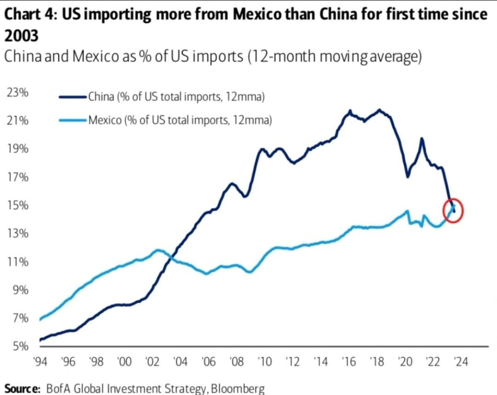
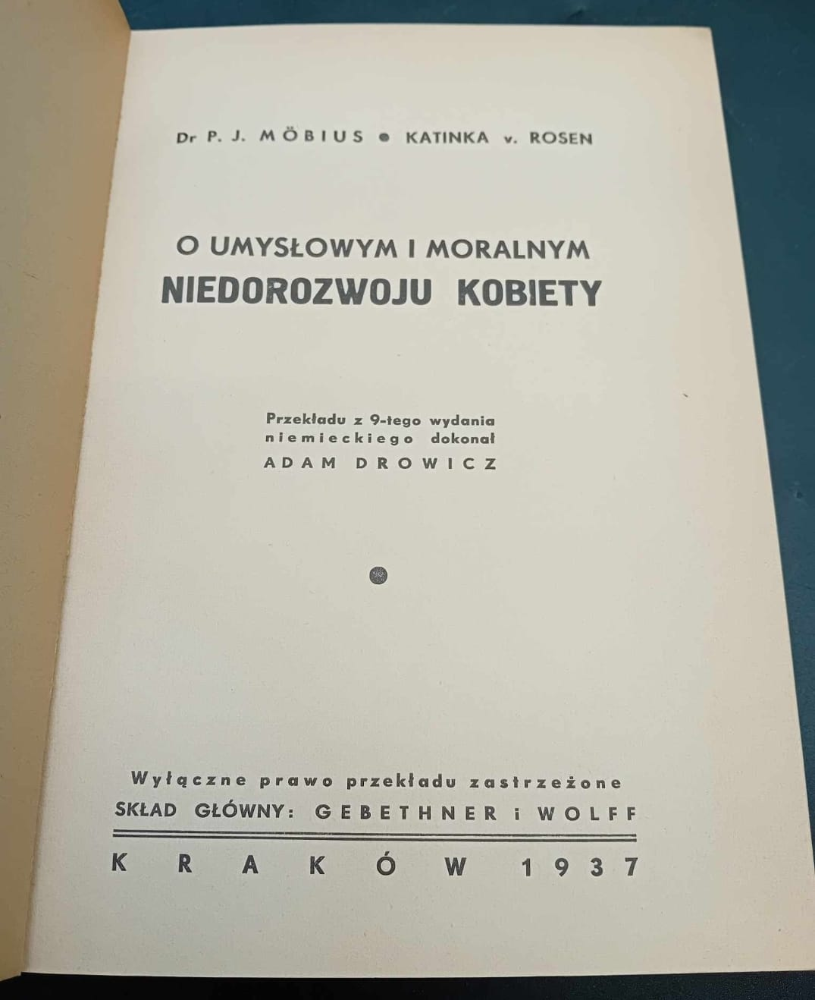
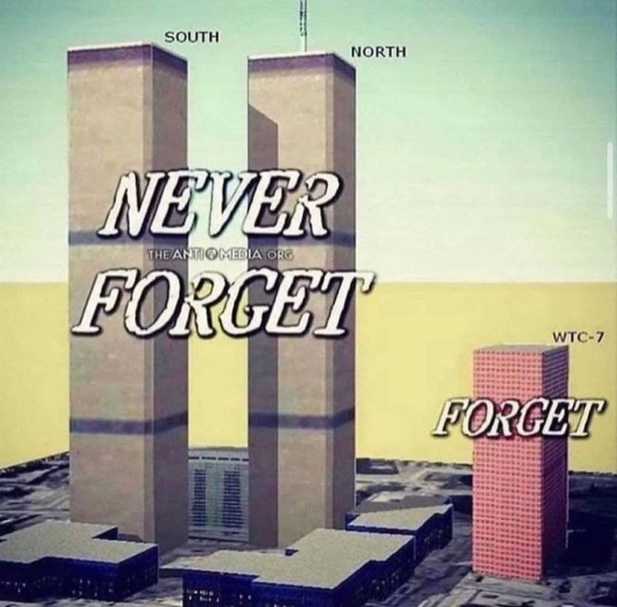
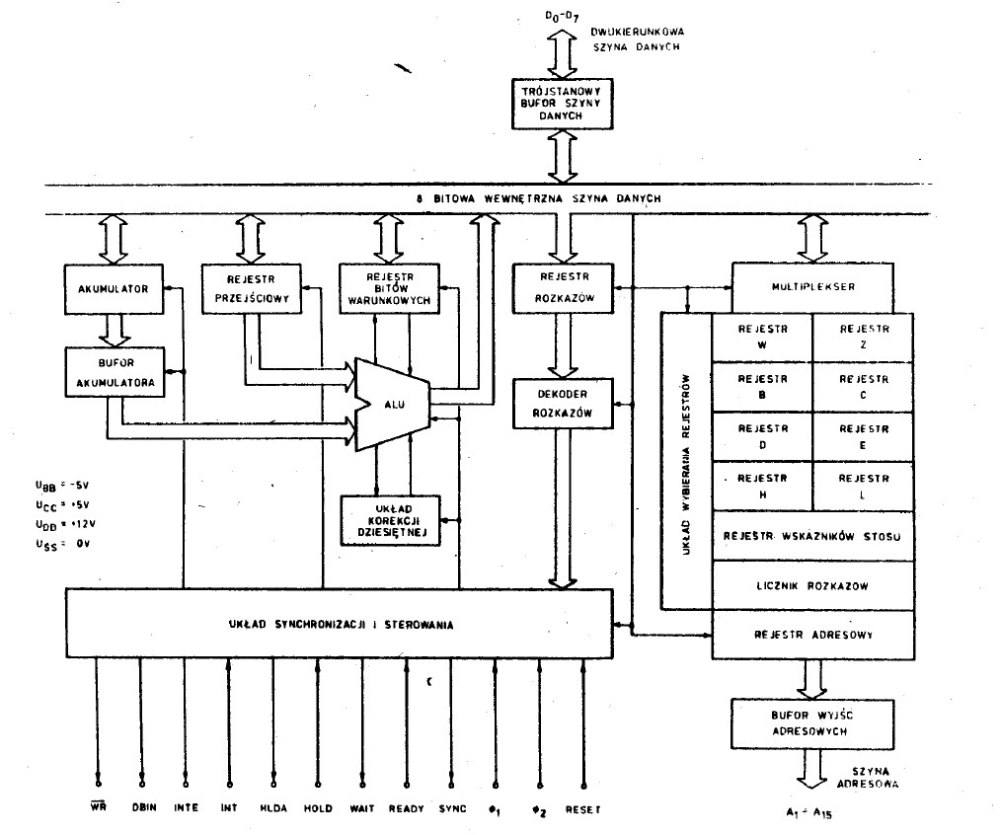

### 2023

  

👀 THE storm (not)perfect is coming.

<a href="./documents/september/sp230819.pdf" target="_blank">Central banks at the crossroads</a>

---

  

> Ultra-liberalism
<!-- (case brasil) -->

---

<a href="./documents/september/the-origins-of-neoliberalism.pdf" target="_blank">the-origins-of-neoliberalism.pdf</a>

<a href="./documents/september/Import-sprzetu-wojskowego_Deszczynski.pdf" target="_blank">Import-sprzetu-wojskowego_Deszczynski</a>

---

> 👀

  

---

### 2021

Największa manifestacja pracowników ochrony zdrowia w historii Polski

  

> Największym wrogiem zdrowia nie jest choroba, tylko hipochondria; największym wrogiem życia nie jest śmierć, tylko wegetacja; największym wrogiem dobrobytu nie jest nędza, tylko wygodnictwo; największym wrogiem sprawiedliwości nie jest niesprawiedliwość, tylko roszczeniowość; a największym wrogiem szczęścia nie jest cierpienie, tylko samozadowolenie. Prawdziwy i uświadomiony brak ma szansę pobudzić do działania, podczas gdy pozór zaspokojenia lub złudzenie krzywdy wpędza wyłącznie w odrętwienie lub jałową szamotaninę.

---

Wiedeń

Austriackie pielęgniarki podczas dzisiejszego protestu przeciw faszyzmowi sanitarnemu.

  

---

### 2001

  

### 1990

W latach 80-tych i 90-tych w Polsce produkowano mikroprocesory. A dokładniej jeden model mikroprocesora, czyli MCY7880. Była to polska wersja popularnego w tamtych czasach 8-bitowego czipa Intel 8080.

  

Ze źródeł internetowych wynika, że miało być kilka wersji układu (z różnymi prędkościami zegara i zakresami temperatur), ale produkcja na przemysłową skalę nawet tego “standardowego” sprawiała problemy, a tylko nieduży procent wyprodukowanych układów w ogóle działał. MCY7880 został wyprodukowany przez CEMI czyli Naukowo-Produkcyjne Centrum Półprzewodników, które zajmowało się produkcją diod, tranzystorów i prostych układów scalonych. Podzespoły wykorzystywano w przemyśle krajowym (np. w komputerach Elwro 500 czy centralach telefonicznych). CEMI zlikwidowano w 1994 roku. Jak do tej pory, MCY7880 był jedynym seryjnie produkowanym polskim czipem.

### 1973

Chile's democratically elected government was overthrown by fascists with the help of the CIA.

  

### 1946

W białostockim więzieniu Urzędu Bezpieczeństwa przy ulicy Kopernika 21 rozstrzelano 6 działaczy antykomunistycznych, członków stowarzyszenia Wolność i Niezawisłość. Był wśród nich 19- letni Marian Piekarski "Ryś" (zdjęcie) dowództwa patrolu dywersyjnego w batalionie "Moczary", uczestnik akcji uwolnienia 6 byłych żołnierzy Armii Krajowej osadzonych w areszcie w Suwałkach. Wydarzenie to miało miejsce 12 marca 1945 roku. Tego samego dnia zabity został również Aleksander Rybnik- prezes Okręgu Białystok WiN.

  

### 1938

https://en.wikipedia.org/wiki/Perry_Anderson

### 1939

Wojska niemieckie przełamały w okolicach Jarosławia  polską linię obrony na Sanie. 
2. Dywizja Pancerna pod dowództwem generała majora Rudolfa Veila utworzyła tak zwane przedmoście  a następnie rozpoczęła budowę mostu, po którym przyjechały 4. Dywizja Lekka, 2. Dywizja Górska pod dowództwem generała Valentina Feursteina, która zdobyła Birczę oraz słowacka 3. Dywizja Piechoty, która zajęła Baligród i Bukowsko. 
Armia niemiecka bardzo szybko zbombardowała miasta. Nie budynki wojskowe, ale dworce, kamienice i grupy uciekinierów z głębi kraju. To był "Blitzkrieg", czyli wojna totalna. 13-letni wówczas Ludwik Misiek - ewakuowany z Komarna pod Lwowem wspominał:
"Niemieckie bombowce He-111 zmasakrowały nasz transport. 116 osób zginęło. Kobiety i dzieci. To było straszne. Zrzucili bomby i strzelali z broni pokładowej do uciekających w kukurydzę dzieci, do wózków".

  

### 1869

Pochodzący z Chełma 25 letni przemysłowiec Antoni Kazimierz Blikle założył w Warszawie przy ulicy Nowy Świat swoją pierwszą cukiernię.
Firma Blikle istnieje do dziś.
Na zdjęciu pocztówka z lat 30. z widokiem na kawiarnię Blikle.

  

### 1661

Powstał Związek Braterski czyli konfederacja wojskowa licząca 14 tysięcy członków zawiązana przeciwko królowi Janowi Kazimierzowi (grafika), któremu zarzucano dążenie do władzy absolutnej. Na czele tej organizacji stanął szlachcic Kazimierz Żeromski.
Związek Braterski wysunął postulaty wypłaty zaległego żołdu,a także przedstawił własny program obrony dóbr i przywilejów szlacheckich.
Nie uzyskawszy poparcia obywatelskiego na Sejmie roku 1662 i po obietnicy wypłacenia
zaległych pieniędzy rozpadł się wewnętrznie i uległ oficjalnie likwidacji 4 sierpnia 1663 roku.

  

---

<a href="https://github.com/TomaszWaszczyk/historia.waszczyk.com/edit/master/src/content/september-11.md" target="_blank">Edytuj tę stronę dzieląc się własnymi notatkami!</a>
