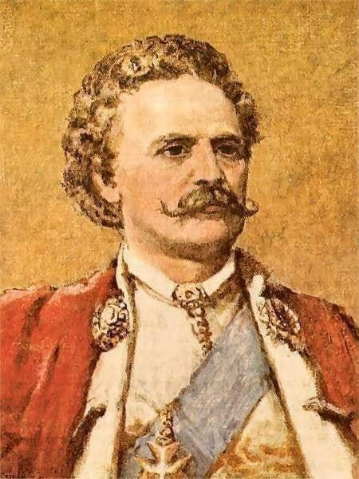

### 1939

https://pl.wikipedia.org/wiki/Bitwa_pod_%C5%81%C4%99townic%C4%85_i_Andrzejewem

---

Francuzi i Brytyjczycy zdecydowali się nie pomagać Polsce w walce z Niemcami.

Argumentowali to faktem szybkich postępów wojsk niemieckich i brakiem sensowności tego typu działania. Ewidentny dowód na to, jak iluzoryczne były wcześniejsze to obietnice z ich strony. Oni nawet nie mieli żadnego planu na to, jak mogliby nam pomóc.

W tekście jest o tym, że to przez tą zdradę aliantów przegraliśmy IIWŚ. Ja zdecydowanie się z tym nie zgadzam. Przegraliśmy, przez naszą wrodzoną naiwność i hamletyzm, którego uosobieniem był minister spraw zagranicznych Józef Beck.

Ówcześni decydenci nie żałowali nigdy krwi naszego narodu i polskiego

### 1917

<https://pl.wikipedia.org/wiki/Rada_Regencyjna>

### 1919

https://en.wikipedia.org/wiki/Gold_fixing

### 1733

12 tysięcy przedstawicieli polskiej szlachty podpisało się pod aktem elekcyjnym Stanisława Leszczyńskiego (grafika).Nie oznaczało to jednak, że został on nowym królem Polski, ponieważ na drodze do tronu stanął mu August III Sas wspierany przez Rosjan,z którym Leszczyński przegrał wojnę domową. Spór ten zakończył się kompromisem z Austrią w skutek którego August III Sas został polskim królem,a Leszczyński dożywotnim władcą Lotaryngii.

  

---

<a href="https://github.com/TomaszWaszczyk/historia.waszczyk.com/edit/master/src/content/september-12.md" target="_blank">Edytuj tę stronę dzieląc się własnymi notatkami!</a>
