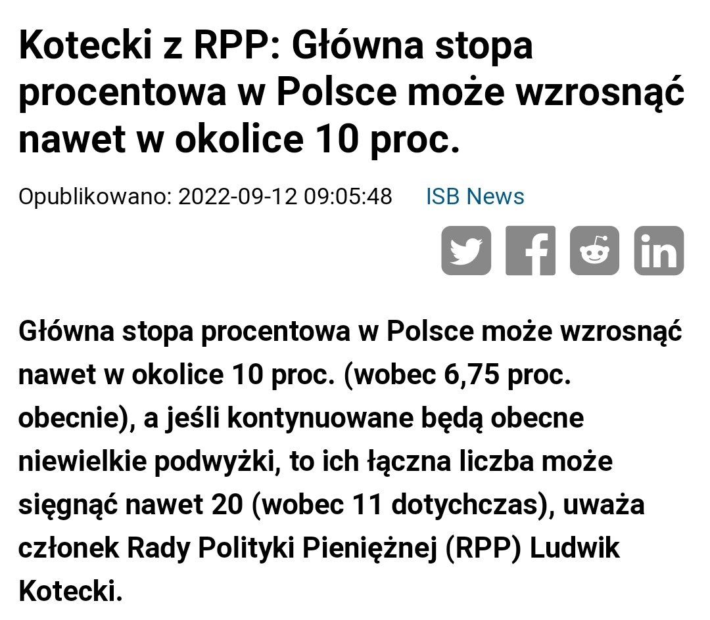
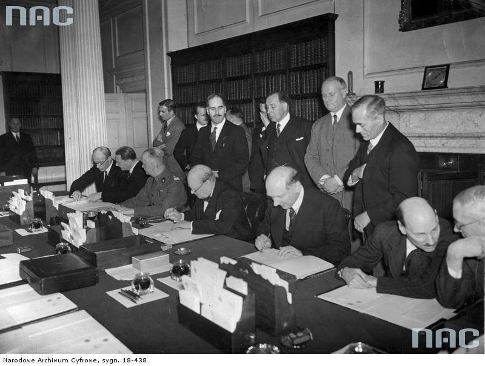
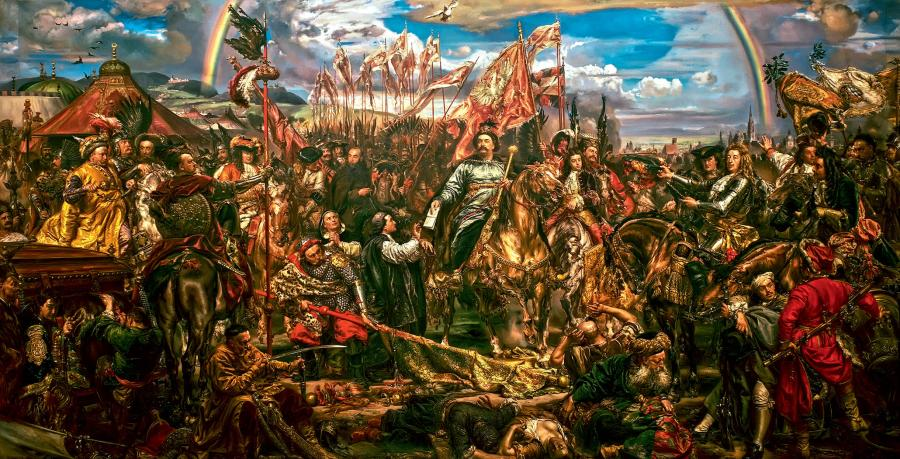

### 2023

  

### 2022

7 years ago 55k Turkish Lira could buy a Volkswagen Golf.

Today 55k Turkish Lira can’t even buy an iPhone.

There is no better way to illustrate how harmful fiat inflation can be.

  

---

  

---

### 2021

Tego jeszcze nie było. Prezes Rafako Radosław Domagalski-Łabędzki stawia rządowi ultimatum: albo państwo zrenacjonalizuje kierowaną przez niego spółkę, albo Rafako ogłosi upadłość, a wtedy władza musi się liczyć z poważnymi kłopotami energetycznymi.

Prezes, który jeszcze niedawno był zaufanym współpracownikiem Mateusza Morawieckiego, teraz narzeka, że nikt z władz nie chce rozmawiać. Ma więc pomysł, jak do tego skłonić rząd.

Rafako to raciborska spółka specjalizująca się w produkcji instalacji do wytwarzania energii, zwłaszcza wielkich kotłów do elektrowni i elektrociepłowni węglowych. Jedyna taka w Polsce. Większość kotłów w polskich elektrowniach i elektrociepłowniach powstała w Rafako. Dziś to prywatna spółka giełdowa z problemami i dość pechową przeszłością.

Rafako popłynęło na kilku kontraktach, zbyt optymistycznie kalkulując ceny. W efekcie z trudem wywinęło się od bankructwa, wynegocjowało układ z wierzycielami i wychodzi na prostą. Tyle że, jako się rzekło, nie ma normalnego właściciela, bo nadzorca nie ma prawa wykonywać obowiązków właścicielskich.

Od pół roku spółką zarządza Radosław Domagalski-Łabędzki, którego rada nadzorcza wybrała ze względu na jego dobre kontakty z obecną władzą. Jako człowiek Morawieckiego, który był przy nim wiceministrem rozwoju, a potem rozwijał się na kolejnych stanowiskach w instytucjach państwowych i spółkach Skarbu Państwa – w KNF, jako prezes KGHM, członek zarządu Polskiej Grupy Zbrojeniowej – wydawało się, że może Rafako pomóc swoimi kontaktami. Na początku tego roku przeszedł do Rafako i od tego czasu zabiega o to, by państwo uratowało raciborską spółkę. Bo z niewyjaśnioną sytuacją właścicielską Rafako nie może startować w przetargach ani podejmować się dużych zleceń. Żaden bank nie da jej większych pieniędzy, nie wiedząc, co stanie się ze spółką. Agencja Rozwoju Przemysłu dała wprawdzie 100 mln zł kredytu, ale nie rozwiązała problemu własnościowego.

### 1939

https://pl.wikipedia.org/wiki/Bitwa_pod_%C5%81%C4%99townic%C4%85_i_Andrzejewem

---

Francuzi i Brytyjczycy zdecydowali się nie pomagać Polsce w walce z Niemcami.

Argumentowali to faktem szybkich postępów wojsk niemieckich i brakiem sensowności tego typu działania. Ewidentny dowód na to, jak iluzoryczne były wcześniejsze to obietnice z ich strony. Oni nawet nie mieli żadnego planu na to, jak mogliby nam pomóc.

> W tekście jest o tym, że to przez tą zdradę aliantów przegraliśmy IIWŚ. Ja zdecydowanie się z tym nie zgadzam. Przegraliśmy, przez naszą wrodzoną naiwność i hamletyzm, którego uosobieniem był minister spraw zagranicznych Józef Beck.

Ówcześni decydenci nie żałowali nigdy krwi naszego narodu i polskiego. Na konferencji aliantów w Abbeville we Francji zdecydowano o nieudzielaniu pomocy Polsce w wojnie z Niemcami.

Mimo iż Francja i Wielka Brytania gwarantowały nienaruszalność granic Polski, a oba państwa podpisały przed wojną układy polityczno-wojskowe z Polską, nie zdecydowały się na wydatne wsparcie sojusznika w obliczu niemieckiej agresji. Co więcej, już 12 września 1939 roku, w niecałe dwa tygodnie po ataku III Rzeszy na Polskę, Najwyższa Rada Wojenna złożona z przedstawicieli mocarstw zachodnich zebrała się na konferencji w Abbeville, gdzie zdecydowano się na wstrzymanie ograniczonej ofensywy lądowej. Francuzi i Brytyjczycy arbitralnie zadecydowali, iż klęska Polski jest przesądzona. Bez kontaktu z sojusznikiem i bez odpowiednich informacji na temat przebiegu walk z niemieckim agresorem. W praktyce oznaczało to pozostawienie Polski bez obiecanej pomocy i skazanie jej na zajęcie przez Niemców. O wynikach konferencji nie poinformowano rządu polskiego, co czyni sprawę jeszcze bardziej kontrowersyjną. W tym czasie Wojsko Polskie toczyło bowiem zacięte walki na linii rzeki Bzury, oczekując wspierającej ofensywy sojuszników na froncie zachodnim. Plany obrony Polski były bowiem układane w odniesieniu do ówczesnej sytuacji polityczno-militarnej, z uwzględnieniem obiecanej pomocy brytyjskiej i francuskiej.
Wyniki konferencji w Abbeville przesądziły o upadku Polski, przyczyniając się również do wkroczenia wojsk sowieckich na polskie ziemie 17 września 1939 roku. W konsekwencji obrady Najwyższej Rady Wojennej są powszechnie uznawane za zdradę sojusznika, zwłaszcza w obliczu niezaproszenia Polaków do rozmów, a następnie braku informacji o ich rezultatach. Był to kolejny wyraźny akt błędnej polityki ustępstw, która w konsekwencji doprowadziła do okupacji niemal połowy Europy przez wojska niemieckie i włoskie.

  

### 1921

We Lwowie urodził się Stanisław Lem, prozaik, eseista, satyryk, najsłynniejszy polski autor literatury fantastycznonaukowej, członek PAU. Z wykształcenia był lekarzem, jednak nigdy nie pracował w wyuczonym zawodzie. Jego literacki debiut datuje się na 1946 rok. Powieści i opowiadania Lema przełożono na kilkadziesiąt języków. Jego najbardziej znane powieści to: Astronauci (1951) i Solaris (1961) oraz zbiory opowiadań: Dzienniki gwiazdowe (1957), Bajki robotów (1961), Cyberiada (1965), Opowieści o pilocie Pirxie (1968). Był również twórcą filozoficznych esejów jak np. Summa technologiae (1964), Filozofia przypadku. Literatura w świecie empirii (1968). Dość często Lem stosował w swej twórczości formę pastiszu oraz parodii, jak w dziele Doskonała próżnia (1971). Zmarł 27 marca 2006 roku.

  

### 1917

<https://pl.wikipedia.org/wiki/Rada_Regencyjna>

### 1919

https://en.wikipedia.org/wiki/Gold_fixing

### 1883

Jan Sobieski pod Wiedniem

  

### 1733

12 tysięcy przedstawicieli polskiej szlachty podpisało się pod aktem elekcyjnym Stanisława Leszczyńskiego (grafika).Nie oznaczało to jednak, że został on nowym królem Polski, ponieważ na drodze do tronu stanął mu August III Sas wspierany przez Rosjan,z którym Leszczyński przegrał wojnę domową. Spór ten zakończył się kompromisem z Austrią w skutek którego August III Sas został polskim królem,a Leszczyński dożywotnim władcą Lotaryngii.

  

---

<a href="https://github.com/TomaszWaszczyk/historia.waszczyk.com/edit/master/src/content/september-12.md" target="_blank">Edytuj tę stronę dzieląc się własnymi notatkami!</a>
