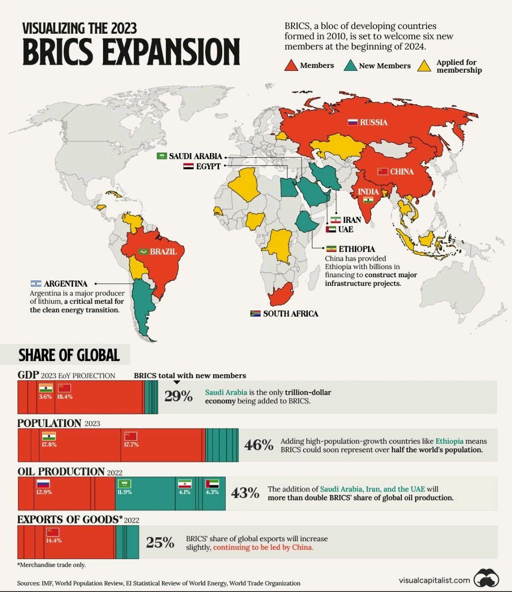
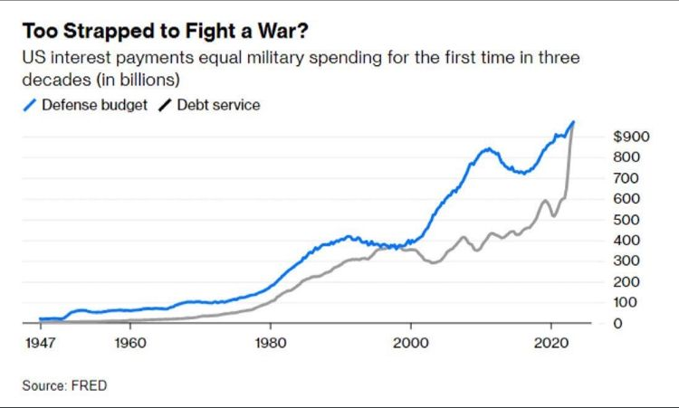
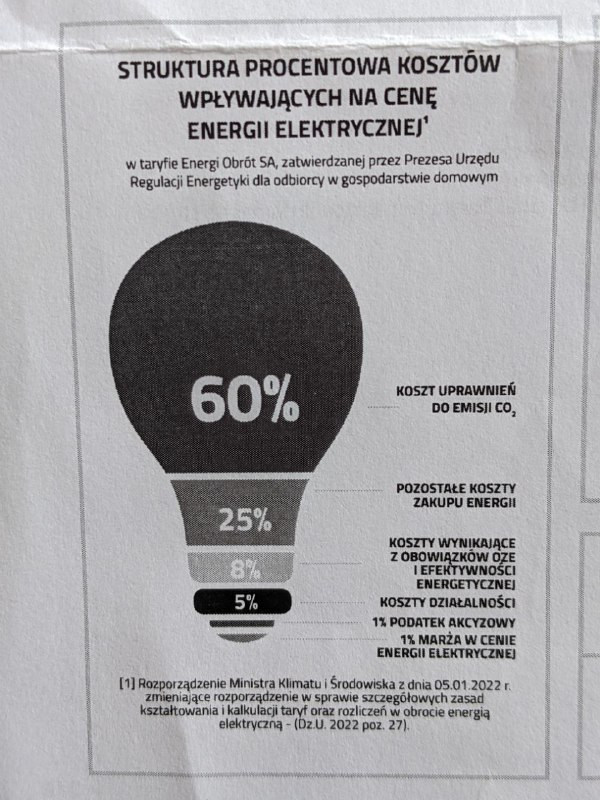
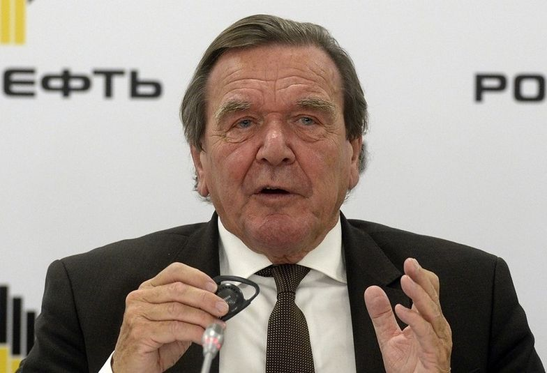
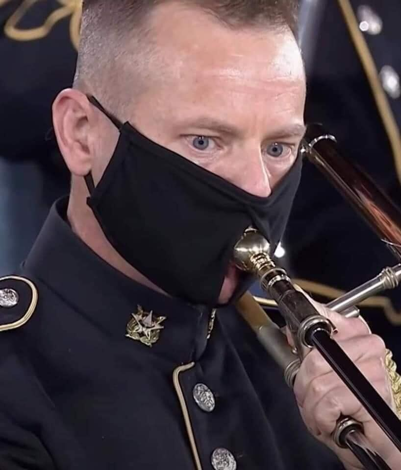
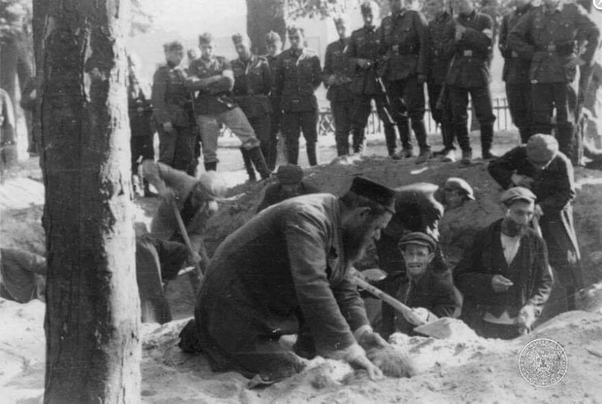

### 2023

  

  

---

<a href="./documents/september/OCRPfizer-1_Redacted.pdf" target="_blank">OCR</a>

<a href="./documents/september/pranie-politykow.pdf" target="_blank">Pranie polityków</a>

<a href="./documents/september/kurczy-sie.pdf" target="_blank">Kurczy się</a>

---

### 2022

> Premier ogłosił podniesienie płacy minimalnej z 3010 zł do poziomu 3600 zł od 1 lipca 2023 roku (wzrost o 19,6%)

...

<video width="640" height="480" controls>
<source src="./movies/september/polskainflacja.mp4" type="video/mp4">
Your browser does not support the video tag.
</video>

---

  

---

Reparacje:

1. https://www.dropbox.com/s/m5ajjug6yjdgzf7/Raport-PL-tom1.pdf?dl=0
2. https://www.dropbox.com/s/xwww19moor8dwdw/Raport-PL-tom2.pdf?dl=0
3. https://www.dropbox.com/s/rmjiey5tpql6lz3/Raport-PL-tom3.pdf?dl=0
4. https://www.dropbox.com/s/z1wnneydwlo8m87/Report-EN-part1.pdf?dl=0
5. https://www.dropbox.com/s/iqjy81yjd3uxinv/Report-EN-part2.pdf?dl=0
6. https://www.dropbox.com/s/gkrxdnylo630hnz/Report-EN-part3.pdf?dl=0

---

### 2021

Merkel goes to Moscow?

German-Russian love in bloom… and the Nord Stream II gas pipeline will show who rules Europe.
Gerhard Schroeder,Matthias Warnig...
They are wonderful people, they can break stereotypes and show love to other people
Earning extra money for retirement ... is already a German tradition.
Gerhard Schroeder, former German chancellor in the management of the Russian oil company Rosneft.
Matthias Warnig, former Stasi agent who was also supposed to work with Vladimir Putin, then a KGB agent, during the communist era.
The names of Schroeder and Warnig also appear on the payroll of another Russian giant, Gazprom

  

---

> Z czego jutro…?

Przez 400 lat w Cesarstwie Rzymskim bito monety wyłącznie z pieczęcią cesarza dzięki uporządkowaniu systemu przez Oktawiana Augusta. Został on zniszczony przez polityki inflacyjne kolejnych cesarzy, co w konsekwencji doprowadziło do upadku samego Cesarstwa i regresu cywilizacyjnego, który prof. H. Samsonowicz zobrazował skurczeniem się znajomość kuli ziemskiej z obszaru obejmującego około 30 milionów kilometrów kwadratowych w starożytności do zaledwie 5 milionów we wczesnym Średniowieczu.

Inflacja pojawiła się w połowie I wieku za sprawą decyzji cesarza Nerona, który jako pierwszy władca zdewaluował oficjalną walutę, redukując do 90 proc. zawartość srebra w denarze. Kolejni cesarze dewaluowali denara doprowadzając do rosnących cen i topniejących oszczędności obywateli. Zawartość srebra w denarach malała i za rządów Marka Aureliusza w 180 roku wynosiła już tylko 75 proc. pierwotnej zawartości. Trzydzieści lat później srebro stanowiło 50 proc., a w 268 roku w denarze znajdowało się już tylko 0,5 proc. srebra. W wyniku psucia własnego pieniądza, Cesarstwo pogrążyło się w szalejącej hiperinflacji. W niektórych okresach ceny rosły o około 1000 proc. rocznie. Reakcją rządzących na wywołaną przez nich samych hiperinflację, było ustanowienie cen maksymalnych na najważniejsze towary, co już wtedy wywołało niedobór towarów i doprowadziło do finansowej ruiny kupców oraz zaniku handlu pomiędzy różnymi obszarami cesarstwa. W trakcie wywołanych w ten sposób kryzysów gospodarczych w III i IV wieku upada również większość banków. W cesarstwie przestaje istnieć bankowość, która dopiero osiem wieków później zostaje na nowo odkryta we włoskich państwach-miastach.

Inflacja - parafrazując Stanisława J. Lecą, to zbiór faktów, które nie musiały zajść. Rządzący od udokumentowania jej skutków już w czasach Cesarstwa Rzymskiego uważali jednak, że jest korzystna dla finansów publicznych, bo m.in. redukuje dług publiczny oraz sprawia, że pieniądz będąc tańszym, staje się bardziej dostępny, nie bacząc, że redukuje oszczędności gospodarstw domowych i obciąża je kolejnymi podatkami.

Inflacja w polskiej literaturze ekonomicznej oraz społecznej dość dobrze została rozpoznana i zdiagnozowana zwłaszcza w II Rzeczpospolitej. Jednym z autorów, który poświęcał jej prace był prof. Adam Krzyżanowski. Uważał, że jednym ze źródeł inflacji jest ogólna suma konsumpcji publicznej, która jest zbyt wielka w stosunku do zamożności ówczesnego społeczeństwa, a wzrost wydatków budżetowych wywołał katastrofę̨. Bronił poglądu, wedle którego „równowaga budżetowa bez przeciążenia podatkowego zabezpiecza przed drożyzną i spadkiem waluty, ale tej gwarancji nie daje równowaga budżetowa sama przez się (...) i że także budżet zrównoważony, ale oparty na przeciążeniu podatkowym podbija ogólny poziom cen i wywraca walutę̨”. Pod koniec XX wieku, o którym Adam Krzyżanowski napisał książkę, prof. Milton Friedman stwierdził, że „kiedy inflacja ulega przyspieszeniu prędzej czy później prowadzi do zniszczenia istniejącego porządku społecznego, gdyż generuje tak wiele niesprawiedliwości i cierpień, że może dojść do niezadowolenia społecznego jak np. w USA w 1980 r. (...) oraz, że obywatele otrzymują straty z inflacji a rząd z jej tytułu większe wpływy”. W tym czasie polskie społeczeństwo masowo protestowało przeciwko drożyźnie i brakowi towarów, co doprowadziło do porozumień sierpniowych i tym samym zapoczątkowało upadek systemu, z którego dziedzictwem, czyli hiperinflacją zmagała się III RP. Wydawałoby się, że tak bolesne i nieodległe doświadczenie z konsekwencjami psującego się pieniądza jest wystarczającym zabezpieczeniem przed eksperymentowaniem z inflacją. Prof. Konrad Raczkowski w sierpniowym raporcie „Wpływ inflacji na gospodarkę” zauważa, że „ inflacja wywołuje niewłaściwą̨ alokację zasobów i tracą̨ na niej zwłaszcza wierzyciele, posiadacze gotówki oraz właściciele depozytów gotówkowych na rachunkach oszczędnościowych. (...) Determinanty inflacji to nadmierna emisja pieniądza, która skutkuje zbyt dużą ich ilością̨ w gospodarce i niezrównoważony budżet państwa (...) Inflacja może być́ kształtowana zarówno przez politykę̨ monetarną, jak i polityką fiskalną, gdzie dyscyplina fiskalna wpływa na obniżenie inflacji”.

W 1999 r. Krzysztof Dzierżawski jako ekspert Centrum im. Adama Smitha w artykule „Inflacja” przestrzegał, że „dzisiejszy poziom inflacji wciąż stanowi główną przeszkodę w rozwoju mieszkalnictwa i innych długookresowych inwestycji. Konieczność ograniczenia wzrostu cen pozostawać musi przeto nadal jednym z najważniejszych celów polskiej polityki gospodarczej”.

Trwające przeciążanie inflacją sztucznie ożywia stan finansów publicznych, jednak w konsekwencji prowadzi do zniszczenia oszczędności obywateli, a co najgorsze -zaufania do polskiej waluty, po której zniszczeniu przyjęcie Euro będzie wybawieniem.

Andrzej Sadowski założyciel i prezydent Centrum im. Adama Smitha - pierwszego w Polsce think tanku działającego od 16 września 1989 roku.

---

  

### 2020

Osiągnięcie przez kurs złota wycenianego w dolarze historycznego rekordu skłoniło część inwestorów do realizacji pokaźnych zysków. Najważniejsze przesłanki fundamentalne będą w naszej ocenie sprzyjać utrzymaniu się trendu wzrostowego ceny kruszcu.

Po pokonaniu w lipcu 2020 r. przez kurs złota silnego oporu na poziomie 1850 USD/oz, trwający od początku 2016 r. trend wzrostowy stał się znacząco silniejszy i w ciągu niecałego miesiąca wywindował cenę kruszcu na rekordowy poziom 2080 USD/oz. Tym samym zakończyła się łatwiejsza do technicznej analizy część ruchu wzrostowego, a kurs złota pozostał bez klarownych poziomów docelowych. W warunkach dużego wykupienia rynku skłoniło to część krótkoterminowych graczy do zrealizowania pokaźnych zysków, a kruszec wprowadziło w naturalną korektę. Powrót do ścieżki wzrostowej wydaje się jednak kwestią kilku tygodni, przy czym im dłużej potrwa obecna konsolidacja, tym lepiej dla trwałości przyszłych wzrostów.

Najważniejsze przesłanki fundamentalne będą w naszej ocenie sprzyjać dalszemu umacnianiu się ceny złota. Nadal silnie rośnie podaż pieniądza w Stanach Zjednoczonych – roczny przyrost agregatu M2 wynosi obecnie około 25 proc. W ostatnich latach najwyższe tempo wzrostu M2, rzędu kilkunastu procent, występowało w 2001 r. i w 2009 r. i w obu przypadkach zapowiadało silny trend wzrostowy cen złota. Złoto wykazuje silną tendencję do tego, żeby w długim okresie utrzymywać w miarę stałą relację do podaży dolarów. Kruszcowi sprzyja również wzrost sumy bilansowej Fed. Po ostatnim równie szybkim zwiększeniu sumy bilansowej pod koniec roku 2008 cena złota wzrosła ponad dwukrotnie.

  

Monetyzacji długu towarzyszy bezprecedensowa ekspansja fiskalna. Stosunek deficytu budżetu USA do PKB sięga 20 proc. Nie widać też poważnych przeszkód natury politycznej, społecznej i ekonomicznej, które mogłyby skłonić decydentów do rezygnacji z traktowania bezpośrednich transferów jako instrumentu wspierania gospodarki USA w warunkach spadku PKB (w drugim kwartale 2020 PKB w ujęciu kwartalnym spadł o 33%) i masowej utraty płynności w przedsiębiorstwach i gospodarstwach domowych.

W odróżnieniu od interwencji Fed w 2008r., obecnie skup obligacji przez amerykański bank centralny, obejmujący poza obligacjami skarbowymi również obligacje koropracyjne o inwestycyjnym i śmieciowym ratingu, oznacza nie tylko monetyzowanie istniejącego długu, ale w dużym zakresie służy też finansowaniu bezpośredniego wsparcia dla realnej gospodarki. Prędzej czy później przełoży się to na wzrost inflacji, a obecnie hamuje tendencje deflacyjne, które w przeciwnym wypadku byłyby dominujące w sytuacji zamrożenia dochodów i utraty pracy przez dużą część amerykańskich pracowników.

Przy rentowności 10-letnich obligacji skarbowych USA na poziomie bliskim dołkom z marca, mocno rosną oczekiwania inflacyjne. Obecnie kupujący amerykańskie 10-letnie obligacje skarbowe muszą pogodzić się z oczekiwaną stratą ok. 1 proc. swojego kapitału rocznie. Czyni to trzymanie złota atrakcyjnym w porównaniu z alternatywą, jaką dla funduszy poszukujących bezpieczeństwa są obligacje skarbowe.

Zadłużona gospodarka amerykańska jest bardzo wrażliwa na nawet niewielki wzrost kosztów odsetkowych, szczególnie w obecnej sytuacji gwałtownie zmniejszonych dochodów, można zatem założyć, że Fed będzie mocno interweniował przy każdym spadku cen obligacji (czyli wzroście ich rentowności).

Ogłoszona w ostatnich dniach przez bank centralny USA strategia uśredniania inflacji wokół poziomu 2% rocznie jest jednoznacznym sygnałem, że Fed nie będzie walczył z inflacją gdy krótkookresowo oddali się ona od tego poziomu. W warunkach niskich stop procentowych oraz przyzwolenia na wyższą niż 2% inflację, koszt alternatywny trzymania złota powinien utrzymywać się jeszcze długo istotnie poniżej zera.

### 1995

Józef Ulma został wraz z żoną Wiktorią pośmiertnie odznaczony medalem Sprawiedliwy wśród Narodów Świata. Podczas wojny Józef i Wiktoria Ulmowie wraz z sześciorgiem dzieci mieszkali w podkarpackiej wsi Markowa. Rodzina Ulmów narażając własne życie udzielała od jesieni 1942 roku schronienia 8 Żydom z rodziny Szallów i Goldmanów. 23 marca 1944 roku szef żandarmerii niemieckiej z posterunku w Łańcucie porucznik Eilert Dieken wydał rozkaz zamordowania rodziny Ulmów oraz ukrywanych przez nich Żydów. Był to efekt donosu jaki granatowy policjant Włodzimierz Leś złożył na rodzinę Józefa i Wiktorii Ulmów. Motywem działania Włodzimierza Lesia była chęć przywłaszczenia sobie majątku należącego do braci Szallów, którym początkowo on sam udzielał schronienia, ale po wprowadzeniu kary śmierci za ukrywanie Żydów, wypędził ich. 24 marca, w godzinach porannych wykonano wyrok. Zabito 8 Żydów, małżeństwo Ulmów oraz 7 ich dzieci w wieku od 0 do 8 lat (poród siódmego dziecka rozpoczął się w dniu masakry). Zamordowana została również córeczka Layki Goldman. Udział w mordzie brali: szef posterunku w Łańcucie porucznik Eilert Dieken, żandarmi: Gustaw Unbehend, Joseph Kokott (trójkę albo czwórkę dzieci Ulmów zamordował własnoręcznie m.in. uderzając główkami dzieci o pień drzewa, krzyczał przy tym: ,,Patrzcie, jak giną polskie świnie, które pomagają Żydom!''), Michael Dziewulski i Erich Wilde, oraz polscy granatowi policjanci: Włodzimierz Leś i Eustachy Kolman. Tożsamości pozostałych granatowych policjantów nie udało się ustalić. Dowódca ekspedycji karnej porucznik Dieken wydał rozkaz zamordowania dzieci, żeby jak twierdził mieszkańcy Markowej nie mieli z nimi kłopotów. Akcję uwieńczyła libacja alkoholowa urządzona na miejscu masakry (w tym celu sołtys musiał dostarczyć oprawcom trzy litry wódki). Po ograbieniu zwłok pomordowanych i splądrowaniu gospodarstwa Ulmów oprawcy załadowali skradzione rzeczy na sześć furmanek i odjechali z miejsca zdarzenia. Porucznik Eilert Dieken, dowódca żandarmerii niemieckiej w Łańcucie nigdy nie odpowiedział za swoje czyny przed sądem, a po wojnie pracował jako inspektor policji w Essen. Joseph Kokott, czeski volksdeutsch, który osobiście zastrzelił trójkę lub czwórkę dzieci Ulmów, a następnie ograbił zwłoki Żydów, został deportowany do Polski, skazany na karę śmierci, którą zamieniono mu na karę 25
lat pozbawienia wolności. Zmarł w więzieniu w 1980 roku. Włodzimierz Leś, wyrokiem polskiego podziemia, został skazany na karę śmierci, którą wykonali na nim żołnierze Armii Krajowej, 10 września 1944. Dalsze losy pozostałych oprawców pozostają nieznane. Proces beatyfikacyjny rodziny Ulmów na etapie diecezjalnym zakończył się w 2008 r. W 2011 r. wszystkie dokumenty trafiły do Watykanu. W przypadku uznania Ulmów za błogosławionych będzie to prawdopodobnie pierwsza w historii Kościoła wspólna beatyfikacja całej rodziny - nie tylko małżonków, ale także siedmiorga ich dzieci.

  

### 1939

W Szczucinie żołdacy z Wehrmachtu zamordowali 25 Żydów. Przed egzekucją Żydzi musieli pochować ok. 100 osób - byli to jeńcy polscy zamordowani dzień wcześniej przez żołdaków z 8. Dywizji Piechoty z VIII Korpusu Armijnego. Żołdacy za wymordowanie polskich jeńców zostali uhonorowani Żelaznym Krzyżem i prawdopodobnie dodatkowymi upominkami w postaci alkoholu i kilku dni wolnych od służby. 
„Następnego dnia [Niemcy] sprowadzili Żydów, by ich pochowali. Musieli wykopać groby. Był z nimi młody Żyd [...], on [podoficer niemiecki] uderzył go pięścią w twarz. Wkrótce potem zatłukł go karabinem. W taki sposób, że zaraz wypłynął mózg, a Żydzi musieli wykopać groby i wtedy wrzucali do nich Polaków. Na koniec rozstrzelano także Żydów i wrzucono do tych samych dołów. Potem to wszystko zasypano cienką warstwą ziemi, a następnego dnia przyszły polskie... żydowskie kobiety, a więc matki i żony, one znowu tych zabitych wykopały po to, by ich pochować. To by było wszystko” (Hannes Heer, Vom Verschwinden der Täter, Berlin 2004)
Na zdjęciu przedstawiona jest egzekucja 22 Żydów - obywateli miasta Końskie w odwecie za zabicie 4 żołnierzy niemieckich przez nieznanych sprawców. Ofiary były przymuszane do kopania sobie grobu. Egzekucję fotografowała ekipa filmowa Leni Riefenstahl. W mojej ocenie egzekucja Żydów w Szczucinie wyglądała podobnie.

  

### 1732

Początek rozbioru Polski:

https://pl.wikipedia.org/wiki/Traktat_Loewenwolda

### 1195

Miała miejsce bitwa nad Mozgawą- nierozstrzygnięta, ale jedna z najkrwawszych batalii w historii okresu rozbicia dzielnicowego. Stronami konfliktu były wojska małopolskie i mazowieckie wojewody krakowskiego Mikołaja Gryfita i księcia włodzimiersko-wołyńskiego Romana Halickiego oraz wojska wielkopolskie pod wodzą Mieszka III Starego (grafika).
Przyczyną konfliktu był wybór na księcia krakowskiego zaledwie 8- letniego Leszka Białego. Wybór ten nie spodobał się władcy wielkopolskiemu oraz zwolennikom silnej władzy książęcej.
Taki opis tego wydarzenia znajdujemy w staroruskiej kronice pod tytułem Latopis Kijowski:
"Roku 6703 (tj. 1195) Roman przestraszył się teścia swojego (Ruryka Rościsławowica) i pojechał w Lachy dla (uzyskania) pomocy, ku Kazimierzowicom (tj. Leszkowi Białemu i Konradowi I). I rzekli mu Kazimierzowice: My byśmy tobie radzi pomogli, lecz skrzywdzi nas stryj nasz Mieszko – szuka pod nami włości. Lecz ty przedtem urządź nas, abyśmy byli wszyscy Lachowie – nie różni,jeno za jedną byśmy tamą byli z tobą i byśmy pomścili krzywdy twoje. Romanowi zaś luba była rada ich. I posłuchawszy ich pojechał na Mieszka z synowcami jego Kazimierzowcami ... Mieszko zaś wyszedł przeciw niemu (z wojskiem), lecz nie chciał się bić z nimi, jeno kazał Romanowi, aby pogodził go z synowcami jego. Roman nie posłuchał go, ani mężów swoich i wydał mu bitwę. I zderzyli się Lachowie z Rusią i przemogli Lachowie Ruś , i zwyciężył Mieszko ... ."
Efektem bitwy było pogrzebanie zasady zwierzchnictwa monarszego w Małopolsce oraz zmiana polityki Mieszka Starego, który zawarł porozumienie z Leszkiem Białym i jego matką księżną Heleną Znomejską.

  

---

<a href="https://github.com/TomaszWaszczyk/historia.waszczyk.com/edit/master/src/content/september-13.md" target="_blank">Edytuj tę stronę dzieląc się własnymi notatkami!</a>
