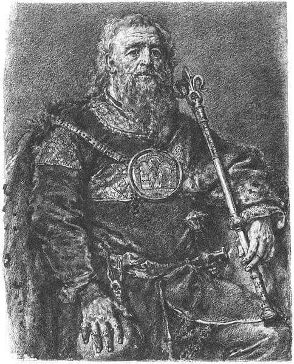

### 2020

Osiągnięcie przez kurs złota wycenianego w dolarze historycznego rekordu skłoniło część inwestorów do realizacji pokaźnych zysków. Najważniejsze przesłanki fundamentalne będą w naszej ocenie sprzyjać utrzymaniu się trendu wzrostowego ceny kruszcu.

Po pokonaniu w lipcu 2020 r. przez kurs złota silnego oporu na poziomie 1850 USD/oz, trwający od początku 2016 r. trend wzrostowy stał się znacząco silniejszy i w ciągu niecałego miesiąca wywindował cenę kruszcu na rekordowy poziom 2080 USD/oz. Tym samym zakończyła się łatwiejsza do technicznej analizy część ruchu wzrostowego, a kurs złota pozostał bez klarownych poziomów docelowych. W warunkach dużego wykupienia rynku skłoniło to część krótkoterminowych graczy do zrealizowania pokaźnych zysków, a kruszec wprowadziło w naturalną korektę. Powrót do ścieżki wzrostowej wydaje się jednak kwestią kilku tygodni, przy czym im dłużej potrwa obecna konsolidacja, tym lepiej dla trwałości przyszłych wzrostów.

Najważniejsze przesłanki fundamentalne będą w naszej ocenie sprzyjać dalszemu umacnianiu się ceny złota. Nadal silnie rośnie podaż pieniądza w Stanach Zjednoczonych – roczny przyrost agregatu M2 wynosi obecnie około 25 proc. W ostatnich latach najwyższe tempo wzrostu M2, rzędu kilkunastu procent, występowało w 2001 r. i w 2009 r. i w obu przypadkach zapowiadało silny trend wzrostowy cen złota. Złoto wykazuje silną tendencję do tego, żeby w długim okresie utrzymywać w miarę stałą relację do podaży dolarów. Kruszcowi sprzyja również wzrost sumy bilansowej Fed. Po ostatnim równie szybkim zwiększeniu sumy bilansowej pod koniec roku 2008 cena złota wzrosła ponad dwukrotnie.

  

### 1995

Józef Ulma został wraz z żoną Wiktorią pośmiertnie odznaczony medalem Sprawiedliwy wśród Narodów Świata. Podczas wojny Józef i Wiktoria Ulmowie wraz z sześciorgiem dzieci mieszkali w podkarpackiej wsi Markowa. Rodzina Ulmów narażając własne życie udzielała od jesieni 1942 roku schronienia 8 Żydom z rodziny Szallów i Goldmanów. 23 marca 1944 roku szef żandarmerii niemieckiej z posterunku w Łańcucie porucznik Eilert Dieken wydał rozkaz zamordowania rodziny Ulmów oraz ukrywanych przez nich Żydów. Był to efekt donosu jaki granatowy policjant Włodzimierz Leś złożył na rodzinę Józefa i Wiktorii Ulmów. Motywem działania Włodzimierza Lesia była chęć przywłaszczenia sobie majątku należącego do braci Szallów, którym początkowo on sam udzielał schronienia, ale po wprowadzeniu kary śmierci za ukrywanie Żydów, wypędził ich. 24 marca, w godzinach porannych wykonano wyrok. Zabito 8 Żydów, małżeństwo Ulmów oraz 7 ich dzieci w wieku od 0 do 8 lat (poród siódmego dziecka rozpoczął się w dniu masakry). Zamordowana została również córeczka Layki Goldman. Udział w mordzie brali: szef posterunku w Łańcucie porucznik Eilert Dieken, żandarmi: Gustaw Unbehend, Joseph Kokott (trójkę albo czwórkę dzieci Ulmów zamordował własnoręcznie m.in. uderzając główkami dzieci o pień drzewa, krzyczał przy tym: ,,Patrzcie, jak giną polskie świnie, które pomagają Żydom!''), Michael Dziewulski i Erich Wilde, oraz polscy granatowi policjanci: Włodzimierz Leś i Eustachy Kolman. Tożsamości pozostałych granatowych policjantów nie udało się ustalić. Dowódca ekspedycji karnej porucznik Dieken wydał rozkaz zamordowania dzieci, żeby jak twierdził mieszkańcy Markowej nie mieli z nimi kłopotów. Akcję uwieńczyła libacja alkoholowa urządzona na miejscu masakry (w tym celu sołtys musiał dostarczyć oprawcom trzy litry wódki). Po ograbieniu zwłok pomordowanych i splądrowaniu gospodarstwa Ulmów oprawcy załadowali skradzione rzeczy na sześć furmanek i odjechali z miejsca zdarzenia. Porucznik Eilert Dieken, dowódca żandarmerii niemieckiej w Łańcucie nigdy nie odpowiedział za swoje czyny przed sądem, a po wojnie pracował jako inspektor policji w Essen. Joseph Kokott, czeski volksdeutsch, który osobiście zastrzelił trójkę lub czwórkę dzieci Ulmów, a następnie ograbił zwłoki Żydów, został deportowany do Polski, skazany na karę śmierci, którą zamieniono mu na karę 25
lat pozbawienia wolności. Zmarł w więzieniu w 1980 roku. Włodzimierz Leś, wyrokiem polskiego podziemia, został skazany na karę śmierci, którą wykonali na nim żołnierze Armii Krajowej, 10 września 1944. Dalsze losy pozostałych oprawców pozostają nieznane. Proces beatyfikacyjny rodziny Ulmów na etapie diecezjalnym zakończył się w 2008 r. W 2011 r. wszystkie dokumenty trafiły do Watykanu. W przypadku uznania Ulmów za błogosławionych będzie to prawdopodobnie pierwsza w historii Kościoła wspólna beatyfikacja całej rodziny - nie tylko małżonków, ale także siedmiorga ich dzieci.

  

### 1732

Początek rozbioru Polski:

https://pl.wikipedia.org/wiki/Traktat_Loewenwolda

### 1195

Miała miejsce bitwa nad Mozgawą- nierozstrzygnięta, ale jedna z najkrwawszych batalii w historii okresu rozbicia dzielnicowego. Stronami konfliktu były wojska małopolskie i mazowieckie wojewody krakowskiego Mikołaja Gryfita i księcia włodzimiersko-wołyńskiego Romana Halickiego oraz wojska wielkopolskie pod wodzą Mieszka III Starego (grafika).
Przyczyną konfliktu był wybór na księcia krakowskiego zaledwie 8- letniego Leszka Białego. Wybór ten nie spodobał się władcy wielkopolskiemu oraz zwolennikom silnej władzy książęcej.
Taki opis tego wydarzenia znajdujemy w staroruskiej kronice pod tytułem Latopis Kijowski:
"Roku 6703 (tj. 1195) Roman przestraszył się teścia swojego (Ruryka Rościsławowica) i pojechał w Lachy dla (uzyskania) pomocy, ku Kazimierzowicom (tj. Leszkowi Białemu i Konradowi I). I rzekli mu Kazimierzowice: My byśmy tobie radzi pomogli, lecz skrzywdzi nas stryj nasz Mieszko – szuka pod nami włości. Lecz ty przedtem urządź nas, abyśmy byli wszyscy Lachowie – nie różni,jeno za jedną byśmy tamą byli z tobą i byśmy pomścili krzywdy twoje. Romanowi zaś luba była rada ich. I posłuchawszy ich pojechał na Mieszka z synowcami jego Kazimierzowcami ... Mieszko zaś wyszedł przeciw niemu (z wojskiem), lecz nie chciał się bić z nimi, jeno kazał Romanowi, aby pogodził go z synowcami jego. Roman nie posłuchał go, ani mężów swoich i wydał mu bitwę. I zderzyli się Lachowie z Rusią i przemogli Lachowie Ruś , i zwyciężył Mieszko ... ."
Efektem bitwy było pogrzebanie zasady zwierzchnictwa monarszego w Małopolsce oraz zmiana polityki Mieszka Starego, który zawarł porozumienie z Leszkiem Białym i jego matką księżną Heleną Znomejską.

  

---

<a href="https://github.com/TomaszWaszczyk/historia.waszczyk.com/edit/master/src/content/september-13.md" target="_blank">Edytuj tę stronę dzieląc się własnymi notatkami!</a>
