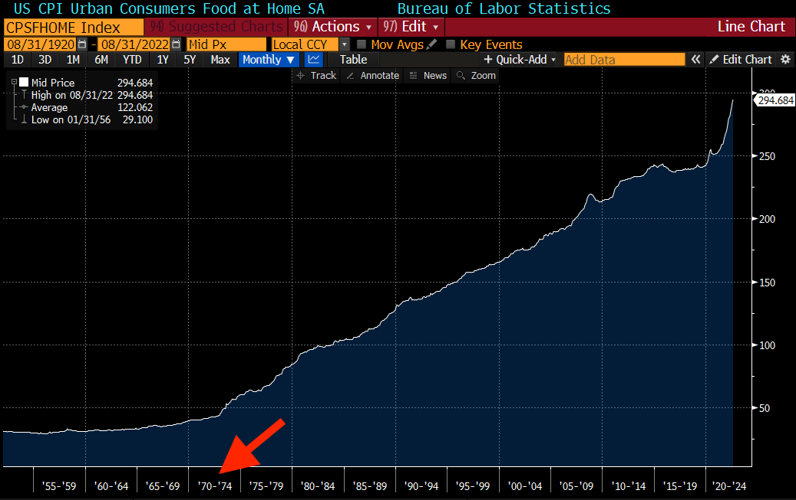
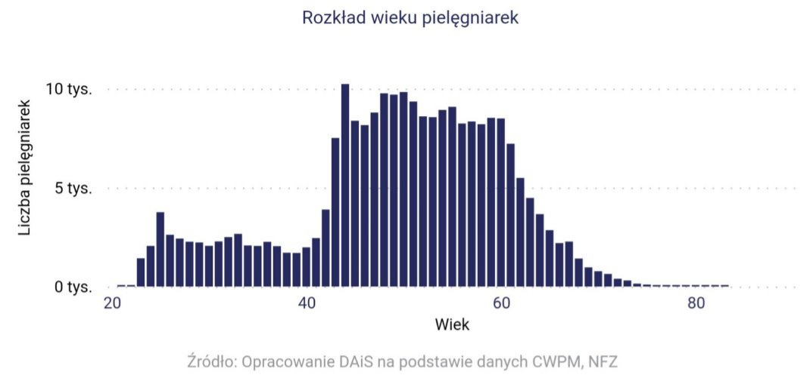
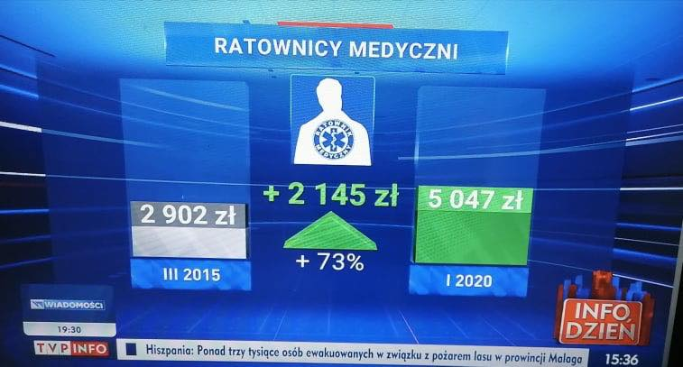
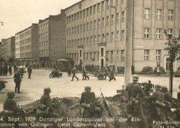

### 2022

Gold went out of fashion?

  

---

Rząd musi dwa razy waloryzować płacę minimalną w 2023 roku (ustawa mu każe). Jednak podnosi ją dużo wyżej niż musiał - do 3.490 i 3.600 (styczeń - lipiec). Niby ok w normalnych czasach, ale teraz, kiedy mali przedsiębiorcy uderzeni są kosztami energii i produktów? Błąd, który może zmusić wiele małych firm do zniknięcia. W budżecie na 2022 rok rząd umieścił śmieszną inflację (3,3%), czyli mniej niż 5% (wtedy musiałby dwa razy waloryzować płacę minimalną). Czyli w tym roku nie walczył o elektorat, ale w 2023 już walczy - rok wyborczy...

---

  

---

<!-- Some fun #math and #bitcoin

5yr CDS on the USA is 22bps (22k/yr to insure 10MM of debt against default)

Total federal debt for USA is $31T funded plus $170T unfunded

20yr CDS equiv is 88bps so:

$200T debt x .88%p/a = $1.76T premium

#btc mkt cap of $386B

U are getting default insurance on the USD for 78% discount...(1-$386B/$1.76T)

PLUS you are getting insurance on ALL other Fiats for free.

The USD wrecking ball is destroying all other Fiats. CONTAGION IS A BIOTCH

#btc is CHEAP insurance on the Fiat ponzi. Don't overthink. -->

### 2021

  

  

---

  

vs rzeczywistość:

> Ratownik medyczny - 12 lat pracy z dodatkiem stażowym 12 %.

  

Rząd i medycy wyglądają tak:

  

### 2020

MicroStrategy completed its acquisition of 16,796 additional bitcoins at an aggregate purchase price of $175 million. To date, we have purchased a total of 38,250 bitcoins at an aggregate purchase price of $425 million, inclusive of fees and expenses.

## 1939

<https://pl.wikipedia.org/wiki/Obrona_twierdzy_brzeskiej_(1939)>

---

Oo dwóch tygodniach walk kapituluje Gdynia. Do miasta wkracza Wermacht. Kilka dni pózniej Niemcy zmieniają nazwę na Gotenhafen,a 20 września przyjeżdża tu sam Adolf Hitler.
Miasto 'Gotenhafen' podporządkowano
rejencji gdańskiej. Na czele okręgu stanał
namiestnik Rzeszy – Albert Forster.
Ustalono, że w mieście należy zatrzymać 5000
wykwalifikowanych polskich mieszkańców [ plus ich rodziny ] i ok. 80 rybaków [ Kaszubów ].
Zmieniono nazwy ulic i usunięto wszelkie polskie symbole. Zlikwidowano wszystkie polskie instytucje, organizacje i urzędy.
Zaczęły się masowe aresztowania, egzekucje, wysiedlenia i represje wobec mieszkańców 'Gdyni', grabieże i niszczenie majątku prywatnego i państwowego.

  

### 1763

Władze pruskie wprowadziły na Śląsku ustawy germanizacyjne. Głównym celem tego posunięcia było wykorzenienie języka polskiego, co próbowano osiągnąć przez usunięcie ze szkół polskich nauczycieli, sprowadzenie z głębi Prus burmistrzów, którzy mówili tylko po niemiecku, zakaz zawierania małżeństw, gdy oblubieńcy nie znają niemieckiego.

  

---

<a href="https://github.com/TomaszWaszczyk/historia.waszczyk.com/edit/master/src/content/september-14.md" target="_blank">Edytuj tę stronę dzieląc się własnymi notatkami!</a>
