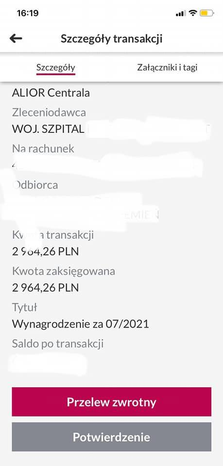

### 2021

  

  

---

  

vs rzeczywistość:

> Ratownik medyczny - 12 lat pracy z dodatkiem stażowym 12 %.

  

Rząd i medycy wyglądają tak:

  

### 2020

MicroStrategy completed its acquisition of 16,796 additional bitcoins at an aggregate purchase price of $175 million. To date, we have purchased a total of 38,250 bitcoins at an aggregate purchase price of $425 million, inclusive of fees and expenses.

## 1939

<https://pl.wikipedia.org/wiki/Obrona_twierdzy_brzeskiej_(1939)>

---

Oo dwóch tygodniach walk kapituluje Gdynia. Do miasta wkracza Wermacht. Kilka dni pózniej Niemcy zmieniają nazwę na Gotenhafen,a 20 września przyjeżdża tu sam Adolf Hitler.
Miasto 'Gotenhafen' podporządkowano
rejencji gdańskiej. Na czele okręgu stanał
namiestnik Rzeszy – Albert Forster.
Ustalono, że w mieście należy zatrzymać 5000
wykwalifikowanych polskich mieszkańców [ plus ich rodziny ] i ok. 80 rybaków [ Kaszubów ].
Zmieniono nazwy ulic i usunięto wszelkie polskie symbole. Zlikwidowano wszystkie polskie instytucje, organizacje i urzędy.
Zaczęły się masowe aresztowania, egzekucje, wysiedlenia i represje wobec mieszkańców 'Gdyni', grabieże i niszczenie majątku prywatnego i państwowego.

  

### 1763

Władze pruskie wprowadziły na Śląsku ustawy germanizacyjne. Głównym celem tego posunięcia było wykorzenienie języka polskiego, co próbowano osiągnąć przez usunięcie ze szkół polskich nauczycieli, sprowadzenie z głębi Prus burmistrzów, którzy mówili tylko po niemiecku, zakaz zawierania małżeństw, gdy oblubieńcy nie znają niemieckiego.

  

---

<a href="https://github.com/TomaszWaszczyk/historia.waszczyk.com/edit/master/src/content/september-14.md" target="_blank">Edytuj tę stronę dzieląc się własnymi notatkami!</a>
