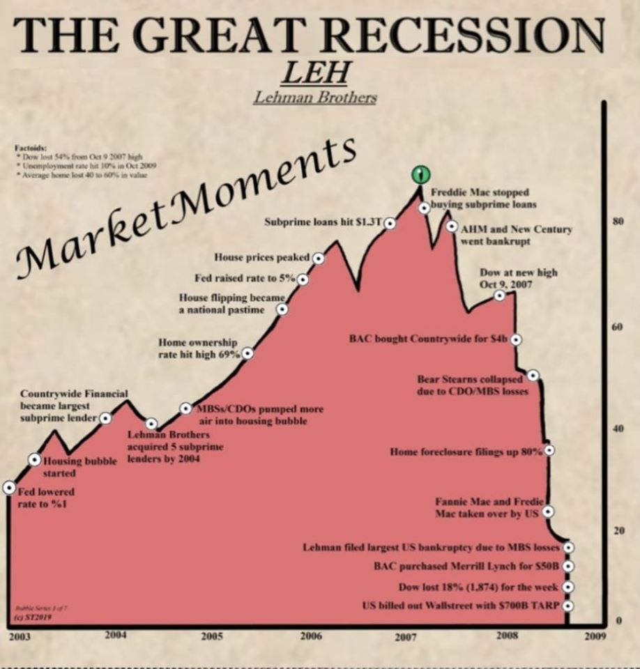
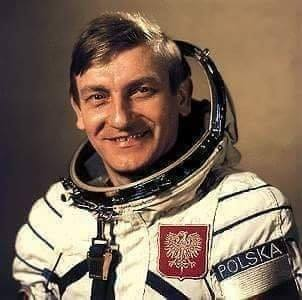

### 2020

PARIS,France​,​September15th,2020,​Today,SocieteGenerale–ForgehasselectedtheTezosblockchainforCentralBankDigitalCurrency(CBDC)experiments.OnJuly20,2020,BanquedeFranceselectedSocieteGenerale–ForgeaspartofitscallforapplicationstoexperimenttheuseofCentralBankDigitalCurrencyforinterbanksettlements.Theexperimentwillexplorethefeasibilityoffinancial securities being digitally settled and delivered in Central Bank Digital Currency.

### 2008

Bankrutuje Lehman Brothers. 2008 to rok do którego zawsze będziemy się odwoływać w tematach kryzysu finansowego. Zmienia się kompletnie krajobraz ekonomiczny oraz mentalność.

  

### 1990

Podczas rozmów i libacji w należącym do MSW „obiekcie specjalnym nr 115” nie doszło do zawarcia pisemnej zmowy pomiędzy komunistami a częścią elity solidarnościowej, bo nie na tym polegają doskonałe polityczne spiski. Konsekwencją tych spotkań była jednak późniejsza niesłychanie silna pozycja polityczna uczestników negocjacji, abolicja dla zbrodniarzy komunistycznych i przyzwolenie na niszczenie archiwów tajnych służb.
Lech Wałęsa 15 września 1988 r. spotkał się w rządowym pałacyku na Zawracie z gen. Czesławem Kiszczakiem, Stanisławem Cioskiem i ks. Alojzym Orszulikiem, aby ustalić szczegóły zakulisowych rozmów między komunistyczną władzą a „konstruktywną opozycją". Wałęsa na widok szefa MSW od razu zadeklarował, że wcale nie chce „zakładać natychmiast »Solidarności«".

Dzień później doszło do pierwszych rozmów w Magdalence, których podstawowym celem – jak to deklarowali reprezentanci opozycji – miała być relegalizacja „Solidarności".  W rzeczywistości reżim Jaruzelskiego zgodził się na oficjalne przywrócenie szyldu „Solidarności" dopiero w kwietniu 1989 r. i to już po zamknięciu obrad Okrągłego Stołu.

Trzeba przyznać, że Kiszczak przystępował do tych rozmów w pełni przygotowany. Ten wieloletni oficer kontrwywiadu i wywiadu wojskowego, który w ostatniej dekadzie PRL podporządkował sobie w dodatku służby cywilne, doskonale znał przeszłość i słabości swoich interlokutorów oraz zasady politycznych szachów z tajnymi służbami w tle. Jakby dla podkreślenia roli tajnych służb w operacji okrągłostołowej do roboczych i poufnych kontaktów reprezentantów władz z przedstawicielami „Solidarności" wyznaczył w dodatku dość specyficzne miejsce: „obiekt specjalny" nr 135 w Magdalence należący do Departamentu I MSW (wywiadu cywilnego).

W dodatku spore, jeśli nie kluczowe, znaczenie w przygotowaniu i obsłudze tych rozmów odegrał cieszący się sympatią wielu opozycjonistów Krzysztof Dubiński. Był on od 1974 r. funkcjonariuszem MSW, w lipcu 1988 r. zaś został mianowany zastępcą naczelnika Wydziału Informacji i Sprawozdawczości w gabinecie ministra spraw wewnętrznych, by po zakończeniu rozmów okrągłostołowych trafić do Departamentu I MSW.
Major Dubiński, jak czytamy w jednej z jego charakterystyk, „aktywnie uczestniczył w przygotowaniu materiałów związanych z obradami i funkcjonowaniem Okrągłego Stołu". W ten sposób gospodarzem i kreatorem Magdalenki były tajne służby PRL. To one stały się ważnym transformatorem ustroju.

FAZA NR 1 PRZYCZYNA ZMIAN
Stan gospodarki posadził władze przy Okrągłym Stole" – powiedział w lutym 1989 r. uczestniczący w zakulisowych rozmowach z komunistami Lech Kaczyński. To prawda. Nikt i nic komunistów w istocie nie obalało tak skutecznie jak katastrofalny stan gospodarki. Główną determinantą ugody pomiędzy władzami PRL i „konstruktywnymi" z „Solidarności" z przełomu 1988 i 1989 r. była kondycja finansowa i niewypłacalność reżimu Jaruzelskiego wobec zachodnich kredytodawców z rozmaitych banków komercyjnych (skupionych głównie w Klubie Paryskim) i ich rządowych żyrantów.
Wspierani przez wywiad cywilny eksperci rządowi uczestniczący w kolejnych turach rozmów z Międzynarodowym Funduszem Walutowym i Klubem Paryskim już w latach 1986–1987 sygnalizowali swoim zwierzchnikom, że „przeprogramowanie istniejących zaległości płatniczych, przesunięcie bieżących płatności i nowe kredyty z MFW i Banku Światowego" są możliwe jedynie wówczas, kiedy ekipa Jaruzelskiego zdecyduje się na wprowadzenie zasadniczych zmian w systemie ekonomiczno-politycznym PRL. Stąd też Departament I MSW nieustannie alarmował Wojciecha Jaruzelskiego, że bez poluzowania gospodarki i otwarcia się na „konstruktywną opozycję" system PRL znajdzie się nad przepaścią wynikającą z bankructwa państwa.
W tym sensie podjęcie rozmów z konstruktywną opozycją w sierpniu 1988 r. było niezbędne dla wiarygodności PRL i możliwości prowadzenia rozmów z MFW i Klubem Paryskim w sprawie zadłużenia. Ten kierunek i postulaty miała wesprzeć „Solidarność". Bez niej operacja ratowania reżimu na arenie międzynarodowej nie mogła się udać. Nieprzypadkowo szef wywiadu gen. Zdzisław Sarewicz pisał wówczas, że „zgodna prezentacja powyższych postulatów przez rząd i środowisko opozycyjne – niezależnie od szans ich realizacji wymusiłaby – według ekspertów MFW – zmianę nastawienia wierzycieli do polskich problemów finansowych".
Jednocześnie rozpoczynał się wówczas proces liberalizacji stosunków gospodarczych, ale i wielki skok partyjnej nomenklatury oraz społeczności tajnych służb na „bazę materiałowo-kapitałową sektora państwowego".
FAZA NR 2 WARUNEK UGODY
Aby solidarnościowa opozycja mogła skutecznie zaświadczyć swoją odpowiedzialność i troskę za stan gospodarki PRL, trzeba było ją wpierw zdezintegrować przez podział i przeformatować w kierunku bardziej konstruktywnym. Nieprzypadkowo we wrześniu 1986 r. Wałęsa, ignorując stanowisko działaczy podziemia nawet głównego nurtu (z Tymczasowej Komisji Koordynacyjnej NSZZ „Solidarność") i Komisji Krajowej NSZZ „Solidarność" wybranej na zjeździe w 1981 r., powołał jawną strukturę władzy nad zdelegalizowanym związkiem – Tymczasową Radę „Solidarności", której skład dobierał, konsultując się ze środowiskiem Kuronia i Michnika oraz najbliższym otoczeniem.
Powołanie TRS było zgodnym z interesami władz faktycznym zamachem stanu, sankcjonującym pozbycie się z kierownictwa „Solidarności" ludzi sprzeciwiających się ugodzie z komunistami. W ten sposób zaczęto realizować koncepcję budowy zupełnie nowej „Solidarności" – „od góry w dół", bez „tych głupich" i „ekstremy", jak mówił już kilka lat wcześniej w rozmowach z komunistami Wałęsa.
Komuniści i ich tajne służby nie kryli satysfakcji. To, co się stało, było zbieżne z realizowaną od jakiegoś czasu przez bezpiekę operacją o kryptonimie „Brzoza", która także stawiała na partnerski dialog z „konstruktywnymi" działaczami „Solidarności", przy jednoczesnym zaniechaniu jakichkolwiek dalszych represji. Był to – jak pisali w memoriale dla Wojciecha Jaruzelskiego Jerzy Urban, Stanisław Ciosek i gen. Władysław Pożoga – „doniosły, dodatkowy czynnik powodujący rozkład podziemia". Nawet konferujący potajemnie wówczas z bezpieką Kuroń miał stwierdzić, że powołanie TRS „spowodowało niezamierzoną korzystną sytuację dla władz" i „wytworzyło rozdźwięki w szeregach opozycji".
Temu wszystkiemu towarzyszyła dość zdumiewająca deklaracja  Lecha  Wałęsy, który  do spółki ze Stefanem Bratkowskim, Bronisławem Geremkiem, Tadeuszem Mazowieckim, Stanisławem Stommą, Klemensem Szaniawskim, Jerzym Turowiczem, Janem Józefem Szczepańskim i Andrzejem Wielowieyskim zaapelował do władz amerykańskich o zniesienie sankcji gospodarczych nałożonych na PRL po wprowadzeniu stanu wojennego. Grupa, której przewodził Wałęsa, wystąpiła także z prośbą o nadanie PRL klauzuli najwyższego uprzywilejowania w stosunkach gospodarczych! Jaruzelski użył w ten sposób noblisty i szyldu opozycji do próby wyciągnięcia dogorywającej Polski Ludowej z międzynarodowej izolacji.
FAZA NR 3 NOWA „SOLIDARNOŚĆ"
Pod koniec 1987 r. w miejsce TKK i TRS powołano kolejny byt – Krajową Komisję Wykonawczą NSZZ „Solidarność". Z ponad setki członków Komisji Krajowej NSZZ „Solidarność" z 1981 r. w KKW ostało się jedynie sześciu sojuszników „warszawki" i Wałęsy – Zbigniew Bujak, Władysław Frasyniuk, Stefan Jurczak, Bogdan Lis, Antoni Stawikowski i Antoni Tokarczuk!
Jeden z rzeczników i beneficjentów tej zmiany w „Solidarności" Jan Lityński ogłosił wówczas na łamach podziemnego „Tygodnika Mazowsze", że „Solidarność" nie może już więcej odpowiadać na wszystkie propozycje komunistów „totalnym i głośnym »nie«!". Ale żeby tak było, należało wyrzucić z niej prawie wszystkich członków władz krajowych i większość ludzi tworzących struktury związkowe w regionach.
Rzeczywiście ta nowa „Solidarność" była coraz bardziej konstruktywna i przewidywalna. Doceniało to trio (Pożoga-Urban-Ciosek) doradców Jaruzelskiego, które w styczniu 1988 r. tak pisało do towarzysza generała: „Uważamy, że naszym realistycznym celem powinno być ustawiczne oswajanie bardziej ugodowego skrzydła nastawionego na koegzystencję z »reżimem«, asymilowanie i neutralizowanie tego skrzydła, budowanie przepaści między nim a opozycją radykalno-nielegalną (...). Taktyka oswajania to wytrącanie opozycji możliwości uprawiania sprzeciwów natury ogólnej i głoszenia pięknie brzmiących haseł, natomiast wmanewrowanie jej w dyskusje o konkretach, zmuszanie do uwzględniania realnie istniejącej sytuacji oraz rzeczywiście możliwych rozwiązań. Taka platforma uczestnictwa umiarkowanej opozycji w życiu kraju oddzieli ją najsilniej od fundamentalistów".
W ten sposób, kosztem wziętej w dwa ognie antykomunistycznej „ekstremy", holowano wiernego neosolidarnościowego partnera z Matką Boską w klapie, z którym można było w przyszłości zawrzeć prawdziwą transakcję epoki – Okrągły Stół i bezkonfliktowe przejście z PRL do postkomunizmu III RP, dla jednych z solidarnościowego styropianu na salony władzy, dla drugich z SB do UOP, z PZPR do SdRP, z Komitetu Centralnego do zarządu banku...
FAZA NR 4 OSUSZANIE PRZEDPOLA
Nadszedł wreszcie czas ostatecznej rozgrywki, który przypadł na strajk sierpniowy 1988 r. Już po dwóch dniach strajkowania (24 sierpnia) pojawiła się konkretna oferta – zgoda komunistów na rozmowy Okrągłego Stołu, a w konsekwencji również ustalenie ścieżki ku pluralizmowi związkowemu (w domyśle relegalizacji „Solidarności"), ale w zamian za zakończenie strajku.
Dla wtajemniczonych w poufny dialog „opozycji" z władzą nie było to zaskoczeniem. Scenariusz ten był bowiem przedyskutowany przez Kuronia w Departamencie III MSW już dwa dni wcześniej (22 sierpnia 1988 r.). W komunikacie z tej rozmowy funkcjonariusze bezpieki napisali m.in., że Kuroń przewiduje, iż „podjęte zostaną bezpośrednie rozmowy z Lechem Wałęsą bez żadnych warunków wstępnych ze strony rządu. W czasie tych rozmów strona rządowa wyraża zgodę na wprowadzenie pluralizmu związkowego z dniem 1 stycznia 1989 roku, natomiast Lech Wałęsa zobowiązuje się do podjęcia natychmiastowych działań w kierunku wygaszania strajków".
Tak się w istocie stało. Zgodnie z planem Kuronia Wałęsa natychmiast pozytywnie zareagował na propozycję Kiszczaka, deklarując w liście, że jest gotów do dialogu, „nie stawiając żadnych warunków wstępnych ani ograniczeń tematycznych". Później, podczas bezpośredniej rozmowy z Kiszczakiem, zadeklarował, że chce „Solidarności" „czysto związkowej" i krytykował „moment rozpoczęcia" strajków. Ale Kiszczak wystąpił wobec niego jak surowy przełożony i oświadczył: „Czekamy przez 20 godzin na działalność pana Lecha Wałęsy w sprawie wygaszenia strajków. Do tego czasu będzie powstrzymane ewentualne użycie środków wymuszających przestrzeganie prawa".
Wałęsa się wystraszył. Przyznał to w pamiętniku: „Wiłem się jak piskorz, atakowałem z prawa i z lewa, ale generał Kiszczak postawił rzeczowe, twarde warunki: legalizacja »Solidarności« będzie możliwa tylko wtedy, gdy rozmowy Okrągłego Stołu zakończą się parafowaniem narodowego porozumienia; obecnie strajki powinny wygasnąć w ciągu osiemnastu godzin; następne ustalenia w sprawie Okrągłego Stołu poczynimy za dwa tygodnie, a w tym czasie przygotujemy wstępne listy negocjatorów i doradców. Oczywiście nie byłem zadowolony, ale też nie mogłem zbytnio podskakiwać. Kilkanaście strajkujących zakładów to nie kilkaset jak w sierpniu 1980, a generał powiedział bez ogródek, że i tak beton partyjny próbuje torpedować każdą ofertę ugody z opozycją". Był to spory sukces komunistów i osobiście zwierzchnika tajnych służb.
FAZA NR 5 HAKI I „POŻYTECZNI IDIOCI"
Dlaczego nie wypominamy przeciwnikom ich grzechów, zbrodni, a byłoby co. (...) O nas mówi się stalinowcy. A dlaczego wszystkim Woroszylskim, Mazowieckim nie przypominamy peanów na cześć Stalina? (...) Czy tak bardzo nam na nich zależy, że dajemy się opluwać, milczymy, nie przypominamy ich nieprawości?" – mówił wówczas Kiszczak.
Okazało się jednak, że komunistom tak bardzo zależało na byłych stalinowcach, których po stronie solidarnościowo-opozycyjnej było wielu, że argumentu z ich haniebnej przeszłości nigdy nie użyli. Nie mogli go wykorzystać też jako środka nacisku zgromadzonej przez SB wiedzy o agenturze po stronie „opozycyjnej". Musiało tak być, ponieważ jej wiarygodność w oczach opinii publicznej była warunkiem zduszenia społecznej opozycji wobec „kontraktu".
Znamienna pod tym względem była argumentacja Władysława Frasyniuka, który podczas pierwszych rozmów w Magdalence mówił do komunistów: „Trzeba jasno powiedzieć, że my, siadając razem z panami do stołu, działamy nie we własnym interesie: zabiegamy w ten sposób o wasz interes. Dla dobra kraju, dla dobra społeczeństwa, które wam nie wierzy i które nie chce was słuchać, staramy się zapewnić waszą wiarygodność". Zapewne nie miał wówczas pojęcia, że władze PRL robiły to samo w stosunku do Wałęsy, Mazowieckiego, Geremka i innych reprezentantów „strony solidarnościowo-opozycyjnej", dbając o ich społeczną wiarygodność.
Co ciekawe, także Michnik zwracał się do komunistów o niezmuszanie tzw. strony solidarnościowej do nadmiernych ustępstw, ponieważ osłabi to jej autorytet w społeczeństwie, a bez tego autorytetu nie będą już potrzebni stronie rządowej.
W każdym razie na przełomie 1988 i 1989 r. obie strony politycznego dialogu (a w zasadzie już nie strony, bo przecież okrągły stół ma to do siebie, że raczej symbolicznie łączy, a nie dzieli) zdawały sobie sprawę z wagi całego przedsięwzięcia. W obozie władzy o wszystkim decydowali Jaruzelski z Kiszczakiem, a po stronie neo-„Solidarności" warszawski salon. Kuroń nie krył satysfakcji z pozycji, jaką on i jego środowisko zajęło, podporządkowując sobie Wałęsę i rekonstruowany, choć na innych warunkach i w nowym kształcie, związek.
Od tej pory to Kuroń i jego polityczni przyjaciele mieli decydować o politycznych karierach ludzi „Solidarności". Po kolejnej turze jego rozmów w MSW funkcjonariusze Departamentu III MSW pisali: „w przekonaniu większości osób z opozycji uczestnictwo w rozmowach otwiera szerokie możliwości kariery politycznej. Przed ludźmi mającymi szanse na takie uczestnictwo staje alternatywa: albo ukorzyć się przed środowiskiem postkorowskim i złożyć niejako deklarację lojalności, albo zachować samodzielność. Jacek Kuroń, w prowadzonych rozmowach, stara się wytwarzać wrażenie, że może on co najmniej odsunąć każdego niewygodnego działacza opozycyjnego".
FAZA NR 6 OSTATECZNA PODMIANA
W tej sytuacji stało się zupełnie oczywiste, że Lech Wałęsa musi wyrazić zgodę na zamknięcie się w „złotej klatce", jaką wymyślił dla niego salonik wszechmocnego Kuronia, zgłaszając pod koniec 1988 r. pomysł powołania Komitetu Obywatelskiego przy przewodniczącym NSZZ „Solidarność".
Komitet Obywatelski przy Wałęsie, którego członków nikt przecież demokratycznie nie wybierał, ale dobierał według towarzysko-politycznego klucza, stał się polityczną czapą nad całą „Solidarnością". Przypominał też powołaną dwa lata wcześniej Radę Konsultacyjną przy Przewodniczącym Rady Państwa, z tą tylko różnicą, że Jaruzelski, w przeciwieństwie do Wałęsy, posiadał w tym gremium realną władzę i decydujący głos. Zamiast „ekstremistów", czyli władz „Solidarności" wybranych w demokratycznych wyborach, komuniści ostatecznie wykreowali „konstruktywnego partnera".
W marcu 1989 r. na posiedzeniu Biura Politycznego KC PZPR Kiszczak mówił wprost: „Równolegle z szeroką falą rozmów w zespołach i podzespołach »okrągłego stołu« ukształtował się odrębny, poufny nurt dialogu. Miał on formę spotkań roboczych w wąskim gronie z udziałem Wałęsy oraz obserwatorów strony kościelnej". Kiszczak miał zapewne na myśli rozmowy prowadzone w „obiekcie specjalnym" numer 135.
Wiosną 1989 r. stały się one jeszcze bardziej konstruktywne, kiedy zaczął w nich uczestniczyć Michnik. Według władz PRL, w tym szefa bezpieki gen. Henryka Dankowskiego, Michnik – obok Geremka i Mazowieckiego – stał się w tym czasie „głównym architektem polityki opozycji w trakcie Okrągłego Stołu". Był radykalnym rzecznikiem porozumienia z komunistami. Już pod koniec lutego 1989 r. tłumaczył kolegom z „Solidarności" „konieczność rezygnacji z tzw. rozliczania za czas stanu wojennego, aby nie psuć atmosfery i nie dawać do ręki konserwie partyjnej broni. Podczas jednej z biesiad Michnik zwrócił się w stronę Kiszczaka z toastem: „Piję, panie generale, za taki rząd, gdzie Lech będzie premierem, a pan ministrem spraw wewnętrznych".
FAZA NR 7 NARODZINY SYSTEMU III RP
W ten sposób rozpoczynał się proces określany później przez Lecha Kaczyńskiego mianem „fraternizacji" i „zblatowania". Kaczyński uważał za niemal pewne, że w Magdalence nie doszło do zawarcia pisemnej zmowy pomiędzy komunistami a częścią elity solidarnościowej, bo nie na tym polegają doskonałe spiski. Konsekwencją tych rozmów jednak była partycypacja „fraternizujących się" w późniejszych przywilejach władzy i nieporównywalnie silniejsza pozycja majątkowa i polityczna aniżeli tych, którzy w procesie magdalenkowego „zblatowania" udziału nie wzięli. I okrągłostołowy spisek na tym przede wszystkim polegał. Późniejsza abolicja dla zbrodniarzy komunistycznych, przyzwolenie na niszczenie archiwów tajnych służb i partii i „gruba linia" („gruba kreska") są jedynie tego potwierdzeniem i konsekwencją.
Jeden z ojców i patronów tego systemu – Jacek Kuroń, już w 1977 r. wyznał podczas spotkania z kolegami, że „w wolnej Polsce listy agentów i pracowników SB powinny być dokładnie opracowane przez opozycję, ale nie można ich ujawniać, aby nie stwarzać sytuacji prześladowania przez otoczenie tych ludzi".
W ten oto sposób podjęty po ogłoszeniu w Związku Sowieckim „głasnosti" wspólny wysiłek władz PRL i „zreformowanej" „Solidarności", akceptowany, a nawet wspomagany przez zainteresowany w utrzymaniu w Polsce spokoju Zachód, doprowadził do zaprezentowania Polakom operacji Okrągłego Stołu jako historycznego „obalenia komunizmu".
O tej realistycznej, ale i negatywnej ocenie Okrągłego Stołu oraz jego następstw zapominają często ci wszyscy, którzy próbują wykorzystać autorytet zmarłego tragicznie prezydenta do podtrzymania fałszywego mitu pokojowej zmiany systemu. ?
Autor jest historykiem, opublikował właśnie kolejną swoją książkę pt. „Wałęsa. Człowiek z teczki" (Wyd. Zysk i S-ka)

### 1941

W Lipnikach na Wołyniu urodził się Mirosław Hermaszewski, generał brygady Wojska Polskiego, kosmonauta- pierwszy i jedyny Polak, który odbył lot w kosmos. Jako mały chłopiec cudem ocalał z rzezi wołyńskiej - uratował go ojciec. Ukraińscy szowiniści zamordowali 19 członków jego rodziny, w tym ojca. Po zakończeniu II wojny światowej wraz z rodziną został poddany repatriacji i przesiedlony do Wołowa niedaleko Wrocławia. Mały Mirek od najmłodszych lat marzył o lotnictwie. W wolnych chwilach wielką frajdę sprawiało mu sklejanie modeli samolotów. Marzenia z dziecięcych lat zaczął realizować w 1960 roku, kiedy podjął naukę latania na szybowcach w Aeroklubie wrocławskim, a następnie na samolotach w Grudziądzu. Rok później udało mu się dostać do wymarzonej Szkoły Orląt w Dęblinie, gdzie uzyskał uprawnienia pilota myśliwskiego 3 klasy. Szkołę ukończył z tytułem prymusa. Został przydzielony do 62 Pułku Lotnictwa Myśliwskiego OPK w Poznaniu. Po dwuletniej nauce uzyskał uprawnienia pilota 1 klasy oraz uprawnienia do pilotowania samolotu naddźwiękowego MiG-21. Dalszą naukę kontynuował w Akademii Sztabu Generalnego w Rembertowie, którą ukończył z wyróżnieniem. W latach 1964-78 służył w obronie przestrzeni powietrznej RP. Od 27 czerwca do 5 lipca 1978 roku odbywał lot kosmiczny, jako inżynier pokładowy wraz z radzieckim dowódcą Piotrem Klimukiem na statku kosmicznym Sojuz 30. Lot odbył się w ramach międzynarodowego programu kosmicznego o nazwie Interkosmos. Od 1981 do 1983 był członkiem, owianej złą sławą, Wojskowej Rady Ocalenia Narodowego. W latach 1987–1991 pracował, jako komendant w Wyższej Szkole Oficerskiej Sił Powietrznych w Dęblinie. Od 1992 do 1995 roku pełnił obowiązki dowódcy Wojsk Lotniczych i Obrony Powietrznej, a następnie był inspektorem ds. Sił Powietrznych w Sztabie Generalnym Wojska Polskiego. Łącznie generał Hermaszewski spędził w powietrzu 2047 godzin i 47 minut, wykonał 3473 starty i lądowania, oddał 10 skoków treningowych ze spadochronem.

  

---

<a href="https://github.com/TomaszWaszczyk/historia.waszczyk.com/edit/master/src/content/september-15.md" target="_blank">Edytuj tę stronę dzieląc się własnymi notatkami!</a>
