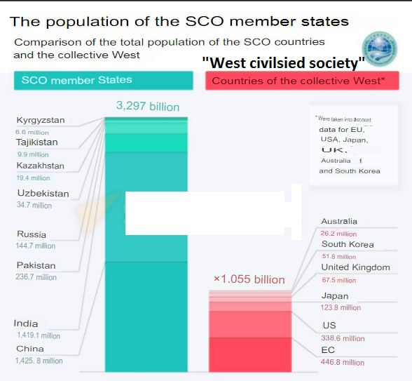
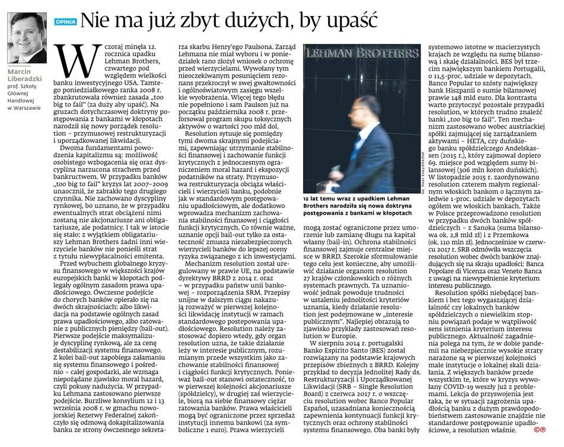
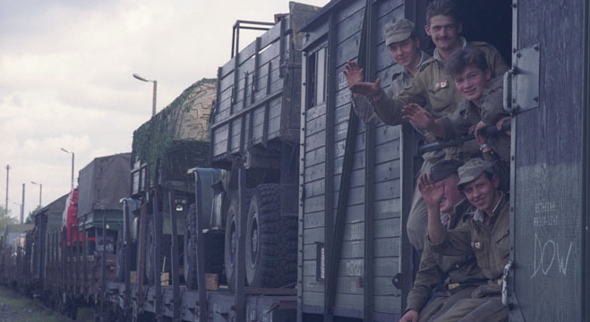
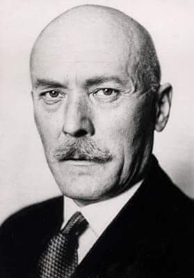

### 2023

  

Government-issued digital ID is equal to a plastic ID in Poland since July 14th.
How is it going so far and what are the next steps?

It’s been exactly two months since the digital ID (mObywatel) became equal to the plastic document in Poland. Ministry of Digital Affairs released its API, development & integration kit, and private businesses were allowed to apply for access to mObywatel.

A couple of observations:

- If your business wants to accept mObywatel it needs approval from the MoDA. The approval process, slow at first, is more and more efficient. We’ve prepared a detailed step-by-step guide to help our customers get their approvals fast.

- Offline/in-person checks are done via QRCode. The online process is faster on a mobile device, thanks to the deep link support of mObywatel. The desktop online process is also based on the QRCode.

- User data is being sent directly from the user device to the back-end system and onto the business. It’s as close to Self-Sovereign Identity as you can get right now.

- mObywatel T&Cs explicitly forbid using it for login (authentication). From the plans, we’ve seen shared by Janusz Cieszynski , it looks like both authentication and 2FA functionality are on the roadmap and hopefully will be available soon.

---

> "MF wyemitował obligacje skarbowe za 3,659 mld zł przeznaczone na podwyższenie kapitału zakładowego CPK" (PAP).

---

  

---

### 2022

> Kto nie gasi światła, ten robi prezent Putinowi

– powiedział w piątek wicemister klimatu i środowiska Ireneusz Zyska.

---

  

---

### 2020

Komitet Rady Ministrów ds. Cyfryzacji (KRMC) przyjął „Politykę rozwoju sztucznej inteligencji w Polsce”

---

W Niemczech odsłonięto pomnik Lenina. "To jest po prostu hańba"
W Gelsenkirchen na zachodzie Niemiec stanął pomnik Włodzimierza Lenina, wodza rewolucji bolszewickiej.
Monument odsłonięto z inicjatywy Marksistowsko-Leninowskiej Partii Niemiec (MLPD), która postawiła go przed swoją siedzibą.
"To jest po prostu hańba. Ten potwór jest odpowiedzialny za zagładę dziesiątek milionów istnień ludzkich. Chętnie bym wysadził ten pomnik w powietrze" – napisał Piotr Zychowicz, redaktor naczelny magazynu "Do Rzeczy Historia".
Wcześniej lokalne władze próbowały zablokować budowę pomnika.
Sąd nie uznał argumentacji władz lokalnych.
Włodzimierz Lenin to pierwszy przywódca Rosji Radzieckiej, komunista i zbrodniarz wojenny.
Dokładna liczba ofiar jego rządów nie jest znana, ale większość historyków mówi o 6 milionach ludzi.

---

Germany’s famed Kurzarbeitergeld programme, which funnels government cash to workers whose hours are cut by employers, is the “gold standard” of furlough schemes, reckons the imf. It has been widely imitated across Europe by governments seeking to protect jobs and incomes from the full ravages of covid-19 lockdowns. In Germany, under relaxed criteria introduced in March that were extended to nearly 7m workers, it has limited the rise in unemployment to around 600,000 and kept consumer spending buoyant.
The extraordinary rescue package assembled by Angela Merkel’s government, which also included bridging loans to firms and a suspension of fiscal rules to allow stimulus spending, was broadly endorsed by Germany’s economic establishment. It has fuelled a more robust recovery than elsewhere in Europe. But two recent decisions have seen that consensus start to fray. The first was an extension of Kurzarbeitergeld payments to 24 months. The second was a further moratorium on Germany’s strict requirement for overly indebted companies to declare bankruptcy.

---

Przykład labilności słabego społeczeństwa:

> „W związku z podejrzeniem, że komunikaty Sanepidu mogą negatywnie wpływać na zachowania społeczne i przyczyniać się do eskalacji zjawiska psychozy strachu oraz do wywoływania stanów lękowych u wielu osób, od dnia dzisiejszego zaprzestajemy ich publikowania...”

---

  

---

### 1996

Otwarcie salonu Ery GSM przy ul. Złotej, Warszawa, 16 września 1996.

  

### 1993

Wojska rosyjskie opuściły Legnicę, będącą od II wojny światowej siedzibą dowództwa wojsk sowieckich stacjonujących w Polsce.

- To jest wielka sprawa: niepodległe państwo, w którym nie ma obcych oddziałów - mówiła reporterowi Polskiego Radia jedna z osób obserwujących ten historyczny moment. Wojska radzieckie stacjonowały na terenie Polski przez blisko 50 lat.

Oficjalne pożegnanie ostatnich żołnierzy rosyjskich odbyło się w Belwederze 17 września 1993 roku.

- Dzień 17 września stał się w polskich dziejach datą bolesną i złowieszczą, otwierając drogę, która wiodła Polaków do więzień i łagrów, do Katynia, przez mękę, poniżenie i zniewolenie – mówił ówczesny prezydent Lech Wałęsa. - Dzisiejszy dzień kończy pewną epokę w naszej wspólnej historii. Dopełnia się miara sprawiedliwości dziejowej. Na terytorium Polski nie ma już obcych wojsk - mówił prezydent.

- Dziś szczególny i uroczysty dzień. Z Polską, polskim narodem żegnają się ostatnie oddziały żołnierzy radzieckich. To znak nowych stosunków między naszymi bliskimi słowiańskim narodami – powiedział z kolei ambasador Rosji.

Stopniowe wycofywanie się Rosjan

9 kwietnia 1991 roku uznany został za początek oficjalnego wycofywania wojsk sowieckich. Tego dnia z garnizonu Borne Sulinowo wyjechał eszelon transportujący w kilkudziesięciu wagonach jednostkę rakietową. Ostatnia jednostka bojowa opuściła Polskę 28 października 1992 roku. Następnego dnia pełnomocnik Rady Ministrów ds. pobytu i wycofania wojsk Federacji Rosyjskiej gen. Zdzisław Ostrowski złożył w Urzędzie Rady Ministrów oficjalny meldunek o wycofaniu z Polski ostatniej rosyjskiej jednostki bojowej.

W całym 1992 roku wycofano z Polski ponad 35 tys. żołnierzy, około 200 samolotów, w tej liczbie 150 bojowych, 220 czołgów, ok. 770 wozów pancernych, 153 działa powyżej 100 mm, 126 wyrzutni i 24 kutry torpedowe. Pozostało ponad 4 tys. żołnierzy rozlokowanych w 20 miejscowościach.

Władze miejscowości, w których stacjonowali przez wiele lat rosyjscy żołnierze, miały ogromne problemy z ponownym zagospodarowaniem tych terenów. Pokazywał to Janusz Sikorski w cyklu reportaży zatytułowanych "Krajobraz po bitwie". Audycje były emitowane na antenie Rozgłośni Polskiej Radia Wolna Europa w 1992 roku.

- Stan nieruchomości jest bardzo zły. Jeśli się wchodzi do mieszkania, w którym jest sześć pokoi ogrzewanych piecami kaflowymi, a piece są dwa, to czy można powiedzieć o właściwej eksploatacji tej nieruchomości? Zawilgocenia, grzyb na ścianach, pozrywana instalacja, wyrwane wszystkie elementy miedziane, brakuje stolarki, bo służyła jako podpałka w piecach, nie ma ani jednego kranu, nie ma drzwi wejściowych - przedstawiał sytuację wiceprezydent Legnicy Zbigniew Kieras.

  

### 1939

W Moskwie podpisany został układ rozejmowy między Związkiem Radzieckim, a Japonią, kończący walki radziecko-japońskie na pograniczu Mandżukuo i Mongolii– serię starć pomiędzy japońską Armią Kwantuńską, a Armią Czerwoną. Jeszcze tego samego dnia odbyło się spotkanie, domagającego się natychmiastowej agresji na Polskę ambasadora niemieckiego Friedricha Wernera von Schulenburga (zdjęcie) z radzieckim ministrem spraw zagranicznych Wiaczesławem Mołotowem, po którym ten pierwszy sporządził tajny protokół nr 371, w którym czytamy:
" Mołotow oświadczył, że wystąpienie zbrojne Związku Sowieckiego nastąpi zaraz, być może nawet jutro (...) Stalin przyjął mnie o drugiej w nocy w obecności Mołotowa i Woroszyłowa i oświadczył, że Armia Czerwona przekroczy dziś rano o godzinie szóstej granicę sowiecką na całej długości od Połocka do Kamieńca Podolskiego. Dla uniknięcia nieporozumień prosił usilnie, aby lotnictwo niemieckie od dzisiaj nie przekraczało na wschód linii Białystok-Brześć-Lwów. Samoloty sowieckie rozpoczną już dzisiaj bombardowanie terenów na wschód od Lwowa.”

  

---

<a href="https://github.com/TomaszWaszczyk/historia.waszczyk.com/edit/master/src/content/september-16.md" target="_blank">Edytuj tę stronę dzieląc się własnymi notatkami!</a>
