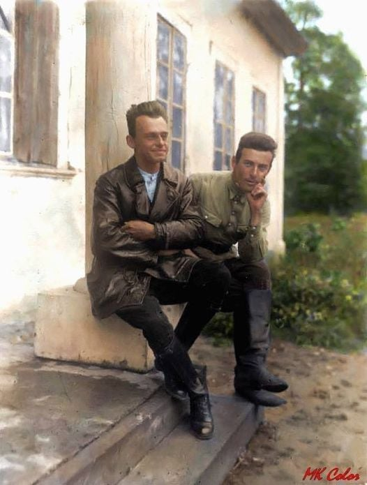

### 2020

> Dzisiejszą rezolucje PE przyjmuje jako: „Jak dalej będziecie fikać, to skończy się to dla was jak w 1939”. Czyli wyraźne upomnienie, abyśmy nie fikali ;)

Parlament Europejski przyjął w czwartek rezolucję, zgodnie z którą w Polsce dochodzi do ciągłego pogarszanie się stanu praworządności w Polsce. Parlament ubolewa też z powodu "masowych aresztowań, których ofiarą padło 48 działaczy LGBTI". Rezolucję, za którą nie idą żadne prawne implikacje, poparło 513 europosłów, przeciw było 148, a wstrzymało się od głosu 33.

---

Fed nie widzi możliwości podwyżek stóp w horyzoncie prognozy. Taki scenariusz nie powinien dziwić biorąc pod uwagę fakt, że najpierw Fed chciałby zobaczyć inflację nieco powyżej 2%, która z kolei nie jest oczekiwana na takim poziomie w ciągu kolejnych kilku lat. Co więcej, stopa bezrobocia ma nie wrócić do poziomu sprzed pandemii w najbliższych latach, co z kolei może implikować brak pełnego zatrudnienia (istotny mandat z punktu widzenia Fed).

---

Design choices for central bank digital currency, VOX EU

This report provides a list of highly relevant design considerations. Summary:

The benefits and risks of CBDC are complex, encompassing financial, legal, and technical considerations and the interplay among them. With many central banks currently considering or piloting CBDCs, each country will have to take into account its specific circumstances and initial conditions before deciding whether the potential benefits of introducing a CBDC outweigh the possible costs (Allen et al. 2020). Any CBDC will require a secure, user-friendly way to hold and transfer funds. A two-layer infrastructure with central bank management of the digital ledger and existing financial institutions providing customer service is a likely choice; it would maintain existing models and avoid disintermediation of the financial system. Regardless of the infrastructure choice, central banks should consider technical and legal confidentiality protections for ledger contents. Once deployed, a retail CBDC will provide rich opportunities for innovative central banking.

### 1992

Czarna środa, czyli dzień złamania Banku Anglii.

Okładka The Daily Telegraph dzień po tym jak GBP wypadł z widełek mechanizmu ERM w wyniku iście westernowskiej wojny Bank of England vs Quantum Funds. Oczywiście wtedy to nie było takie jasne.

Błędnie nazywamy całą sytuację jako atak spekulacyjny Georga Sorosa na funta. Sytuacja na świecie była wtedy fatalna dla takiego systemu, który chciał regulować kursy walut jak właśnie ERM. Wysokie stopy procentowe Bundesbanku przeciwko presji inflacyjnej w procesie jednoczenia Niemiec. I to właśnie wywiad z prezesem niemieckiego banku wskazał Drunkemillerowi, że sytuacja europejskich walut, sztywnych kursów oraz widełek jest świetną okazją do BIG SZORTA na funcie.

Stanley Drunkemiller był pomysłodawcą setupu. George Soros bardzo mocno zaangażował się w pomysł przyjaciela.

W środę publikacja artykułu z tej okazji, gdzie opisujemy trzy najlepsze setupu Georga Sorosa. Również chcemy przybliżyć sylwetkę Drunkemillera w tym tygodniu.

  

### 1939

  

---

O świcie Armia Czerwona, na całej długości granicy wtargnęła na terytorium broniącej się przed hitlerowskim agresorem Polski. Wschodnie granice były strzeżone jedynie przez przerzedzone Korpusy Ochrony Pogranicza. Bolszewicy ostatecznie podcięli nogi II RP. Wojska frontów ukraińskiego i białoruskiego, liczące według radzieckich danych 466 tysięcy żołnierzy, realizowały plan ustalony kilka dni wcześniej w trakcie rokowań Radziecko - Niemieckich. Plan polegający na zablokowaniu polskim wojskom drogi na Węgry i do Rumunii. Sowieci planowali dojść do linii Narwi Wisły i Sanu. Dzień wcześniej, przed rozpoczęciem ofensywy, Stalin w rozmowie z niemieckim ambasadorem w Moskwie, uczulił go aby Luftwaffe nie przekraczała właśnie tej linii, by zapobiec ewentualnym pomyłkom. Przestrzeń powietrzną na wschód od niej miały zdominować samoloty z czerwoną gwiazdą na skrzydłach.

  

<iframe width="100%" height="300" scrolling="no" frameborder="no" allow="autoplay" src="https://w.soundcloud.com/player/?url=https%3A//api.soundcloud.com/tracks/672321125&color=%23ff5500&auto_play=false&hide_related=false&show_comments=true&show_user=true&show_reposts=false&show_teaser=true&visual=true"></iframe>
<a href="https://soundcloud.com/ciecierski" title="Niesymfonia&#x27;s" target="_blank" style="color: #cccccc; text-decoration: none;">Niesymfonia&#x27;s</a> · <a href="https://soundcloud.com/ciecierski/september-1939" title="September 1939" target="_blank" style="color: #cccccc; text-decoration: none;">September 1939</a>

---

[…] Pamiętajcie, tylko Armia Czerwona wyzwoli naród polski z nieszczęsnej wojny. […] Wierzcie nam! Armia Czerwona Związku Radzieckiego – to wasz jedyny przyjaciel. Dowódca frontu Ukraińskiego S. Timoszenko”
(faksymile sowieckiej ulotki, cyt. za: Zbrodnia Katyńska w świetle dokumentów, Londyn 1982, s. 11, s. nlb.).
 „Wojsko sowieckie wkroczyło około godziny 16-tej i natychmiast przystąpiło do okrutnej rzezi i bestialskiego znęcania się nad ofiarami, co trwało przez cały dzień. Mordowano nie tylko policję i wojskowych, ale tak zwaną burżuazję, nie wyłączając kobiet i dzieci”
(zeznania polskiego świadka opisującego wydarzenia w miejscowości Rohatyń w woj. stanisławowskim we wrześniu 1939 r.; cyt. za: Zbrodnia Katyńska w świetle dokumentów..., s. 11).
17 września 1939 roku ponad 500 tysięcy żołnierzy sowieckich wtargnęło na terytorium Rzeczypospolitej. Jako oficjalny powód wtargnięcia swych sił Sowieci podali: ,,obronę sowieckich granic oraz mieszkających na terenie Polski Ukraińców i Białorusinów''.
Jednak wszyscy dobrze wiemy, że napaść była realizacją sowiecko-niemieckich ustaleń z dnia 23 sierpnia 1939 roku.
Granic Polski bronili żołnierze Korpusu Ochrony Pogranicza oraz Wojska Polskiego. Szczególną rolę w organizowaniu polskiej obrony odgrywał dowódca KOP generał brygady Wilhelm Orlik-Rückemann, który stoczył z Sowietami kilkanaście potyczek i dwie duże bitwy pod Szackiem (28-29 IX) i Wytycznem (1 X). Podczas tych bitew generał Orlik-Rückemann zadał sowieckim najeźdźcom dotkliwe straty.
Na zdjęciu mapka zaczerpnięta z Wielkiego Atlasu Kampanii Wrześniowej Wojciecha Zalewskiego. Mapa obrazuje stan na dzień 17 września 1939 r.

  

---

"Sukurcze (koło Lidy) – rodzinny majątek Pileckich, który zachował się przed rosyjską konfiskatą po powstaniu styczniowym, dzięki temu, że był zapisany na panieńskie nazwisko prababki Witolda Pileckiego – Marii Domeykówny. Od 1918 roku mieszkali tu rodzice i rodzeństwo Witolda, który na stałe sprowadził się do Sukurcz w 1926. Do wybuchy II wojny światowej mieszkał tu z żoną i dziećmi. Po agresji sowieckiej na Polskę 17 września 1939, tereny te zostały zajęte przez Armię Czerwoną, a w wyniku powojennej zmiany granic (postanowienia konferencji w Jałcie, 1945) znalazły się w obrębie ZSRS (Białoruskiej SRS). Do lat 90. XX wieku majątek został całkowicie zdewastowany, rozebrany dwór, zasypane stawy, wykarczowane stare drzewa. Dziś po majątku w Sukurczach nie ma już śladu".

  

  

---

<a href="https://github.com/TomaszWaszczyk/historia.waszczyk.com/edit/master/src/content/september-17.md" target="_blank">Edytuj tę stronę dzieląc się własnymi notatkami!</a>
