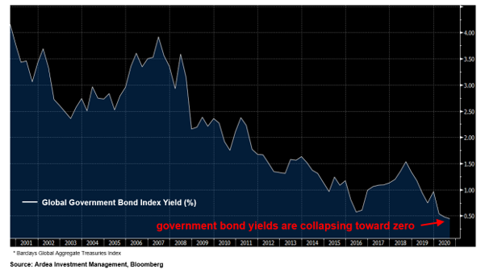
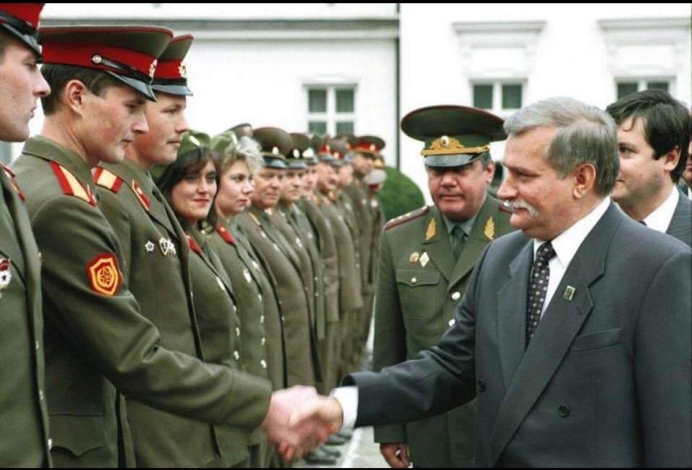
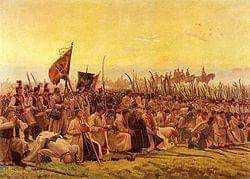
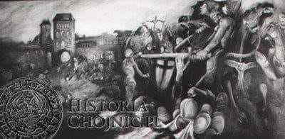

### 2020

Today's Thought?
It is a terrifyingly simple, the Fiat Money shell game.

One part of the government, Treasury issues bonds. The buyers pay, for the sake of illustration, $100 for each bond. The bonds pay an interest rate of $1 per annum, or 1% yield.

Why would anyone be satisfied with so low a dividend? Because there is a quick, short-term insiders profit in the offing, that raises the annualized rate of total profit. The buyers (commercial banks) are approached soon after they acquire new bonds with a quick profit offer made by the central bank.

The central bank offers to buy up bonds at the attractive price of $200 per bond. Since the annual interest paid by Treasury remains at $1 per bond, the annualized interest rate (now being “earned” by the central bank) falls from 1% (one dollar on a hundred) to one-half of 1% ($1 dividend on a $200 bond), which treasury never pays to the Central bank. The ability to swap $100 of commercial bank held bonds for $200 of central bank money is infinite for fiat money.
Bizarrely some Central Banks have started to pay the commercial banks interest on the $100 bonds they purchased?

Its a shell game, there is no pea (IOU) under any shell; and the shells must never stand still long enough to observe this reality.

  

---

Global government bond yields are approaching zero fast; a growing proportion are actually negative.

Yes, that's global.

  

---

<!-- Główne kultury świata to kultura zachodnia (amerykańska i europejska), afrykańska, latynoamerykańska, arabska i azjatycka. Każda z tych kultur posiada swoje nieodłączne cechy, które razem wzięte tworzą niepowtarzalne połączenie wyróżniające kultury spośród innych. Te wyróżniające je cechy to:

Indywidualizm - jest charakterystyczny dla kultur zachodnich. Wywodzi się on jeszcze z tradycji protestanckiej, w której człowiek jest z góry przeznaczony do osiągania sukcesów jako jednostka. Najważniejsze wartości indywidualistyczne to wolność rozwoju unikalnej osobowości, wolność przedsięwzięć i wyrażania siebie. Pozycja jest zdobywana, a nie dziedziczona, prawa i obowiązki są stanowione przez prawo, ale mogą być kwestionowane.
Kultury indywidualistyczne to kraje:
Ameryki Północnej, Europy Północnej i Zachodniej, Australii i Nowej Zelandii, Izraela

Kolektywizm z kolei skupia się na zbiorowości (rodzina, klan, kasta, grupa społeczna, społeczeństwo). Motywem przewodnim działania jednostki jest dobro zbiorowości, jednostka zaś korzysta z praw pod warunkiem, że są zgodne z prawami zbiorowości. Miejsce państwa i prawa nie jest jasne. Decyzje są podejmowane przez przywódców w oparciu o ich osobiste cele. Kolektywizm odznacza się unikaniem konfrontacji, zachowaniem harmonii w grupie, niekwestionowaną władzą osób starszych.
Kultury kolektywistyczne to kraje:
Afryka, Azja, Bliski Wschód, Oceania

Kultury wysokiego kontekstu porozumiewają się w sposób aluzyjny, posługują się raczej sygnałami niewerbalnymi oraz wskazówkami myśli. Komunikacja opiera się na uważnym dobieraniu i ważeniu słów, bezpośredniość oraz wyrażanie przeciwnej opinii są niemile widziane. Polegają bardziej na intuicji i zaufaniu niż na faktach i statystykach. Dla ludzi z kultur niskiego kontekstu osoby reprezentujące kulturę wysokiego kontekstu mogą być uważane za podejrzliwe, nieszczere i przebiegłe.
Należą do nich:
Kraje azjatyckie, arabskie i śródziemnomorskie

Kultura niskiego kontekstu charakteryzuje się bardzo bezpośrednią i otwartą komunikacją. Unika się niepotrzebnych rytuałów, „owijania w bawełnę”, udawanych formuł oraz słownego upiększania. Niewiele uwagi poświęca się językowi ciała. Ważne jest też silne przywiązanie do czasu oraz oddzielanie pracy od relacji międzyludzkich.
Zalicza się do nich kraje:
Ameryka Północna, kraje skandynawskie, Niemcy, Szwajcaria

Kultury monochroniczne są przywiązane do czasu. Czas odgrywa dla nich dużą rolę i liczą go w godzinach, minutach i sekundach. Zegar reguluje ich życie społeczne, rodzinne, pracę, grę, procesy produkcyjne.
Kultury monochroniczne wystepują w:
Kraje skandynawskie i inne germańskie kraje europejskie, Ameryka Północna, Japonia

Kultury polichroniczne nie przywiązują wagi do czasu, gdyż dla nich ważniejsze są relacje i tradycja. Nie widzą sensu w dokładnym liczeniu czasu, zaś jego najlepszym wyznacznikiem są dni, tygodnie, miesiące i lata. Powolność, a nie pośpiech są kardynalną zasadą. Wszystko, co ma być zrobione w końcu zostanie zrobione. Konflikty pomiędzy negocjatorami reprezentującymi obydwie kultury powstają dlatego, że partnerzy punktualni traktują swych mniej punktualnych rozmówców jako niezdyscyplinowanych, niezorganizowanych, a nawet leniwych.
Do kultur polichronicznych zaliczymy więc:
Kraje arabskie, większość krajów Afryki, Ameryki Łacińskiej, kraje Azji Południowej i Południowo-Wschodniej

Można także wyróżnić kultury propartnerskie, nastawione na relacje, które dużą uwagę przywiązują do sposobu, w jaki utrzymywane są wzajemne kontakty oraz kultury protransakcyjne, które przede wszystkim dążą do postawionych celów, są nastawione na wynik. Konflikt może polegać na tym, że przedstawiciele kultury protransakcyjnej  będą postrzegani przez negocjatorów propartnerskich jako zbyt pewni siebie, agresywni, grubiańscy.
Kultury propartnerskie znajdziemy w:
Kraje arabskie, większość krajów Afryki, Ameryki Łacińskiej i Azji
Zaś kraje protransakcyjne to:
Kraje skandynawskie i inne kraje germańskie, kraje europejskie, Ameryka Północna (USA, Kanada), Australia, Nowa Zelandia

Przywiązywanie wagi do statusu społecznego, hierarchii, władzy i okazywania szacunku jest znakiem podziału na kultury ceremonialne i nieceremonialne. Nieceremonialni nie przywiązują uwagi do konwenansów czy hierarchi, wszystkich traktują na równi z sobą. Dla kultur ceremonialnych jest to bardzo obraźliwe, gdy nie przestrzega się zasady starszeństwa lub gdy do negocjacji z nimi zostanie wysłana osoba młodsza wiekiem lub doświadczeniem zawodowym.
Nieceremonialne narody spotkamy w:
USA, Kanada, Australia, Nowa Zelandia, kraje skandynawskie, Holandia
Ceremonialne kultury to:
Pozostałe kraje europejskie, kraje basenu Morza Śródziemnego, kraje arabskie, Ameryka Łacińska

Kultury operujące dużą liczbą sygnałów niewerbalnych są określane mianem kultur ekspresyjnych, zaś kultury, które ograniczają je do minimum to kultury powściągliwe.
Ekspresyjnośc na pewno zauważymy w:
Włochy, Hiszpania, Francja, kraje afrykańskie

Kultury powściągliwe unikają kontaktu wzrokowego, zachowują o wiele większy dystans, mówią ciszej, a sama cisza nie jest dla nich krępująca. Ludzie  z tej kultury ograniczają gestykulację i mimikę oraz nie lubią być dotykani, stąd partnerzy z kultur ekspresyjnych odbierają ich często jako ludzi fałszywych, nie chcących z nimi współpracować.
Powściągliwe nacje zaś to:
Głównie kraje azjatyckie -->

### 1993

Prezydent Lech Wałęsa przyjął od generała Leonida Kowalowa meldunek o zakończeniu wycofywania wojsk rosyjskich z Polski. Ostatni żołnierze opuścili Polskę 18 września 1993 r.

  

### 1931

Incydent mukdeński

### 1794

W czasie insurekcji kościuszkowskiej Rada Najwyższa Narodowa wydała dekret na mocy którego zamieniono pospolite ruszenie włościan na pobór 1 rekruta z 10 domów i 1 konia z 50 domów.

  

---

### 1773

Delegacja Sejmu Rozbiorowego podpisała traktaty podziałowe z przedstawicielami Prus, Rosji i Austrii
30 września 1773 r. traktaty rozbiorowe
ratyfikował Sejm Rozbiorowy zwołany przez
zaborców, przy proteście trzech posłów:
Tadeusza Reytana, Samuela Korsaka i
Stanisława Bohuszewicza.
W wyniku I Rozbioru Austria zawłaszczyła całą
południową Polskę po Zbrucz ze Lwowem, ale
bez Krakowa, a już dwa lata wcześniej
samorzutnie przejęła Spisz oraz powiaty
nowotarski, nowosądecki i czorsztyński. Z kolei
Prusy zaanektowały Warmię i Prusy Królewskie
(Pomorze Gdańskie), ale bez Gdańska i Torunia.
Natomiast Rosja zagarnęła Inflanty Polskie oraz wschodnie krańce Rzeczypospolitej za
Dnieprem, Drucią i Dźwiną, czyli województwa:
mścisławskie, witebskie, połockie oraz część
mińskiego i inflanckiego. Łącznie Polska utraciła w I Rozbiorze 211 tys. km kw. terytorium i 4,5 miliona ludności.
Poparcie dla idei rozbioru Polski znalazło swoje odbicie również w kręgach zafascynowanej absolutyzmem kultury francuskiej i niemieckiej. Poparcie dla tego rozbioru głośno wyraził nawet sam pisarz Francois Voltaire.

  

### 1454

Miała miejsce pierwsza bitwa pod Chojnicami.
Zle zorganizowane wojska polskie i pruskie poniosły sromotną klęskę z wojskami zakonu krzyżackiego.
Przegrana Polaków oznaczała wielkie straty dla Polski i powrót władzy krzyżackiej do części miast i zamków na Pomorzu. Innym efektem tej porażki było osłabienie pozycji Polski na politycznej mapie Europy ,oddalenie się szansy na zakończenie wojny trzynastoletniej i dewaluację znaczenia tzw "pospolitego ruszenia".

  

---

<a href="https://github.com/TomaszWaszczyk/historia.waszczyk.com/edit/master/src/content/september-18.md" target="_blank">Edytuj tę stronę dzieląc się własnymi notatkami!</a>
