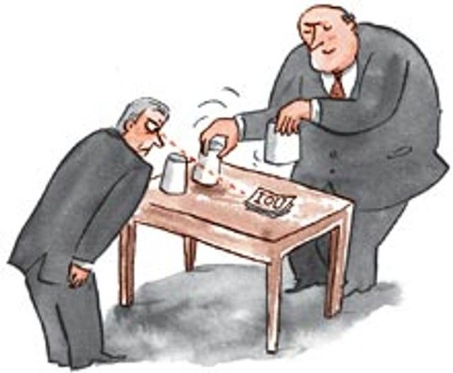
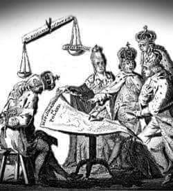

### 2020

Today's Thought?
It is a terrifyingly simple, the Fiat Money shell game.

One part of the government, Treasury issues bonds. The buyers pay, for the sake of illustration, $100 for each bond. The bonds pay an interest rate of $1 per annum, or 1% yield.

Why would anyone be satisfied with so low a dividend? Because there is a quick, short-term insiders profit in the offing, that raises the annualized rate of total profit. The buyers (commercial banks) are approached soon after they acquire new bonds with a quick profit offer made by the central bank.

The central bank offers to buy up bonds at the attractive price of $200 per bond. Since the annual interest paid by Treasury remains at $1 per bond, the annualized interest rate (now being “earned” by the central bank) falls from 1% (one dollar on a hundred) to one-half of 1% ($1 dividend on a $200 bond), which treasury never pays to the Central bank. The ability to swap $100 of commercial bank held bonds for $200 of central bank money is infinite for fiat money.
Bizarrely some Central Banks have started to pay the commercial banks interest on the $100 bonds they purchased?

Its a shell game, there is no pea (IOU) under any shell; and the shells must never stand still long enough to observe this reality.

  

### 1794

W czasie insurekcji kościuszkowskiej Rada Najwyższa Narodowa wydała dekret na mocy którego zamieniono pospolite ruszenie włościan na pobór 1 rekruta z 10 domów i 1 konia z 50 domów.

  

---

### 1773

Delegacja Sejmu Rozbiorowego podpisała traktaty podziałowe z przedstawicielami Prus, Rosji i Austrii
30 września 1773 r. traktaty rozbiorowe
ratyfikował Sejm Rozbiorowy zwołany przez
zaborców, przy proteście trzech posłów:
Tadeusza Reytana, Samuela Korsaka i
Stanisława Bohuszewicza.
W wyniku I Rozbioru Austria zawłaszczyła całą
południową Polskę po Zbrucz ze Lwowem, ale
bez Krakowa, a już dwa lata wcześniej
samorzutnie przejęła Spisz oraz powiaty
nowotarski, nowosądecki i czorsztyński. Z kolei
Prusy zaanektowały Warmię i Prusy Królewskie
(Pomorze Gdańskie), ale bez Gdańska i Torunia.
Natomiast Rosja zagarnęła Inflanty Polskie oraz wschodnie krańce Rzeczypospolitej za
Dnieprem, Drucią i Dźwiną, czyli województwa:
mścisławskie, witebskie, połockie oraz część
mińskiego i inflanckiego. Łącznie Polska utraciła w I Rozbiorze 211 tys. km kw. terytorium i 4,5 miliona ludności.
Poparcie dla idei rozbioru Polski znalazło swoje odbicie również w kręgach zafascynowanej absolutyzmem kultury francuskiej i niemieckiej. Poparcie dla tego rozbioru głośno wyraził nawet sam pisarz Francois Voltaire.

  

### 1454

Miała miejsce pierwsza bitwa pod Chojnicami.
Zle zorganizowane wojska polskie i pruskie poniosły sromotną klęskę z wojskami zakonu krzyżackiego.
Przegrana Polaków oznaczała wielkie straty dla Polski i powrót władzy krzyżackiej do części miast i zamków na Pomorzu. Innym efektem tej porażki było osłabienie pozycji Polski na politycznej mapie Europy ,oddalenie się szansy na zakończenie wojny trzynastoletniej i dewaluację znaczenia tzw "pospolitego ruszenia".

  

---

<a href="https://github.com/TomaszWaszczyk/historia.waszczyk.com/edit/master/src/content/september-18.md" target="_blank">Edytuj tę stronę dzieląc się własnymi notatkami!</a>
