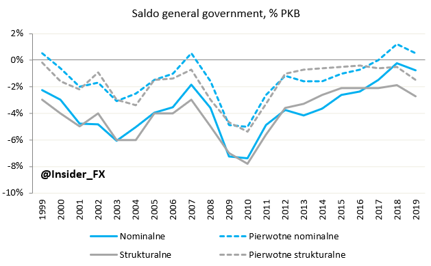
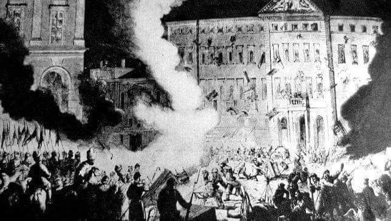

### 2020

Agencja Moody's zwraca uwagę, że Polska stoi przed szeregiem wyzwań fiskalnych w postaci wysokiego deficytu strukturalnego i powrotu do reguł fiskalnych po pandemii. Oznacza to, że osiągnięcie MTO w kolejnych latach (nawet po 2021 roku) będzie znacznie trudniejsze.

  

---

BANK OF ENGLAND HAS SAID NEGATIVE INTEREST RATES NOW UNDER CONSIDERATION.

---

### 2019

http://xxpzhp.umcs.lublin.pl/

### 2013

Linux supremo Linus Torvalds has jokingly admitted US spooks approached him to put a backdoor in his open-source operating system.

During a question-and-answer ‪session ‬at ‪the LinuxCon gathering in New Orleans this week‪, Torvalds ‬and his fellow kernel programmers ‪w‬ere‪ asked by moderator Ric Wheeler whether America's g-men leaned on the Finn to compromise Linux's security, allowing spies to infiltrate computers.

Torvalds replied with a firm "no" while nodding his head to say yes, a response greeted with laughter fr‪o‬m the audience. He quickly followed up by repeating "no" while shaking his head in the negative.

South Korean Red Hat developer Tejun Heo, sitting alongside the kernel boss, quipped: "Not that I can talk about." A video of the Q&A session is below - the short exchange about US spooks starts at the 24-minute mark.

### 1939

https://pl.wikipedia.org/wiki/Stanis%C5%82aw_D%C4%85bek

### 1863

Podczas powstania styczniowego bracia Feliks i Dominik Krasuscy ,Władysław Wnętowski i Wojciech Kunke dokonali na Krakowskim Przedmieściu w Warszawie nieudanego zamachu na carskiego naczelnika rządu cywilnego generała Fiodora Berga.
Zamachowcy użyli w tym celu butelek z płynem zapalającym bomb i garłacza wypełnionego sieksńcami. O dziwo Berg wyszedł z tego cało. W odwecie. Rosjanie całkowicie zdemolowali budynek Pałacu Zamoyskich, wyrzucając na bruk fortepian Fryderyka Chopina. Wydarzenie to stało się inspiracją dla wiersza Cypriana Kamila Norwida, w którym napisał: "Jękły głuche kamienie, ideał sięgnął bruku".
Dominik Krasuski został stracony 13 sierpnia 1864 roku, Feliks uciekł za granicę.

  

---

<a href="https://github.com/TomaszWaszczyk/historia.waszczyk.com/edit/master/src/content/september-19.md" target="_blank">Edytuj tę stronę dzieląc się własnymi notatkami!</a>
