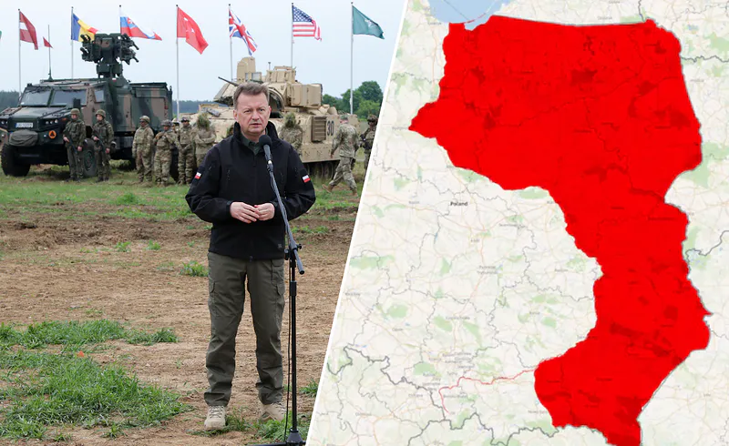
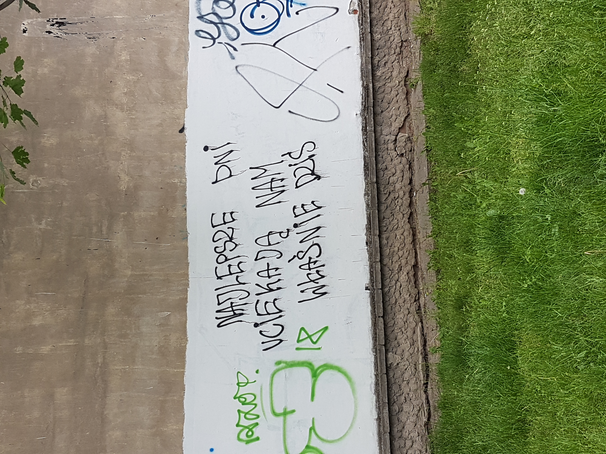

### 2023

<a href="./documents/september/G20-New-Delhi-Leaders-Declaration.pdf" target="_blank">G20-New-Delhi-Leaders-Declaration.pdf</a>

<a href="./documents/september/Statement_by_President_von_der_Leyen_at_Session_III_of_the_G20___One_Future_.pdf" target="_blank">Statement_by_President_von_der_Leyen_at_Session_III_of_the_G20___One_Future_.pdf</a>

---

<video width="640" height="480" controls>
<source src="./movies/september/przedwyborcze.mp4" type="video/mp4">
Your browser does not support the video tag.
</video>

```
„- Trzeba powiedzieć wprost, że ujawniono tajemnice, które są częścią tajemnicy NATO - tak gen. Waldemar Skrzypczak komentuje publikację w spocie PiS dokumentu wytworzonego przez Sztab Generalny Wojska Polskiego w 2011 roku. Zdaniem partii rządzącej dokument to dowód, że "rząd Tuska w razie wojny był gotowy oddać połowę Polski".

- Ja nie wiem, czy jest jakieś słowo, które określiłoby to, co zrobiono - komentuje w rozmowie z WP gen. Waldemar Skrzypczak, wyraźnie zdumiony tym, co zrobiło Prawo i Sprawiedliwość.

W ten sposób były dowódca Wojsk Lądowych (w latach 2006-2009) odnosi się do filmu, jaki w niedzielę opublikowało PiS w swoich mediach społecznościowych. Wystąpił w nim minister obrony narodowej Mariusz Błaszczak, który zarzucił, że rząd Tuska "w razie wojny był gotowy oddać połowę Polski".

Pokazano pierwszą stronę dokumentu wytworzonego przez Sztab Generalny Wojska Polskiego. To "Plan użycia Sił Zbrojnych Rzeczypospolitej Polskiej Warta - 00101". Podtytuł brzmi "Samodzielna operacja obronna". Plan został podpisany 30 czerwca 2011 roku przez ówczesnego Szefa Sztabu Generalnego Wojska Polskiego gen. Mieczysława Cieniucha, a następnie 11 lipca zatwierdzony przez szefa MON Bogdana Klicha.

W prawym górnym rogu pierwszej strony upublicznionego dokumentu znajduje się pieczątka "ściśle tajne". Jednak ją skreślono, a w lewym górnym rogu znalazł się odręczny dopisek o "zniesieniu klauzuli tajności" decyzją ministra obrony narodowej.

- Upublicznienie takiego dokumentu po raz kolejny podważa nasze zaufanie u sojuszników. Świadczy to o tym, że jesteśmy zdolni do wszystkiego, że możemy zdradzić najgłębszą tajemnicę Polski i NATO - komentuje dla WP gen. Waldemar Skrzypczak. - Czy ktoś myśli, że w NATO przejdą nad tym do porządku dziennego? Nie. Oni mogą się teraz bać, że zostaną ujawnione kolejne dokumenty na temat działalności Sojuszu - dodaje.

Skrzypczak zwraca uwagę na to, że dokument powstał w chwili, kiedy Polska była już od 12 lat w NATO.

- Ten dokument jest konsekwencją dokumentów doktrynalnych NATO-wskich, jego ujawnienie jest ujawnieniem części filozofii NATO, czyli to zdrada - uważa Waldemar Skrzypczak. - To nie jest tak, że Polska robiła te dokumenty sama dla siebie. My robiliśmy je w konsekwencji tajnych doktryn NATO-wskich. Nasz plan jest częścią planu NATO. Ujawnienie części planu NATO, jest ujawnieniem Rosjanom zamiarów NATO - podkreśla.

Gen. Waldemar Skrzypczak mówi, że nie zna samego planu, więc nie chce się odnosić do fragmentów jego zapisów ujawnionych przez PiS.

- To zostało zapisane zgodnie z doktryną NATO-wską, na podstawie filozofii prowadzenia operacji obronnych. Ja tego dokumentu nie znam, więc nie wnikam w jego treść. Kiedy powstał, już byłem poza armią. Ale byłem Szefem Zarządu Doktryn i Szkolenia Sił Zbrojnych w Sztabie Generalnym i wiem jak doktryny NATO-wskie powstawały. W konsekwencji doktryn NATO-wskich powstawały doktryny polskie. Sądzę, że tak jest też z tym dokumentem - dodaje.
```

<br><br>

---

[National AI Policy](https://aipolicyportal.org/)

---

<br><br>

---

### 2020

Agencja Moody's zwraca uwagę, że Polska stoi przed szeregiem wyzwań fiskalnych w postaci wysokiego deficytu strukturalnego i powrotu do reguł fiskalnych po pandemii. Oznacza to, że osiągnięcie MTO w kolejnych latach (nawet po 2021 roku) będzie znacznie trudniejsze.

<br><br>

---

BANK OF ENGLAND HAS SAID NEGATIVE INTEREST RATES NOW UNDER CONSIDERATION.

---

### 2019

http://xxpzhp.umcs.lublin.pl/

### 2013

Linux supremo Linus Torvalds has jokingly admitted US spooks approached him to put a backdoor in his open-source operating system.

During a question-and-answer ‪session ‬at ‪the LinuxCon gathering in New Orleans this week‪, Torvalds ‬and his fellow kernel programmers ‪w‬ere‪ asked by moderator Ric Wheeler whether America's g-men leaned on the Finn to compromise Linux's security, allowing spies to infiltrate computers.

Torvalds replied with a firm "no" while nodding his head to say yes, a response greeted with laughter fr‪o‬m the audience. He quickly followed up by repeating "no" while shaking his head in the negative.

South Korean Red Hat developer Tejun Heo, sitting alongside the kernel boss, quipped: "Not that I can talk about." A video of the Q&A session is below - the short exchange about US spooks starts at the 24-minute mark.

### 1939

https://pl.wikipedia.org/wiki/Stanis%C5%82aw_D%C4%85bek

### 1863

Podczas powstania styczniowego bracia Feliks i Dominik Krasuscy ,Władysław Wnętowski i Wojciech Kunke dokonali na Krakowskim Przedmieściu w Warszawie nieudanego zamachu na carskiego naczelnika rządu cywilnego generała Fiodora Berga.
Zamachowcy użyli w tym celu butelek z płynem zapalającym bomb i garłacza wypełnionego sieksńcami. O dziwo Berg wyszedł z tego cało. W odwecie. Rosjanie całkowicie zdemolowali budynek Pałacu Zamoyskich, wyrzucając na bruk fortepian Fryderyka Chopina. Wydarzenie to stało się inspiracją dla wiersza Cypriana Kamila Norwida, w którym napisał: "Jękły głuche kamienie, ideał sięgnął bruku".
Dominik Krasuski został stracony 13 sierpnia 1864 roku, Feliks uciekł za granicę.

<br><br>

---

<a href="https://github.com/TomaszWaszczyk/historia.waszczyk.com/edit/master/src/content/september-19.md" target="_blank">Edytuj tę stronę dzieląc się własnymi notatkami!</a>
