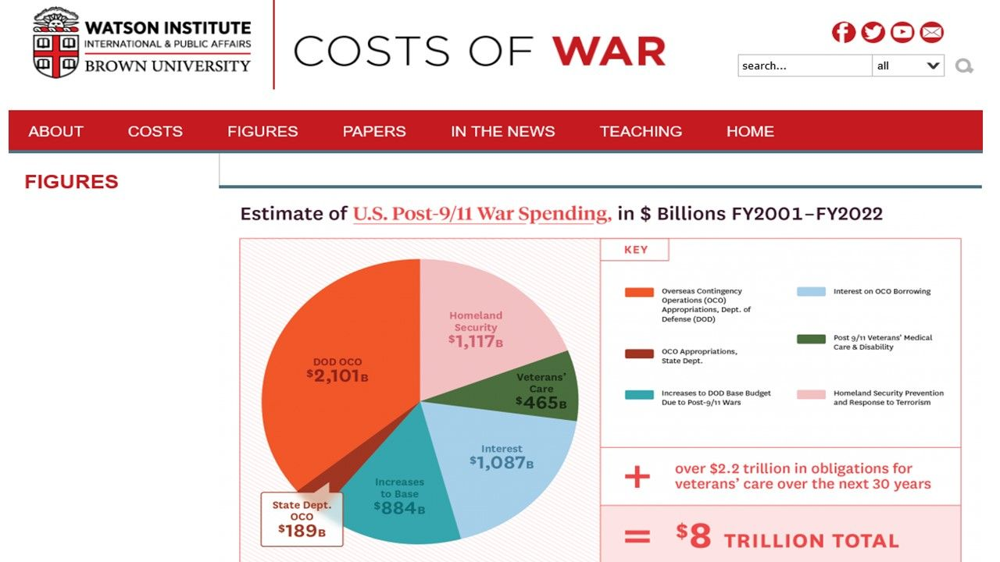
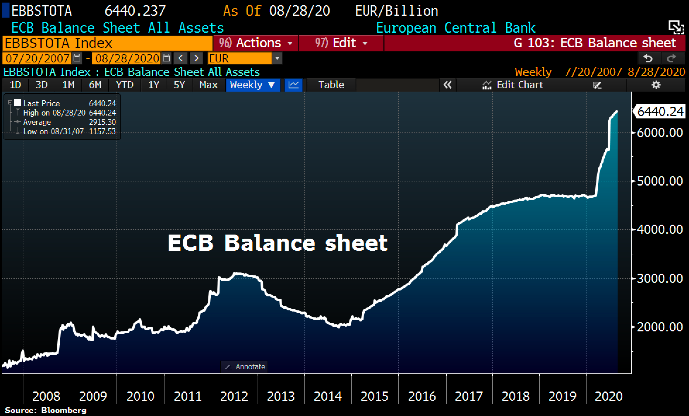
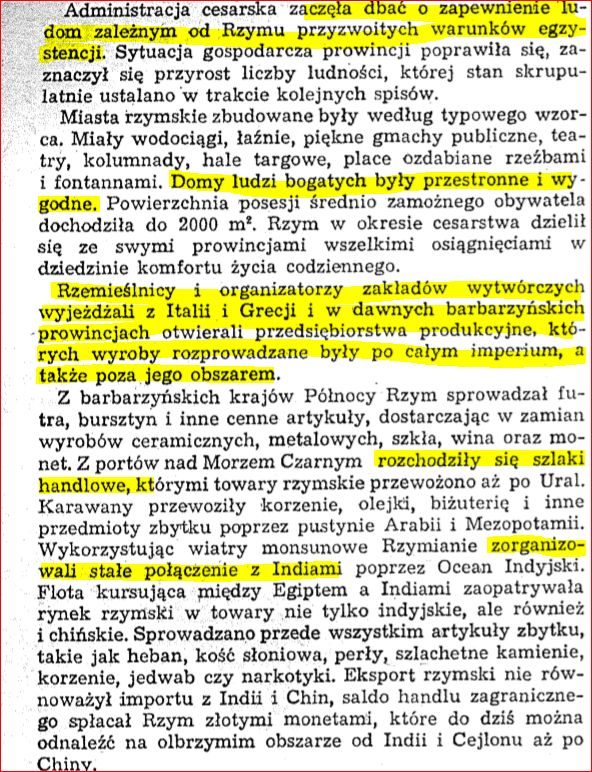
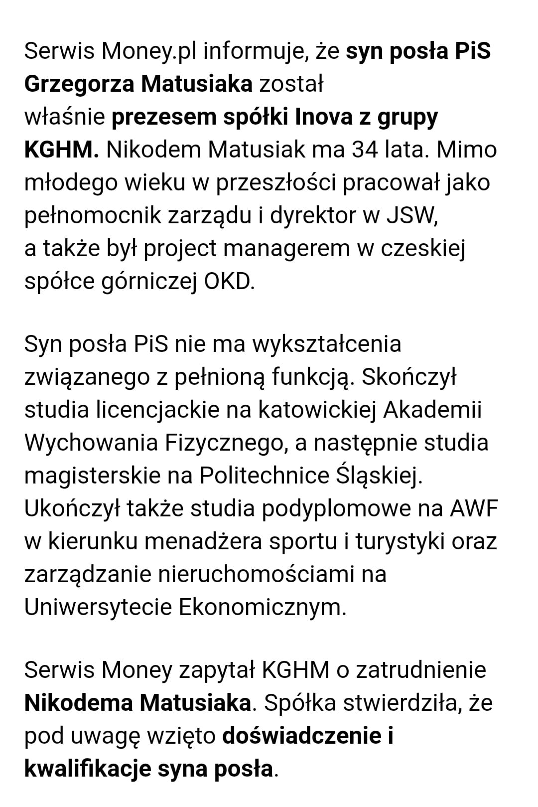
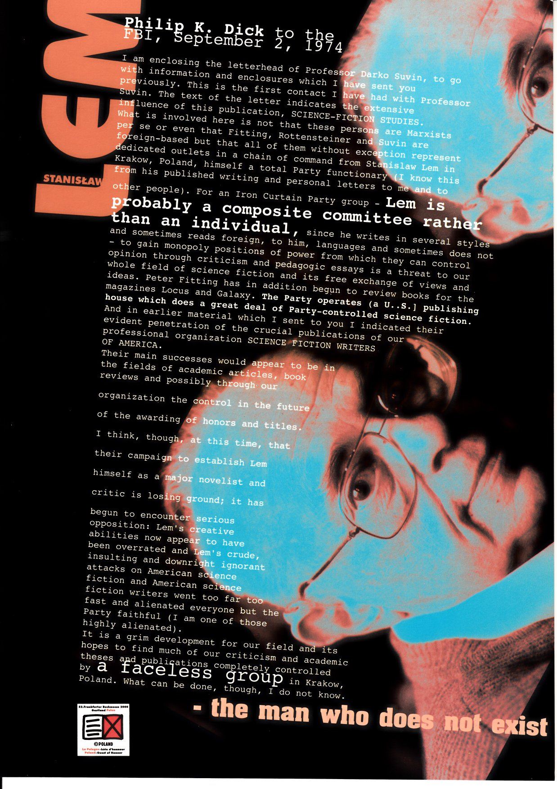
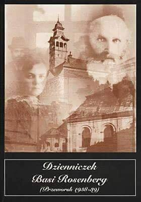
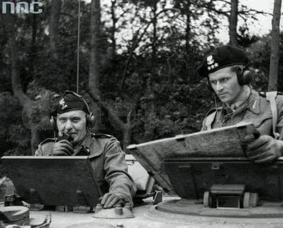

### 2021

Prezydent Andrzej Duda podjął decyzją o wydaniu rozporządzenia o wprowadzeniu stanu wyjątkowego na okres 30 dni w przygranicznym pasie z Białorusią, czyli na części województw podlaskiego i lubelskiego – podał rzecznik prezydenta Błażej Spychalski. Pas ten obejmuje 183 miejscowości (115 w woj. podlaskim i 68 w woj. lubelskim) bezpośrednio przylegające do granicy.

---

Przeglądam koszty wojny w Afganistanie, niemal wszystkie media przytaczają dane z raportu Brown University i podają kwotę $2,29 bln. Forbes nawet skrupulatnie przelicza te koszty na $300mln DZIENNIE, statystyczny Amerykanin zapłacił za tę wojnę $24tys. niektórzy dodają do tego koszty, które trzeba będzie ponieść na weteranów, odsetki itd wówczas suma urasta do $6,5bln

Ale kiedy sięgam do źródeł czyli do Raportu to koszt wojen USA po 11-tym września 2001 roku (Afganistan, Irak, Syria) zamyka się kwotą $8bln, dla porównania CAŁY budżet USA w 2021 r. to tylko $3,4 bln a budżet Polski to zaledwie $0,1 bln.

  

---

Nie wyegzekwujemy sprawiedliwego zadośćuczynienia za skutki napaści 1 września 1939 na nasz kraj, skoro dziś w Polsce według mediów polskie armie walczyły tego dnia z wybuchem wojny światowej, a nie z niemieckimi armiami.

---

### 2020

ECB balance sheet hit another ATH at €6,440.2bn as Lagarde keeps printing press rumbling. Total assets rose by another €16.2bn on QE. ECB balance sheet now equal to 61% of Eurozone GDP vs BoJ's 132% and Fed's 36%.

  

---

Kończący się cykl gospodarczy dokonuje szeregu zmian w przebiegu szlaków handlowych. Dlatego warto poczytać jak dawne imperia budowały swoja potęgę.

  

---

  

---

### 1974

P. K. Dick to the FBI [2 September 1974] :
"Lem is probably a composite committee rather than an individual"

  

### 1949

https://pl.wikipedia.org/wiki/Hans-Hermann_Hoppe

### 1944

https://en.wikipedia.org/wiki/Stefan_Rowecki - Grot Rowecki

### 1939

Rozpoczęło się niemieckie bombardowanie węzła lotniczego w Dęblinie. Głównym celem ataku stały się : składnica lotnicza, pole startowe i Dział Nauk. Aby w jakiś sposób przeciwdziałać powietrznym atakom Luftwaffe, próbowano naprędce zorganizować obronę. Niestety szkolne samoloty nie były w stanie sprostać temu zadaniu. 4 września sformowano pluton rozpoznawczy na dwóch samolotach Potez XXV. Uzupełniony jeszcze dwoma „ Karasiami ” działał pod dowództwem kpt.obs.Juliana Łagowskiego na korzyść Brygady Pancerno – Motorowej oraz formującej się właśnie Armii „ Lublin ” gen.Tadeusza Piskora. Obszaru powietrznego nad Dęblinem próbowała bronić również grupa pilotów myśliwskich z Ułęża. Wyposażona w samoloty P – 11 kilkakrotnie odpierała skuteczne ataki niemieckich bombowców. Całością dowodził kpt.pil. Stanisław Brzezina. 7 września grupa ta wycofała się na wschód. W walkach wyróżnili się piloci – instruktorzy, w okresie późniejszym bardzo znani, doskonali myśliwcy: por.Stefan Witorzeńć, Witold Urbanowicz, Tadeusz Arentowicz, Zdzisław Henneberg. 5
września ppor.pil. Wacław Krół ze 121 eskadry myśliwskiej Armii „ Kraków ” wraz z kapralem pil.Piotrem Zaniewskim zestrzelili nad lotniskiem Borowina jednego Dorniera

---

Fragment dzienniczka Basi Rosenberg-15-letniej Żydówki zamieszkałej w centrum Przeworska, obok ratusza, przy Rynku 36. Była absolwentką szkoły żeńskiej, którą ukończyła w roku szkolnym 1935/36. Dalsza edukację kontynuowała w oddziale handlowym Publicznej Dokształcającej Szkoły Zawodowej. Dyplom otrzymała 22 czerwca 1939 roku. Mając 14 lat rozpoczęła pisanie dziennika, w którym przedstawiła zapis życia małego polskiego miasteczka położonego na terenie dawnej Galicji, a także opisała tragiczne wydarzenia września 1939 roku.  Były to dwa zeszyty. Pierwszy zeszyt prawdopodobnie zaginął, a drugi został odnaleziony w 1958 roku podczas robót ziemnych. Dzienniczek kończy się na dacie 24 września 1939 roku. Dalsze losy autorki są owiane tajemnicą. Prawdopodobnie nie doczekała zakończenia wojny, jak większość polskich Żydów. Rękopis jej pamiętnika zachował się w zbiorach archiwalnych Muzeum w Przeworsku:
,,2.IX.39 (sobota wieczór 9-ta)
Wojna. Mówiono ciągle o tem, a jednak nikt nie wierzył, że wybuchnie. I oto siedzimy w ciemnościach. Elektryki nie wolno świecić, by nie było widać światła na zewnątrz. Piszę przy świeczce. Na dworze jest ciemno i tak ponuro i okropnie dookoła. Okna muszą być przysłonięte. Boję się panicznie. Już było dziś kilka alarmów gazowych, ale na szczęście były fałszywe. Nerwy mam naprężone. Nie wiem jak ja to przetrwam. Ludzie uszczelniają okna każdy chce się bronić, a nie wie jak. O Boże! Zlituj się nad nami. Co będzie dalej. Na szczęście nie ma teraz alarmu gazowego, więc możemy być spokojni. Wojna. Nigdy sobie tego tak nie przedstawiałam. Łajki narzeczony jest u nas. Przyjechał we czwartek. Cukru nie wydają nam we fabryce. Mamy tam zapłacone przeszło 2 wagony. Nadsłuchuję ciągle i każdy szmer wydaje mi się wyciem syreny alarmowej. Auta jadą przesłonięte niebieską żelatyną. O 4-tej nad ranem obudził nas alarm gazowy i później było jeszcze kilka. Nerwy odmawiają mi posłuszeństwa. Z frontu jeszcze nic pewnego nie wiadomo. Chodzą pogłoski, że zbombardowano Kraków i dużo miast, że wojsko polskie zajęło Gdańsk, ale nie wiadomo czy to prawda. Ludzie uciekają z Katowic i Krakowa i nasza drogą przejeżdża mnóstwo samochodów z uciekającymi. Luzer jest przy OPL ma teraz służbę. Benzyny nie wydaje się teraz prywatnym samochodom i biedni uciekinierzy nie mają teraz ratunku. Okropne, a wszystko to przez jednego człowieka. Hitler, wszyscy go tak nienawidzą, iż myślę że z zimną krwią zamordowaliby go najokrutniejszą śmiercią. Jak to długo potrwa. Czy on jest naprawdę nieśmiertelny jak opowiada witz. Piszę głupstwa. Nie mogę myśli zebrać. Chciałam się tym pisaniem choć trochę uspokoić. Ufam Bogu i wierzę, że jest On sprawiedliwy i potrafi uczynić wszystko co zechce. Proszę tylko by nas nie opuścił.''
źródło: Dzienniczek Basi Rosenberg (Przeworsk 1938-39)
Muzeum w Przeworsku - Zespół Pałacowo-Parkowy, Przeworsk 1997, str. 58-59.

  

---

Podczas walk w rejonie Jordanowa 10. Brygada Kawalerii Zmotoryzowanej pod dowództwem pułkownika dyplomowanego Stanisława Maczka (na zdjęciu po lewej stronie) zniszczyła ok. 50 czołgów niemieckiego XXII Korpusu Pancernego.

  

---

### 1940

Na podstawie reskryptu Heinricha Himmlera w życie weszła "Niemiecka Lista Narodowościowa" znana lepiej, jako "Volkslista".
Dokument ten będący przejawem rasistowskiej polityki III Rzezy został wprowadzony w celu podziału ludności zamieszkującej tereny polskie zdobyte przez Niemców.
Szczególnym naciskom poddawani byli
mieszkańcy Śląska, Wielkopolski oraz Gdańska i Prus Zachodnich. Na tych terenach stosowano
całą gamę środków przymusu: od nacisków
administracyjnych (grożenie eksmisją z
mieszkania, odebrania kartek żywnościowych,
przeniesienie do gorszej pracy), poprzez represje policyjne (uporczywe wzywanie na policję, bicie), kończąc na wywożeniu członków rodziny do obozów koncentracyjnych lub przesiedleńczych i warunkowaniu ich zwolnienia podpisaniem niemieckiej listy narodowościowej.
Co ciekawe, podpisywanie tej listy sugerował sam polski rząd na uchodztwie usprawiedliwiając swoją decyzję obawą o całkowitą eliminację biologiczną Polaków. Podpisanie volkslisty miało temu zapobiec.
Odmiennie sytuacja kształtowała się na terenie
Generalnego Gubernatorstwa, gdzie przypadki
podpisania volkslisty były nieliczne, a ci, którzy ją podpisali, otoczeni byli ostracyzmem
społeczeństwa. Ocenia się, że podpisało ją
łącznie ponad 2 mln obywateli polskich.
Tworzona była do końca marca 1942.
Kategorie Volksdeutschów
Volksdeutschów dzielono na cztery kategorie
DVL:
Kategoria 1 - Volksdeutscher – osoby
narodowości niemieckiej, aktywne politycznie,
działające na rzecz III Rzeszy w okresie
międzywojennym (tzw. Reichslista).
Kategoria 2 - Deutschstämmige – osoby
przyznające się do narodowości niemieckiej,
posługujące się na co dzień językiem
niemieckim, kultywujące kulturę niemiecką,
zachowujące się biernie.
Kategoria 3 - Eingedeutschte – osoby
autochtoniczne, uważane przez Niemców za
częściowo spolonizowane (Ślązacy, Kaszubi,
Mazurzy) oraz Polacy niemieckiego pochodzenia (osoby pozostające w związkach małżeńskich z Niemcami).
Kategoria 4 - Rückgedeutschte – osoby
pochodzenia niemieckiego, które się
spolonizowały i czynnie współpracowały w
okresie międzywojennym z władzami polskimi,
bądź aktywnie działały w polskich organizacjach
społeczno-politycznych (popularnie zwane przez Niemców renegatami.

## 1942

Lotnictwo sowieckie zrzuciło na Warszawę 300 bomb burzących. Tydzień później Biuletyn Informacyjny opublikował raport, w którym czytamy:
"Najskuteczniej zbombardowano Pl. Kercelego, na którym spłonęło ponad 1000 straganów i kramów. Wartość towarów spalonych na Kercelaku obliczają według cen dzisiejszych na 200 do 300 milionów złotych. Poza tym zniszczeniu lub uszkodzeniu uległo około 100 budynków mieszkalnych” 
Zdjęcie " Życie Warszawy".
Jedyne znane zdjęcie dokumentujące sowiecki nalot na Warszawę – rozbity bombą róg cmentarza u zbiegu ulic Powązkowskiej i Okopowej. Fotografia z – M. Kielarski „Powązki: miasto umarłych (ilustrowany przewodnik po cmentarzu)”, 1971 r.

## 1945

<a href="https://pl.wikipedia.org/wiki/Zrzeszenie_Wolno%C5%9B%C4%87_i_Niezawis%C5%82o%C5%9B%C4%87" target="_blank">Zrzeszenie Wolność i Niezawisłość</a>

### 1863

Born Edvard Phragmén's parents were Lars Jakob Phragmén, a mathematics teacher at the local Gymnasium in Örebro and author of mathematics books, and Hedvig Amalia Fernander. Lars Jakob Phragmén had been born on 11 January 1832 and had studied at the University of Uppsala before becoming a teacher at a school in Stockholm. He became a mathematics teacher at the Gymnasium in Örebro in 1859 and, in 1875, he also took on the role of rector. He retired in 1902. Edvard grew up in Örebro, a town about 200 km west of Stockholm. Following in his father's footsteps, he entered the University of Uppsala in 1882 but, after a year, he began studying at Stockholm where Mittag-Leffler immediately recruited him to work for his journal Acta Mathematica. Phragmén was asked by Mittag-Leffler to study a letter from Édouard Goursat and then discuss Georg Cantor's definition of the continuum with Mittag-Leffler. Phragmén gave a new proof of the Cantor-Bendixson theorem in Beweis eines Satzes aus der Mannigfaltigkeitslehre Ⓣ (1884) and then published significant results on elliptic functions in Sur un théorème concernant les fonctions elliptiques Ⓣ (1885). Also in 1885 he published Über die Begrenzungen von Continua Ⓣ. These three papers were all published in Acta Mathematica, the high quality journal which was edited by Mittag-Leffler. Phragmén became an editor of Acta Mathematica in 1888. He graduated from the University of Uppsala in 1889.

It was proof-reading papers for Acta Mathematica that first brought Phragmén to international recognition. This followed the competition for the Royal Prize, financed by King Oscar II of Sweden, which was announced in Acta Mathematica in 1885. The deadline for submissions was 1 June 1888 and there were four questions, the first of which involved the stability of the solar system and asked for series which describe the motion of bodies in a generalised 3-body problem. Henri Poincaré submitted an entry which the judges, Hermite, Weierstrass and Mittag-Leffler, deemed the best and worthy of the prize. The prize was to be presented by the King in January 1889 and Poincaré's prize-winning contribution began to be set up for printing in Acta Mathematica with Phragmén as proof-reader [1]:-

    ... Phragmén found one dubious point after another. In December of 1888 he writes: "If the author were not what he is, I would not for a moment hesitate to say that he has made a great mistake here."

Phragmén corresponded with Poincaré who tried to correct the errors. However Phragmén found more problems with the paper and eventually, after the paper had been printed, it had to be withdrawn and completely rewritten by Poincaré. The new version was nearly 100 pages longer than the original. In the revised introduction, Poincaré thanked Phragmen, writing:-

    It is he, who in calling my attention to a delicate point, made it possible for me to discover and correct an important error.

In fact one of the points which Phragmén questioned prompted Poincaré to take the first steps in chaos theory. Gårding writes [1]:-

    His remarkable proofreading feats gave Phragmén a great reputation. It may be overstated, but his penetrating critical ability became clear to everyone.

Yngve Domar writes [6]:-

    Of the greatest value for the editorial work of 'Acta Mathematica' was Phragmén's uncommon ability to analyze and critically examine, and his astuteness in this respect was also evidenced e.g. in the group of works he published in 1890-92 which treat a variety of subjects, often starting with an analysis of older theories. He speaks as critic in such lines as the following which introduce a work in which an argument of Schwarz is revised and corrected: "Most mathematicians would probably not have any objection to this proof. However, there is one point which I find dissatisfying, ..."

Sofia Kovalevskaya died in February 1891 and her chair at Stockholm had to be filled. Mittag-Leffler had two excellent candidates to fill the chair, Phragmén and Ivar Bendixson [1]:-

    After careful deliberation Mittag-Leffler found that Phragmén was the best candidate. Nobody at Stockholm University could contradict him.

In 1892 Phragmén obtained a permanent position at Stockholm when he was appointed to succeed Sofia Kovalevskaya. He married Gyda Josephine Mathilde Sohlberg in 1896. She was born in Christiania in 1864, the daughter of Johan Vilhelm Sohlberg (born 1831) and his wife Johanne (born 1837). In 1904 Phragmén resigned his chair at the university and, from that time, he worked for the state run Royal Inspection of Insurance Companies becoming director and head of the department of insurance in the following year. However, he continued in his role as an editor of Acta Mathematica, in fact he continued as an editor until his death in 1937. In 1908 he became director of the private insurance company Allmänna Lifförsakringsbolaget.

The mathematical result for which Phragmén is best remembered today is the Phragmén-Lindelöf principle. Phragmén's first progress towards this was his paper Sur une extension d'un théorème classique de la théorie des fonctions (1904) in which he extended Liouville's result that every entire bounded function must be constant to show that the same result could be obtained for entire functions with controlled growth in a given sector that were bounded outside the sector. Although this paper was an important contribution, the major advance came in a joint paper Sur une extension d'un principe classique de l'analyse et sur quelques propriétés des fonctions monogènes dans le voisinage d'un point singulier Ⓣ of 1908 by Phragmén and the Finnish mathematician Ernst Lindelöf. The breakthrough in this paper came about because in it they generalise Phragmén's earlier result by formulating it as an extension of the maximum principle for the absolute values of analytic functions.

Domar comments in [6] about a later work by Phragmén:-

    Another pioneering work of Phragmén was presented at the Scandinavian Congress of 1913. Here the problem is more special, lying within the theory of uniform convergence of trigonometric series. But Phragmén was far ahead of his time, as has been certified by the expert Antoni Zygmund, who rediscovered parts of the theory 26 years later, unaware of Phragmén's paper.

Phragmén had also made an important contribution to voting systems with the publication of two papers Proportional elections (Swedish) (1895) and On the question of a proportional election method (Swedish) (1899). Phragmén's variant on the single transferable vote, proposed in his 1895 paper, was introduced in the Swedish Elections Act as a method of allocating seats within a party. Phragmén was a member of the committee during 1903-03 which prepared the legislation which became law in the Swedish Elections Act. His interest in voting systems in elections had come from a somewhat disastrous episode in attempting to elect a rector of the Mathematics College in December 1894. There was a dispute over which mathematics lecturers were eligible to vote, some feeling that only the professors should vote. All were invited to vote in the December election but, because of the dispute, Mittag-Leffler, Bendixson and Phragmén abstained. Pettersson was elected but declined to accept the post. A second election was held at which only professors voted (after a lengthy argument with the docent who eventually left the meeting with Pettersson) and Phragmén was elected rector. However, this vote was later declared invalid and yet another vote was held at which Pettersson was elected rector.

Harald Cramér comments in [5] about Phragmén's character. Phragmén was:-

    ... clear, logically objective, factual, perhaps somewhat cool, and occasionally sarcastic in his opinions.

For many years he was President of the Swedish Society of Actuaries taking up that role in 1909. He was a member of a large number of Swedish and foreign academies and scientific societies. From 1927 until his death he was president of the council of the Mittag-Leffler Institute.

Edvard Phragmén was a Swedish mathematician who worked on the theory of functions.

### 1839

https://en.wikipedia.org/wiki/Henry_George

## 1655

W czasie potopu szwedzkiego miała miejsce przegrana przez Polaków bitwa pod Sobotą (województwo łódzkie). Szwedzi,którymi dowodził sam król Karol X Gustaw (grafika) już od 31 sierpnia szli na Warszawę,zatrzymując się dzień pózniej w okolicach Kutna. 25 tysięczna armia szwedzka została tu poinformowa,że w znajdującym się 20 km dalej Piątku znajdują się polskie oddziały. Król szwedzki chcąc wykorzystać okazję ruszył do ataku 2 września. Żeby jednak tego dokonać należało się przeprawić przez rzekę Bzurę właśnie w okolicach Soboty. Ten manewr,który miał na celu podejście Polaków od tyłu skutecznie przez pewien czas spowalniała armia konna Aleksandra Koniecpolskiego,która nacierała na przednią straż szwedzką. Zatrzymanie Szwedów nie było jednak tak proste i prób tego dokonywano jeszcze kilkrotnie przy czym za każdym razem z gorszym efektem. Przewaga Szwedów wzrosła jeszcze dodatkowo po tym,jak przybyły im z pomocą kolejne oddziały,co zmusiło Koniecpolskiego do wycofania się.
Jan Kazimierz widząc przeważające
siły nieprzyjaciela, nakazał odwrót. Szwedzi
ruszyli w pościg, jednak udało im się urwać
tylko część polskiego taboru oraz pojmać
niewielką liczbę maruderów. Za wycofującym
się Janem Kazimierzem ruszył Arvid
Wittenberg (8 tys. żołnierzy), natomiast Karol
Gustaw z resztą wojsk szwedzkich
pomaszerował do Warszawy, którą zajął 8
września.

---

<a href="https://github.com/TomaszWaszczyk/historia.waszczyk.com/edit/master/src/content/september-2.md" target="_blank">Edytuj tę stronę dzieląc się własnymi notatkami!</a>
