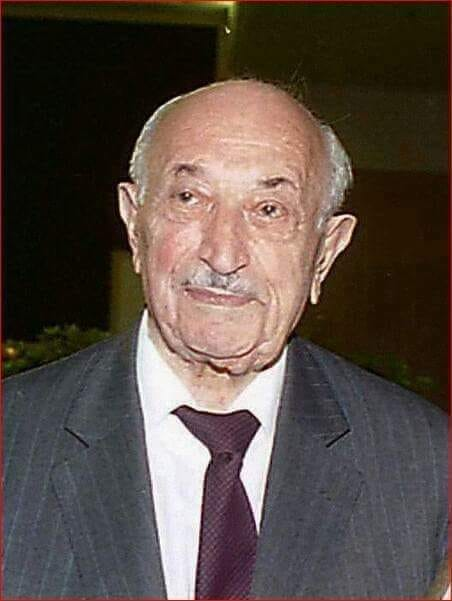
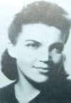
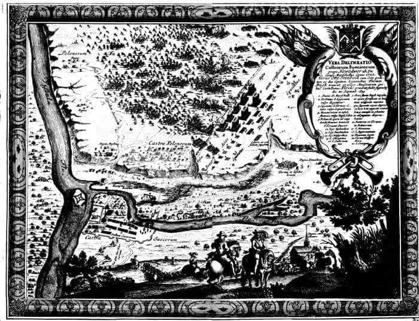
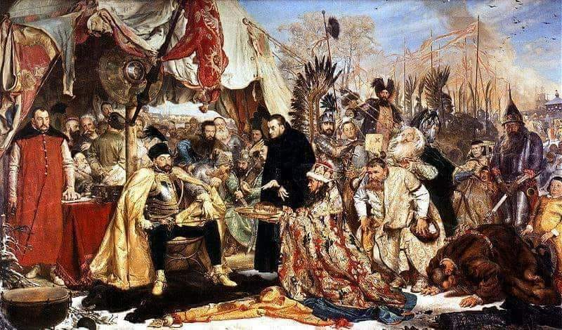

### 2005

W Wiedniu zmarł Szymon Wiesenthal, tropiciel hitlerowskich zbrodniarzy wojennych, więzień dwunastu niemieckich obozów koncentracyjnych (m.in. Płaszów, Gross-Rosen i Buchenwald). Ponadto autor książek poświęconych Zagładzie Żydów. W 1947 roku założył w Linzu centrum dokumentacyjne, które od 1961 roku zaczęło działać w Wiedniu. W Żydowskim Centrum Dokumentacji w Wiedniu udało się zgromadzić dokumenty na temat Holokaustu i zbrodniarzy wojennych (łącznie 160 tys. kartotek). Dzięki temu trafiono na ślad 3000 zbrodniarzy i 1000 postawiono przed obliczem sprawiedliwości. To właśnie Szymon Wiesenthal przyczynił się do pojmania SS-Obersturmbannführera Adolfa Eichmanna, odpowiedzialnego za eksterminację milionów Żydów w Europie; Gustava Wagnera, zastępcy komendanta niemieckiego obozu zagłady w Sobiborze; oraz SS-Hauptsturmführera Franza Stangla, komendanta niemieckich obozów zagłady w Sobiborze i Treblince. Szymon Wiesenthal został uhonorowany m.in. Krzyżem Komandorskim Orderu Odrodzenia Polski (1994) oraz tytułem doktora honoris causa Uniwersytetu Karola w Pradze.

  

### 1944

51 DZIEŃ POWSTANIA WARSZAWSKIEGO
Z Czerniakowa wycofują się żołnierze powstańczych oddziałów z batalionów "Zośka" i "Parasol". Część powstańców wycofuje się na Pragę razem z oddziałami 1 Armii Wojska Polskiego.
Tego dnia Niemcy dopuszczają się zbrodni na ludności. Egzekutorzy z oddziału Dirlewangera zabili 1000 osób w magazynach "Społem". Rozstrzelano wszystkich, którzy tylko mogli być zdolni do walki.
Tego dnia zginęli: łączniczka Maria Cetys i 12 letni kapral Witold Modelski.
Na zdjęciu Maria Cetys.

  

### 1655

W czasie potopu szwedzkiego rozpoczęła się bitwa pod Nowym Dworem Mazowieckim.
Po przeciwnych stronach stanęło 8 000 tysięcy żołnierzy wojsk Rzeczypospolitej Obojga Narodów pod dowództwem pułkownika Jana Kazimierza Krasińskiego oraz tyle samo Szwedów pod wodzą generała Gustawa Otto Stenbocka.
Bitwa ta była jednym z elementów szwedzkiej strategii opananowania basenu Morza Bałtyckiego.
Batalia ta zakończyła się po 10 dniach zwycięstwem wojsk szwedzkich, co otwotrzyło Szwedom drogę do Inflant.

  

### 1576

Król Polski Stefan Batory postawił przed sądem królewskim miasto Gdańsk. Historycy określają to wydarzenie, jako rozpoczęcie wojny między Rzeczypodpolitą, a Gdańskiem.
Przyczyną tego była odmowa Gdańszczan wpuszczenia do miasta nowowybranego władcy oraz stanowcza postawa Batorego, który nie chciał tej sprawy załatwić za pomocą ugody.
Stefan Batory doprowadził do blokady ekonomicznej Gdańska, przez okres trwania wojny Elbląg stał się główny polskim portem.
Konfilkt ten zakończył się na korzyść Stefana Batorego 16 grudnia 1577 roku, kiedy to wjechał on uroczyście do Gdańska oraz przyjął od rady miasta przysięgę poddaństwa.

  

---

<a href="https://github.com/TomaszWaszczyk/historia.waszczyk.com/edit/master/src/content/september-20.md" target="_blank">Edytuj tę stronę dzieląc się własnymi notatkami!</a>
