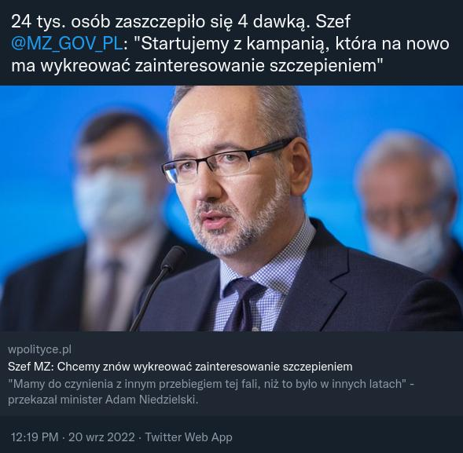

### 2023

> ...

  

---

  

[Post-Quantum Cryptography for Engineers](https://datatracker.ietf.org/doc/draft-ietf-pquip-pqc-engineers/)

---

### 2022

  

---

  

---

### 2021

Those who are pointing out the #stagflation risk are vindicated this morning. While the evergrande crisis puts global growth at risk, we are getting not so good news on the #inflation front from Europe. Indeed, price pressure keeps rising in the #1 europan economy as German producer prices (PPI) jumped 12% YoY in August, most since 1974, mainly driven by energy and intermediate product prices. Meanwhile, prices of consumer goods are also increasingly on the rise. The bond market seems more concerned about #deflationary risk which might arise from #china as the Bund is down -3bps, deep into negative territory at -31bps.

  

---

<video width="640" height="480" controls>
<source src="./movies/september/ostraglupota.mp4" type="video/mp4">
Your browser does not support the video tag.
</video>

---

### 2005

W Wiedniu zmarł Szymon Wiesenthal, tropiciel hitlerowskich zbrodniarzy wojennych, więzień dwunastu niemieckich obozów koncentracyjnych (m.in. Płaszów, Gross-Rosen i Buchenwald). Ponadto autor książek poświęconych Zagładzie Żydów. W 1947 roku założył w Linzu centrum dokumentacyjne, które od 1961 roku zaczęło działać w Wiedniu. W Żydowskim Centrum Dokumentacji w Wiedniu udało się zgromadzić dokumenty na temat Holokaustu i zbrodniarzy wojennych (łącznie 160 tys. kartotek). Dzięki temu trafiono na ślad 3000 zbrodniarzy i 1000 postawiono przed obliczem sprawiedliwości. To właśnie Szymon Wiesenthal przyczynił się do pojmania SS-Obersturmbannführera Adolfa Eichmanna, odpowiedzialnego za eksterminację milionów Żydów w Europie; Gustava Wagnera, zastępcy komendanta niemieckiego obozu zagłady w Sobiborze; oraz SS-Hauptsturmführera Franza Stangla, komendanta niemieckich obozów zagłady w Sobiborze i Treblince. Szymon Wiesenthal został uhonorowany m.in. Krzyżem Komandorskim Orderu Odrodzenia Polski (1994) oraz tytułem doktora honoris causa Uniwersytetu Karola w Pradze.

  

---

Dziś opowiem Wam dlaczego Niemcy są bogaci.

Bo dużo i lepiej pracują? Bo są bogatsi z domu? Zacznijmy od sprytnego mechanizmu, który zmusił kraje zachodu do intensywnych inwestycji w RFN. Przypominam tę historię z okazji 71. rocznicy powołania rządu Adenauera (l. 73), do którego niekiedy lubi być przyrównywany Jarosław Kaczyński, obecnie 71 lat mający. 
Ale od początku.
Traktat wersalski po pierwszej wojnie światowej nakładał na Berlin i jego sprzymierzeńców odpowiedzialność za wybuch konfliktu. Artykuł 232 działu VIII przewidywał, że Niemcy wypłacą zwycięzcom wysokie odszkodowania w wysokości ustalonej przez specjalnie powołaną Komisję. Szczegóły ich spłacania uregulowały plany Dawesa (1924) i Younga (1929), które zawierały nie tylko harmonogram, lecz także przewidywały pożyczki dla ratowania niemieckiej gospodarki. Tzw. pożyczka Dawesa wynosiła 800 mln marek w złocie na 7 procent, a pożyczka Younga – 300 mln marek w złocie na 5,5 proc. Rządy państw sprzymierzonych zdawały sobie bowiem sprawę z katastrofalnej sytuacji niemieckiej gospodarki.
W lutym 1933 r. rząd Adolfa Hitlera odmówił spłaty pożyczek i odsetek. Dług rósł.
O ile sytuacja gospodarcza Niemiec po I wojnie światowej była tragiczna, to po drugim wywołanym przez ten kraj konflikcie, była katastrofalna. Całe państwo znalazło się zresztą pod okupacją aliantów, która w części zachodniej trwała do 1955 r. RFN musiała wziąć na siebie dług III Rzeszy, bowiem uznawała się za jedyne państwo niemieckie. Gdyby obciążeń finansowych nie przejęła, pośrednio mogłoby to doprowadzić do konieczności uznania NRD.
Na marginesie warto dodać, że pewnej niedzieli 1948 r. mieszkańcy Niemiec obudzili się w kraju z nową walutą. Rząd wprowadził markę niemiecką, zastępując nią Reichsmarkę. Depozyty w bankach zostały po prostu zredukowane w proporcji 10:1.
Kanclerz Adenauer, który od 20 września 1949 r. rządził w RFN wiedział oczywiście, że bieżąca obsługa gigantycznego zadłużenia zagranicznego nie jest możliwa bez jego redukcji lub choćby restrukturyzacji. Zresztą już wcześniej, przed objęciem swej najważniejszej funkcji, krytykował aliantów za demontaż niemieckiego przemysłu i rabunkową gospodarkę. Nowo budowane państwo potrzebowało pieniędzy, by rozbudować przemysł, a z eksportu czerpać zyski na spłatę długów. A Adenauer miał wyjątkowy dar przekonywania.
Negocjacje nie były jednak łatwe. Uczestniczyły w nich, obok Zachodnich Niemiec, Belgia, Kanada, Dania, Francja, Wielka Brytania, Grecja, Iran, Irlandia, Włochy, Liechtenstein, Luksemburg, Norwegia, Pakistan, Hiszpania, Szwecja, Szwajcaria, RPA, Stany Zjednoczone i Jugosławia. Państwa bloku wschodniego nie zostały zaproszone. Rozmowy trwały od 27 lutego do 8 kwietnia.
Dług obejmował 13,5 miliarda marek zobowiązań sprzed 1939 r., i 16,2 miliarda marek powojennych kredytów udzielonych przez Stany Zjednoczone. W wyniku negocjacji całość obniżono do 15 miliardów marek, płatnych przez trzydzieści lat. Porozumienie zawierało jednak dwa niezwykle istotne warunki, które stały się przyczyną późniejszego sukcesu niemieckiej gospodarki.
Po pierwsze, dług miał być spłacany tylko pod warunkiem utrzymywania się dodatniego bilansu w handlu zagranicznym RFN, a koszt obsługi długu nie mógł być większy nić 3% eksportu (dla porównania Polska spłaca raty wysokości 10% eksportu). A więc pozostałym sygnatariuszom musiało od tego momentu zależeć na jak najszybszym rozwoju gospodarczym Niemiec.
Po drugie, dług podzielono. Większość obniżonej już kwoty rozłożono na trzydzieści powojennych lat. Część jednak przeznaczono do spłaty w momencie ponownego zjednoczenia Niemiec, co wtedy mogło być interpretowane jako de facto jego umorzenie. 
Porozumienie londyńskie doprowadziło do niezwykle szybkiego rozwoju RFN nie tylko ze względu na redukcję zadłużenia, ale również zapisy proeksportowe. W krótkim czasie państwo dołączyło do Banku Światowego, Międzynarodowego Funduszu Walutowego i Światowej Organizacji Handlu.
Rozpoczął się Wirtschaftswunder - cud gospodarczy. Między 1951 a 1966 rokiem wskaźnik wzrostu PKB tylko w dwóch latach spadał poniżej granicy 3%, poza tym niezależnie od wahań stale utrzymywał się na wysokim poziomie, dochodząc raz nawet do 11,5%.
O długach się nie zapomina - przekonał się o tym również kanclerz Kohl w 1990 r., kiedy wierzyciele wyciągnęli mu kupony za wierzytelności odroczone do zjednoczenia. Przez dwadzieścia lat RFN musiała spłacać dług wysokości 240 milionów marek. Ostatnia rata w wysokości 70 milionów euro za szkody wyrządzone przez Cesarstwo Niemieckie w czasie I wojny światowej została spłacona w 2010 r.
Reasumując, Niemcy są bogaci, bo zagwarantowali sobie rozkręcenie gospodarki w ramach umów miedzynarodowych dotyczących ich zadłużenia. (dzięki Radek Stanczewski)
O, cierpliwości! Gratuluję przeczytania artykułu. Jeśli Ci się spodobał, to udostępnij, proszę.
Na zdjęciu Konrad Adenauer.

---

### 1998

After Long-Term Capital Management contacted the New York Fed, then-President William McDonough sent a team to visit the firm.

<a href="./documents/september/economic_history.pdf" target="_blank">Economic history</a>

### 1944

51 DZIEŃ POWSTANIA WARSZAWSKIEGO
Z Czerniakowa wycofują się żołnierze powstańczych oddziałów z batalionów "Zośka" i "Parasol". Część powstańców wycofuje się na Pragę razem z oddziałami 1 Armii Wojska Polskiego.
Tego dnia Niemcy dopuszczają się zbrodni na ludności. Egzekutorzy z oddziału Dirlewangera zabili 1000 osób w magazynach "Społem". Rozstrzelano wszystkich, którzy tylko mogli być zdolni do walki.
Tego dnia zginęli: łączniczka Maria Cetys i 12 letni kapral Witold Modelski.
Na zdjęciu Maria Cetys.

  

### 1920

https://pl.wikipedia.org/wiki/Bitwa_nad_Niemnem

---

  

---

### 1655

W czasie potopu szwedzkiego rozpoczęła się bitwa pod Nowym Dworem Mazowieckim.
Po przeciwnych stronach stanęło 8 000 tysięcy żołnierzy wojsk Rzeczypospolitej Obojga Narodów pod dowództwem pułkownika Jana Kazimierza Krasińskiego oraz tyle samo Szwedów pod wodzą generała Gustawa Otto Stenbocka.
Bitwa ta była jednym z elementów szwedzkiej strategii opananowania basenu Morza Bałtyckiego.
Batalia ta zakończyła się po 10 dniach zwycięstwem wojsk szwedzkich, co otwotrzyło Szwedom drogę do Inflant.

  

### 1576

Król Polski Stefan Batory postawił przed sądem królewskim miasto Gdańsk. Historycy określają to wydarzenie, jako rozpoczęcie wojny między Rzeczypodpolitą, a Gdańskiem.
Przyczyną tego była odmowa Gdańszczan wpuszczenia do miasta nowowybranego władcy oraz stanowcza postawa Batorego, który nie chciał tej sprawy załatwić za pomocą ugody.
Stefan Batory doprowadził do blokady ekonomicznej Gdańska, przez okres trwania wojny Elbląg stał się główny polskim portem.
Konfilkt ten zakończył się na korzyść Stefana Batorego 16 grudnia 1577 roku, kiedy to wjechał on uroczyście do Gdańska oraz przyjął od rady miasta przysięgę poddaństwa.

  

---

<a href="https://github.com/TomaszWaszczyk/historia.waszczyk.com/edit/master/src/content/september-20.md" target="_blank">Edytuj tę stronę dzieląc się własnymi notatkami!</a>
