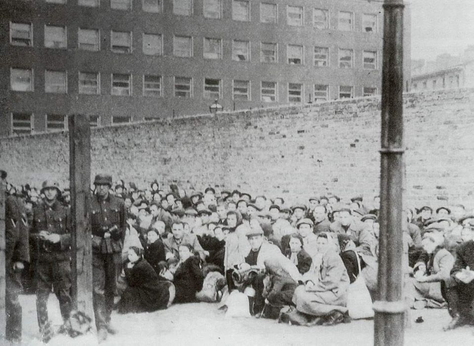
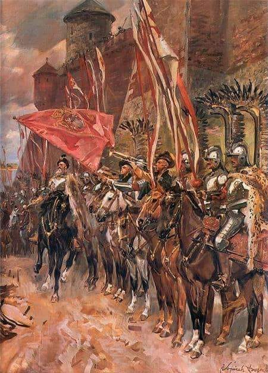

### 1942

W czasie żydowskiego święta Jom Kippur (Dzień Pojednania) zakończyła się akcja wysiedleńcza warszawskiego getta. Z Umschlagplatzu wyruszył wtedy ostatni transport z Żydami.
Według raportów żydowskich organizacji podziemnych akcja pochłonęła około 275 tysięcy ofiar, natomiast generał Stroop szacuje liczbę wywiezionych i zabitych na 310 tysięcy.
Niespełna tydzień po zakończeniu akcji
wysiedleńczej, 27 września 1942 roku, Delegatura Rządu powołała w Warszawie, z inicjatywy Zofii Kossak i Wandy Krahelskiej-Filipowiczowej, Tymczasowy Komitet Pomocy Żydom im. Konrada Żegoty, przekształcony 4 grudnia w Radę Pomocy Żydom pod kryptonimem „Żegota”.
W jej skład weszli przedstawiciele polskich i
żydowskich organizacji politycznych.
Na zdjęciu Żydzi oczekujący na transport na Umschlagplatzu.

  

### 1610

Wojska polskie pod wodzą Stanisława Żółkiewskiego wkroczyły do Moskwy.
Wydarzenie to poprzedziła zwycięska dla Polaków bitwa pod Kłuszynem, gdzie armia rosyjska została rozbita doszczętnie. Kolejnym wydarzeniem na drodze do tego militarnego sukcesu była detronizacja rosyjskiego cara, którą w ramach pertraktacji z Polakami przeprowadzili rosyjscy bojarzy.
Cel ten udało się osiągnąć 8 października 1610 roku.

  

---

<a href="https://github.com/TomaszWaszczyk/historia.waszczyk.com/edit/master/src/content/september-21.md" target="_blank">Edytuj tę stronę dzieląc się własnymi notatkami!</a>
